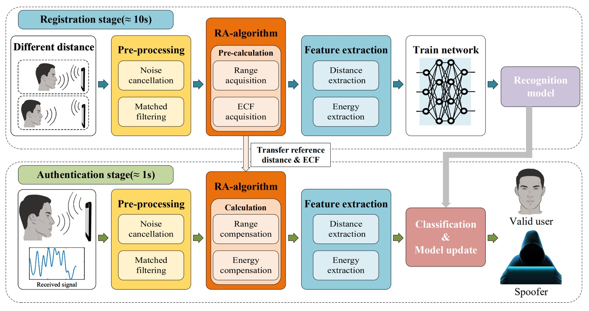
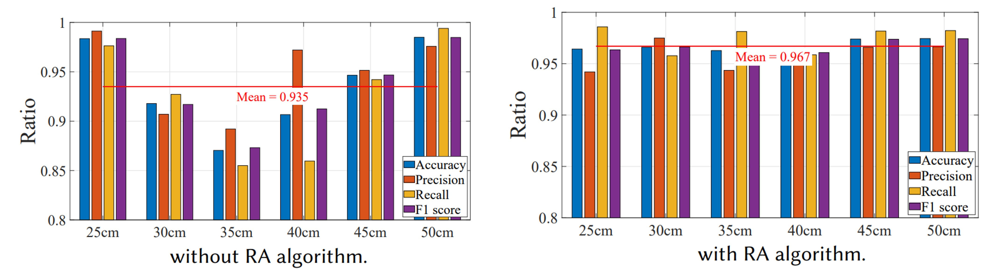
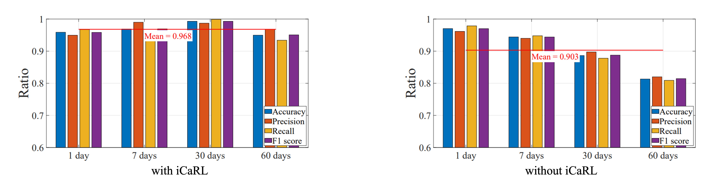

## 波動の邊界

[**AFace: Range-flexible Anti-spoofing Face Authentication via Smartphone Acoustic Sensing**](https://www.researchgate.net/profile/Chao-Liu-80/publication/378372686_AFace_Range-flexible_Anti-spoofing_Face_Authentication_via_Smartphone_Acoustic_Sensing/links/65d6faf2adc608480adf3229/AFace-Range-flexible-Anti-spoofing-Face-Authentication-via-Smartphone-Acoustic-Sensing.pdf)

---

この論文を開くと、33 ページもありました！

思わず頭が痛くなりました。

## 問題の定義

スマートフォンの認証システムは、過去 10 年で PIN コード、指紋認証、虹彩認証から顔認証へと進化してきました。

これらの方法は段階的に進化し、記憶に頼るものから生体情報へ、接触センサーから非接触センサーへと変わり、利便性と安全性の向上を目指しています。

しかし、この技術進化の道筋は、どこかで限界にぶつかっているようです。

- **PIN コード** は忘れやすく、覗き見のリスクもあります；
- **指紋認証** は唯一性があるものの、シリコン製の複製モデルによる偽造が可能です；
- **虹彩認証** は高精度ですがコストが高く、普及が難しいです；
- **顔認証** は広く導入されていますが、写真や動画による基本的な攻撃に脆弱です。

さらに、ドットプロジェクターや赤外線構造光などの 3D センサーを導入しても、以下の 3 つのリスクは残ります。

1. **コストとサイズの制約**：これらのハードウェアは携帯電話の BOM コストを 5%以上増加させ、普及を妨げます；
2. **リソースと遅延のボトルネック**：高性能モデルは 4 秒以上の推論時間を要し、実用に耐えません；
3. **偽造とプライバシーリスク**：視覚情報は複製や漏洩が容易で、防御が困難です。

さらに、主流のなりすまし防止研究は、テクスチャ特徴から深層学習まで進化していますが、常にある核心的な課題を克服できていません。

> **攻撃者が 3D プリントモデルを手にした場合、既存の視覚システムはその材料の本質を識別できない**。

そこで、信号に着目する動きが出てきました。

音波、WiFi、RFID、RF 信号が認証分野の文献に登場し始めています。これらの非視覚的手法は、外観を超えて歩行、呼吸、心拍、反射特徴を読み取ろうとしています。しかし、これらの方法にも限界があります。

- 歩行特徴は服装や姿勢の影響を強く受ける；
- WiFi や RFID は正確ですが、追加のデバイスやタグが必要；
- 耳道認証は装着感の悪いイヤホン型機器を必要とします。

最近ではスマホのマイクやスピーカーで実現される音波顔認証もありますが、多くは形状再構成に注目しており、3D 偽装モデルの模倣攻撃を回避できていません。形状が一致すれば、反響も似通い、識別が失敗するためです。

そこで問題が浮かび上がります。

> **反響音までも模倣可能ならば、攻撃者が偽造できない特徴とは何か？**

## 問題の解決

<figure style={{"width": "90%"}}>

</figure>

AFace は音波を主体とした認証システムです。

スマートフォンの既存のスピーカーとマイクを使い、顔認識を行います。

全体の処理は以下の 4 ステップで構成されています：

1. **音波投射**：ユーザーが異なる 2 つの距離でスマホから音波を発し、その反射エコーを受信して「エネルギー－距離」の対応関係を構築する。
2. **信号前処理**：反響信号を背景反射除去とマッチフィルタリング処理し、直接波や顔以外の物体の干渉を除去し、距離次元に関連した情報を抽出する。
3. **補償モデル**：ユーザーとスマホの距離変動に対応するため、範囲適応（RA: Range Adaptive）モデルを構築し、前述の二距離データを用いてエネルギー補償関数（ECF: Energy Compensation Function）を計算し、以降の全測定値を同一基準に正規化する。
4. **特徴抽出とモデル訓練**：補償後の信号から重要特徴を抽出し、深層学習モデルで分類訓練を行い、後続の照合基盤とする。

### 音波投射

音波は発信されるだけでなく認識されなければならず、エネルギーは集中させつつもユーザーに不快感を与えてはいけません。

この信号が「解読可能」で「実現可能」であるために、著者は以下の設計を採用しています：

1. **信号設計**：AFace は**FMCW（周波数変調連続波）**を信号基底に採用し、その利点は以下の通りです。

   1. **周波数の分離性が高い**：10 ～ 22 kHz の設計でほとんどの環境音（8 kHz 以下）を避け、高域通過フィルタで環境ノイズを除去可能。
   2. **解像度が細かい**：12 kHz 帯域幅は 1.4 cm の距離解像度に対応し、顔領域の微細な違いを識別可能。
   3. **スマホで動作可能**：多くのスマホは 24 kHz 以下の周波数をサポートし、信号減衰を考慮すると 22 kHz が妥当な上限。
   4. **音が不快でない**：10 ms の信号長＋ 40 ms の間隔で、ユーザーにほぼ気づかれない。
   5. **エネルギー制御適切**：ハニング窓を用いて 16 kHz にエネルギーを集中させ、スペクトル漏れを防止。

   この信号の数式は以下の通りです：

   $$
   s(t, \hat{t}_m) = \text{rect}\left( \frac{\hat{t}}{T_p} \right) \cdot e^{j 2\pi \left( f_c t + \frac{1}{2} k \hat{t}^2 \right)}
   $$

   意味は以下の通りです：

   - $\text{rect}(\cdot)$：信号が 10 ms 内（$T_p=10$ ms）に限定されることを示す；
   - $f_c$：搬送波周波数（中心 16 kHz）；
   - $k$：チャープレート（掃引速度）；
   - $\hat{t} = t - t_m$：fast time、各信号区間の時間窓を示す；
   - $t_m = mT$：slow time、各チャープ送信時刻（$m=0,1,2,\dots$）を表す。

   この設計により、信号は物理空間で展開・反射し、比較可能なデジタル特徴として収束します。

2. **等深モデル（Iso-depth Model）**：音波が送信された後、スマホのマイクが受け取るのは混合信号です。これを解析するため著者は 4 種類の信号源に分類しました：

   1. 環境音ノイズ；
   2. 直達経路信号（スピーカーからマイクへの直接波）；
   3. 顔からの反射（本来取得したい信号）；
   4. その他物体からの反射（除去したい信号）。

   これを基に AFace は多経路受信モデルを構築しました：

   $$
   s_r(t, \hat{t}_m) = \sum_i \text{rect}\left( \frac{\hat{t} - \tau_i}{T_p} \right) \cdot e^{j 2\pi \left( f_c (t - \tau_i) + \frac{1}{2} k (\hat{t} - \tau_i)^2 \right)}
   $$

   ここで、

   - $\tau_i$：第$i$経路の遅延時間；
   - 各反射信号は送信信号の遅延版としてモデル化される。

   信号処理簡略化のため、信号は次のように分けられます：

   $$
   s_r(t, \hat{t}_m) = \sum_i s_i + \sum_j s_j
   $$

   - $s_i$：ターゲット反射（顔）；
   - $s_j$：非顔反射（後に除去される）。

---

顔に対応する音波信号を得るため、AFace はマッチングフィルタ（match filtering）を用いて、受信エコーと参照信号$s_{\text{ref}}$の畳み込みを計算し、時間軸上の重なり位置でエネルギーピークを算出します：

$$
E = \sum_i s_i \odot s_{\text{ref}}
$$

- $\odot$：畳み込み演算；
- エネルギーピークは反響と参照信号の「整合」位置を示し、反射距離の分布を表す。

距離が近い領域のピークは重なりエネルギーが加算され、この「重ね合わせ現象」が顔各部の反射識別根拠となります。

顔認識のため、AFace は顔を 6 つの等深ゾーンに分割しました。下図の通りです。

<figure style={{"width": "90%"}}>

</figure>

- **最も近い：鼻先（反射面積小・エネルギー低い）**；
- **前面環帯：目窩、額、唇（反射面積大・スマホ正面で最もエネルギーが高い）**；
- **側頬帯：斜角反射でエネルギー限定的**；
- **最も遠い：耳（距離遠く構造複雑で最もエネルギー低い）**。

これらの物理特性はエネルギー分布ピークモデルに変換され、図(b)に示されています。著者は後の実験で、遮蔽領域を使いモデルの正確性を検証し、音波反射が顔の素材と形状に忠実に対応することを証明しました。

### 信号前処理

すべての信号には物語がありますが、まずは雑音を黙らせなければなりません。

信号設計は重要ですが、実際に受信端に入るのは歪み、遅延、雑音に満ちた音波です。スマホが送った信号がそのまま届くとは限らず、ハードウェアの非理想性や環境の影響で「エコー」は洗浄と補正を待つ生のデータとなっています。

AFace の前処理モジュールは以下の 4 ステップで構成されます：

1. **実際の参照信号の取得**

   スマホのスピーカーとマイクは周波数帯ごとに利得が異なり、送受信される信号は理想的ではありません。

   そこで著者は実用的な「ハードウェア非依存化」手法を提案しました：

   - 無人環境で一度背景信号を収集；
   - 次に、15cm 離れた位置に 1cm×1cm の紙板を置き、単一反射を収集；
   - この二つの差分を取ることで、その紙板からの純粋な単一エコーを近似的に得て、参照信号 $s_{\text{ref}}$ とします。

   これは「送信信号を既知と仮定せず、計測から真の音響を逆算する」ことを意味します。

---

2. **信号開始点の同期**

   

   <figure style={{"width": "70%"}}>
   
   </figure>
   

   スピーカーとマイクは同時に動作できず、受信信号の「実際の送信時刻」を直接測れません。

   この問題を解決するために、著者はスマホ内部の「スピーカーからマイクへの固体伝播」を利用しました：

   - 音はスマホ内部（スピーカー → マイク）を数センチ伝わり、約 0.04ms の遅延；
   - 固体伝播は減衰が少なく信号強度が高い；
   - クロスコリレーションにより直達信号の到達点を精密に特定し、時間基準とします。

   これにより約 1〜2 サンプル（約 0.7cm）の誤差が生じますが、顔の相対距離（差分）は正確に保たれ、後続の RA アルゴリズムで補正可能です。

---

3. **ノイズ除去**

   雑音は大きく二種に分けられます：

   - **環境ノイズ**：主に 10kHz 以下であり、高域通過フィルタで除去可能；
   - **信号ノイズ**：例えば直達信号の干渉や多重反射ノイズは、参照信号を使って減算処理が必要。

   ただし単純な差分除去は完全でなく、反射強度は距離に依存し減衰し、波形は似ていても振幅が異なります。

   そこで著者はスケール係数 $\varepsilon$ を導入し、次式の差分誤差を最小化します：

   $$
   \min_\varepsilon \left\| S_r - \varepsilon \cdot S_c \right\|^2
   $$

   - $S_r$：受信信号；
   - $S_c$：事前に取得したクリーンな参照信号；
   - $\varepsilon$：最小二乗法で求めるスケールパラメータ。

   実験では、200 フレーム連続信号中、$\varepsilon$の変動は反射減衰を安定して補償できることを示しています。

---

4. **マッチングフィルタリング**

   

   <figure style={{"width": "70%"}}>
   
   </figure>
   

   信号を同期・ノイズ除去した後、顔のエコー信号 $s_i$ に近似します。

   次にマッチングフィルタリング（参照信号との畳み込み）を行います：

   $$
   y_t = s_i \odot s_{\text{ref}} = \frac{\sin(\pi k T_p t)}{\pi k t} \cdot \text{rect}\left(\frac{t}{2T_p}\right) \cdot e^{j2\pi f_c t}
   $$

   これは sinc 関数に似た結果で、以下を意味します：

   - 距離の異なる反射は異なる時間点にエネルギーピークを作る；
   - 各ピークは顔の異なる領域の「深度エコー」に対応；
   - フーリエ変換で各反射の周波数を得られ、

   $$
   f_i = -k \cdot \frac{2\Delta R}{c}
   $$

   ここで、$\Delta R$ は参照信号との距離差、$c$ は音速を表します。

つまり、マッチングフィルタとフーリエ変換で、ぼやけた音波信号を解像度のある「距離スペクトル」、すなわち顔の立体構造深度マップに復元しているのです。

### RA 補償アルゴリズム

次に、変動する距離を安定した特徴に変換し、後続の顔認識の基準とします。

音のエコーは距離の関数ですが、実際の利用環境では、ユーザーは常に 15cm や 20cm の距離でスマホを持つわけではありません。認証ごとに顔とスマホの距離は微妙に変動し、その差異が信号の位相ずれやエネルギー変化を引き起こし、モデルの認識安定性に影響します。

そこで AFace は**RA（Range Adaptive）補償機構**を設計し、各入力を安定した距離・エネルギー基準へマッピングします。

この機構は以下の２つのサブモジュールからなります：

1. **レンジ補償**：エコー信号の位相変化を補正；
2. **エネルギー補償**：反射エネルギーと距離の関係を校正。

登録時にユーザーは異なる 2 距離（例：_D_0_, _D_1_）で登録し、最短エコーポイント距離（_d_0_, _d_1_）と最大エネルギー（_e_0_, _e_1_）を記録。これを基準に補償を行います。

認証時に顔の距離が*d_i*の場合、回響信号の位相は：

$$
\varphi_1 = 2\pi f_c \left(t - \frac{2d_i}{c}\right) + \pi k \left(t - \frac{2d_i}{c}\right)^2
$$

基準距離*d_0*の理想位相*\varphi_0*は：

$$
\varphi_0 = 2\pi f_c \left(t - \frac{2d_0}{c}\right) + \pi k \left(t - \frac{2d_0}{c}\right)^2
$$

両者の差は：

$$
\Delta \varphi = -\frac{4\pi f_c}{c}(d_i - d_0) - \frac{4\pi k t}{c}(d_i - d_0) + \frac{4\pi k}{c^2}(d_i^2 - d_0^2)
$$

この位相差は単なる時間差に留まらず、フーリエ変換後のピーク位置ずれを招き、距離推定や特徴抽出に影響します。

信号を揃えるため、AFace は全信号に対し以下の補償を施します：

$$
s' = \frac{e^{-j\varphi_1}}{e^{-j\Delta \varphi}} = e^{-j(\varphi_1 - \Delta \varphi)}
$$

つまり、信号の位相を基準距離の位置に戻し、全顔が同一距離で比較されているかのようにします。

位相ずれだけでなく、反射エネルギーも距離・材質により変動します。

AFace はこれを誤差とせず、むしろ強力な識別特徴と捉え、以下の実験を行いました：

- 紙、木、鉄の異なる材質を一定速度でスマホに接近させる；
- 10 秒間信号を連続再生し、各距離でのピークエネルギーを記録；
- ノイズ・背景反射除去・マッチングフィルタ実行で反射強度を取得；
- 各距離の最大エネルギーを抽出し、エネルギー変化曲線を描画；
- エネルギーと距離の線形回帰を行い、高い相関（_R^2=0.9536_、RMSE=0.03198）を確認。

実験イメージは以下の通り：

<figure style={{"width": "90%"}}>

</figure>

エネルギーと距離は高い線形相関を示し、かつ材質ごとに異なる曲線を描きます。

これを踏まえ、AFace はエネルギー補償関数（ECF）を定義しました：

$$
\text{ECF}(d_i) = \frac{e_1 - e_0}{d_1 - d_0}(d_i - d_0) + e_0
$$

これは距離*d_i*における理論上のエネルギー値を示し、実際のエネルギー*e_i*は以下で補正されます：

$$
e'_i = e_i \cdot \frac{e_0}{\text{ECF}(d_i)}
$$

この補償は単に*e_i*を*e_0*に強制的に戻すのではなく、特徴を保ちつつ距離影響を補正します。

つまり、

> **3D 偽装モデルの材質とエネルギー分布が異なれば、距離が同じでも補償後のエネルギーは本物ユーザーと明確に異なる。**

これにより、距離影響を補正しつつ材質差異を拡張する「差分保持型補償」となり、音波エネルギーは偽造不可能な「顔の証明」になります。

---

### 特徴抽出

信号の同期・補償・ノイズ除去後、AFace は回響から個人識別に有効な情報を抽出します。

特徴は大きく二種類：

- 距離特徴（Distance Features）
- エネルギー特徴（Energy Features）

まず距離特徴：

Iso-depth モデルに基づき、顔を 6 主要部位に分割し、そのうち 5 部位を深度分析対象とします：

- 鼻先（nose tip）
- 鼻根（nose root）
- 唇と眼窩（lips & eye socket）
- 頬から額（cheek to forehead）
- 側面（side of face）
- 耳は最遠端で基準深度 0 に設定

これらに基づき特徴は：

1. **5 つの絶対距離値**：マッチングフィルタピーク位置から推定；
2. **10 組の相対距離差**：任意 2 部位間の深度差（例：鼻先と鼻根間の距離は「鼻梁高さ」）；
3. **5 組の面積近似情報**：複数部位が近接すると重畳ピークが生じ、ピーク幅は反射領域の大きさを示す；

   - 50%エネルギー幅（FWHM 類似）を基準に計測；
   - 特に鼻根と唇・眼窩間の近接ピーク幅を算出。

---

次にエネルギー特徴：

材質により音波反射特性は異なり、著者は遮蔽実験で以下を観察しました：

<figure style={{"width": "90%"}}>

</figure>

異なる顔部位を覆った際のエネルギー変化を測定し、皮膚と偽装モデル間の反射率・吸収率の差を確認。

つまり、形状で騙せてもエネルギー特性で差異が現れるのです。

最終的に選定されたエネルギー特徴は：

1. **最大エネルギー**（max energy）：全体反射強度、皮膚と面積情報を反映；
2. **平均ピークエネルギー**（avg peak energy）：顔全体の反射平均；
3. **分散**（variance）：顔深度分布の集中度合い；
4. **ピークファクター**（peak factor）：高反射点の強弱；
5. **平均周波数**（average frequency）：エコーの主周波数分布；
6. **エネルギー密度**（energy density）：特定領域内のエネルギー集中度。

これらは材質特性を反映し、形状だけでは識別困難な部分を補完します。

AFace は計 26 次元の特徴を採用し、形状・材質・反射挙動を統合して後段分類モデルの核としています。

### 分類器アーキテクチャ

<figure style={{"width": "60%"}}>

</figure>

特徴設計と抽出が完了した後、AFace はこれらの特徴を「あなたを認識する」という結果に変換する分類器を必要とします。

著者は分類器を以下の 2 部分に分けました：

1. BiLSTM を用いて信号の時系列ロジックとゾーン特徴を捕捉；
2. iCaRL を使い、ユーザー追加やクラス増加時の「忘却問題」を解決。

AFace の入力特徴は単なる表形式のデータではなく、「信号スライス」「距離関係」「エネルギープロファイル」を含む複合的特徴です。この複雑な構造を処理するため、4 層の BiLSTM 構造を採用しています。

- **40 次元信号スライス（時系列）**：

  - ノイズ除去・距離補償後のエコー残響から取得；
  - 鼻先を起点に 40 サンプル（約 14cm 範囲）を切り出し。

- **20 次元距離特徴**：

  - 5 つの絶対深度（鼻先、鼻根、唇・眼窩、頬・額、側顔）；
  - 10 の相対深度差；
  - 5 つのマッチングフィルタ後ピーク幅（反射領域の重複・形状反映）。

- **6 次元エネルギー特徴**：

  - 材質特性、分布、反射強度を反映（前章参照）。

BiLSTM のパラメータ設定：

- **層数**：4 層構成；
- **活性化関数**：`tanh`（隠れ状態は $[-1, 1]$ 範囲で変動）；
- **ゲート関数**：`sigmoid`、情報の保持可否を制御；
- **重み初期化**：Xavier 初期化（`tanh`に最適化）；
- **忘却ゲート**：初期値を 1 に近づけ（unit-forget-gate）、長期依存学習を強化。

全結合層と分類器は以下：

- **Dense 層（128 ユニット）**、活性化は`LeakyReLU`；
- **Dropout 層（率 0.5）**、過学習防止；
- **Softmax 層（40 クラス）**、最終出力を識別確率に変換；
- **分類器**は Softmax 確率をユーザー ID にマッピング。

---

もう一つの重要部分は iCaRL による増分学習戦略です。

AFace は「ユーザー増加」と「顔の長期変化」という課題を解決するため、iCaRL（Incremental Classifier and Representation Learning）を採用し、ニューラルネットを動的に更新でき、古い知識を忘れない構造にしています。

増分学習は以下 2 パターンに分かれます：

- **クラス増分学習（Class Increment）**：

  - 新ユーザー登録時、回響データから特徴抽出し新サンプル生成；
  - モデル構造に新たな全結合分類ノードを追加し新クラス対応；
  - 既存の BiLSTM および全結合層は凍結し、既習知識を保持；
  - 新規層のみ微調整し、学習高速化と安定化。

- **データ増分学習（Data Increment）**：

  - ユーザーが補助認証（PIN など）により長期変化の可能性があると判定；
  - 「音波認証失敗・補助成功」時に新サンプルを蓄積；
  - サンプル数が 5 以上で増分学習を実行；
  - モデル構造は固定し、低学習率で微調整を行い長期適応と記憶更新。

この方式は従来のモデルが新データにより「破壊的忘却（catastrophic forgetting）」を起こす問題や、ネット全体の再学習に伴う高計算コストを回避します。

著者の狙いは、AFace がユーザーを継続的に観察し記憶を更新することで、単なる分類器ではなく「適応的関係性」を実現することにあります。

## 討論

論文中の実験表は非常に多いため、すべては列挙しません。興味がある読者は原論文を参照してください。

以下にいくつかの視点で本手法の性能を検証します。

### 異なるスピーカーとマイクの組み合わせ

<figure style={{"width": "60%"}}>

</figure>

実験結果は「上部スピーカー＋上部マイク」の組み合わせが最良でした。

底部のスピーカーやマイクを使うと、エコーは主に使用者の胸部から反射し、衣服の材質による影響を強く受けます。わずかな環境変化（例えば上着の変更）で認識精度が著しく低下します。

このためハードウェア設計では、不要な反射を減らし顔の信号に集中できるよう、上部配置を推奨します。

### 2D 攻撃と 3D 攻撃

<figure style={{"width": "90%"}}>

</figure>

実験結果は、2D 攻撃でも 3D 攻撃でも AFace が効果的に防御可能であることを示します。その根本理由は「音波認証が距離と材質の両方を含むため」であり、2D 画像は真のエコーを提供できません。

もしエネルギー特徴を使わなければ、AFace の 3D 偽装防御成功率は 5%程度に過ぎません。しかしエネルギー特徴を加えると 98%以上に跳ね上がります。3D モデルは形状が一致しても、材質の吸収率・反射率は顔と異なり、AFace はその差を「聞き分ける」ことができるのです。

### RA アルゴリズムの重要性

<figure style={{"width": "90%"}}>

</figure>

RA アルゴリズムの有効性を検証するため、ユーザーに 25cm と 50cm で登録してもらい、25、30、35、40、45、50cm で単一ユーザーモードの複数テストを実施しました。

結果は、RA なしでは登録距離（25cm、50cm）だけ認識率が高く（>96%）、その他距離では約 90%に低下しました。一方 RA ありではすべての距離で 95%以上の認識率を維持し、平均 96.7%でした。これは RA が位相とエネルギーのズレを効果的に補正し、「距離」がユーザー体験の最大障壁でなくなったことを示しています。

### 長期使用と顔変化

<figure style={{"width": "90%"}}>

</figure>

続いて iCaRL 増分学習の効果を検証しました。

2 ヶ月間の実験で、ユーザーの顔変化（加齢、髪型変化、眼鏡着用）とシステムの認識率を観察。ユーザーは増分学習ありグループとなしグループに分けられました。

結果は、増分学習なしでは時間経過とともに認識率が明確に低下。一方 iCaRL ありでは自動でモデルを更新し、長期にわたり 95〜98%の高精度を維持しました。

## 結論

2019 年以降、音波は FAS 分野に徐々に導入され、画像とは異なる認証経路を拓きました。

しかし多くの手法は制限を抱え、最も大きな問題は、

> **音波は 3D マスクの問題を解決できない！**

という点です。

音波環境下では、マスクと実際の顔はほとんど区別できません。

AFace はここに材質という概念を導入し、音波のエコーを「距離＋材質」の複合関数とみなすことで、初めて音波を実用的な FAS 手法にしました。

AFace は 3D 耐性を改善しただけでなく、距離補償（RA）とエネルギーモデリング（ECF）を駆使して、実世界での運用柔軟性と使用シナリオを広げました。さらに商用スマホ上での実装と長期変化対応の増分学習を盛り込んだ数少ない音波認証システムの一つでもあります。

完全解決ではないものの、

**音波はすでに独立した有効な識別手がかりになりうることが証明された。**
