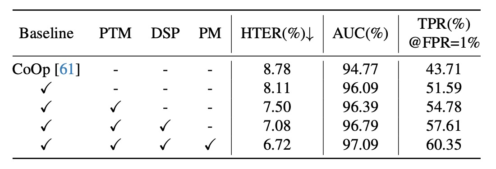
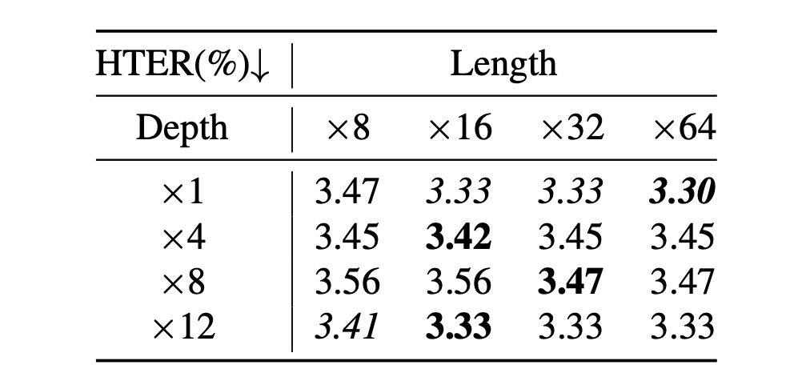

## クラスなしのプロンプト学習

[**CFPL-FAS: Class Free Prompt Learning for Generalizable Face Anti-spoofing**](https://arxiv.org/abs/2403.14333)

---

この記事の構造は少し複雑ですが、タイトルからいくつかの明確なキーワードを見つけることができます：

- 最初は「Class Free」
- 次は「Prompt Learning」
- 最後に、適用シーンは「Face Anti-spoofing」。

この 3 つのポイントを押さえれば、この論文の理解がだいぶ楽になります。

FAS の本質は顔認識システムの防御策で、目的は偽造者が写真や動画などを使用して攻撃を仕掛けるのを防ぐことです。著者が目的を Face Anti-spoofing に定めたので、まずはこの分野での過去の解決方法を見てみましょう。

## 問題の定義

初期の研究では、研究者たちは主にいくつかの特徴を設計して本物の顔と偽造された顔を区別しようとしていました。これらの特徴にはテクスチャ、光学スペクトル、動きなどが含まれますが、これらの特徴は限られており、研究者たちは深層学習に転向し、畳み込みネットワークなどのアーキテクチャを通じて偽造された顔の特徴を見つけ出そうとしました。

まさに「道高一尺、魔高一丈」。攻撃者は深層学習を使用した FAS システムに対抗するため、質の高い写真や動画を使用して侵入し始めました。

未知の攻撃に対する防御のために、近年では領域一般化（Domain Generalization）が主流となっています。この方法の中心的な考え方は、モデルが訓練データに過剰に適合しないように抑制し、未知のデータでも良いパフォーマンスを発揮できるようにすることです。

その後、LLM（大規模言語モデル）の時代が訪れ、多モーダルな学習方法が FAS 分野にも広く応用されるようになりました。異なるモーダルの訓練データを使って、モデルが攻撃される難易度を高めようとしています。

---

ここまでで、プロンプト学習を用いてこの問題にアプローチしてみましょう。

通常、一般の人は LLM を訓練できないため、後にプロンプトを使用して LLM に入力し、得られたテキスト特徴を使用して自分のモデルの訓練を誘導する方法が生まれました。

これは新しい概念ではなく、CLIP 以降、広く知られるようになり、後続の研究で BLIP-2 が Q-Former の概念を提案しました。目的は少量のトークンを使用して大規模モデルの知識を移行し、領域間の一般化効果を達成することです。

:::tip
もし BLIP-2 をまだ見ていなければ、私たちの以前の記事を参照してください：

- [**[23.01] BLIP-2: Q-Former 初登場**](../../model-tuning/2301-blip2/index.md)
  :::

この論文に戻りましょう。

著者は FAS 分野でもプロンプト学習を使いたいと考えていますが、FAS ではクラス数が少なく、また、事前学習されたモデルは FAS の領域で訓練されたわけではないため、プロンプト学習を使用しても価値のある特徴を得ることはできず、一般化もできません。

したがって、問題の定義は明確です。著者は FAS 分野でプロンプト学習を行いたいが、クラスのヒントは使わず、かつ一般化効果を達成したいと考えています。

次に、具体的な解決策を見ていきましょう。

## 問題の解決

### モデルアーキテクチャ

上の図は全体のモデルアーキテクチャですが、この図を見るだけではエルゴノミクスに適していないことがわかります。

したがって、このモデルを分解する必要があります。

### プロンプト生成

FAS の特徴は画像内に隠れています。

:::tip
もしこのテーマを初めて見る方がいれば、簡単に紹介しましょう：

一般的な FAS 攻撃は Replay Attack で、攻撃者は本物の顔の写真や動画を使って攻撃し、偽のアイデンティティを作り出します。このタイプの攻撃では、モデルは画面の特徴、例えば異常な反射やモアレパターンなどを見つける必要があります。

もう一つの攻撃は Print Attack で、攻撃者は印刷された顔の写真を使って攻撃を行います。このタイプの攻撃では、モデルは印刷の特徴、例えば紙のテクスチャなどを見つける必要があります。

顔の特徴は非常に強力で、私たちは一目で見ることができますが、FAS の特徴は隠れており、人間が直接認識するのは難しいです。
:::

これらの隠れた特徴を見つけるために、著者は 2 つの特徴セットを設計しました：

1. **Content Q-Former:** これは Transformer のデコーダーモジュールで、FAS 画像の「内容」特徴を照会するために使用されます。
2. **Style Q-Former:** これは別の Transformer のデコーダーモジュールで、FAS 画像の「スタイル」特徴を照会するために使用されます。

対応するモデルアーキテクチャはこの部分です：

照会のトークンはランダムに初期化され、各セットに 16 個のトークンがあります。この部分で著者は実験を行い、16 個で十分だと分かりました。

照会の対象は FAS 画像から来ており、CLIP の Image Encoder を通じて画像の特徴を得ますが、単に特徴を出力するのではなく、Image Encoder の「各層」の出力を取り、平均値と標準偏差を計算することで、「各層」のスタイル特徴を得ることができます。最後に、すべての層のスタイル特徴を平均化することで、画像全体のスタイル特徴$\boldsymbol{v}_{s}$を得ます。

数式は以下の通りです：

$$
\boldsymbol{v}_{s} = \frac{\sum_{l=1}^{L}\boldsymbol{v}^{l}_{s}}{L}, \quad \boldsymbol{v}^{l}_{s} = \left[\mu(\boldsymbol{v}^{l}) \,||\, \sigma(\boldsymbol{v}^{l})\right], \quad \boldsymbol{v}_{s} \in \mathbb{R}^{1 \times 2d}
$$

ここで、$L$は画像エンコーダーの層数、$\left[\cdot || \cdot\right]$は埋め込み次元で特徴を結合することを示します。

さらに、Image Encoder の元の出力を直接取得し、標準化することで、画像の内容特徴$\boldsymbol{v}_{c}$を得ることができます。

$$
\boldsymbol{v}_{c} = \frac{\boldsymbol{v}^{L} - \mu(\boldsymbol{v}^{L})}{\sigma(\boldsymbol{v}^{L})}, \quad \boldsymbol{v}_{c} \in \mathbb{R}^{n \times d}
$$

照会対象が得られた後、Content Q-Former は$\boldsymbol{v}_{c}$を照会し、Style Q-Former は$\boldsymbol{v}_{s}$を照会します。これで 2 つの特徴セットが得られます。

:::tip
**えっ、なぜ Image Encoder の出力から「テキスト内容」特徴が得られるのですか？**

CLIP は元々画像とテキストの整列モデルであることを忘れたのですか？だから、画像分岐から得られる特徴やテキスト分岐から得られる特徴はすべて「テキスト」と「画像」特徴の重ね合わせとして扱われます。
:::

### プロンプト最適化

この章では、上図の青色と緑色で囲まれた部分について説明します。

前のステップで生成されたプロンプト特徴は、直接使用できません。なぜなら、CLIP は FAS 分野の知識を欠いているからです。

著者は、Content Q-Former（以後 CQF）を高次のレベルで FAS のクラスを理解させるために、2 クラス分類のタスクを通じてプロンプト特徴を学習させます。ここで提示されたのは「マッチング」タスクで、モデルにプロンプトペア（特徴ペア）が一致しているかどうかを予測させます。

まず、次の文を使って記述を行います：`a photo of a [CLASS] face`。ここでの `[CLASS]` は「real」または「fake」の 2 つの可能性のみです。次に、CLIP モデルのテキストトークナイザーとテキスト埋め込み層を使って、この文を CLIP のテキスト特徴に変換します。

ここまでで前準備は完了です。次は正負サンプルペアを作成します。

著者はここで ALBEF のデザイン理念を導入し、一定量のプロンプト特徴を保持するためのバンクを使います。これにより、訓練中にランダムに正負サンプルペアを抽出し、「ハードネガティブマイニング」の手法を使って訓練効率を向上させます。

- [**[21.07] ALBEF: 追求される純粋な道**](../../multimodality/2107-albef/index.md)

正負サンプルペアを組み合わせた後、全結合層を通して logit を得て、クロスエントロピー損失を使って最適化します。全体の流れを数式で示すと以下の通りです：

$$
\boldsymbol{S} = \texttt{Embed}(\texttt{Tokenizer}(\boldsymbol{T})), \quad \boldsymbol{S} \in \mathbb{R}^{B \times 77 \times d}
$$

$$
\boldsymbol{S} = \texttt{Mean\&Expand}(\boldsymbol{S}), \quad \boldsymbol{S} \in \mathbb{R}^{B \times N \times d}
$$

$$
\boldsymbol{R}_{p} = \left[\boldsymbol{P} \,||\, \boldsymbol{S}\right]_{\texttt{2}}, \quad \boldsymbol{R}_{p} \in \mathbb{R}^{B \times N \times 2d}
$$

$$
\boldsymbol{R} = \left[\boldsymbol{R}_{p} \,||\, \boldsymbol{R}^{prompt}_{n} \,||\, \boldsymbol{R}^{text}_{n}\right]_{\texttt{0}}, \quad \boldsymbol{R} \in \mathbb{R}^{3B \times N \times 2d}
$$

最後、テキスト監視による最適化は、結合された特徴$\boldsymbol{R}$に対して一致と不一致の確率を予測することで実現します：

$$
\mathcal{L}_{ptm} = \sum_{i=1}^{3B} \mathcal{H}\left(\boldsymbol{y}^{ptm}_{i}, \texttt{Mean}(\texttt{FC}^{ptm}(\boldsymbol{R}_{i}))\right)
$$

ここでは、各クエリ埋め込みを 2 クラスの線形分類器に入力し、logit を得て、全てのクエリの logit を平均（Mean）して出力の一致スコアを得ます。$\mathcal{H}(., .)$はクロスエントロピー損失で、$\texttt{FC}^{ptm}$はソフトマックスを使った全結合層、$\boldsymbol{y}^{ptm} \in \{0, 1\}$は真のラベルを表す 2 次元の one-hot ベクトルです。

---

論文で$L_{ptm}$を計算する際、$\boldsymbol{R}$には 3 つの異なるバージョンが登場します。それは$\boldsymbol{R}_{p}$、$\boldsymbol{R}^{prompt}_{n}$、$\boldsymbol{R}^{text}_{n}$です。

ここでの正のサンプルペアは$\boldsymbol{R}_{p}$であり、負のサンプルペアは$\boldsymbol{R}^{prompt}_{n}$と$\boldsymbol{R}^{text}_{n}$です。

これを図で示すと、このようになります：

### クラスフリープロンプト

最後に、クラスフリープロンプトの部分です。

ここまで来ると、かなりシンプルになりました。なぜなら、すでにプロンプト特徴を得ており、プロンプトの最適化方法もわかっているからです。

他の論文で一般的に見られるデザインでは、特徴を分類に使うことが多いです。例えば、`Real`、`Print`、`Replay`、`Deepfake`などのクラスに分けます。しかし、ここで著者はこのデザインが十分に一般化されていないと考えています。なぜなら、このデザインではこれらのクラスで良いパフォーマンスを発揮できますが、他のクラスではパフォーマンスが悪くなる可能性があるからです。

そのため、著者は 2 クラス分類のデザインに変更しました。`Real`と`Fake`の 2 クラスだけで、`Real`以外はすべて`Fake`に分類されます。どのタイプの`Fake`かは重要ではなく、モデルが内部で自動的に推論することに任せます。

人工的な先入観の介入を最小限に抑え、モデルに自分で学習させることが最も重要です。

---

赤色で囲まれた部分がクラスフリープロンプトの部分です。

CQF と SQF の特徴をそれぞれ CLIP のテキストエンコーダに入力し、テキスト特徴を得た後、2 つの特徴を結合します。次に、単純な全結合層を通して 1 組の特徴を得て、最後に CLIP の画像エンコーダの特徴とドット積を計算して最終的な予測 logit を得ます。この logit はクロスエントロピー損失を通じて最適化されます。

論文での「プロンプト変調」モジュールの設計は以下の通りです：

$$
\boldsymbol{w} = \delta (\texttt{g}_{e}(\boldsymbol{t}, \mathbf{W})) = \delta (\mathbf{W}_{2}\sigma_{\textrm{relu}}(\mathbf{W}_{1}\boldsymbol{t})),
$$

$$
\boldsymbol{\tilde{v}} = \left[\boldsymbol{\tilde{v}}^{1}, \boldsymbol{\tilde{v}}^{2}, \dots, \boldsymbol{\tilde{v}}^{d} \right], \quad \boldsymbol{\tilde{v}}^{c} = \boldsymbol{w}^{c} \cdot \boldsymbol{v}^{c},
$$

$$
\mathcal{L}_{cls} = \sum_{i=1}^{B} \mathcal{H}(\boldsymbol{y}^{cls}_{i}, \texttt{FC}^{cls}(\boldsymbol{\tilde{v}}_{i})), \quad \boldsymbol{\tilde{v}} \in \mathbb{R}^{B \times d}
$$

ここで、$\sigma_{\textrm{relu}}$は ReLU 関数、$\mathbf{W}_1 \in \mathbb{R}^{\frac{d}{r} \times 2d}$と$\mathbf{W}_2 \in \mathbb{R}^{d \times \frac{d}{r}}$は 2 つの全結合層の学習可能なパラメータで、$r$は縮小比率です。この値は 16 に設定されています。最後に、チャネル特徴$\boldsymbol{v}^{c}$とスカラー$\boldsymbol{w}^{c}$を掛け合わせて適応された視覚特徴$\boldsymbol{\tilde{v}} \in \mathbb{R}^{B \times d}$を得て、これらの特徴を全結合層（$\texttt{FC}^{cls}$）に渡して 2 クラス（実際または偽）の確率を予測します。$\boldsymbol{y}^{cls} \in \{0, 1\}$は実際または偽の顔に対応するラベルです。

### データセット、プロトコル、評価指標

先行研究に基づき、この記事ではモデルの一般化能力を評価するために 2 つのプロトコルを採用しています。

- **プロトコル 1**：4 つの一般的なベンチマークデータセットを使用します。これには MSU-MFSD (M)、CASIA-FASD (C)、Idiap Replay-Attack (I)、および OULU-NPU (O)が含まれます。
- **プロトコル 2**：CASIA-SURF (S)、CASIA-SURF CeFA (C)、および WMCA (W)の RGB サンプルを使用します。これらのデータセットは、より多くの被験者、さまざまな攻撃タイプ、および豊富な収集環境を持っています。

各プロトコルでは、各データセットを 1 つのドメインと見なし、留一法を使用して一般化能力をテストします。この記事では、モデルの性能を評価するために 3 つの指標を採用しています：

1. **HTER** (Half Total Error Rate)：FRR（偽拒絶率）と FAR（偽受容率）の平均値を計算します。
2. **AUC** (Area Under Curve)：モデルの理論的な性能を評価します。
3. **TPR at FPR=1%**：誤報率(FPR)が 1%に固定されたときの真陽性率(TPR)を計算し、実際のシーンに適した閾値を選択します。

### 実装の詳細

- **クエリ設定**：スタイルとコンテンツクエリの長さを 16 に設定し、各クエリの次元は 512 にします；CQF と SQF の深さは 1 に設定します。
- **スタイルプロンプトの多様化**：訓練段階では 50%の確率で有効化し、テスト段階では無効化します。
- **訓練設定**：バッチサイズは 12、Adam オプティマイザーを使用、重み減衰は 0.05、2 段階目の最小学習率は 1e-6 に設定します。画像サイズは 224×224 に調整し、ランダムクロップと水平反転のデータ拡張を行い、訓練の総イテレーション数は 500 回です。

## 議論

### 実験結果

**プロトコル 1**：他の最新の手法と比較して、この記事で提案された手法はすべてのテストデータセットで最良の性能を達成しています。

提案された CFPL は、HTER 指標で、すべてのターゲット領域で低いエラー率を示しました。例えば、M (3.09% vs. 5.41%)、C (2.56% vs. 8.70%)、I (5.43% vs. 10.62%)、O (3.33% vs. 8.86%)。

全体の平均 HTER は 3.60%で、先行の最良結果 7.82%を大きく上回りました。CelebA-Spoof データセットを導入後、CFPL*は FLIP-MCL*より優れた性能を示し、HTER は 2.98% vs. 3.01%でした。しかし、ViTAF*-5-shot と比較すると、CFPL*は平均 HTER で若干劣っており(2.98% vs. 2.83%)。

---

**プロトコル 2**：CFPL は W および C 領域で複数のベンチマーク手法を大きく上回っています。

S データセットでは、CFPL は HTER (8.77% vs. 8.32%)、AUC (96.83% vs. 97.23%)、TPR@FPR=1% (53.34% vs. 57.28%)で CLIP-V よりわずかに低い指標を示しました。これは CASIA-SURF データセット内で明らかな偽造痕跡があり、視覚特徴だけで十分な一般化能力を発揮できたためです。

プロトコル 1 と同様に、CelebA-Spoof データセットを導入後、CFPL*は ViT*や FLIP-MCL\*より優れた結果を示し、例えば HTER 指標では最良の平均値が 7.01%でした。

### アブレーション実験

1. **各コンポーネントの有効性**

   

   - **ベースライン**：CFPL のすべてのコンポーネントを除去しました。CoOp の自由学習ベクトルと比較して、ベースラインは 2 つの軽量な Transformer（CQF と SQF）を導入し、画像エンコーダ条件下でコンテンツとスタイルのプロンプトを学習させ、一般化性能を大きく向上させました（HTER -0.67%、AUC +1.32%、TPR@FPR=1% +7.88%）。
   - テキスト監視を追加した後、3 つの指標がさらに最適化されました：HTER 7.50%、AUC 96.39%、TPR@FPR=1% 54.78%。これはコンテンツプロンプトに含まれるクラス属性が一般化性能に大きな影響を与えることを示しています。
   - スタイルプロンプトにスタイル多様化を導入した後、性能が再び向上しました：HTER -0.42%、AUC +0.4%、TPR@FPR=1% +2.83%。
   - 設計されたゲーティング関数を除去すると、一般化性能が顕著に低下しました。HTER は 6.72%から 7.08%に、AUC は 97.09%から 96.79%に、TPR@FPR=1%は 60.35%から 57.61%に減少しました。

2. **CQF と SQF の構造の影響**

   

   - ICM→O 実験で、単純な 2 層のボトルネック構造では、顕著なドメイン差を持つ FAS タスクを効果的に緩和できませんが、CQF と SQF を導入すると性能が顕著に向上しました。HTER はそれぞれ 1.68%と 1.96%減少し、AUC はそれぞれ 1.38%と 1.48%向上し、TPR@FPR=1%はそれぞれ 13.26%と 26.67%増加しました。
   - 最終的に、CQF と SQF を組み合わせた CFPL はすべての指標で最良の結果を達成しました。HTER は 3.33%、AUC は 99.05%、TPR@FPR=1%は 90.06%で、CQF と SQF の協調効果が顕著であることを示しています。

3. **クエリ長さと Q-Former の深さの影響**

   

   - クエリの数と CQF および SQF の深さは性能に影響を与えます。ICM→O 実験では、クエリ長さ（[8, 16, 32, 64]）と Q-Former の深さ（[1, 4, 8, 12]）の検索実験が行われました。
   - 上表に基づき、2 つの結論が得られます：

     1. クエリ長さが 16 に設定された場合、最良の性能が得られ、クエリ数を増やしても性能向上は限られており、退化する傾向が見られました；
     2. Q-Former の深さは性能にほとんど影響を与えず、各深さでの性能変動はほとんどありませんでした。

     したがって、クエリ数は 16 に設定し、Q-Former の深さは 1 にすることをお勧めします。

### 可視化分析

注意力モデルの可解釈ツールを使用して、著者は提案された CFPL 方法がベースラインと比較して優れていることを視覚的に検証しました。ベースラインは CFPL のすべての貢献を除いたバージョンで、その結果は上図に示されています。ベースラインの注意力図は誤分類されたサンプルに対応しており、CFPL はこれらのサンプルを正しく分類できていることがわかります。

プロトコル 1 の OCM→I 実験では、ベースラインは背景部分に過度に注目し、本物の顔を誤分類しました。CFPL は顔と背景の境界に焦点を修正し、正しく分類しました。さらに、Replay 攻撃に関して、ベースラインは偽造の手がかりを見逃しており、電子スクリーンの反射点などを見逃しましたが、CFPL 方法は照明を受けた特徴領域を示しました。他のサブプロトコルでも同様の結論が得られました。

## 結論

この論文を読んでみると、著者の設計思想が非常にユニークであることがわかります。

このモデルアーキテクチャでは、CLIP 部分は訓練に参加せず、CLIP の利点を享受することを目指しています。

したがって、設計は CLIP の Image Encoder から始まり、FAS 分類に必要な特徴を Image Encoder から生成することを目指しています。

でも、CLIP は FAS を認識しないじゃないですか？どうするのか？

そこで著者は CQF と SQF の設計を導入しました。この部分は、FAS の特徴を「保存する」ための「プラグイン」として理解できます。このプラグインの機能は、FAS の特徴を CLIP の Text Encoder の特徴空間に「投影する」ことです。

CLIP の Text Encoder はすでに訓練済みなので、私たちができることは「組み合わせる」ことです。CLIP の Text Encoder は、すでに多くの知識を学習しています。例えば、「Monitor」、「Face」、「OOO」、「XXX」などの N 種類のトークンが FAS の「Replay」特徴を集約できるかもしれません。または、「Paper」、「Texture」、「OOO」、「XXX」などの M 種類のトークンが FAS の「Print」特徴を集約できるかもしれません。

具体的にどのトークンを使用するかは重要ではなく、重要なのは、モデル自身がこのトークン群が FAS の特徴を助けることを見つけ出すことです。それだけで十分です。

特徴を見つけた後、この特徴を CLIP の Image Encoder の特徴とドット積を計算し、FAS の特徴を CLIP の特徴に追加することができます。これにより分類が可能になります。

面白いですよね！
