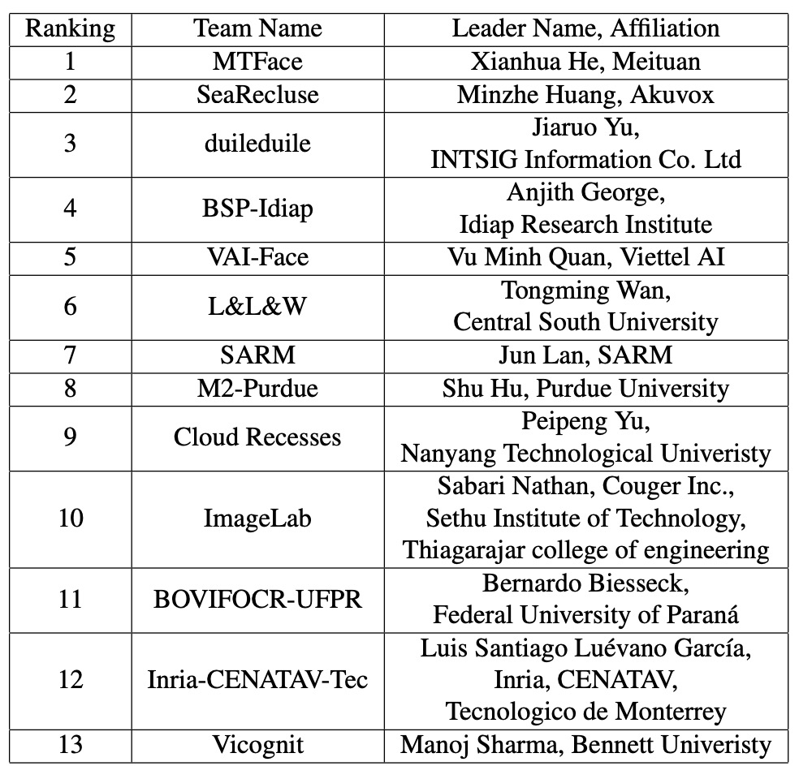
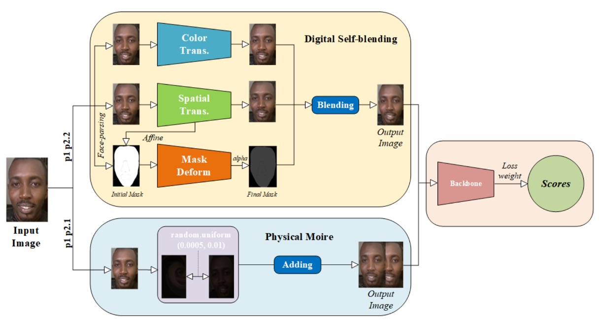
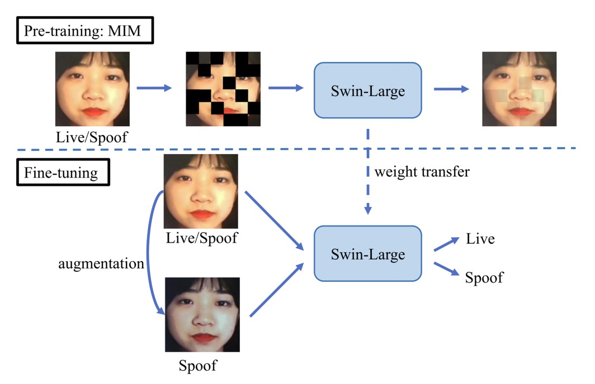
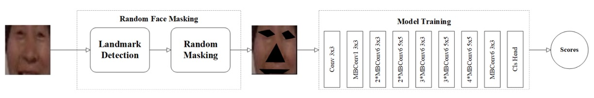

## 兵器譜

[**Unified Physical-Digital Attack Detection Challenge**](https://arxiv.org/abs/2404.06211)

---

これは CVPR2024 で開催された FAS コンペティションで、正式名称は：

[**5th Chalearn Face Anti-spoofing Workshop and Challenge@CVPR2024**](https://sites.google.com/view/face-anti-spoofing-challenge/welcome/challengecvpr2024)

非常に盛況で、FAS 分野の研究者なら誰でも訪れる価値があります。

## 問題定義

Face Anti-Spoofing（FAS）の本質的なタスクは、映像から「ライブ（生体）」の文法を掘り起こすことです。

しかし現実には、攻撃手法が以下の二つの並行した技術分野に発展しています：

- **物理攻撃（Physical Attacks）**：模倣者が紙、ディスプレイ、シリコンマスクなどの実体媒体を用いて顔を提示します。これらはセンサー層で干渉が発生し、現実世界と直接的に相互作用します。
- **デジタル攻撃（Digital Attacks）**：Deepfake、フェイススワッピング、敵対的サンプルなど、データ生成元や特徴空間で操作が行われます。映像はリアルに見えますが、本質的には虚構です。

従来の手法は多くがどちらか一方に特化してモデル化しており、結果としてモデルの性能は訓練分布に限定され、広範な転移が困難です。

物理攻撃とデジタル攻撃はどちらも最終的な分類上は「偽物（fake）」に属しますが、画像統計的特徴と変異方向に高度な異質性があり、偽クラス内の特徴距離が予想以上に大きく、これが一般化の壁となっています。

現在「統一モデル」の構築が難しい主な理由は二つあります：

1. **大規模な統一データセットの欠如**：従来は物理攻撃（PA）とデジタル攻撃（DA）のデータセットを別々に収集し結合する形で、一つの ID に対する完全な攻撃パターンを含みませんでした。
2. **共通の評価基準の不足**：物理攻撃とデジタル攻撃で異なる指標やプロトコルを使用しており、クロスドメインのアルゴリズム比較ができません。

これがまさに **Unified Physical-Digital Attack Detection Challenge** が立ち上げられた背景です。新たなデータセット、標準プロトコル、公開競技を通じて、新しい問題設定を試みます：

> **一つのモデルで異質な二種の偽装を同時に処理し、未知のドメインでも識別能力を保てるか？**

## 統一データセット：UniAttackData

<figure style={{"width": "70%"}}>

</figure>

**UniAttackData** は現時点で最大規模かつ最も包括的に設計された統一攻撃データセットであり、1,800 名の被験者、計 28,706 本の顔動画から構成され、以下の 3 種類のサンプルを含みます：

- **Live**：1,800 本の実映像
- **Physical Attacks（PA）**：5,400 本（プリント、ディスプレイ、3D マスク等含む）
- **Digital Attacks（DA）**：21,506 本（Deepfake、フェイススワップ、敵対的サンプル等含む）

データセット最大の特徴は：**各 ID ごとに完全な攻撃対応サンプルを持つこと**で、攻撃タイプの偏りによるモデル学習の歪みを防ぎます。この設計により、モデルは ID、民族、照明など無関係な副次的特徴に依存せず、「偽装」自体の検知に集中できます。

モデルが事前にデータ規則を察知しないよう、研究チームは顔領域を切り出し、命名にステガノグラフィ（隠蔽処理）を施し、画像のピクセルレベルで余計な手がかりが残らないよう細心の注意を払っています。

### 評価プロトコルと一般化設計

今回のチャレンジは二つの主要なプロトコルを含み、異なる実世界シナリオのモデル運用要求をシミュレートします：

- **Protocol 1：統一攻撃検知**
  PA と DA の両方を同時に識別する必要がある状況を模擬し、混合攻撃の統合的分類能力を評価。

- **Protocol 2：未見攻撃への一般化**
  未知の攻撃タイプを zero-shot で評価し、さらに細分化して：

  - **Protocol 2.1：未見のデジタル攻撃**
  - **Protocol 2.2：未見の物理攻撃**

leave-one-type-out 戦略を採用し、特定攻撃タイプを完全に排除して訓練し、より意味論的な一般化識別能力をモデルに要求します。

---

### 大会スケジュールとルール

競技全体は CodaLab プラットフォーム上で二段階に分けて実施：

- **開発フェーズ（2/1–2/22）**
  ラベル付き訓練データとラベル無し開発セットを提供し、何度でも予測結果を提出可能なランキングシステムでモデル改善を支援。

- **最終フェーズ（2/23–3/3）**
  開発セットのラベル公開とテストセットの非公開ラベル提供。参加チームはテストラベルにアクセスできずに最終モデルの予測を提出。最終提出が公式成績となり、コードと技術シート（fact sheet）の公開が受賞資格となる。

---

### 評価指標

チャレンジは ISO/IEC 30107-3 国際標準に準拠した指標を用いて、モデルの偽装識別能力を定量化します。具体的には：

- **APCER**（Attack Presentation Classification Error Rate）
- **BPCER**（Bona Fide Presentation Classification Error Rate）
- **ACER**（Average Classification Error Rate）
- **AUC**（ROC 曲線下面積）

主なランキング指標は ACER とし、AUC は補助的に用います。評価の一貫性を保つため、最終 ACER は開発セット上の Equal Error Rate（EER）で算出された閾値を用います。

---

## 兵器譜

<figure style={{"width": "70%"}}>

</figure>

続いて、上位 13 チームの技術概要を順に見ていきましょう。彼らが具体的に何を行ったのかを探ります。

### 1. MTFace

<figure style={{"width": "90%"}}>

</figure>

デジタルと物理の攻撃を横断するこの挑戦において、**MTFace** チームは最終的に優勝を勝ち取りました。

MTFace の提案した構成は以下のように略せます：

> **Optimized Data Augmentation for Comprehensive Face Attack Detection Across Physical and Digital Domains**

長い名称ですが、本質を突いています。つまり、モデルが訓練時に「十分に多様で、十分にリアルな」偽装を見られるようにする方法です。

MTFace の構成の核となるのは、データ拡張と損失バランスの共同設計にあります。

データ前処理は以下の通りです：

1. **顔検出と切り出し**：すべての画像に対し顔検出を行い、周辺特徴を残すためにさらに 20 ピクセル拡張。
2. **顔マスク抽出**：ライブデータの顔マスクを事前抽出し、後の拡張に利用。

次に、異なるプロトコルの一般化能力に応じて、二種類の「意味的対応の拡張戦略」を設計：

- **モアレ模倣拡張**（Protocol 1 と 2.1 に適用）
  スクリーン再生はモアレパターンを生みやすく、これは攻撃識別に重要な視覚的手がかりとなる。
  MTFace はこれを模倣し、モアレを原画像に注入して物理的現象の影響を予習させる。

- **自己融合拡張**（Protocol 1 と 2.2 に適用）
  既存文献に触発され、ライブデータを基底にデジタル攻撃の表面特徴を注入。
  色歪み、空間変形、マスク折り畳みなどで「デジタル偽装の混合サンプル」を生成し、Deepfake 型攻撃の識別力を高める。

各プロトコルで、真実サンプルと偽装サンプルの比率が大きく異なります。

無調整だと、サンプル数が多い方に偏り、希少なパターンの識別力が失われます。

そこで MTFace は各プロトコルでクロスエントロピーの重み配分を調整：

- **Protocol 1：live : fake = 1 : 1**
  損失のバランスを保ち、公平な学習を促進。
- **Protocol 2.1（未見デジタル攻撃）**：live : fake = 5 : 1
  ライブ特徴の学習を強化し、デジタル攻撃への防御力向上。
- **Protocol 2.2（未見物理攻撃）**：live : fake = 2 : 1
  物理攻撃サンプルの割合を抑制し、モアレやマスク輪郭への過剰依存を防止。

こうした細やかな調整により、モデルは各プロトコルに応じて重要な特徴へ的確に注力し、堅牢な一般化性能を実現。

MTFace は最終的に **ResNet-50 をバックボーン** とし、**ImageNet 事前学習済み重みをロード**。

ViT や大型独自モデルは用いず、戦略とデータにより今回のコンペを制しました。

### 2. SeaRecluse

**SeaRecluse** はデータの境界と比率調整に重点を置いた防壁を築きました。

彼らの手法は：

> **Cross-domain Face Anti-spoofing in Unified Physical-Digital Attack Dataset**

この構成は過度な変形を求めず、スタイル変換も用いず、**データ使用比率と切り出し戦略**に着目。

より実運用に近い条件下でのモデルの安定性と一般化を最適化しようと試みています。

SeaRecluse は **SCRFD** を用いて訓練セットの未切り出し画像に顔検出・切り出しを実施。

しかし他チームと異なり、切り出しにおいて「緩めの切り出し」と「きつめの切り出し」を区別し、両者をデータ拡張の一つとして併用。

また、各タスクプロトコルで **データ分割比率と拡張戦略を完全に変化** させています：

- **Protocol 1：追加拡張なし**
  最も基本的な条件での識別性能を模擬し、80%の訓練データと検証セット混合で学習。

- **Protocol 2.1（未見デジタル攻撃）**
  ライブデータに対しダウンサンプリングと縁補完を行い、リアルフェイス数を元の **3 倍** に増強。偽装と真実のバランスを取る。

- **Protocol 2.2（未見物理攻撃）**
  偽装検知能力強化のため、偽装顔画像を **4 倍および 8 倍** のダウンサンプリングで拡張し、計 **7 倍** のデータ量に増加。

さらに、長辺・短辺比率が異常な画像を修正し、自然な比率に戻すことで視覚的歪みからの誤学習を回避。

画像拡張は全タスクで標準的な反転やランダムクロップを行い、P2.1 ではさらに **ガウスぼかし** を加え、撮影のブレや遠距離ぼけを模擬。

バックボーンは **ConvNeXt V2** を採用し、性能と計算コストのバランスを考慮した選択。

また一般化を強化するために以下の学習技術も併用：

- **Image CutMix**：二枚の画像とラベルを混ぜ、視覚的境界や空間変異に対応させる。
- **Label Smoothing**：ハードラベルをソフトラベルに変換し、過学習リスクを軽減。

これらによりモデルは意味的特徴に集中し、データ不均衡による過度な記憶を緩和。

SeaRecluse の手法は大掛かりな変革ではなく、一歩ずつ壁を築くように、タスクごとの比率や切り出しスケールを丁寧に扱い、偽装を視界に封じ込める。

これは忍耐強い解法であり、現実運用を見据えた思考法でもあります。

### 3. duileduile

<figure style={{"width": "90%"}}>

</figure>

**duileduile** チームはモジュール化された二段階学習プロセスを設計し、抽象的な視覚表現でリアルと偽装の流動的な境界に挑みます。その構成の核心は：

> **Swin Transformer + Masked Image Modeling + 物理・デジタル攻撃対応の強化**

モデルのバックボーンには **Swin-Large Transformer** を採用し、1536 次元の特徴ベクトルを抽出。優れた局所認識と階層的抽象能力を備えます。

**事前学習フェーズ** では、duileduile は **simMIM（Simple Masked Image Modeling）** 戦略を用い、画像を非重複パッチに分割しランダムにマスク。欠損部分から全体を復元する学習を行います。

この自己教師あり手法は、特徴欠損や遮蔽攻撃の環境下での識別耐性を高め、特に Protocol 2 の「未知攻撃タイプ」への対応に効果的です。

視覚文法の学習完了後、**微調整（Fine-tuning）フェーズ** へ。ここでは大量データの単純積み重ねでなく、攻撃タイプごとに的確な模倣を施す拡張処理を設計：

- **ガウシアンノイズ**：デジタル攻撃で生じるピクセルレベルのノイズや圧縮痕跡を模擬
- **ColorJitter + モアレパターン + ガンマ補正**：物理攻撃に伴う光影変動や表示ズレを再現

これらの拡張はすべてのデータに強制適用せず、訓練サンプルやプロトコルに応じて確率的に適用し、モデルが多様な干渉と偽装に曝露されるようにしています。

前二チームがデータ比率や意味的拡充に注力したのに対し、duileduile の手法はプラットフォーム的な偽装防止策に近く、各プロトコルで同じ設定を適用可能。高い転移性と構造的一貫性を持ちます。

### 4. BSP-Idiap

<figure style={{"width": "90%"}}>

</figure>

**BSP-Idiap** チームは異なる路線を選びました：**信号自体のテクスチャリズムに立ち返り、攻撃信号を周波数次元から復元**する方法です。

この手法は **DBPixBiS（Dual-Branch Pixel-wise Binary Supervision）** と呼ばれます。

彼らの前作を踏襲しつつ、二分岐構造に拡張。

**DBPixBiS** は二つの枝を持つニューラルネットワーク：

1. **RGB 枝**：従来の畳み込みに代え **Central Difference Convolution（CDC）** を使用。局所的なテクスチャ変化を強調し、異常エッジや微細変動を感知。
2. **フーリエ枝**：入力画像をフーリエ変換し、別経路で周波数領域の偽装テクスチャ（繰り返し性、ノイズ、圧縮残留など）を抽出。

これにより、「画像上の像」と「信号中の偽」の二重認識が可能に。

過学習と敵対的サンプルの難読化に対抗するため、BSP-Idiap は特異的な学習設計を採用：

- **ピクセル単位の二値監督**：特徴マップの各ピクセルに二値分類監督を行い、局所的な偽装検出を強化。
- **Attentional Angular Margin Loss**：角度マージン損失を加え、live と spoof の特徴ベクトル間の距離を明確にし分類境界の安定性を高める。

推論時は特徴マップを全体平均し、**平均活性化値**を最終的な spoof スコアとします。

### 5. VAI-Face

<figure style={{"width": "90%"}}>

</figure>

この統一識別の戦いにおいて、あるチームはメカニズムを構築し、別のチームは文法を復元しましたが、**VAI-Face** は第三の道を選びました：**異常を作り出し識別力を強化する**。

彼らの手法は **Dinov2 Vision Transformer（ViT-Large）** を基盤に置き、**変形した顔が視覚注意下で欠陥を露わにすることを狙う**ものです。

データ拡張の最大特徴は、**live と fake の対称的処理を敢えて破壊すること**。

両者を意味的に異質なデータとみなし、まったく異なる拡張パイプラインを採用：

- **Live 画像**：ランダムリサイズクロップと水平反転のみで自然な分布と幾何安定性を保持。
- **Fake 画像**：ぼかし、歪み、カスタムカットアウトなど大量の非対称的擾乱を加え、不自然な痕跡や構造破綻を模倣。

この戦略で ViT は異常な幾何・テクスチャを学習。

また、学習設定でも高度な工夫を示し：

- **OneCycleLR**：学習率の上昇下降を精密制御し収束と一般化を促進。
- **Label Smoothing**：過信を防ぎ過学習を緩和。
- **Mixup Augmentation**：画像とラベルの混合でサンプル空間の境界を滑らかに。
- **Optimizer**：ADAN を採用。適応勾配とモメンタムを融合した新型最適化手法で、安定した勾配推進力を実現。

ViT-Large は優れた領域間関連性モデリング能力を持ち、spoof 画像では微細な不調和を全域注意で捉え、偽装の隠し難い歪みを拡大。

追加の分岐や生成モジュールは用いず、主幹視覚モデルの識別力を最大化し、洗練されたデータ擾乱と学習曲線でシンプル構成の中に一般化可能性を引き出しています。

### 6. L&L&W

大半のモデルが全体画像で判定する中、**L&L&W** チームは逆に局所に着目。顔を多数の断片に分解し、真偽の痕跡を繋ぎ合わせます。

彼らの核心は：

> **パッチベース特徴学習 + 周波数志向サンプリング + 局所注意誘導**

処理は画像パッチ抽出から始まり、入力画像を複数の小領域に分解し独立特徴を学習。

そこに **Centre Difference Attention（CDA）** を導入。

CDA は細部テクスチャの差異に焦点を当て、「本来一致すべきだが微細なズレがある」部分（例：エッジのぼやけ、位置ズレ、低周波融合失敗など）に注意を払います。

空間的詳細に加え、L&L&W は周波数信号の潜在的手がかりも無視しません。彼らは **High-Frequency Wavelet Sampler（HFWS）** モジュールを設計し、高周波帯域に集中。圧縮残留、融合失敗、非自然なテクスチャ変化を識別します。

この空間・周波数二領域融合特徴戦略により、モデルは「どこが変？」を見るだけでなく、「どの周波数帯で変？」も察知。

予測の安定性と多角的カバーを高めるため、テスト時には各画像から **36 種の異なるクロップ** を生成。各パッチを独立判定し結果を平均し、最終スコアとします。

### 7. SARM

**SARM** チームの設計は複雑な構造やデータ変形に依らず、「トレーナーを訓練する」反復プロセスにあります。

手法は以下の通り：

> **Multi-Attention Training（MAT） + Label Flip Augmentation**

これは「段階的視覚調整法」であり、まずタスクを理解したモデルを訓練し、それを基に異なる攻撃タイプへ細かく適用します。

SARM は全体を二段階に分けています：

1. **第 1 段階**：各プロトコル（P1, P2.1, P2.2）に特化した事前検知器を訓練。**教師ありコントラスト学習**を用い、live と fake の表現間の意味的距離を最大化。
2. **第 2 段階**：第 1 段階で得た表現を初期重みとして微調整し、本格的な偽装検出モデルを構築。

この設計により各タスクの「期待対象理解」を強化し、直接の end-to-end 訓練で起こりうる誤誘導を抑制。特にクロスドメイン一般化（P2.1・P2.2）で効果的です。

データ拡張の革新点は、**ライブ画像を偽画像に変換し fake とラベル付けすること**。

単なる合成偽装ではなく、**OpenCV スタイル変換**による弱偽装シミュレーション。

P2.1・P2.2 の訓練データに色調変化、照明変動、ガンマ補正、偽装フィルターを適用。

こうした処理済みの live 画像を **spoof** として扱う **label-flip augmentation** を形成し、多様でターゲットドメインに近い「弱攻撃サンプル」を増やしドメインギャップを縮小。

最適化は **Adam**、クロスエントロピーとコントラスト損失の組み合わせで安定的な学習曲線を維持。P1 は標準戦略で収束、P2.1・P2.2 に強化拡張を投入。

この方法は「タスク意図の事前理解」によってモデル収束を促します。

---

### 8. M2-Purdue

<figure style={{"width": "90%"}}>

</figure>

**M2-Purdue** チームは異なるアプローチを持ち込みました。

複雑な構造設計や強化データ増強を捨て、CLIP の意味的表現と「極値リスク指向」損失を組み合わせます。手法は：

> **Robust Face Attack Detection with CLIP + MLP + CVAR–AUC Loss Fusion**

標準画像前処理で全入力を **224×224** に統一し、スケールを揃えます。

続いて **CLIP の画像エンコーダー** で意味特徴を抽出し、視覚情報を深層埋め込みに変換。

新特徴創出ではなく、「膨大なデータを学習済みのモデル」を借用し、汎用的意味特徴を得るのが肝。

後続に三層の **MLP 分類器** を置き、タスク特化の判断器として微調整。構成は極めてシンプルで軽量展開に適します。

最大の特徴は二重損失設計：

- **CVAR（Conditional Value at Risk）損失**：金融リスク管理由来で、誤判しやすいリスク領域に着目。
- **AUC 損失**：全体の判別性能、特に正確な順位付けを促進。

損失は次の形：

$$
\mathcal{L} = \lambda \cdot \mathcal{L}_{\mathrm{CVAR}} + (1 - \lambda) \cdot \mathcal{L}_{\mathrm{AUC}}
$$

パラメータ $\lambda$ でリスク感知と全体性能のバランス調整。

この設計の核心は「全面正解は求めず、誤りやすい箇所の誤りを減らす」こと。

学習は **Adam** を用い、過度な調整なしに CLIP 特徴を基盤にリスク領域重視で安定収束し、一定のクロスドメイン識別力を実現。

---

### 9. Cloud Recesses

<figure style={{"width": "90%"}}>

</figure>

偽装検出の本質が「顔の破綻を探す」ことなら、**Cloud Recesses** チームは逆説的に「最も判別しやすい部分を隠し、より微細な信号から真偽を推測させる」方法を示しました。

手法名：

> **Random Masking for Face Anti-Spoofing Detection**

データレベルの対抗訓練であり、画像中の重要部位をマスクし、**目や口が見えない状態でも活体判別を学習させる**狙い。

手順は三段階：

1. **顔検出**：**RetinaFace** で原画像から顔を切り出し、256×256 に統一。
2. **キーポイント検出**：**dlib** で 68 点の顔のキーポイントを抽出し、目、鼻先、唇などの位置を特定。
3. **ランダムマスク**：各訓練画像にて、**3 ～ 5 か所の重要領域をランダムに遮蔽**し、モデルの顔特徴依存を阻害。

この設計は、モデルが過剰に頼る可能性のある白目や口の輪郭などの特徴を乱し、皮膚の粒状感、顔輪郭の連続性、局所的な動的ぼかしといったより抽象的かつ安定した活体情報を学ばせます。

バックボーンは精度と効率を両立する **EfficientNet**。

訓練は複雑な調整なしに、マスク戦略をデータ正則化の核心と位置付け、視覚的なプレッシャーを与え不完全情報からの真偽推定力を鍛えます。

Cloud Recesses の構成には追加モジュールや二分岐、特徴融合はなく、顔の重要視覚情報をただ遮断し、暗闇の中で真偽を見極められるかを試みるのみです。

### 10. Image Lab

<figure style={{"width": "90%"}}>

</figure>

偽装検知タスクではモデルに「よく見させる」ことが通常ですが、**Image Lab** チームは「何度も見させる」ことを選択しました。彼らの提案は：

> **Multiattention-Net：多層注意機構から成る深層視覚認識ネットワーク**

多段階の空間情報と多重注意を統合し、画像の異なる次元から偽装の兆候を体系的に抽出します。

ネットワークはまず **7×7 畳み込み層** で局所テクスチャを捉え、続く 10 層の **改良型スクイーズ残差ブロック（modified squeezed residual blocks）** を重ねます。各層は **max pooling** を伴い、入力情報は層を追うごとに下サンプリングされつつ、より大域的な空間意味に抽象化されます。

各層で空間情報を継続抽出し、最終的に **二重注意モジュール（Dual Attention Block）** を通して重要部位の重みを強化。これによりモデルは細部と構造の両面から偽装痕跡を発見。

最後は **Global Average Pooling（GAP）** で次元圧縮し、全層出力を結合して全結合層で分類。

学習には **Binary Focal Cross Entropy Loss** を採用。これは少数クラスや高信頼誤分類に特にペナルティを与える損失で、具体的には：

$$
\mathcal{L}(y, \hat{y}) = -\alpha \cdot (1 - \hat{y})^\gamma \cdot \log(\hat{y}) - (1 - \alpha) \cdot \hat{y}^\gamma \cdot \log(1 - \hat{y})
$$

ここで、

- $\hat{y}$ は予測確率、$y$ は真ラベル、
- $\alpha = 0.25$（データ不均衡補正）、
- $\gamma = 3$（誤分類強調パラメータ）。

Multiattention-Net は他参加モデルに比べ深層ですが、モジュール化設計と残差安定性により訓練は安定。繊細な損失重み調整と相まって高い一般化能力と収束効率を示します。

---

### 11. BOVIFOCR-UFPR

<figure style={{"width": "90%"}}>

</figure>

偽装認識に特化した競技において、**BOVIFOCR-UFPR** は珍しく視点を 2D 平面から引き上げました。単に画像の色彩やテクスチャを分析するのではなく、**顔の 3D リアリティを再構築し、偽装が再現できない空間的誤りを検出**します。

手法の核心は：

> **3D 再構築 + ArcFace + Chamfer 損失**

全体構造は **3DPC-Net** に着想を得た **エンコーダ-デコーダ**：

1. **前処理**：高品質なアライメントと切り出しにより全画像のスケール統一。
2. **エンコーダ**：**ResNet-50** バックボーンで高次特徴を抽出。
3. **デコーダ**：特徴を対応する **3D 点群表現（Point Cloud）** に変換し、空間的顔形状を模擬。

これによりモデルは「似ているか」ではなく「合理的か」、空間座標系での整合性を学習。

学習時は以下損失を併用：

- **ArcFace 損失**：クラス間の角度的分離を強化。
- **Chamfer 距離損失**：出力点群と真の 3D 点群間の距離を測り、幾何構造近似を促進。

モデルは live/fake の分類に加え、真実構造に沿った 3D 形状生成も課題とします。

この方法は唯一の「3D 点群再構築」利用チームであり、幾何検証に基づく偽装対策の可能性を示しています。

---

### 12. Inria-CENATAV-Tec

<figure style={{"width": "90%"}}>

</figure>

**Inria-CENATAV-Tec** は古典的な問題に立ち返りました：

> **計算資源が限られた環境でも安定した偽装検知を達成できるか？**

答えは：**MobileNetV3-spoof にハイパーパラメータ調整を施す**

モデルの複雑度と認識精度のバランスを追求した実験です。

開始からシステム的かつ保守的な設計：

1. **顔位置特定**：**ResNet-50** によるランドマーク検出。
2. **アライメント＆階層処理**：ランドマーク検出成功時は **InsightFace テンプレート** で顔を整列、失敗時は元画像のサイズ変更のみ。

この処理は厳密さ（検出時の精密整列）と耐障害性（検出不可時も除外せず）の両立で、現実運用を見据えた実装。

バックボーンに選んだ **MobileNetV3-large1.25** はエッジ AI・低消費電力向けに最適化され、畳み込み効率を保ちつつ **SE attention block** と **h-swish 活性化** を導入。パラメータ数と性能の合理的折衷を実現。

学習は **SGD オプティマイザ** と **マルチステップ学習率調整** で段階的かつ安定的な収束を図る。

基本的拡張（クロップ、反転等）に加え、各プロトコルデータセットの平均・標準偏差で正規化し、異質なソース由来の特徴ズレを防止。

このプロトコル毎の前処理調整は工学的な手法ながら、軽量モデルでありつつ多タスク環境下で安定した認識性能維持に大きく寄与しています。

### 13. Vicognit

<figure style={{"width": "90%"}}>

</figure>

参加チームの中で、**Vicognit** は明確に ViT に注力した数少ないチームの一つです。

彼らの提案は：

> **FASTormer：Vision Transformer を活用した Face Anti-Spoofing**

非常にシンプルかつ明確な戦略で、データ加工や追加モジュール、多分岐経路を用いず、Transformer の関連性エンコードと系列構造捕捉能力に全面的に依存。モデルが空間情報から顔の真偽文法を自律的に構築します。

Vicognit の核は、原解像度のまま ViT に入力し、余分な次元削減や圧縮を行わず空間構造の詳細を保持し、セルフアテンションが全画像関係に自然に作用できる点です。

この方針は新奇ではありませんが、顔偽装検知では非常に挑戦的。偽顔と真顔の差異は幾何的でなく、テクスチャ・材質・微細ノイズにあり、ViT の全域関連モデリングがこれら微妙で不規則な意味的裂け目を学習するのに最適です。

訓練戦略は以下：

- 精密な **学習率（Learning Rate）** と **重み減衰（Weight Decay）** の調整により、安定かつ精密な収束を実現；
- Transformer にありがちな早期過学習を避ける適応的トレーニング；
- 追加拡張なしで構造をシンプルに保ち、モデル学習の負荷を系列パターン構築へ集中。

この戦略により、FASTormer は追加情報なしでも意味的キーポイントを効果的に捉え、良好な一般化力をもち未知の偽装パターンにも柔軟に対応します。

Vicognit の貢献は、純粋な Transformer アーキテクチャにおける FAS 実現可能性の実証にあります。

---

## 議論

<figure style={{"width": "90%"}}>

</figure>

公式最終統計によると、上位 5 チームには以下の特徴が見られます：

1. **トップ 3 チームが ACER 指標で明確に他をリード**し、高い一般化安定性を示す。
2. **1 位チームは ACER、AUC、BPCER 全てで首位を獲得**、しかし最高の APCER は 5 位チームが記録し、モデルごとに誤り種別で得意分野があることを示唆。
3. **上位 5 チームは全て業界チーム**であり、実務志向の設計が UAD 成果に強く影響。
4. **ACER に大きなばらつきがある**ことから、UAD はまだ技術探求の初期段階で、安定したコンセンサスや絶対的アーキテクチャは未確立。

本チャレンジの真価は単なる勝敗だけでなく、「どのモデル設計哲学が有効か」の検証でもあります。

全体観察から、現在の UAD における一般化設計の秘訣は主に以下三路線：

- **路線 1：大規模モデルによる全域認識構築（例：ViT、CLIP）**
- **路線 2：データ擾乱で一般化耐性構築（例：マスク、スタイル変換、自己融合等の強化）**
- **路線 3：意味的整合を特徴圧力源に（例：教師あり対比学習、ArcFace、二分岐整合）**

ほぼ全ての効果的解法は、これらのロジックの組み合わせを何らかの形で包含しています。

---

## 結論

本競技と主催者のまとめから、UAD の今後の課題は主に三つ：

1. **より包括的なデータセット構築**
   UniAttackData は攻撃タイプ横断の基盤を作ったものの、攻撃多様性、被験者多様性、画質面で改善余地あり。特に対抗攻撃やスタイル変換偽装等新型態では、現行サンプル数が体系的な一般化検証に不足。

2. **視覚言語モデル（VLM）を活用した一般化戦略**
   CLIP、DINOv2 等の VLM 導入は意味レベルでの一般化圧力を設計可能に。今後これら多モーダル事前学習知識を効果的に UAD へ誘導できれば、ラベル付き偽装データへの依存軽減が期待。

3. **タスクプロトコル・基準の再構築**
   現行プロトコルは代表的だが混合攻撃、多モーダル、モバイル展開等新環境を十分包含せず。誤判を高リスク・許容誤差等に層別する高次評価機構の開発が、実環境信頼度向上に不可欠。

我々は今なお偽装認識の霧の中を歩んでいる。

各チームは様々なアルゴリズムの道を照らし、注意機構で異常を見抜き、マスクで耐性を育み、3D 空間で形態の真偽を抽出してきた。

しかし根本の問いは変わらない：

> **偽顔は一体どのように構成されているのか？**

答えはまだ形を成さずとも、この技術公開戦の後、我々はまた一歩、答えに近づいた。
