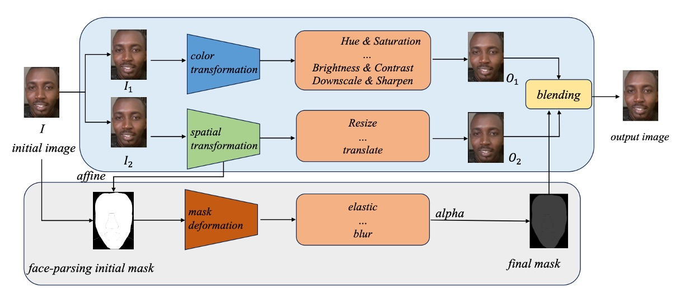

## 幻影の演武場

[**Joint Physical-Digital Facial Attack Detection Via Simulating Spoofing Clues**](https://arxiv.org/abs/2404.08450)

---

本論文の著者は自身のアーキテクチャに名前を付けていませんが、最も注目すべき Physical-Digital 部分を抜き出し、仮に PD-FAS と呼びます。

今後、著者が名前を付けた場合は更新します。

## 問題定義

顔認証におけるなりすまし防止（Face Anti-Spoofing, FAS）の目的は、ますます深まる変容との戦いです。

攻撃者は一般的に二種類に分類されます：

- **物理的攻撃（Physical Attacks）**：実体が存在し、表面を触れることが可能。写真、ディスプレイ、3D マスクなど、肉眼で見える偽装であり、実際の光の反射や素材感、角度のズレを伴います。
- **デジタル攻撃（Digital Attacks）**：純粋に生成されたもの。DeepFake、顔のスワッピング、敵対的摂動などがあり、私たちに非常によく似ているものの、実際には存在しません。

物理攻撃と魔法攻撃のように理解しても差し支えありません。

これら二つの攻撃は形式も痕跡も全く異なり、まるで二つの「世界観」を持っています。前者は光学的不調和、スクリーンのリフレッシュレート、エッジのギザギザから発生し、後者は意味空間の再構成に近く、敵対的学習の幻影と言えます。

これにより防御側のアプローチも分裂し、物理攻撃には低レベルなテクスチャ検出を重視し、デジタル攻撃には意味的・周波数領域のモデリングを目指します。二種類のモデル、二種類の論理、二つの訓練プロセスが存在し、まるでそれぞれ別の形態の欺瞞を防ぐ二人の守護者のようです。

しかし、世界はそんなに単純ではありません。

もしデジタル生成された DeepFake 動画をスマホの画面に表示し、さらにスマホで撮影して顔認証を行ったら、それはデジタル攻撃でしょうか？それとも物理的攻撃でしょうか？

あるいは、3D プリントマスクの内部に可変抵抗を設置し、顔の脈拍を模擬できるとしたら、それはバイオニクスでしょうか？それともアルゴリズムの拡張でしょうか？

境界は曖昧になり、境界線は崩れ、モデルの境界自体が脆弱性となります。

本論文はこの問題に対して新たな視点を提案します：

> **「一つのモデルに二つの世界の欺瞞を理解し、抵抗させるにはどうすればよいか？」**

---

## 解決策

<figure style={{"width": "90%"}}>

</figure>

PD-FAS はアーキテクチャ面で新しいモジュールを導入せず、また二つの攻撃を一つの判別メカニズムで統一しようともしていません。代わりに巧妙な戦略を採用しています：攻撃の手がかりを模擬する（Simulated Spoofing Clues）方法です。

これはデータ駆動型の介入手法であり、すべての世界の変形にモデルを適応させるよりも、**能動的に幻影を作り出す**ことを目指します。

PD-FAS は二種類のデータ拡張戦略を提案します：

- **SPSC（Simulated Physical Spoofing Clues）**：実際の画像に対して物理攻撃の変形を模擬します。例えば反射、高周波テクスチャ、エッジのぼかしなど。
- **SDSC（Simulated Digital Spoofing Clues）**：実際のサンプルに対してデジタル攻撃の攪乱を模擬します。例えば視覚的意味のずれ、スタイルの不整合、周波数領域の異常など。

これらの処理は元の「本物」画像に「偽り」の層をかぶせるものであり、既存の攻撃サンプルを直接使用するのではありません。目的は、モデルが**本物のサンプルに汚染が加わった際の歪みの痕跡**を学習することにあります。

訓練プロセスでは、これらの拡張されたサンプルを元のデータとともにネットワークに入力し、クロスエントロピー損失を通じてスプーフィング手がかりの識別能力を強化します。この方法には以下の利点があります：

1. **真の攻撃データを必要としない**：特に収集困難なデジタル攻撃タイプを SDSC が自動的に模擬可能。
2. **推論コストは増加しない**：訓練時に幻影を生成するだけで、推論は通常の流れ。
3. **既存のアーキテクチャに容易に統合可能**：SPSC と SDSC は任意の FAS モデルの訓練パイプラインに拡張モジュールとして挿入可能。

実験設計では、異なるプロトコルに対して対応する模擬戦略を適用しています：

- **Protocol 1**：SPSC と SDSC 両方を有効にし、モデルの総合的な識別力を向上；
- **Protocol 2.1**：SPSC のみ有効にし、未知の物理攻撃タイプに対抗；
- **Protocol 2.2**：SDSC のみ有効にし、未知のデジタル攻撃モードに対応。

### Simulated Physical Spoofing Clues

<figure style={{"width": "90%"}}>

</figure>

まずは SPSC の部分を見ていきます。

いわゆる物理攻撃とは、多くの場合、顔画像を紙やディスプレイ、3D マスクなどの実体のある媒体に変換し、それをカメラに映す過程を指します。この過程では色ズレ、モアレ、エッジのぼかし、反射の歪みなど、多くの観察可能な「物理的痕跡」が映像に残ります。

PD-FAS の第一のデータ増強戦略は、こうした実世界の映像からインスピレーションを得て、ライブサンプルに似た視覚的手がかりを人工的に作り出し、モデルが実際の攻撃サンプルに出会う前に識別ロジックを学習させることを目指します。

SPSC は以下の二つの増強を統合しています：

- **ColorJitter 増強**：印刷物で起こる色彩の歪み（Print Attack 対応）を模擬；
- **モアレ生成**：スクリーン再生＋カメラ撮影で発生する干渉模様（Replay Attack 対応）を再現。

まずは ColorJitter 増強について。

実物の印刷は画像の色が不安定になったり、コントラスト過剰や彩度の偏りを生じやすく、これらの色ズレは攻撃サンプル判別の重要な手がかりの一つです。

PD-FAS は統一された増強パラメータでこの異常状態を模擬します：

- 明るさ (Brightness) = 0.4
- コントラスト (Contrast) = 0.4
- 彩度 (Saturation) = 0.4
- 色相 (Hue) = 0.4

これらの設定は強烈ではないものの、元の「クリーン」なライブ画像に微かな違和感を加え、ぱっと見は本物に見えても細部で何かがおかしい「偽証明書」のような効果をもたらします。

次にモアレの生成です。

モアレはスクリーン映像をカメラで撮影する際に生じる干渉パターンで、Replay Attack によく見られる偽装の欠陥です。

この効果を模擬するため、PD-FAS は独自のモアレ生成アルゴリズムを設計しました。主な手順は以下の通りです：

1. 画像のサイズと中心座標を取得
2. 区間 $U(0.0005, 0.01)$ から干渉強度をランダム生成
3. ピクセル座標グリッド (x, y) を生成し (X, Y) に変換
4. オフセットと極座標角度 $(\theta, \rho)$ を計算
5. 角度と半径に基づき新座標 $(X_{\text{new}}, Y_{\text{new}})$ を生成
6. 結果を元画像にマッピングし、モアレの歪みを生成

この処理により、元画像がモアレ模様で歪み、モデルが物理攻撃の特徴を識別する学習が促進されます。

:::tip
**このような歪みは人工的すぎるのでは？**

それは一概には言えず、実験によって検証する必要があります。

画像に様々な増強手法を適用することはよくありますが、検証セットで期待通りの性能が出ない場合もあります。これは増強の方向性が実際の攻撃サンプルと合致していない可能性があるためで、その際は増強パラメータの調整や、より実際の攻撃特徴に適した模擬手法を選択する必要があります。
:::

### Simulated Digital Spoofing Clues

<figure style={{"width": "90%"}}>

</figure>

続いて SDSC の部分です。

物理攻撃の光や質感に比べ、デジタル偽造は意味やピクセルの細部に潜む騙しの手法です。DeepFake、顔のスワッピング、顔生成など、多くは顔領域に知覚できても定量化が難しい「人工的な痕跡」を残します。例えば境界のズレ、意味の漂流、局所的な歪みなどです。

これらの曖昧で不可解な特徴をモデルが識別できるよう、著者は Self-Blending 技術を参考に、三段階の擬似生成プロセスを設計しました。色の歪み、空間のずれ、マスクによる混合を段階的に模擬します。

- **ステップ 1：二重画像生成（色変換と空間変換）**

  原画像 $I$ から二つのコピー $I_1$ と $I_2$ を作成し、それぞれ「偽造元」と「偽造先」として扱います。

  - $I_1$：色調変換（Hue、Brightness の調整やダウンスケール）を施し、生成系顔に多い色彩異常を模擬した $O_1$ に。
  - $I_2$：リサイズや平行移動など空間変換を加え、顔位置や幾何変形の誤差を含む $O_2$ に。

  $O_1$ と $O_2$ は同一画像由来に見えますが、境界や意味がズレており、誤った顔交換を連想させます。

- **ステップ 2：顔マスク生成と変形**

  顔解析モデル（Face Parsing）で原画像 $I$ の顔領域を抽出し、**顔マスク（mask）** を作成します。

  さらにこのマスクに対し、

  1. **アフィン変換**：顔の空間変形を模擬；
  2. **マスク変形**：弾性変形やぼかしなどのノイズを加え、合成感を強調。

  こうしてズレや歪み、ぼかしを含む顔マスクが完成します。

- **ステップ 3：偽造画像の合成**

  最後に $O_1$、$O_2$、および変形マスク $\text{mask}$ を使い、以下の式で合成します：

  $$
  O_{\text{forgery}} = O_1 \odot \text{mask} + O_2 \odot (1 - \text{mask})
  $$

  この式は「偽造元の部分」と「歪んだ偽造先の部分」が混ざり合った、自己矛盾を含む顔画像を意味します。これが SDSC が再現しようとする手がかりです。

この三段階により、SDSC はモデル学習に「デジタル攻撃前のリハーサル台本」を提供し、モデルが曖昧に混じり合った顔の中から虚構の特徴を見つけ出すことを促します。

### データセット設定：UniAttackData

本論文の手法が「二重モーダルななりすまし防止」という新たな問題に対して有効か検証するため、著者はこれまでで最も包括的なクロスモーダル攻撃データセットである **UniAttackData** を選択しました。

このデータセットは多様な攻撃タイプをカバーするだけでなく、設計されたプロトコルも我々が真に解決したい課題に正確に対応しています：**一つのモデルが物理的およびデジタルな偽装を同時に識別できるか？**

UniAttackData は CASIA-SURF を基に拡張され、以下を含みます：

- **1800 人の被験者**、三大民族グループ（アフリカ系、東アジア系、中アジア系）
- **二種類の物理攻撃**：Print（印刷）、Replay（リプレイ）
- **六種類のデジタル偽造**：多様な DeepFake スタイルを含む
- **六種類の敵対的サンプル**：極限の偽装を模擬

二つの現実的な課題に対応するため、二つの主要なテストプロトコルを設計しています：

| プロトコル   | テスト目的                   | テストデータ           |
| ------------ | ---------------------------- | ---------------------- |
| Protocol 1   | デジタル＆物理攻撃の同時識別 | 全ての攻撃タイプ含む   |
| Protocol 2.1 | 未知の物理攻撃への一般化     | 未知の物理偽装サンプル |
| Protocol 2.2 | 未知のデジタル攻撃への一般化 | 未知の DeepFake        |

### 評価指標：APCER / BPCER / ACER

モデル性能の評価は顔なりすまし防止領域の古典的三指標を用いています：

- **APCER**（Attack Presentation Classification Error Rate）：攻撃を真実と誤認する割合
- **BPCER**（Bona Fide Presentation Classification Error Rate）：本物を攻撃と誤認する割合
- **ACER**（Average Classification Error Rate）：総合誤認率

CVPR 2024 第 5 回 Face Anti-Spoofing Challenge においては、**最終順位は ACER を基準**としており、単一攻撃種別だけでなく双方向の判別安定性を重視しています。

### 実験設定および訓練詳細

- **画像前処理フロー**：

  - 元画像サイズが 700px 超の場合は顔検出を行い、20px 拡張した範囲で切り出し。
  - 顔検出不可の場合は中央から 500×500 でクロップ。
  - SDSC では顔パーシングを用いて顔マスクを取得し、後続の合成に利用。

- **ネットワーク構造**：

  - バックボーンに **ResNet-50** を採用。著者は「任意の構造に対応可能」と述べていますが、データ量制限のため安定した中間規模モデルを選択。

- **訓練戦略**：

  - Optimizer：AdamW、学習率 $10^{-3}$、weight decay $5 \times 10^{-4}$
  - 学習率調整：Cosine Annealing
  - 入力サイズ統一：$224 \times 224$
  - 一般的なデータ増強：`RandomResizedCrop` と `HorizontalFlip`
  - 損失関数：クロスエントロピー、live / attack 重み付けバランス有り

- **三種のプロトコルに対応した三つのモデル**を独立に訓練し、以下の設定：

  - 単一の A100（80GB） GPU で訓練完了、**各モデルは約 1 時間で完了**。

| プロトコル   | 訓練データ範囲     | 訓練時間     | テスト時間 |
| ------------ | ------------------ | ------------ | ---------- |
| Protocol 1   | 全サンプル         | 200 エポック | 約 1 分    |
| Protocol 2.1 | 未知の物理攻撃     | 200 エポック | 約 1 分    |
| Protocol 2.2 | 未知のデジタル攻撃 | 200 エポック | 約 1 分    |

## 議論

PD-FAS はモデルの複雑化を主張せず、むしろデータレベルで「何が攻撃か」を再構築しています。

この設計の有効性を検証するため、著者は多様な指標や設定で総合的な実験を行い、SOTA 手法との比較、プロトコル別の一般化能力、モジュール別効果解析、バックボーンの適応性および可視化分析を網羅しています。

### SOTA 手法との比較

<figure style={{"width": "70%"}}>

</figure>

UniAttackData データセット上で、PD-FAS は代表的手法（例：VAI-Face など）と 4 つの指標で対比されました。VAI-Face は BPCER で最良（0.25%）を示しましたが、PD-FAS は他 3 指標で全面的に上回り、以下を達成しています：

- AUC：**99.69%**
- APCER：**3.75%**
- ACER：**2.33%**

これは、実運用での不確実な攻撃タイプに対し、PD-FAS がより堅牢な識別能力を持つことを示します。特に最低の APCER は偽サンプル検出に優れ、不正侵入を効果的に阻止する意味合いがあります。

### 3 つのプロトコル別シナリオ

<figure style={{"width": "70%"}}>

</figure>

実際の運用での一般化課題を模擬するため、実験は 3 つのプロトコルに分けられています：

- **Protocol 1**：標準的な訓練とテスト
- **Protocol 2.1**：未知の物理攻撃（SPSC のみ使用）
- **Protocol 2.2**：未知のデジタル攻撃（SDSC のみ使用）

結果は以下の通りです：

- Protocol 1 では PD-FAS はベースラインを若干上回る
- Protocol 2.1：**ACER が 38.05% から 1.32% に低下**
- Protocol 2.2：**ACER が 44.35% から 1.65% に低下**
- 平均 ACER は **27.54% から 1.06% に約 26.48 ポイント改善**

これらの数値は結論とみなせ、**クロスドメインテストにおいて、PD-FAS の模擬的データ増強は静的な元データより圧倒的に効果的**であることを示しています。

### モジュール別効果分解

- **SPSC モジュール**：

    

    <figure style={{"width": "70%"}}>
    
    </figure>
    

  - ColorJitter のみ：ACER 3.62% に低減
  - モアレパターンのみ：ACER 6.18% に低減
  - 両者併用（完全な SPSC）：**ACER = 1.32%**

  色ズレとスクリーン干渉は Replay および Print 攻撃の代表的特徴であることが証明されました。

- **SDSC モジュール**：

    

    <figure style={{"width": "70%"}}>
    
    </figure>
    

  - SDSC 単独：**ACER = 1.65%**
  - ガウシアンノイズによる敵対的擾乱模擬：ACER は 36.77% にしか低減せず
  - SDSC + GaussNoise：ACER は逆に 22.57% に上昇（過剰干渉は逆効果）

結論は明瞭で、**ターゲットを絞った特徴模擬は汎用ノイズより効果的**であり、模擬の細部があいまいな一般化より現実的です。

### バックボーン検証

<figure style={{"width": "70%"}}>

</figure>

PD-FAS は「アーキテクチャ非依存」を特徴とし、5 種のバックボーンを試験しました：

- ResNet18 / ResNet34 / ResNet50
- Swin-Tiny / Swin-Base

UniAttackData の規模が大きくないためモデル間に若干のバラつきはありますが、

- **すべての構造が PD-FAS を統合可能で、主体構造の変更は不要**
- **ResNet50 が最良の性能で、ACER = 1.06%**

この「プラグイン式」の性質は実運用価値を示唆します。

### 可視化解析

<figure style={{"width": "70%"}}>

</figure>

Grad-CAM による可視化解析の結果：

- **Protocol 2.1（物理攻撃）**：色変化やモアレ模様の領域に注意が集中
- **Protocol 2.2（デジタル攻撃）**：エッジの断裂や顔の変形部分に注目

## 結論

**SPSC** と **SDSC** という二つのターゲット増強により、モデルは訓練段階で曖昧な領域を目にし識別能力を高めます。

多数の実験で検証され、本手法は未知攻撃タイプの検出能力を大幅に改善し、アーキテクチャ非依存性と拡張性も示しています。結果的に CVPR 2024 第 5 回 FAS チャレンジで優勝を飾り、以下の注目点を残しました：

- **データ増強の再定義**：モデルに「偽りとは何か」を思考させる論理を学習させる
- **攻撃モード間の架け橋設計**：対立的識別方法から共通の訓練空間を発見
- **訓練データの組み合わせ可能性**：アーキテクチャ非拘束かつ低侵襲で、実用的な普及が可能

また、この論文は問いかけます：

**本当に汎化能力はより大きなデータと深いモデルだけで築かれるのか？**

おそらくそうではないでしょう。
