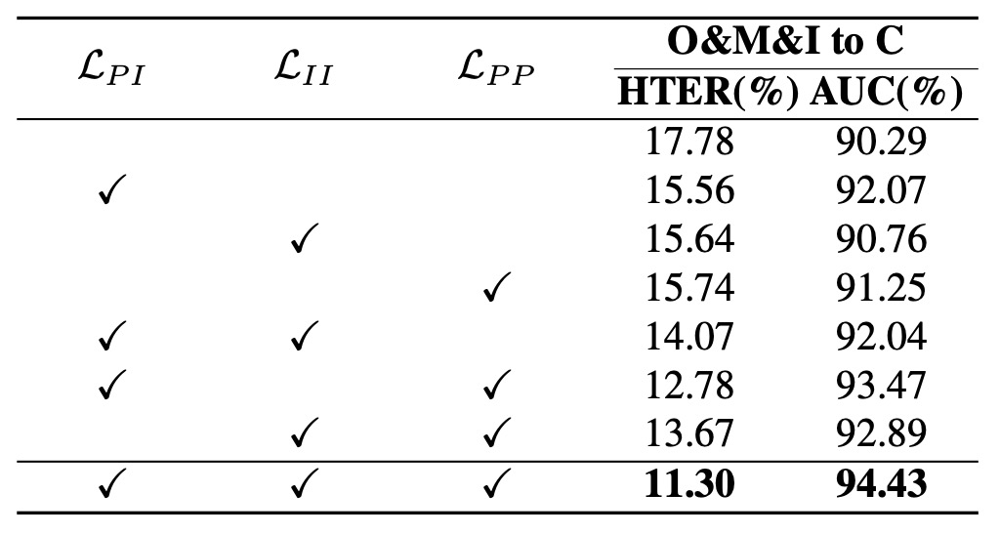

## 双曲の世界樹

[**Rethinking Generalizable Face Anti-spoofing via Hierarchical Prototype-guided Distribution Refinement in Hyperbolic Space**](https://openaccess.thecvf.com//content/CVPR2024/papers/Hu_Rethinking_Generalizable_Face_Anti-spoofing_via_Hierarchical_Prototype-guided_Distribution_Refinement_in_CVPR_2024_paper.pdf)

---

CVPR の論文を見てみましょう。

著者は別の視点から FAS の問題に切り込み、新規性の高いコンセプトを提示しています。

## 問題の定義

顔認識システムの防護網は FAS（顔偽装検知）に基づいて構築されています。

深層学習の成熟とともに研究は著しい進展を遂げました。初期の手作業による特徴量から、深層の二分類モデル、近年ではドメイン適応技術へと進化し、FAS は混沌からリスクを識別する方法を段階的に学んでいます。

しかし、データセットやシーンが変わるとモデルの性能は急激に低下し、これは繰り返し確認されてきました。

そのため研究者はモデルに「一般化能力」を学ばせようと、敵対的学習、デコーディング、対比学習、メタラーニングなど様々な訓練手法を導入し、異なる環境でも特徴量が一貫するよう試みています。

しかしその過程で、知らず知らずのうちに犠牲になっているものがあります。それは「意味の構造性」です。

ここで言う構造性とは、ネットワーク構造そのものではなく、サンプル間の「意味的距離」と「階層的文脈」のことを指します：

- カラー印刷機で印刷された写真と、スマホで録画再生された動画は、画素分布は似ているかもしれませんが、背後にある攻撃タイプやメカニズムはまったく異なります。
- 攻撃生成の条件（光の加減、背景、材質など）は、サンプルの意味的属性を分割している本質であり、ノイズではありません。

しかし現状の手法は、すべてのサンプルを無理に同じ「ユークリッド」特徴空間に埋め込み、ドメインギャップの最小化を優先するために、過度な整合（オーバーアラインメント）が発生しています。

本来分離すべき特徴を無理に押し込め、モデルが理解できるはずの構造を平坦で階層のない空間に押し込めてしまっています。

これは非常に不自然です。

そこで本論文の著者はこう提案します：

> **一般化の難しさは意味のアンバランスに起因する。ならば、階層構造が自然に現れる空間に特徴を移すことはできないか？**

---

## 問題の解決

:::warning
数学的な警告ですが、本論文の方法論はやや難解です。読者はご注意ください。
:::

意味構造が圧縮されて断裂した問題を修復するために、本論文は新しい方法論を提案します：

- **階層的プロトタイプ指導分布再精緻化（Hierarchical Prototype-guided Distribution Refinement：HPDR）**

全体として、HPDR は以下の 3 つのコアに基づいています：

1. **双曲空間に特徴を埋め込み**、内在する階層構造を捉えること；
2. プロトタイプ学習を意味座標系として用い、サンプルと意味的クラスターとの関連付けを行うこと；
3. **多層の整合と最適化戦略**を通じて、一般化可能な意味分布に段階的に近づけること。

まずは、この空間自体から見ていきましょう。

### 双曲空間

意味が木構造を持つならば、双曲空間は幾何学的に最適な選択肢となります。

我々は意味の樹を想像できます。そこでは「攻撃」と「本物」が幹として分かれ、材質や呈示方法、取得機器に応じて枝葉が無限に伸びていきます。この樹を無理やり平坦なユークリッド平面に押し込めると、枝が歪み、重なり、展開できません。しかし双曲空間では自然に伸びあい、互いに避け合い、境界上で無限に増殖します。

HPDR が採用するのはまさにこの空間モデル、ポアンカレ球面モデル（Poincaré Ball Model）です。

ポアンカレ球面は概念上の空間で、

$$
\mathbb{D}^n = \left\{ \mathbf{x} \in \mathbb{R}^n \mid \|\mathbf{x}\| < 1 \right\}
$$

つまり、全ての点が半径 1 の開球体内に包まれています。

一見閉じた領域のようですが、この球の境界は終点ではなく、無限遠点です。

**これは境界に近づくことはできても、決して触れることはできないことを意味します。**

この設計には重要な特性があります。境界に近い点ほど互いの距離が**非線形に膨張**します。言い換えれば距離自体が意味階層の緊張を帯びています。

この空間を計算可能にするために、従来のユークリッド距離ではなく、曲率で制御される**リーマン計量テンソル**を導入します：

$$
g_{\mathbb{D}} = \lambda_c^2 \cdot g_E, \quad \lambda_c = \frac{2}{1 - c\|\mathbf{x}\|^2}
$$

- $g_E$：我々が馴染み深い平面上の計量
- $\lambda_c$：位置に依存するスケーリング因子（共形因子）

中心に近いほど$\lambda_c$は一定に近く、幾何は平坦に近似されますが、境界に近づくと$|\mathbf{x}| \to 1$で$\lambda_c$は発散し、空間全体が「強い緊張状態」となり、わずかなズレでも距離が大きくなります。

これが双曲空間の本質です。**階層が自然に拡張されることを可能にします。**

この幾何で移動するには線形加算ではなく、**メビウス加算**を用います：

$$
\mathbf{u} \oplus_c \mathbf{v}
= \frac{(1 + 2c\langle \mathbf{u}, \mathbf{v} \rangle + c\|\mathbf{v}\|^2)\mathbf{u} + (1 - c\|\mathbf{u}\|^2)\mathbf{v}}{1 + 2c\langle \mathbf{u}, \mathbf{v} \rangle + c^2\|\mathbf{u}\|^2\|\mathbf{v}\|^2}
$$

この加算は通常のベクトルの重ね合わせではなく、**曲がった空間の境界に沿って進む動作**を表します。現在の位置の曲率に従い、意味や方向が変わります。

点間の距離は双曲距離で定義されます：

$$
d_H(\mathbf{u}, \mathbf{v}) = \frac{2}{\sqrt{c}} \cdot \operatorname{arctanh}\left( \sqrt{c} \cdot \| -\mathbf{u} \oplus_c \mathbf{v} \| \right)
$$

この距離は「意味の分岐」を幾何的に表現し、ベクトル間のどれだけ曲がり、どれだけ深く分かれているかを測り、伝統的な「距離の長さ」ではありません。

双曲空間を得た次の問題は、

- **ニューラルネットの出力をどうマッピングするか？**

ニューラルネットの特徴は依然ユークリッド空間のベクトルなので、双曲空間への適切な写像が必要です。

これには指数写像（Exponential Map）を使います：

$$
\exp_0^c(\mathbf{v}) = \tanh\left(\sqrt{c} \frac{\|\mathbf{v}\|}{2}\right) \cdot \frac{\mathbf{v}}{\sqrt{c}\|\mathbf{v}\|}
$$

この操作は２つの効果を持ちます：

- ベクトルが短い場合：球の中心近くに押し込まれ、高次の意味を表す
- ベクトルが長い場合：球の縁へ押し出され、細分化された意味の葉ノードとなる

意味は本質的に非線形なので、この過程は意味の真の分布により適合しています。

### 意味のアンカーポイント

双曲空間が準備できたら、次は意味がどこで生まれるかです。

HPDR では、モデルにすべてのサンプルを「エンドツーエンド」で特徴分類させるのではなく、まず安定かつ制御可能な意味構造、つまり「プロトタイプ（Prototype）」設計を与えます。

プロトタイプは単なる点ではなく、**意味の集約単位**です。

- その座標位置が、サンプルの分類を決める；
- それらの間の距離が、意味空間の全体的な分布を形作る。

まず基本となる一組のプロトタイプを定義し、葉ノードプロトタイプ（Leaf Prototypes）と呼びます。これはサンプルの意味的な集約点に対応し、明確なラベル情報を持ちます。

数学的には次のように定義されます：

$$
\mathcal{P}_{\text{leaf}} = \{ p_{ij} \mid i \in \{0,1\}, j \in \{0, \dots, K-1\} \}
$$

- $i$：クラスインデックス。0 は fake、1 は live を示す；
- $j$：各クラスの$j$番目のプロトタイプで、計$K$個；
- 合計で$2K$個の leaf prototypes があり、2 つのクラスの意味的なサブグループに対応する。

この設計は次の仮定を含みます：**同一クラスのサンプルは複数の意味的なサブタイプに分割でき、それらはそれぞれ異なる leaf prototype で対応する**。

理論的には、これらのプロトタイプは双曲空間$\mathbb{D}^n$内で初期化されることが望ましいですが、実務では直接初期化すると勾配爆発や最適化不安定を招きやすいです。そこで著者の実装は：

1. ユークリッド空間$\mathbb{R}^n$でランダムにプロトタイプベクトル$\mathbf{p}_{\text{Euc}}$を初期化；
2. 指数写像を通じて双曲空間に写像：

$$
\mathbf{p} = \exp_0^c(\mathbf{p}_{\text{Euc}}) \quad \text{with} \quad \mathbf{p}_{\text{Euc}} \in \mathbb{R}^n
$$

この設計により、初期化の安定性が保たれ、訓練初期の過度な散逸や収縮を防げます。

次に、全体構造の中で最も興味深い部分、**None-leaf Prototypes**です。

これらのプロトタイプは単一のサンプルに対応せず、leaf prototypes の間に存在し、それらの共通の祖先かつ意味的な接続点として機能します。

定義は次の通り：

$$
\mathcal{P}_{\text{none-leaf}} = \{ p_k \mid k \in \{0, \dots, K'-1\} \}
$$

- これらも$\mathbb{D}^n$に埋め込まれていますが、ラベル情報は持ちません；
- 意味の樹の内部ノードを構築し、意味階層間の遷移や収束を模倣します。

つまり、

- **Leaf Prototypes はサンプルを集約し意味対応を構築する**；
- **None-leaf Prototypes はプロトタイプを集約し階層構造を作る**。

この設計の美しさは、**教師なしの意味階層モデリングを分類構造に組み込んでいること**です。

どのサブグループが誰に属するかを明示的に指定せず、モデルが自ら発見します。どのプロトタイプが近く、どれに共通の祖先があるか、どの祖先が境界に近く中心に留まるべきかを。

### 意味の三層アラインメント

双曲空間とプロトタイプが整ったら、次は学習可能なシステムを構築します。

この設計は **Hyperbolic Prototype Learning（HPL）** と呼ばれ、意味の三層関係に着目した学習構造です：

- **Prototype ↔ Instance**：点対点の意味アラインメント
- **Instance ↔ Instance**：サンプル間の内部一貫性
- **Prototype ↔ Prototype**：意味構造の階層構築

それぞれ見ていきましょう。

1. **プロトタイプベースの特徴アラインメント**

   基本は、**サンプルが自分の意味的アンカーを見つける**ことです。

   各サンプル特徴ベクトル$\mathbf{z}$について、そのラベル$y$のもとで対応する leaf prototypes の中から最も距離の近いものを探します：

   $$
   p(\mathbf{z}) = \arg\min_{p_{yj} \in \mathcal{P}_{\text{leaf}}} d_H(\mathbf{z}, p_{yj})
   $$

   これで各サンプルに「正しい」プロトタイプを割り当てます。

   次に、特徴が対応プロトタイプに近づき、非対応のものから離れるよう学習します。双曲空間での対比学習はこう表現されます：

   $$
   \mathcal{L}_{PI} = -\sum_{n=1}^N \log \frac{e^{-d_H(\mathbf{z}_n, p_{c_k})}}{\sum_{i,j} e^{-d_H(\mathbf{z}_n, p_{ij})}}
   $$

   この損失はモデルに意味空間上でどのサンプルが近づくべきかを判断させます。

   また、すべてのサンプルが一つのプロトタイプに割り当てられる collapse を防ぐため、ミニバッチ中で各プロトタイプに均等に割り当てられるよう調整し、多様性と分布の張力を保ちます。

---

2. **インスタンスベースの一貫性**

   実際のサンプルは静的でなく、光や角度、遮蔽などの条件で揺らぎます。モデルは意味に関わる信号だけを学ぶべきです。そこで HPL は一貫性学習を導入します。

   サンプルペア$(x, x_{\text{aug}})$に対し、それぞれ特徴$\mathbf{z}, \mathbf{z}_{\text{aug}}$を取り、意味空間上で距離を縮めます：

   $$
   \mathcal{L}_{II\text{-feat}} = d_H(\text{detach}(\mathbf{z}), \mathbf{z}_{\text{aug}})
   $$

   ここで$\text{detach}(\cdot)$は勾配を遮断し、$\mathbf{z}_{\text{aug}}$のみを調整してアンカーを安定化させます。

   意味分布のレベルでは、両者の全プロトタイプへの距離分布を揃えます：

   $$
   \mathcal{L}_{II\text{-dist}} = \left\| d_H(\text{detach}(\mathbf{z}), \mathcal{P}_{\text{leaf}}) - d_H(\mathbf{z}_{\text{aug}}, \mathcal{P}_{\text{leaf}}) \right\|_2
   $$

   合計損失は：

   $$
   \mathcal{L}_{II} = \mathcal{L}_{II\text{-feat}} + \mathcal{L}_{II\text{-dist}}
   $$

   これにより外見の変化があっても、意味空間内での位置は変わりません。

---

3. **階層構造モデリング**

   プロトタイプ間の関係は単なる均等分布ではなく、距離や上下関係、祖先・子孫関係があります。

   ここが HPDR の象徴的なステップ：**意味の樹の自己成長**です。

   これを学習するために、階層的クラスタリングで用いられる **Dasgupta コスト**の考えを借ります：

   $$
   \mathcal{C} = \sum_{i,j} w_{ij} \cdot |\text{leaves}(p_i \vee p_j)|
   $$

   $p_i \vee p_j$は$p_i, p_j$の最小共通祖先（LCA）、$|\text{leaves}(\cdot)|$はその部分木の葉数。このコストは「意味的に近いプロトタイプは低い階層で集約できるか？」を問います。

   直接最適化できないため、トリプレットベースの手法を使います：

   1. 正例：$p_i, p_j$は互いに近い KNN
   2. 負例：$p_k$は両者から遠いプロトタイプ

   それぞれの三つ組$(p_i, p_j, p_k)$について、$p_i, p_j$の LCA となる none-leaf prototype $\rho_{ij}$を探します：

   $$
   \pi_{ij}(\rho) = \exp\left( - \max(d_H(p_i, \rho), d_H(p_j, \rho)) \right)
   $$

   $$
   \rho_{ij} = \arg\max_{\rho} \left( \pi_{ij}(\rho) + g_{ij} \right)
   $$

   $g_{ij}$は Gumbel ノイズで、argmax の微分可能近似。

   さらに、$\rho_{ij}$と$p_k$の共通祖先$\rho_{ijk}$を定め、次のトリプレット損失を設計します：

   $$
   \begin{aligned}
   \mathcal{L}_{PP\text{-LCA}} = &\left[d_H(p_i, \rho_{ij}) - d_H(p_i, \rho_{ijk}) + \delta\right] \\
   + &\left[d_H(p_j, \rho_{ij}) - d_H(p_j, \rho_{ijk}) + \delta\right] \\
   + &\left[d_H(p_k, \rho_{ijk}) - d_H(p_k, \rho_{ij}) + \delta\right]
   \end{aligned}
   $$

   また、leaf prototypes の分布には次の 2 つの構造的制約を課します：

   - **全プロトタイプを原点から遠ざける（収縮防止）**：

   $$
   \mathcal{L}_{P\text{-Origin}} = -\log \frac{1}{1 + \sum_{p_i \in \mathcal{P}_{\text{leaf}}} \exp(-d_H(p_i, \mathbf{O}))}
   $$

   - **異なるプロトタイプ同士を分散させる**：

   $$
   \mathcal{L}_{PP\text{-leaf}} = -\log \frac{1}{1 + \sum_{p_i, p_j \in \mathcal{P}_{\text{leaf}}} \exp(-d_H(p_i, p_j))}
   $$

   最終的な意味構造モデリングの損失は：

   $$
   \mathcal{L}_{PP} = \mathcal{L}_{PP\text{-LCA}} + \mathcal{L}_{P\text{-Origin}} + \mathcal{L}_{PP\text{-leaf}}
   $$

---

意味のアラインメントで最も難しいのは、点間の関係もまた樹構造として成長させることです。

HPDR の Hyperbolic Prototype Learning は非線形空間で、分類を単なるラベリングではなく、まるで構文解析のように変貌させます。

### トレーニングプロセス

トレーニングは以下の 3 段階に分かれます：

- **Step 1：プロトタイプ初期化**

  まず双曲空間内でランダムに初期化します：

  - すべての **Leaf Prototypes**（サンプルとのアラインメント用）
  - すべての **None-leaf Prototypes**（階層構築用）

  この段階ではプロトタイプは空間上に分散し、構造を持たず、サンプルとの明確な対応関係もありません。ただ静かに存在し、サンプルに「認領」され、距離から意味を育むのを待ちます。

---

- **Step 2：プロトタイプ割り当て**

  サンプルは双曲空間に埋め込まれ、自分の意味的なアンカーを探し始めます。

  著者はサンプルのラベル $y$ に基づき、その特徴 $\mathbf{z}$ を同じクラス内で最も近い Leaf Prototype に割り当てます。

---

- **Step 3：プロトタイプ最適化**

  サンプルとプロトタイプの関係が確定すると、システム全体の協調調整と意味のアラインメントを行います。

  次の総損失で最適化します：

  $$
  \mathcal{L}_{\text{all}} = \mathcal{L}_{\text{pred}} + \mathcal{L}_{PI} + \mathcal{L}_{II} + \mathcal{L}_{PP}
  $$

  これら 4 つの損失はそれぞれ、

  - **意味的決定の安定性**（$\mathcal{L}_{\text{pred}}$）
  - **サンプルとプロトタイプのアラインメント**（$\mathcal{L}_{PI}$）
  - **サンプル自身の強化下での一貫性**（$\mathcal{L}_{II}$）
  - **プロトタイプ間の階層および構造関係**（$\mathcal{L}_{PP}$）

  この最適化を経て、空間内のサンプルとプロトタイプが変化し、プロトタイプの位置が微調整され、サンプルの埋め込みが収束し、意味的な緊張が再配分されます。

  その後、プロセスは Step 2 に戻り、**再度割り当てを行い、次の収束サイクルに入ります。**

### 実験設計

HPDR の汎化能力を検証するため、著者は一般的な OCIM ベンチマークを用いています。

全体構造の学習可能性と再現性を担保するため、以下がモデル実装の重要な設定です：

- **入力画像サイズ**：256×256（カラー顔領域のクロップ）
- **leaf プロトタイプ数 $K = 20$**：各クラスごとに 20 個の意味的アンカー
- **none-leaf プロトタイプ数 $K' = 256$**：意味階層の骨格ノード
- **特徴次元数**：256 次元の双曲特徴空間
- **曲率パラメータ $c = 0.01$**：双曲幾何の空間湾曲度合い
- **サンプル配置**：各ドメインからクラスごとに 5 サンプル、合計バッチサイズ 30
- **トリプレットにおける正例プロトタイプペア**：KNN 上位 3 つを正例とする
- **損失関数の構造的マージン $\delta = 0.1$**

トレーニングは Pytorch フレームワークで行い、Backbone に DepthNet を用います。NVIDIA 4090 上で実行し、オプティマイザは Adam、学習率は 0.001 です。

## 議論

### OCIM ベンチマーク

<figure style={{"width": "90%"}}>

</figure>

これは近年のほぼすべての論文で標準となっているベンチマークで、任意の 3 つのデータセットを訓練ソースとし、未見のドメインをテストセットとして残します。

実験の目的は、「新しい機器、新しい光源、新しい環境」といった実際の場面での挑戦を模擬することです。

実験結果は上表の通りです：

- すべての DG（Domain Generalization）手法が従来法を上回り、DG 戦略が確かにクロスシーンの汎化に寄与していることを示す；
- HPDR は他の DG ベースの手法を明確に凌駕し、未見のテストセットでも低誤認率を維持している；

特に注目すべきは、**対抗手法もプロトタイプや双曲埋め込みを用いているにも関わらず、HPDR が勝っている**点です。なぜなら HPDR は単なるサンプルのアラインメントではなく、**階層的な意味の樹を構築している**からです。

ここでの強みはモデルに内蔵された構文構造に由来します。
他の手法は点と点の関係を合わせますが、HPDR は意味間の**位置と階層**を整合させています。

---

### 限られたソースドメイン

<figure style={{"width": "60%"}}>

</figure>

このテストでは、著者は 2 つのデータセット（MSU と Replay）だけを訓練源とし、OULU と CASIA でテストしました。これは実務でよくあるサンプルが希薄でドメイン分布が限られる状況に近いです。

実験結果（上表）では、AEML などの手法に比べ、HPDR は M\&I→C 設定で AUC を 3.42%**向上、HTER を**2.30%減少させました。同様に双曲・プロトタイプ手法間でも HPDR が依然リードしています。

これは**サンプルが少数ドメインに由来しても、意味構造が明確であれば未知シーンでも合理的な判断が可能**であることを示しています。

HPDR はここで、視界のはっきりした地図読み手のような役割を担い、目先の道筋ではなく内蔵された地形知識で方向を理解しています。

---

### クロスアタック

最後に、著者は HQ-WMCA データセットでクロスアタック評価を行いました。

このタスクの困難さは、ある攻撃形式を除外して訓練し、テスト時にその攻撃タイプのみで評価する点にあり、**意味の転移の堅牢性**を試します。

結果は HPDR がすべての攻撃タイプで低い ACER を維持し、「新しい攻撃」が現れても安定した性能を示しました。その理由は、**単に攻撃タイプを判定するのではなく、「これは既知の意味分布か否か」を意味空間上で識別できているからです。**

言い換えれば、モデルは「この顔に化粧があるか」を覚えたのではなく、「この顔の全体的意味が既知の意味構造内に合理的に存在するか」を判断しているのです。

### 意味空間の鍵は誰か？

<figure style={{"width": "60%"}}>

</figure>

実験結果から得られる観察は：

- **損失を一切入れない場合**、性能が最悪（HTER が明らかに上昇）し、双曲空間への埋め込みだけでは性能向上に足りず、空間には**構造的な教師信号**が必要であること。
- **$\mathcal{L}_{PI}$（Prototype-Instance 整合）単体投入で性能大幅改善**し、サンプルと意味プロトタイプの対応が安定した埋め込み空間形成の鍵となること。
- **$\mathcal{L}_{PP}$（Prototype 間階層構築）投入でさらなる進歩**を示し、空間が安定するだけでなく階層的になること。
- **全損失併用時に最良結果**となり、HPDR の設計思想が協調的であり、単なる線形積み上げでなく意味の構文的立体パズルであることを裏付ける。

結論として、空間自体は構造を保証せず、構造は多層的関係で維持される。整合、一貫性、階層論理が揃って初めて成立する。

### 意味の樹はいくつの枝を伸ばすべきか？

<figure style={{"width": "60%"}}>

</figure>

著者は分岐数を変えて実験し、プロトタイプ数を 4 から 20 まで増やすと性能は安定的に向上しました。しかし 20 を超えると**過拡張効果**が発生し、空間が過度に希薄化して意味分布が不安定に。

またプロトタイプ数が多すぎるとミニバッチのリソース配分が不均一となり、些細な割当てを招きます。今回の設定では、**クラスごと 20 個のプロトタイプ**が「最小冗長かつ最大表現力」の最適解とされます。

---

### 意味空間の湾曲度はどの程度か？

<figure style={{"width": "60%"}}>

</figure>

表からいくつかのポイントがわかります：

- **ユークリッド空間（$c=0$）が最も低性能**で、意味階層が展開しにくい；
- 曲率が小から 0.01 に増えると性能向上し、意味階層が明確になる；
- $c$が大きすぎると性能が下がる。指数写像は基点$x=0$を使い、空間が歪みすぎると近似誤差が大きくなり意味も崩れる。

つまり双曲空間は「湾曲すれば良い」というわけでなく、意味の枝が自由に伸び、かつ迷わない「ちょうど良い」湾曲が必要です。

### 可視化結果

最後に、著者は**Leave-One-Out**と**Cross-Attack**タスクを背景に、HPDR で学習された意味空間を可視化しました。

図中では、

- **サンプル色はクラスやドメインを示す**；
- **位置は双曲空間での埋め込み結果に対応**；
- **leaf および none-leaf プロトタイプは特定点や階層ノードとして示される**。

図から以下の要点が読み取れます：

1. 意味分布は乱雑に拡散するのではなく、階層的に展開し、サンプルは自分の意味プロトタイプ周辺に集まり、意味の近さに応じて樹状構造を形成している；
2. none-leaf プロトタイプの導入が意味の収束に重要で、複数の意味的サブグループの集約点となり、過剰なプロトタイプによる空間の断片化を防ぐ；
3. ドメインや攻撃を跨いだサンプルも既存の構造に自然に埋め込まれており、モデルが学んだのは表面的なドメイン分布ではなく意味の論理的トポロジーであることを示す。

図(b)では各 leaf プロトタイプに対応するサンプルを個別に可視化し、画像群として提示。そこからは、

- どのドメインであっても、同一プロトタイプに属するサンプルは非常に類似している；
- 共有 LCA が低いプロトタイプ間では意味的一貫性が高く、階層が意味の一貫性を幾何学的に反映していることがわかる。

この可視化は、構造を教示しなくともモデルが自然に意味の階層分化を学んだことを示しています。

## 結論

本研究の核心は多様なサンプルを記憶することにあるのではなく、意味階層を内包する空間論理を構築することにあります。

著者は多数の実験と可視化解析を通じて HPDR の有効性を検証しました。未知の環境、限られたソース、新種の攻撃に対して優れた汎化性能を示し、構造的モデリングがクロスシーン認識の安定性を大きく高めることを証明しています。

近年、自然言語処理能力を FAS に統合する動きがありますが、将来的に意味の樹の概念を自然言語と組み合わせれば、まったく新しい意味の樹が現れる可能性も期待されます。
