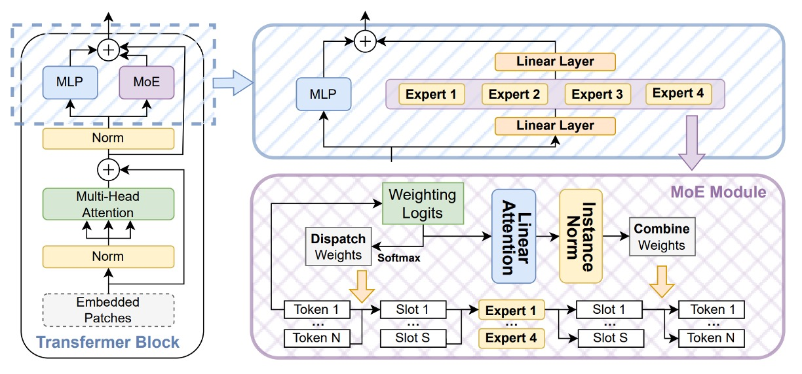
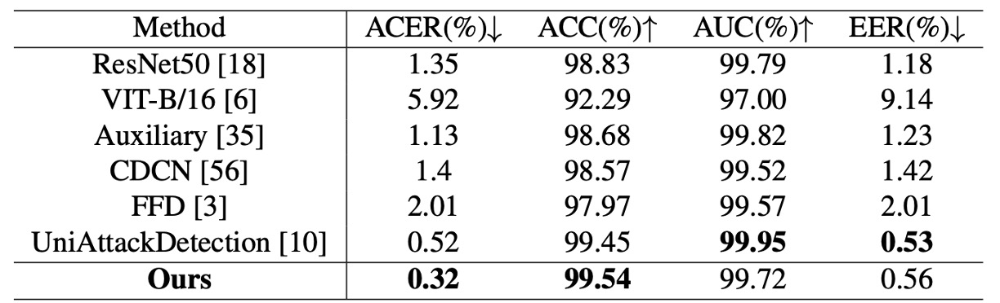
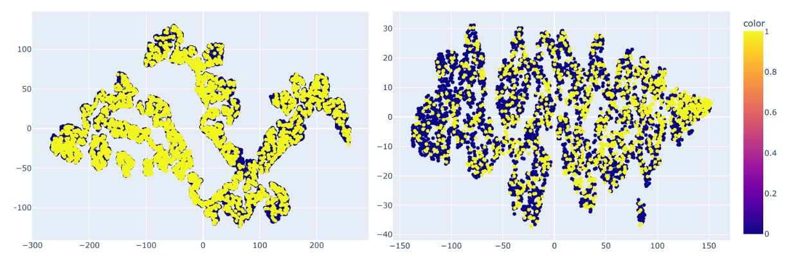

## 希薄な亀裂

[**La-SoftMoE CLIP for Unified Physical-Digital Face Attack Detection**](https://arxiv.org/abs/2408.12793)

---

実体攻撃（Physical Attacks, PAs）はよりリアルにカメラに侵入してくる。プリンターから吐き出されたカラープリント写真から、リアルなマスクの下の深い眼窩まで。

デジタル攻撃（Digital Attacks, DAs）はアルゴリズムの深層で幻影を生成する。スタイル変換、ディープフェイク、さらには映像記録自体の改ざんを含む。

顔認識システムの境界は、これまでになく曖昧になっている。

## 問題の定義

これまでの研究では、この二つは別々のタスクとして扱われてきた：

- **PAD（Physical Attack Detection）**：

  複数モーダルのセンサーと生理的特徴の抽出に注力し、実世界の計測可能性を重視する；

- **DAD（Digital Attack Detection）**：

  特徴レベルの細部解析、周波数領域の異常や視覚的な欺瞞パターンに着目する。

それぞれが進展を遂げてきたものの、モデルの展開において重複した構築やタスク間の移行困難を生んでいる。

実際の運用環境において、単一の攻撃タイプにしか遭遇しないシステムは存在せず、だからこそ **Unified Attack Detection (UAD)** が急務かつ自然な研究テーマとなっている。

しかし、統一は融合を意味しない。

UniAttackData が示す特徴分布を見ると、二種類の攻撃は埋め込み空間で極めて異なる分布を示している。特に ID の一貫性（ID consistency）を含む設定では、同一人物の攻撃サンプルであっても孤立したクラスタ傾向を示す。

この「**希薄かつ分裂した特徴空間**」こそが既存手法の盲点である。

一部の研究者は多分岐設計（CA-MoEiT など）、マルチタスク学習、生理情報の導入で二種の攻撃形態に対応しようとしているが、これらは新たな課題を引き起こしている：

- アーキテクチャの複雑化により計算資源の消費増大と展開遅延が発生
- ID-consistency を持たないデータセットにより、モデルが背景や非意味的手がかりを学習
- CLIP のような大規模汎用モデルにおいて、特徴次元の希薄さが分類ロジックの安定性をさらに損なう

このような状況下で、たとえ CLIP のような視覚言語モデルであっても、希薄な特徴空間において「偽の顔」の統一的な文法を識別することは困難だ。

人々は気づき始めている：**これは単にデータ不足の問題ではなく、意味特徴の分布があまりにも分裂しているのだと。** 真の問題はモデルの容量ではなく、自らの能力を適切に活用する明確な手段が欠如している点にある。

おそらく、モデルに自己調整や自己協調を学ばせる時期が来ている。

まさにここに、Mixture-of-Experts（MoE）の設計論理が誕生する。

:::tip
MoE の概念に馴染みがない読者は、以前読んだ以下の論文を参照されたい：

- [**[21.01] Switch Transformer: 専門家に話をさせる**](../../transformers/2101-switch-transformer/index.md)
  :::

## 問題の解決

前述の問題に対し、著者は Mixture-of-Experts（MoE）の設計理念と線形注意機構を組み合わせた構造を提案し、これを **La-SoftMoE CLIP** と命名した。

この手法は元の CLIP アーキテクチャを改造し、特に希薄な意味空間における分類能力を強化している。

### SoftMoE モジュール設計

<figure style={{"width": "90%"}}>

</figure>

CLIP の希薄な意味空間での識別能力を強化するために、著者は **Soft Mixture-of-Experts（SoftMoE）** モジュールを導入し、各層の ViT の残差ブロックに埋め込んでいる（上図参照）。

SoftMoE は従来の MoE と比べて以下の利点を持つ：

- **ソフトディスパッチ（Soft Dispatch）**：Softmax 重みを用いて全入力トークンをスロットにマッピングし、top-k のハード割当てによるトークンのドロップや負荷不均衡の問題を回避。
- **微分可能設計**：全体の処理が微分可能であり、主幹ネットワークと安定して共同学習が可能。
- **高い拡張性**：専門家の選択やソートを必要とせず、軽量に数千ものエキスパートスロットへ拡張可能。

具体的な計算プロセスは以下の通り：

1. **ディスパッチ重み**

   Soft-MoE では従来の top-$k$ 割当てを廃止し、代わりに

   - **ソフトディスパッチ機構**

   を採用する。

   ここで「スロット」と呼ばれる媒介表現群を導入し、入力トークンの意味的加重平均を担う。各スロットは単一トークンではなく、「トークンの加重総和」で生成され、意味的部分空間の集約ベクトルとみなせる。

   各専門家は複数スロットを処理し、データ特性に応じて差異化された演算を行う。

   ディスパッチは次のように定義される。入力トークン行列を $X$ とし、パラメータ $\Phi$ で投影したディスパッチロジットに対して各スロット（$m = e \cdot s$ 個）に列方向ソフトマックスを施す：

   $$
   D_{ij}= \frac{\exp\bigl[(X\Phi)_{ij}\bigr]}
           {\sum_{i'=1}^{n}\exp\bigl[(X\Phi)_{i'j}\bigr]}
   ,\qquad
   \tilde X = D^{\!\top}X
   $$

   - $D \in \mathbb{R}^{n \times m}$ はディスパッチ重み行列で、第 $i$ トークンが第 $j$ スロットにどれだけ寄与するかを示す。
   - $\tilde X$ は各スロットの入力表現行列で、第 $j$ 行が第 $j$ スロットの加重意味ベクトル。

   この設計により、各スロットはすべてのトークンから情報を統合しつつ、異なる注意重み付けで処理される。モデルはトークンレベルの離散特徴から、より高次で共有可能なスロットレベル表現へと変換する。

   また、従来 MoE のトークンドロップやエキスパート負荷不均衡問題を回避し、一貫性かつ微分可能な特徴基盤を後続の専門家処理や組み合わせ重みに提供する。

---

2. **専門家処理と組み合わせ重み**

   $\tilde X$ をスロット単位でグループ化し、$e$ 個の専門家へ入力（各専門家は $s$ 個のスロット担当）、出力として **スロット出力** $\tilde Y$ を得る。

   次に、**組み合わせ重み** $\mathbf C$ を計算し、今回は **各トークン毎に** 行方向ソフトマックスを施し、「どのスロットから情報を回収するか」を決定する：

   $$
   C_{ij}= \frac{\exp\bigl[(X\Phi)_{ij}\bigr]}
               {\displaystyle \sum_{j'=1}^{e, s}\exp\bigl[(X\Phi)_{ij'}\bigr]}
   ,\qquad
   Y = C\,\tilde Y\;
   $$

   - $Y$ は Soft-MoE の出力トークン列で、ViT の後続 MLP や Attention と並列または直列に接続可能。

### La-SoftMoE

Soft-MoE は微分可能なディスパッチと再構成機構を備えるが、組み合わせ段階に潜在的制約がある。

元設計では、各出力トークンの全スロットに対する重み付けを行う際、行方向ソフトマックスで実装されており、すべてのスロットに対し同一の重み付け機構を採用している。この処理は「特徴分布の高度異質性」に対し、異なる攻撃種別（例：3D マスク vs. ディープフェイク映像）のスロットに差異化した重み付けを施すことが難しく、情報統合の平均化を招きやすい。

この課題を解決するために著者は改良版 **La-SoftMoE** を提案し、以下の二つの主要修正を加えた：

<figure style={{"width": "90%"}}>

</figure>

1. **行方向ソフトマックスを線形注意（Linear Attention）機構に置換**

   従来のソフトマックスは全スロットに均一な重み付けを行い、特定スロットの特徴強度に応じた調整が困難。線形注意は学習可能な特徴写像関数 $\phi(\cdot)$ によりスロット重みを動的に計算し、より柔軟な意味選択を可能にすると同時に線形計算コストを維持し、大規模モデル展開に適する。

2. **重み計算前にインスタンス正規化を挿入**

   注意重み分布の安定化と特徴量のスケール拡大や勾配不安定の防止を目的に、Combine Weights のロジットに対しインスタンス正規化を施す。これにより全スロットの重み値が制御可能範囲に保たれ、学習の安定性と汎化性能が向上する。

### 実装の詳細

- **埋め込み位置**：La-SoftMoE モジュールは ViT の 12 層の残差ブロックに挿入され、元の Feed-Forward MLP サブモジュールと並列構成をとる。
- **専門家設定**：各層に $e=4$ 個の専門家を配置し、各専門家は $s=49$ 個のスロットを担当。合計 $m=196$ 個のスロットとなる。GPU メモリに応じて線形に拡張可能で柔軟性あり。
- **オーバーヘッド評価**：元の ViT に比べ、La-SoftMoE 導入で推論遅延は 6%未満の増加に抑えられる一方、UniAttackData における UAD タスクの F1 スコアは 5 ～ 8 ポイント改善し高い性能を示す。
- **実装ポイント**：すべての行列演算は `einsum` または `torch.einsum` を利用し GPU バッチ計算に最適化。インスタンス正規化はスロット単位の 1 次元設計で、パラメータ数を抑えつつ数値安定性を確保。

---

これらの構造的改良とモジュール統合により、La-SoftMoE CLIP はほぼモデルパラメータや計算コストを増加させずに、PAs と DAs それぞれに特化した特徴モデリングと階層的サブスペース整合を実現した。

本手法は、元の CLIP 構造が希薄な攻撃特徴空間で示す性能低下を効果的に補い、今後のクロスドメイン汎化タスクに拡張可能な実装基盤を提供している。

## 討論

実験は主に **UniAttackData** を用いて行われた。このデータセットは ID consistency を備えた Unified Attack Detection の初の基準であり、以下を含む：

- 1800 名の被験者、2 種類の実体攻撃（PAs）と 12 種類のデジタル攻撃（DAs）
- 完全な live/fake 対応サンプルを使った第一評価プロトコルで訓練・テストを実施

補足実験には **JFSFDB** を使用し、伝統的 PAD と深偽 DAD 例を含む 9 つの FAS サブセットを統合。

主に Joint Training プロトコルを用いてクロスデータセットの汎化性能を検証。

モデルのバックボーンは ViT-B/16、La-SoftMoE を埋め込み（各層 4 エキスパート、49 スロット）、Adam 最適化器と学習率 $10^{-6}$ で A100 GPU 上で訓練。

### 実験結果解析（UniAttackData）

<figure style={{"width": "70%"}}>

</figure>

上表は La-SoftMoE CLIP と既存手法の比較結果を示し、主要評価指標において SoTA 性能を達成：

- **ACER：0.32%**（従来最高は 0.52%）
- **ACC：99.54%**（従来最高は 99.45%）
- AUC と EER は最良モデルには若干劣るが高水準（99.72% / 0.56%）

これは La-SoftMoE が真偽の顔サンプルを効果的に分離し、特徴空間においてより緊密な分類ロジックを構築していることを示す。

### クロスデータセット汎化テスト（JFSFDB）

<figure style={{"width": "70%"}}>

</figure>

複雑なシナリオでの安定性を検証するため、JFSFDB データセットでも評価。各サブセットの汎化能力を比較。総合指標は UniAttackData より低いものの、La-SoftMoE CLIP は以下を達成：

- **ACER：4.21%**
- **ACC：95.85%**
- **AUC：99.11%**
- **EER：4.19%**

t-SNE による両データセットの分布可視化も実施：

<figure style={{"width": "90%"}}>

</figure>

UniAttackData は特徴空間で明瞭なクラスタと連結性が見られ、JFSFDB はより分散し ID consistency を欠く。この差がクロスデータ性能の違いの主因と推察される。

### Prompt Robustness テスト

CLIP 型モデルは言語プロンプトに敏感なため、意味的に等価で構造の異なる 8 種のプロンプト（T-1 ～ T-8）を設計し、La-SoftMoE CLIP の安定性と意味適応性を評価。

<figure style={{"width": "70%"}}>

</figure>

結果：

- **T-8（This is an image of a \<fake/live> face）** が ACER と ACC で最高性能
- **T-3（A photo of a \<fake/live> face）** が AUC と EER で最良

以下図はプロンプトごとの性能差を示す：

<figure style={{"width": "90%"}}>

</figure>

いずれのプロンプトも安定した性能を示し、La-SoftMoE の意味変異に対する高い堅牢性を証明。

### 消融実験

<figure style={{"width": "90%"}}>

</figure>

表 6 で比較されたモデル：

- **Vanilla CLIP**
- **CLIP + SoftMoE**
- **CLIP + La-SoftMoE**

SoftMoE は希薄分布下の CLIP の分類力を大幅に改善し、La-SoftMoE は線形注意機構により重み選択を強化、モデルの汎化力と精度を同時に向上。

最終的に 4 モデルの特徴分布を示す：

<figure style={{"width": "90%"}}>

</figure>

- ResNet-50（左上）
- CLIP（右上）
- CLIP + SoftMoE（左下）
- CLIP + La-SoftMoE（右下）

CLIP は偽・真サンプルを分離できるが境界は曖昧。SoftMoE 追加で境界は明確だが不規則。La-SoftMoE は分布形状と決定境界が最も安定かつ集中している。

これらの実験と可視化は、La-SoftMoE が統一攻撃認識において多層的な利点を持つことを示す：**特徴階層が構造化され意味拡散が制御され、汎化力が強化されつつコストは抑制されている。**

## 結論

本論文では、Soft Mixture-of-Experts（SoftMoE）を CLIP の画像エンコーダに導入し、さらに重み計算を線形注意と正規化機構で改良。大幅な計算負荷増加なく、実体攻撃とデジタル攻撃の異質な特徴に柔軟に対応可能とした。

示唆として、**意味分布が本質的に断裂している場合、無理に統一を試みるより、モデルに専門家の割当と責任共有を学習させ、特徴空間を構造的に再編成させるほうが効果的である**。

今後は意味駆動型ルーティング、プロンプト条件生成、跨モーダル汎化可能なトークン-スロット整合などの探索を通じ、こうした構造化設計の多モーダル認識応用を拡大することが期待される。
