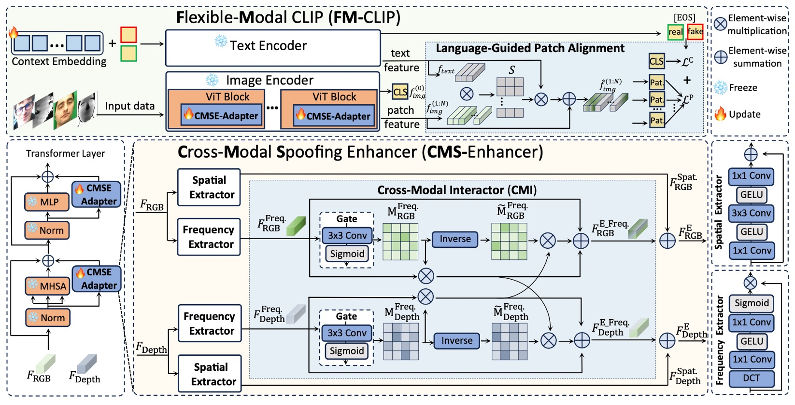
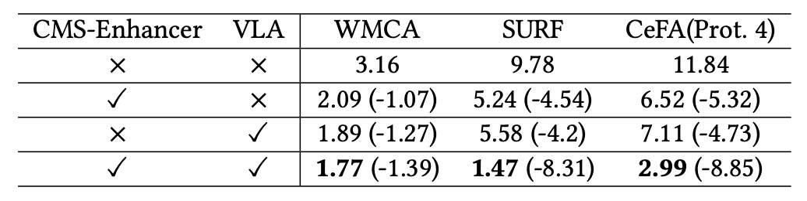

## 言語からの指針

[**FM-CLIP: Flexible Modal CLIP for Face Anti-Spoofing**](https://dl.acm.org/doi/pdf/10.1145/3664647.3680856)

---

Face Anti-Spoofing 分野で言う「多モダリティ」とは、通常、RGB、深度、赤外線などの異なるセンサーを指します。

しかし近年、もう一つの「モダリティ」が急速に登場しています。それが「自然言語」です。

## 問題定義

FAS の最初の戦場は、画像そのものでした。

研究者たちは、畳み込みネットワーク（CNN）を設計し、テクスチャ、深度、反射率などの特徴を抽出して、真偽を判別しようとしました。しかし、攻撃手法の進化に伴い、高解像度の印刷物、再生、3D マスクなどが、単一モダリティの防御を崩壊させつつあります。

このような攻防の進化に対応するため、FAS コミュニティは多モダリティ融合を導入しました。RGB は色をキャプチャし、IR は熱源を感知し、Depth は構造を測定し、異なるセンサーからの交錯する信号の中で、より真実に近い画像を再構築しようとしました。

しかし、このアプローチにも限界があります。

多モダリティ融合は、すべてのモダリティがトレーニングおよびテストの段階で揃っていることを前提としており、どれか一つのセンサーデータが欠けると、システムの認識能力は崩壊します。デプロイメント時のハードウェアコストやシーン条件の変動により、「モダリティの一貫性」は贅沢な願いとなっています。

Flexible Modal（柔軟なモダリティ）の概念が生まれました。その目的は、トレーニング段階では多モダリティの特徴を学習し、テスト段階ではすべてのモダリティに依存しないモデルを設計することです。しかし、過去の研究では、Flexible Modal の設計は従来のモダリティ（例えば、スペクトル、熱場、幾何学的信号）に向けられていました。

自然言語の登場により、私たちは別の可能性を見出しました。

言語は、世界の光と形を直接捉えるのではなく、経験の記述、解釈、そして整合性を提供します。それは、センサーのレベルを超えた整合性のメカニズムを提供し、異質な観測を意味のレベルで共通性を見つけることを可能にします。

おそらく、これらの破れたモダリティの隙間を埋めるために、自然言語を橋渡しとして、真偽の認識を再構築できるかもしれません。

## 解決策

:::tip
この論文では CLIP を基盤として使用します。もし CLIP に不慣れな方は、以前の論文を参照してください。

- [**[21.03] CLIP: 次元の壁を打ち破る**](../../multimodality/2103-clip/index.md)

:::

### モデルアーキテクチャ

<figure style={{"width": "90%"}}>

</figure>

著者は、FAS 専用に設計された CLIP ベースの多モダリティ整合性モデル、**FM-CLIP**を提案しています。

全体のアーキテクチャは、凍結（frozen）された CLIP モデルをベースに構築されています。

上の図のように、FM-CLIP は 2 つの主要なブランチに分けられます：

- **視覚ブランチ（Visual Branch）**：RGB、Depth などのセンサーデータを受け取り、ViT 画像エンコーダーで処理します。
- **言語ブランチ（Language Branch）**：プロンプト学習で生成されたテキストベクトルを補助信号として使用し、視覚特徴を整合させます。

次に、信号の流れに沿って、各部品の設計を詳しく見ていきましょう。

### CMS-Enhancer

ViT はもともと純粋な自己注意ネットワークであり、局所的な構造や周波数信号に対する感度が欠けています。

この欠陥を補うために、FM-CLIP では各 ViT ステージに**Cross-Modal Spoofing Enhancer（CMS-Enhancer）**を挿入し、

入力特徴を 2 つの並列チャネルに分解します：

- **空間特徴（Spatial Features）** — Spatial Extractor（SE）を使用して、細粒度のテクスチャ抽出を行います。
- **周波数特徴（Frequency Features）** — Frequency Extractor（FE）を使用して、画像を周波数領域にマッピングし、高次の構造差異を抽出します。

**Spatial Extractor (SE)**の操作方法は次の通りです：

$$
F_{\text{SE\_output}}^{(j)} = \text{Conv1}(\text{GELU}(\text{Conv3}(\text{GELU}(\text{Conv1}(F_{\text{input}}^{(j)})))))
$$

$$
\hat{F}_{\text{spatial}}^{(j)} = F_{\text{SE\_output}}^{(j)} \oplus F_{\text{input}}^{(j)}
$$

**Frequency Extractor (FE)**は次のように計算されます：

$$
F_{\text{FE\_output}}^{(j)} = \sigma(\text{Conv1}(\text{GELU}(\text{Conv1}(\text{DCT}(F_{\text{input}}^{(j)})))))
$$

$$
\hat{F}_{\text{frequency}}^{(j)} = F_{\text{FE\_output}}^{(j)} \otimes F_{\text{input}}^{(j)}
$$

ここで、DCT（離散コサイン変換）は、モデルが周波数の観点からモダリティ間の構造やテクスチャ差異を理解するのを助けます。

### クロスモーダルインタラクター

異なるモダリティは空間特徴においては非常に異なりますが、周波数空間では、これらを共有の中間平面にマッピングすることができます。

この周波数領域での相互作用を促進するために、FM-CLIP は**クロスモーダルインタラクター（CMI）**モジュールを設計しました：

- まず、各モダリティに対してゲートマップを計算し、情報密度が高い領域と低い領域を識別します。
- 次に、そのゲートマップに基づいて、別のモダリティから有用な情報を補充し、元のモダリティの弱い領域を修正します。

ゲートマップの計算：

$$
M_{\text{freq.RGB}} = \sigma(\text{Conv3}(F_{\text{freq.RGB}}))
$$

$$
M_{\text{freq.Depth}} = \sigma(\text{Conv3}(F_{\text{freq.Depth}}))
$$

相互補充過程：

$$
eF_{\text{freq.RGB-Depth}} = (1-M_{\text{freq.RGB}}) \otimes eF_{\text{freq.Depth}}
$$

$$
eF_{\text{freq.Depth-RGB}} = (1-M_{\text{freq.Depth}}) \otimes eF_{\text{freq.RGB}}
$$

最後に、元の特徴、強化された特徴、補充された特徴を統合します：

$$
F_{E\_\text{freq.RGB}} = F_{\text{freq.RGB}} \oplus eF_{\text{freq.RGB}} \oplus eF_{\text{freq.RGB-Depth}}
$$

$$
F_{E\_\text{freq.Depth}} = F_{\text{freq.Depth}} \oplus eF_{\text{freq.Depth}} \oplus eF_{\text{freq.Depth-RGB}}
$$

そして、対応する空間特徴と統合し、強化された特徴を形成します。

これにより、視覚ブランチは各 ViT ブロックで、単に自分のモダリティの詳細を学習するだけでなく、他のモダリティからの周波数補充情報も吸収することができます。

### 言語ガイド付きパッチ整合

視覚信号の処理が終了した後、著者は自然言語モダリティを導入し、各パッチが詐欺の手がかりに焦点を当てるようにさらに誘導します。

FM-CLIP はテキストブランチ内で**プロンプト学習**技術を使用し、学習可能なコンテキストベクトル $\mathbf{v} = \{v_1, v_2, ..., v_M\}$ を初期化し、クラスラベル $c_i$ と組み合わせてプロンプトを形成します：

$$
t_i = \{v_1, v_2, ..., v_M, c_i\}
$$

その後、テキストエンコーダー $g(\cdot)$ を通してテキスト特徴 $f_{\text{text}}$ を生成します。

先ほどの視覚ブランチでは、CLS トークン $f_{\text{img}}^{(0)}$ とパッチトークン $f_{\text{img}}^{(1:N)}$ をすでに取得しています。

FM-CLIP は二重の整合性を採用しています：

1. **CLS トークンの整合** — CLS と EOS（real/fake）ベクトルの類似度を計算し、全体分類を行います。
2. **パッチトークンの整合（LGPA）** — 各パッチトークンとテキスト特徴との類似度マトリックスを計算します：

$$
S = f_{\text{img}}^{(1:N)} \cdot (f_{\text{text}})^T
$$

その後、重み付けされた融合を行います：

$$
\hat{f}_{\text{img}}^{(1:N)} = \text{softmax}(S) \cdot f_{\text{text}} + f_{\text{img}}^{(1:N)}
$$

これにより、各パッチは言語に基づいて仮想の痕跡が存在する可能性のある局所的な手がかりに再焦点を当てることができます。

### 損失関数設計

グローバルおよびローカルの整合性を同時に監視するために、FM-CLIP は 2 つの損失項を導入しています：

- **CLS 損失（グローバル整合）**：

  $$
  L_C = \text{CrossEntropy}(p_{\text{cls\_token}}, y)
  $$

- **パッチ損失（ローカル整合）**：
  $$
  L_P = \text{CrossEntropy}(p_{\text{patch\_token}}, y)
  $$

最終的な総損失は：

$$
L_{\text{total}} = L_C + L_P
$$

この設計により、モデルは全体認識と細部認識の間でバランスを保ち、マクロな意味を捉えつつ、微細な欠陥にも焦点を当てることができます。

## 討論

著者は 3 つの多モダリティ FAS（顔認証詐欺防止）で使用されるデータセットで実験を行いました：

- **CASIA-SURF (SURF)**：3 つのモダリティデータセットで、未知の攻撃タイプをターゲットにしています。
- **CASIA-SURF CeFA (CeFA)**：人種およびモダリティの変異を含み、プロトコル 1、2、4 を使用。
- **WMCA**：高精度な複数攻撃シナリオ、"seen"と"unseen"の評価状況をカバー。

実験には 2 つのテスト設定があります：

- **固定モダリティ（Fixed Modal）**：トレーニングとテストでモダリティが一致。
- **柔軟モダリティ（Flexible Modal）**：テスト段階では任意の単一モダリティデータのみが提供されます。

指標として、APCER、BPCER、および ACER が標準として使用されます。

### 固定モダリティ結果

:::tip
スペースの制約により、ここでは SURF データセットの図のみを掲載し、他の 2 つのデータセットの図は元の論文を参照してください。
:::

<figure style={{"width": "90%"}}>

</figure>

固定モダリティの設定では、FM-CLIP は安定した改善傾向を示しました。

- **SURF データセット**：
  CMS-Enhancer を導入した後、ACER は 0.45 から 0.44 に低下し、LGPA を統合した後、さらに 0.43 に低下しました。
- **WMCA データセット（unseen プロトコル）**：
  CMS-Enhancer は ACER を 2.49%から 2.36%に低下させ、LGPA を追加した FM-CLIP は最終的に 2.29%に低下しました。
- **CeFA データセット**：
  3 つのプロトコルすべてで FM-CLIP は APCER、BPCER、ACER の指標をわずかに低下させ、堅実なクロスドメインの一般化能力を示しました。

FM-CLIP の学習可能なパラメータ数が FM-ViT よりも少ないため、WMCA の「seen」状況では絶対的な性能は FM-ViT にわずかに劣りますが、これは予想されるトレードオフです。

### 柔軟モダリティ結果

より挑戦的な柔軟モダリティテストでは、FM-CLIP は明らかな優位性を示しました。

- **SURF データセット**：
  RGB、Depth、IR の 3 つの単一モダリティにおいて、FM-CLIP は FM-ViT を全面的に超え、最大で 2.17%の ACER 低下を達成しました。
- **CeFA プロトコル 4**：
  特に IR モダリティでは、FM-CLIP は FM-ViT と比較して 8.1 の ACER 低下を示し、難易度の高い赤外線データに対して特に有効であることが示されました。
- **WMCA（seen プロトコル）**：
  FM-CLIP はすべてのモダリティ（RGB、Depth、IR）で追加の改善を示し、安定した低誤差率を維持しました。

### コアコンポーネント分析

<figure style={{"width": "70%"}}>

</figure>

著者は FM-CLIP の 2 つの主要モジュール、CMS-Enhancer と VLA（Vision-Language Alignment）の消失実験を行いました。
実験は、WMCA（seen）、SURF、CeFA（Prot.4）データセットで、柔軟モダリティ設定で実施されました。

結果は以下の通りです：

- **CMS-Enhancer**のみを導入した場合、ACER は平均して 4%以上低下し、視覚特徴の安定性が有効に向上しました。
- **VLA**のみを導入した場合も、約 4%の低下が見られ、局所的な特徴整合における言語誘導の効果が証明されました。
- **両者を統合後（FM-CLIP）**、各データセットで ACER はそれぞれ 8%〜9%低下し、2 つのモジュールが補完的であることが示されました。

## 結論

VLM（視覚言語モデル）の FAS 領域への導入は、近年の人気トレンドとなっています。

データソースの異質性や攻撃方法の多様化の中で、単一センサーや手作りの特徴設計に依存することは、安定した識別システムを支えることがますます難しくなっています。自然言語は高次の整合性メカニズムとして、センサー間や攻撃タイプ間の潜在的なリンクを提供し、研究者たちがその力を借りようとする方向性として注目されています。

この研究に基づき、現在の研究の 2 つの重要な方向性が浮き彫りになっています：

1. **物理的な観測が避けられなくなった場合、意味的なレベルでの整合性と修復が、識別システムの重要な支柱となる。**
2. **単純な言語誘導はセンサー層の情報補強を完全に代替するには不十分であり、周波数空間、局所的な構造、意味的な関連は依然として緊密に編み合わせる必要がある。**

FM-CLIP は、この探索の中で軽量設計を通じて異なるモダリティの整合性の可能性を示し、より深い構造的モデリングや能動的な感知修復のための空間を提供しています。
