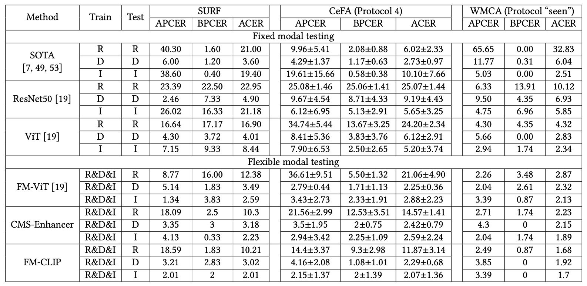

## 言語からの指針

[**FM-CLIP: Flexible Modal CLIP for Face Anti-Spoofing**](https://dl.acm.org/doi/pdf/10.1145/3664647.3680856)

---

FAS（顔偽装防止）の分野で言う「マルチモーダル」とは、通常、RGB、深度、赤外線などの異なるセンサーを指す。

しかし近年、もう一つの「モーダル」が台頭している。それは自然言語である。

## 問題の定義

Face Anti-Spoofing（FAS）の最初の戦場は映像そのものであった。

研究者たちは畳み込みネットワークを設計し、テクスチャ、深度、反射率などの特徴を抽出して、本物か偽物かを判別してきた。

しかし攻撃手法が進化するにつれ、高解像度のプリント、リプレイ、3D マスクにより、単一モーダルの防御線は徐々に破られていった。

この攻防の高度化に対応するため、FAS コミュニティはマルチモーダル融合を導入した。RGB は色を捉え、IR は熱源を感知し、Depth は構造を測定し、異なるセンサーの信号を組み合わせて、より現実に近い状況を再構築しようとした。

しかしこの路線にも亀裂がある。

マルチモーダル融合は、訓練時とテスト時にすべてのモーダルが揃っていることを前提としている。どれか一つのセンサー情報が欠けると、システムの識別能力は決壊のごとくほぼ機能しなくなる。ハードウェアコストや環境条件の変化により、「モーダルの一貫性」は贅沢な要求となってしまった。

そこで「Flexible Modal」の概念が生まれた。

これは訓練時にマルチモーダル特徴を学習しつつ、テスト時にはすべてのモーダルを必要としないモデル設計を目指すものである。しかし過去の研究では、Flexible Modal の設計は従来のモーダル、例えばスペクトル、熱場、幾何信号などに限定されていた。

自然言語の台頭により、新たな可能性が見えてきた。

言語は世界の光や形を直接捉えるのではなく、経験の記述や解釈、整合を行う。

それはセンサーのレベルを超えた整合メカニズムを提供し、異質な観測を意味的なレベルで共通性へと導く。

もしかすると、我々はこの壊れたモーダルの隙間に、自然言語を橋として、真偽の認識を再構築できるのかもしれない。

## 問題の解決

:::tip
本論文は CLIP を基盤アーキテクチャとして採用している。もし CLIP に不慣れであれば、以前の論文を参照されたい。

- [**[21.03] CLIP: 次元の壁を打破する**](../../multimodality/2103-clip/index.md)

  :::

### モデル構造

<figure style={{"width": "90%"}}>

</figure>

著者は FAS 専用に設計され、CLIP をベースとしたマルチモーダル整合モデル **FM-CLIP** を提案した。

全体構造は凍結された CLIP モデルの上に構築されている。

上図のように、FM-CLIP は主に二つのブランチに分けられる：

- **視覚ブランチ（Visual Branch）**：RGB、Depth などのセンサーデータを入力し、ViT 画像エンコーダで処理する。
- **言語ブランチ（Language Branch）**：プロンプト学習によって生成されたテキストベクトルを補助信号として用い、視覚特徴の整合を促す。

以下では信号の流れに沿って各コンポーネントの設計を詳しく見ていく。

### CMS-Enhancer

ViT は元々純粋な自己注意ネットワークであり、局所構造や周波数信号に対する感度が不足している。

この欠点を補うため、著者は各 ViT ステージにクロスモーダル偽装強化モジュールを挿入した：

- **Cross-Modal Spoofing Enhancer（CMS-Enhancer）**

入力特徴を二つの平行チャネルに分解する：

- **空間特徴**：Spatial Extractor（SE）を用いて細粒度のテクスチャを抽出。
- **周波数特徴**：Frequency Extractor（FE）で画像を周波数領域にマッピングし、高次構造の差異を抽出。

**Spatial Extractor (SE)** の処理は以下の通り：

$$
F_{\text{SE\_output}}^{(j)} = \text{Conv1}(\text{GELU}(\text{Conv3}(\text{GELU}(\text{Conv1}(F_{\text{input}}^{(j)})))))
$$

簡単な畳み込み構造に $GELU$ 活性化関数を組み合わせて、局所的な画像特徴を取得する。

最後に残差接続を加える：

$$
\hat{F}_{\text{spatial}}^{(j)} = F_{\text{SE\_output}}^{(j)} \oplus F_{\text{input}}^{(j)}
$$

**Frequency Extractor (FE)** は以下のように定義される：

$$
F_{\text{FE\_output}}^{(j)} = \sigma(\text{Conv1}(\text{GELU}(\text{Conv1}(\text{DCT}(F_{\text{input}}^{(j)})))))
$$

画像を周波数スペクトルに変換した後、同様に畳み込みと $GELU$ を適用する。操作は似ているが対象は周波数スペクトルであり、抽出される特徴は本質的に異なる。

最終的に出力を元の入力と点乗算し、特定の周波数を強化または抑制する：

$$
\hat{F}_{\text{frequency}}^{(j)} = F_{\text{FE\_output}}^{(j)} \otimes F_{\text{input}}^{(j)}
$$

### Cross-Modal Interactor

異なるモーダルは空間特徴では大きく異なるが、周波数空間上では共有の仲介面にマッピングできる。周波数領域の相互作用を促進するために、著者は**Cross-Modal Interactor (CMI)** モジュールを設計した：

- 各モーダルに対し、情報密度の高低を示す gate map を計算。
- gate map に基づき、他モーダルから有用な情報を補い、自モーダルの弱点を補完。

gate map の計算：

$$
M_{\text{freq.RGB}} = \sigma(\text{Conv3}(F_{\text{freq.RGB}}))
$$

$$
M_{\text{freq.Depth}} = \sigma(\text{Conv3}(F_{\text{freq.Depth}}))
$$

出力は sigmoid 関数を通して 0〜1 の値をとり、モデルが不要と判断した画像領域を保持または遮断する役割を持つ。

続いて相互補完過程：

$$
eF_{\text{freq.RGB-Depth}} = (1-M_{\text{freq.RGB}}) \otimes eF_{\text{freq.Depth}}
$$

$$
eF_{\text{freq.Depth-RGB}} = (1-M_{\text{freq.Depth}}) \otimes eF_{\text{freq.RGB}}
$$

つまり、モデルが RGB 特徴内で保持したい領域に対し、隣接する別モーダルの特徴を参照し、そちらの特異点を注視させる仕組みである。

最後に元の特徴、強化特徴、補完特徴を融合：

$$
F_{E_\text{freq.RGB}} = F_{\text{freq.RGB}} \oplus eF_{\text{freq.RGB}} \oplus eF_{\text{freq.RGB-Depth}}
$$

$$
F_{E_\text{freq.Depth}} = F_{\text{freq.Depth}} \oplus eF_{\text{freq.Depth}} \oplus eF_{\text{freq.Depth-RGB}}
$$

これらを対応する空間特徴と統合し、強化特徴とする。

このように、視覚ブランチは各 ViT ブロック内で、自身のモーダル詳細を学びつつ、他モーダルからの周波数補完情報も吸収している。

### 言語誘導パッチ整合

視覚信号の処理が一段落した後、著者は自然言語モーダルを導入し、各パッチを偽装の手がかりに注目させることを試みる。

テキストブランチでは、著者は **Prompt Learning** 技術を用い、学習可能なコンテキストベクトル群 $\mathbf{v} = {v_1, v_2, ..., v_M}$ を初期化し、クラスラベル $c_i$ と結合してプロンプトを構成する：

$$
t_i = \{v_1, v_2, ..., v_M, c_i\}
$$

この技術自体は新規性は乏しく、近年大規模モデルを活用する際には広く使われているシンプルかつ有効な方法である。欠点を挙げるとすれば、学習されたトークンの意味解釈が難しい点である。

テキストエンコーダ $g(\cdot)$ を通し、テキスト特徴量 $f_{\text{text}}$ を生成する。

先ほどの視覚ブランチで得た CLS トークン $f_{\text{img}}^{(0)}$ とパッチトークン群 $f_{\text{img}}^{(1\:N)}$ に対し、著者は二段階の整合を適用する：

1. **CLS トークン整合**：CLS と EOS（real/fake）ベクトル間の類似度を計算し、グローバルな分類に用いる。
2. **パッチトークン整合（LGPA）**：各パッチトークンとテキスト特徴の類似度行列を計算：

$$
S = f_{\text{img}}^{(1:N)} \cdot (f_{\text{text}})^T
$$

続いて加重和を計算：

$$
\hat{f}_{\text{img}}^{(1:N)} = \text{softmax}(S) \cdot f_{\text{text}} + f_{\text{img}}^{(1:N)}
$$

これにより、各パッチは言語による誘導を受け、偽装痕跡が潜む可能性のある局所特徴へ再フォーカスされる。

### 損失関数設計

グローバルとローカル双方の整合を同時に監督するため、最後に二つの損失項が導入される：

- **CLS 損失（グローバル整合）**：

  $$
  L_C = \text{CrossEntropy}(p_{\text{cls\_token}}, y)
  $$

- **パッチ損失（ローカル整合）**：

  $$
  L_P = \text{CrossEntropy}(p_{\text{patch\_token}}, y)
  $$

最終的な総損失は：

$$
L_{\text{total}} = L_C + L_P
$$

この設計により、モデルは全体的な意味理解と局所的な偽装の細部検出の両者をバランス良く学習できる。

## 討論

著者は 3 つのマルチモーダル FAS でよく使われるデータセットを選び、評価を行った：

- **CASIA-SURF (SURF)**：3 モーダルデータで未知の攻撃タイプを主に検出。
- **CASIA-SURF CeFA (CeFA)**：人種やモーダルの多様性を含み、Protocol 1、2、4 を選択。
- **WMCA**：高精度多攻撃シナリオで、「seen」と「unseen」両方の評価条件をカバー。

実験は 2 種類のテスト設定を含む：

- **固定モーダル（Fixed Modal）**：訓練とテスト時にモーダルが一致。
- **柔軟モーダル（Flexible Modal）**：テスト時は任意の単一モーダルのみ提供。

評価指標として APCER、BPCER、ACER を使用。

### 固定モーダル結果

<figure style={{"width": "90%"}}>

</figure>

固定モーダル環境で、FM-CLIP は安定した性能向上を示す。

- **SURF データセット**：
  CMS-Enhancer 導入で ACER は 0.45 から 0.44 に低減し、LGPA 統合後はさらに 0.43 に。
- **WMCA（unseen protocol）**：
  CMS-Enhancer により ACER が 2.49%から 2.36%に改善、LGPA 追加で最終的に 2.29%まで低減。
- **CeFA データセット**：
  3 つのプロトコルで FM-CLIP は APCER、BPCER、ACER 全指標をわずかに改善し、堅牢なクロスドメイン汎化を示す。

FM-CLIP は FM-ViT よりパラメータ数が少ないため、WMCA「seen」環境での絶対性能はやや劣るが、これは妥当なトレードオフ。

### 柔軟モーダル結果

より厳しい柔軟モーダルテストで、FM-CLIP は顕著な優位を示す。

- **SURF データセット**：
  RGB、Depth、IR の 3 つの単一モーダル全てで FM-CLIP が FM-ViT を上回り、最大 2.17%の ACER 低減を達成。
- **CeFA Protocol 4**：
  特に IR モーダルで、FM-CLIP は FM-ViT より 8.1 の ACER 減少を示し、難解な赤外データに対して効果的。
- **WMCA（seen protocol）**：
  全モーダル（RGB、Depth、IR）でさらなる性能向上と安定した低誤差率を維持。

### コアコンポーネント分析

<figure style={{"width": "70%"}}>

</figure>

著者は FM-CLIP の主な 2 つのモジュール、CMS-Enhancer と VLA（Vision-Language Alignment）について消融実験を実施。WMCA（seen）、SURF、CeFA (Prot.4)の柔軟モーダル環境で評価。

結果は以下の通り：

- 単独で**CMS-Enhancer**導入で ACER が平均 4%以上低減し、視覚特徴の安定性が向上。
- 単独で**VLA**導入でも約 4%の低減効果があり、言語誘導による局所特徴整合の有効性を示す。
- **両者統合の FM-CLIP**は全データセットで ACER が 8〜9%低減し、両モジュールが補完的な役割を持つことを証明。

## 結論

VLM（Vision-Language Model）を FAS 領域に導入することは近年のホットトピックである。

データソースの多様性や攻撃形態の複雑化が進む中、単一センサーや手作業の特徴設計だけでは安定した識別が難しくなっている。自然言語は高次元の整合メカニズムとして、センサーや攻撃形態を跨ぐ潜在的な連結を提供し、多くの研究者が注目する方向性である。

本研究から見える重要な 2 点は：

1. **物理層の観測が不可避的に断片化するとき、意味層での整合と修復が識別システムの要となる。**
2. **言語誘導だけではセンサー層の情報補強を完全に代替できず、周波数空間や局所構造、意味的連関がさらに緊密に統合される必要がある。**

FM-CLIP はこの探索において軽量設計で異種モーダル整合の可能性を示しつつ、より深い構造モデリングや能動的感知修復への展望を残している。
