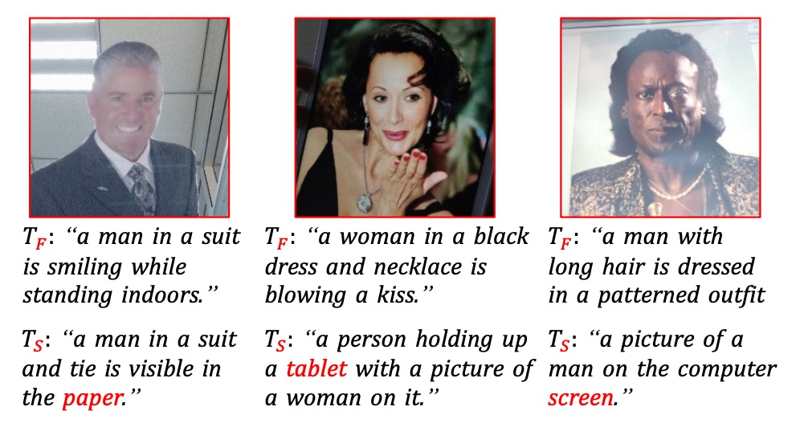
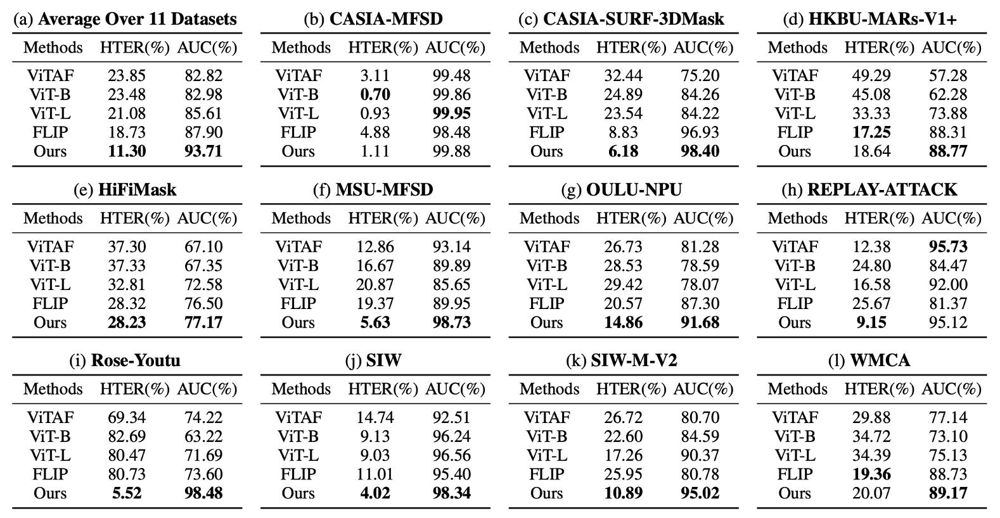
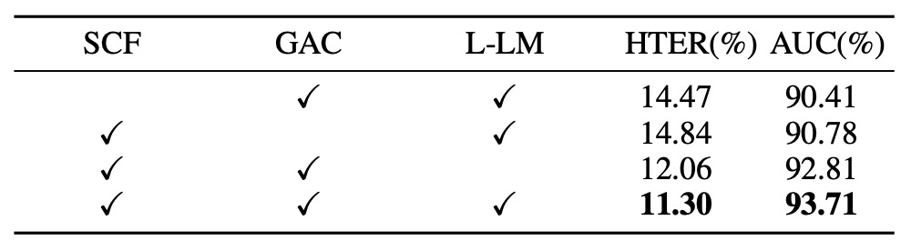
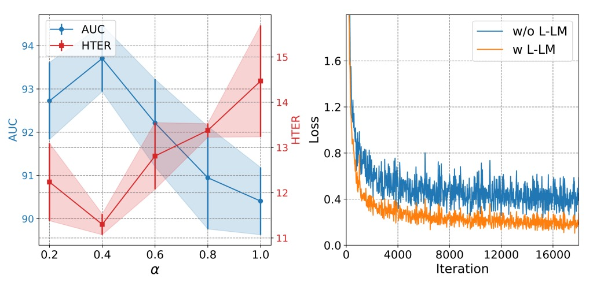

## 分類の終章

[**Interpretable Face Anti-Spoofing: Enhancing Generalization with Multimodal Large Language Models**](https://arxiv.org/abs/2501.01720)

---

顔認証の活体検出は、一般的に二値分類タスクである：Real（本物）か Spoof（偽物）か。

しかし、「なぜか？」と問うと、多くのモデルは答えられない。

さらには、「なぜ？」という質問さえ許されない。

## 問題の定義

既存の顔偽装検出モデルは、ほとんどが単一の目的で訓練されており、入力画像を真実か偽造かに分類する。

このロジックは長年続いているが、以下の状況では頻繁に失敗する：

- テスト環境と訓練データのスタイルギャップが大きすぎる
- 偽造手法の刷新（高画質リプレイや 3D マスクなど）
- ユーザー層の文化・デバイス・地理的分布の違い

研究者は一般化能力を強化するために様々な手法を試みている：

1. **Domain Adaptation（DA）**：モデルがターゲットドメインのデータに触れて特徴を整合させる
2. **Domain Generalization（DG）**：複数のソースドメインから安定した特徴分布を学習する
3. **Incremental Learning（IL）**：既存の知識を維持しつつ、新たなデータ環境を取り入れる

だがどの方法も本質的には「活体特徴」を画像から抽出しているに過ぎず、その特徴はほとんどモデル自身が説明できない。

ここに問題の核心がある：

> **我々は判断できるが説明できないシステムを訓練している。**

それは「これは偽物だ」と教えてくれるが、「どこが偽物か」「なぜ偽物か」は説明できない。

我々はモデルに画像を見せているのに、合理的なストーリーを語る方法を教えていない。

人間の認識はまさに「ストーリー」に基づいているのに。

## 解決策

「これは本物か？」

活体検出モデルにとって、この問いには答えだけでなく説明も必要だ。

I-FAS フレームワークはこの信念に基づき、FAS タスクを「画像質問応答」に翻訳した。

モデルに人のように答えさせるには、三つのレベルからアプローチが必要である：**言語構築、特徴整合、訓練戦略**。

## Spoof-aware Captioning and Filtering（SCF）

多くの汎用キャプショナーは顔の表情や服装、背景にしか注意を払わず、偽装の決め手となる手がかりを見落とす。

下図の通り：

<figure style={{"width": "80%"}}>

</figure>

従来のキャプショナーが生成するのは $T_F$ であるが、著者らが微調整した spoof-aware キャプショナーは $T_S$ である。

上図の通り、従来のキャプショナーは曖昧な記述が多いが、微調整された spoof-aware キャプショナーは攻撃メディア（_screen_、_paper_、*mannequin*など）を明確に示し、文中に埋め込むことで説得力のある意味的根拠を形成している。

SCF 戦略の流れは以下の通り：

- 12 個の公開データセットを統合し、真偽ラベル付きのサンプル集合 $D = {(I_i, Y_i)}$ を作成
- 攻撃タイプごとに分類された spoof キーワード辞書 $K$ を構築
- 汎用キャプショナー $C_G$ を用いて全ての偽画像から初期説明 $T_F$ を生成
- キャプションに対応するキーワードが含まれないサンプルを除外し、攻撃特徴を明確に反映する部分集合 $D_S$ を抽出
- $D_S$ を用いて $C_G$ を微調整し、spoof-aware キャプショナー $C_S$ を得る
- 最後にすべての本物画像にもキャプションを生成し、意味的差異を持つ訓練データを形成

この戦略により、各データにはラベルに加えて**意味的説明が付与され**、モデルの対比学習および解釈性が向上する。

## マルチモーダル指示調整と GAC

訓練データが完成したら、次はモデルの訓練フェーズに入る。

全体のモデル構造は上図の通りで、I-FAS は以下の 3 つの主要コンポーネントで構成される：

- **視覚エンコーダー $E_V$**：入力画像 $I \in \mathbb{R}^{H \times W \times 3}$ から特徴量 $X_V \in \mathbb{R}^{N \times D}$ を抽出。
- **クロスモーダルコネクタ $P_{V \to T}$**：$X_V$ を言語モデルのトークンスペースに写像。
- **言語モデル $\Phi_T$**：視覚特徴とテキストプロンプトを元に自動応答し、自然言語の説明文を生成。

### Globally Aware Connector（GAC）

視覚情報の意味をより包括的かつ詳細に言語モデルに伝えるため、著者は GAC モジュールを提案。多層のグローバル特徴を言語モデルに渡すことを目標とする。具体的な手順は：

- 視覚エンコーダー各層から cls トークン $g_i$ を抽出し、$G_V = {g_1, ..., g_L}$ を構成。
- これらを線形変換し $Q_V$ とし、学習可能なクエリベクトル $Q_P$ と結合：$Q = \text{Concat}(Q_P, Q_V)$。$Q_P$ は一般的な Prefix tuning の設計。
- その後、マルチヘッド自己注意（MSA）およびマルチヘッドクロス注意（MCA）を通じて領域特徴 $X_V$ と統合：

  $$
  \begin{aligned}
  Q' &= Q + \text{MSA}(\text{LN}(Q)) \\
  Q'' &= Q' + \text{MCA}(\text{LN}(Q'), \text{LN}(X_V)) \\
  X_T &= Q'' + \text{MLP}(\text{LN}(Q''))
  \end{aligned}
  $$

これは $Q$ を主体に画像特徴に問い合わせ、活体検出に特化した特徴を抽出する仕組み。

一般に、浅い層はモアレやぼかしなどのテクスチャ詳細を捉え、深い層は抽象的な意味を表す。GAC はこれら視点を言語出力に融合させるための設計であり、言語モデルに渡されるのは単一特徴ではなく、視覚的階層・空間・意味を融合したクロスモーダル表現となる。

## アシンメトリック言語モデル損失（L-LM Loss）

モデルが言葉を話せるようになった後の課題は：

> **結果を先に言うべきか、理由を先に言うべきか？**

著者は FAS タスクを単一ターンの質問応答形式で再定義し、訓練データは $(I, T_Q, T_A)$ の三部構成とした。

- $T_Q$ は固定命令文：「Is this photo of a real person?」
- $T_A$ は二段構成の回答：

  $$
  T_A = [T_{\text{Judgment}},\ T_{\text{Interpretation}}]
  $$

ここで $T_{\text{Judgment}}$ はモデルの真偽判定（“Yes”か“No”）、$T_{\text{Interpretation}}$ はキャプショナー（$C_G$ または $C_S$）による説明文。

従来の LM 損失を使うと、モデルは $T_A$ 全体を連続したテキストとして自己回帰的に学習するため、

1. **意味の重心があいまいに**：判定の重要なキーワードよりも、説明文の文末スタイルを過剰に模倣しがち。
2. **ノイズによる収束の遅延**：説明文は詳細・雑音を含み、判定タスク本来の学習を妨げる。

そこで、モデルがまず「正しい判定」を学び、続いて「妥当な説明」を学ぶため、非対称重み付き言語モデル損失関数を設計。これを **Lopsided LM Loss（L-LM Loss）** と呼ぶ：

$$
L_{\text{total}} = \alpha L_{\text{Judgment}} + (1 - \alpha) L_{\text{Interpretation}}
$$

- $L_{\text{Judgment}}$ は判定部分（Yes/No）のトークン単位損失
- $L_{\text{Interpretation}}$ は説明文部分の損失
- $\alpha \in \[0, 1]$ は重み付けパラメータ

$\alpha$ を高めることで、訓練初期は主判定タスクに注力し、説明文のノイズ干渉を抑制。判定が安定すれば徐々に説明の学習を促進する。

この設計は精度だけでなく、訓練の**収束速度や安定性**にも寄与している。

## 議論

### ドメイン一般化能力の検証

<figure style={{"width": "90%"}}>

</figure>

まず **Protocol 1** では、4 つの代表的データセットを用いた leave-one-domain-out テストを行った。

上表からわかるように、I-FAS は従来の SoTA 手法に比べ、すべての組み合わせで優位性を示し、平均 HTER を **1.33%** にまで低減した。自然言語監督を組み合わせることで、モデルはデータ分布の変動に対してより高い許容性を持つ。一方、単一モーダルで分類トークンのみを用いる手法は環境変化に弱い傾向にある。

**Protocol 2** はさらに過酷な設定で、単一の CelebA-Spoof のみを訓練に用い、11 個の未知データセットをテストに使い、攻撃手法やセンサーも異なる。

実験結果は以下の通り：

<figure style={{"width": "90%"}}>

</figure>

この設定下で、I-FAS の平均 AUC は FLIP や ViTAF を 7%以上上回り、3D マスク（SURF-3DMask）、メイク干渉（HKBU-MARs）、新素材攻撃（SIW-M-V2）などの状況でも安定しており、多様で異質な攻撃変化に対応可能な構造であることを示した。

### モジュールの貢献度

<figure style={{"width": "70%"}}>

</figure>

各モジュールの効果を検証するため、3 つのコアコンポーネントを順次除去して一般化能力への影響を測定。結果は上表の通り：

- **SCF 除去時**、モデルは Yes/No のみの応答に戻り、HTER が大幅増加（+3.17%）、AUC は減少（−3.30%）。キャプションは単なる付加テキストでなく、効果的な監督信号であることが示された。
- **GAC 除去時**、エンコーダの各層からのグローバル意味統合を失い、性能が低下。異なる層特徴の役割分担が、spoof 手掛かりの認識に寄与している。
- **L-LM Loss を標準 LM Loss に変更時**、性能悪化は小さいが収束速度と安定性が低下し、高分散テストセットでは過学習しやすくなる傾向が見られた。

### キャプションの種類分析

<figure style={{"width": "70%"}}>

</figure>

テキストの多様性は一般化能力を示すのか？

実験では様々な文字監督形式を比較し、キャプションの意味的内容が鍵であると示す：

- 単なる判定語（Yes/No）や多様なテンプレート文だけでは性能向上が見られず。
- 攻撃手掛かり（“tablet screen”, “mask texture”など）を明示したキャプションで AUC が **93.71%** に向上し、全ベースラインを上回った。
- spoof-aware キャプションを通常のキャプション（$T_F$）に置き換えると性能が低下し、情報の特異性が多様性より重要であることが分かった。

### L-LM Loss のハイパーパラメータ検討

<figure style={{"width": "70%"}}>

</figure>

上図より、L-LM Loss の判定と説明の重みを制御するパラメータ $\alpha$ は中間値（約 0.7）に保つことで精度と学習安定性を両立できる：

- $\alpha$ が高すぎると判定部分に偏り、説明の意味部分が失われ、結果的に一般化能力が低下。
- $\alpha$ が低すぎるとキャプションのノイズが損失を支配し、収束を妨げる。

この損失設計により、微調整時にモデルは重要な説明文の整合を素早く習得し、単なるトークンマッチングではない構造的な分類過程を形成する。

### 解釈性の可視化

先に示した spoof-aware キャプションは “wrinkles on paper” や “glare from glossy screen” といった手掛かりを生成し、モデルに追加の認知アンカーを与えている。これらは言語的な役割だけでなく、人間の視線誘導を模擬している。

最後に、解釈型 QA 設定でのテストサンプル予測結果の可視化を示す。単一ドメイン訓練のみながら、多くの未知データセットで判定と説明を含む整合的な応答を出し、高い意味的総括力を発揮している。

## 結論

モデルが「はい」か「いいえ」しか答えられないなら、その信頼度は得られても、なぜそう判断したか、どの根拠に基づくかは分からない。

こうした分類はシステム開発・評価に便利だが、モデルを長期間ブラックボックスに閉じ込め、ドメイン間一般化や攻撃手法更新、環境変動といった実運用の課題に対応できない。

本研究は出力形式を再定義し、自然言語 QA 形式とキャプション監督を導入して、モデルが「真偽を答える」だけでなく「判断根拠を語る」ことを可能にした。

これは近年コンピュータビジョン分野で進む監督文法の転換でもある：

> **単一ラベルから構造的意味記述へ。**

実験はこの意味誘導が実効的な効果を生むことを示し、Protocol 1 の多ドメイン一般化や Protocol 2 の単一ドメイン極限設定において、I-FAS は OCIM 指標で最高性能を達成した。

言語は学習補助にとどまらず、異常サンプルの認知理解を安定的に高めうる。この言語による書き換えは、モデルが話し始める過程であると同時に、FAS タスクの境界を再考する機会でもある。

モデルが言葉を紡ぐその瞬間、FAS だけでなく、

> **すべての分類タスクは、やがて別の結末へと向かう。**
