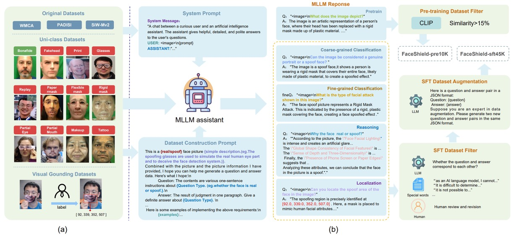
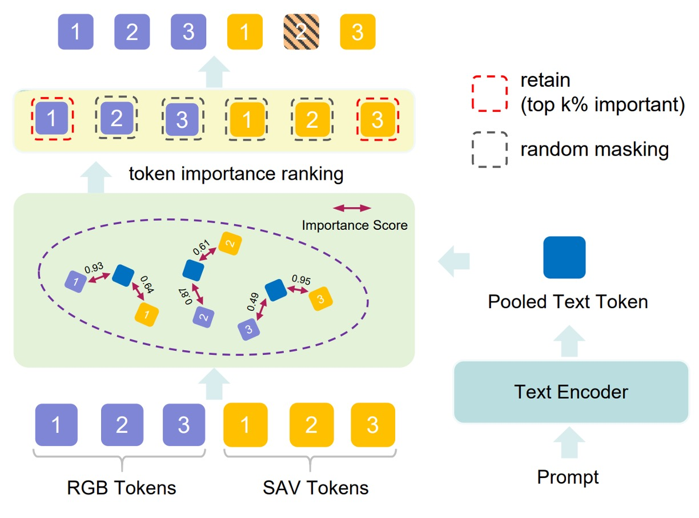

## 顔のシールド

[**FaceShield: Explainable Face Anti-Spoofing with Multimodal Large Language Models**](https://arxiv.org/abs/2505.09415)

---

少し前に読んだデータセット論文「SHIELD」を覚えていますか？

今回はその続編となる関連応用を見てみましょう。

## 問題定義

顔の偽造防止（Face Anti-Spoofing, FAS）は顔認識システムにおいて不可欠なセキュリティ機構であり、写真や映像、マスクなどの偽装攻撃によってモデルを誤誘導することを防ぎます。過去 10 年、研究コミュニティはこの問題に対し多くの手法を提案してきました。主流のアプローチは大きく二つに分かれます：

一つ目は CNN や Vision Transformer を骨格とした視覚モデルで、反射光や深度マップ、rPPG、勾配信号などの補助特徴を用い、タスクを単純な生体／偽体の二値分類として扱うものです。この方法は訓練データ内で優れた性能を示しますが、未知の環境や新型攻撃に対するモデルの汎化能力は明らかに不足しています。

二つ目は近年注目を集めている Vision-Language 手法で、画像と言語のペアでモデルを訓練するもので、CLIP が代表例です。これらは言語記述の意味情報を利用して判断を助け、従来モデルのスプリアスな特徴への依存を改善しました。

しかしながら、VLM（Vision-Language Model）には依然として二つの大きな課題があります：

- 一つは「説明能力」が欠けており、なぜその顔が偽物か説明できないこと。
- 二つ目は偽造部分の位置特定ができず、分類と推論の両方のタスクを同時に扱えないこと。

さらに厄介なのは、視覚モデルも VLM も共に訓練データが非常に乏しいことです。多くの FAS データセットはラベルと画像のみで構成され、推論タスクを支援するような記述的アノテーションが不足しており、これがモデルの言語能力と汎化力を直接制限しています。

では、マルチモーダル LLM（MLLM）はどうでしょうか？

GPT-4V や LLaVA などの汎用 MLLM はリモートセンシング、医療、Deepfake 検出などのタスクで強力な能力を示していますが、FAS タスクにおいてはまだ目立った成果を出せていません。その主な理由は、現在の言語モデル自体に偽造攻撃に関する知識が不足しており、既存のビジョンエンコーダーが真偽の微妙なテクスチャの違いを捉えられないためです。

指令チューニング（instruction tuning）で記述能力を持つ FAS モデルを作ろうとする試みもあり、複数データセットを統合して意味認識を高めることは試みられていますが、これらの方法は分類、推論、位置特定の三つのタスクを同時に扱えず、現実の複合型攻撃に対応できていません。

そこで問題が浮上します：

> **本当に偽造顔の疑わしい点を理解し、なぜそう判断するか説明し、さらにどこから偽装が始まっているか指摘できるモデルを作れないか？**

## 問題解決

多モーダル言語モデルに偽造顔を見抜かせるには、単に画像と言葉があるだけでは不十分です。

モデルにはタスクが明確で、意味が完全で、構造が合理的な訓練データが必要であり、「なぜこの顔が怪しいのか」を多層的に理解できなければなりません。著者はこの出発点として「データ」が鍵だと考えました。

そのため、まずデータセット設計のコンセプトを以下の図のように計画しました：

FaceShield の訓練データは二段階で構成されています：

- **FaceShield-pre10K**：事前学習用で、モデルに基本的な記述と理解能力を付与する。
- **FaceShield-sft45K**：指令微調整（SFT）用で、多タスクにおける具体的な性能を強化する。

研究チームは WMCA、PADSIS、SiWMv2 などの一般的な FAS データセットを統合し、それぞれの分類を 12 カテゴリに統一しました：

> Bonafide、Fakehead、Print、Glasses、Replay、Paper mask、Flexible mask、Rigid mask、Partial Eye、Partial Mouth、Makeup、Tattoo

これらは単に画像レベルのラベルを保持するだけでなく、局所的な偽造領域に対して詳細なボックスと座標アノテーションも付与し、合計で 12,091 枚のカテゴリ付き画像と 3,139 枚の偽造領域ボックス付き画像を整備しました。

画像とラベルを収集した後は、言語モデルがこれらの情報を理解できるようにします。

著者は生成アシスタントとして Bunny-Llama-3-8B-V を使用し、システムプロンプトでモデルを誘導して記述文を生成、各タスクタイプに応じた QA ペアも生成しました。

**FaceShield-pre10K**についてはプロセスはシンプルで、モデルは画像に基づく記述文を生成し、CLIP 類似度でペアをフィルタリング（15%未満は除外）し、視覚と言語の強い関連性を担保しました。

**FaceShield-sft45K**ではさらに厳密に四種のタスク指令を含み、多層のフィルタリングと強化を組み合わせています：

- MLLM が多数の QA ペアを出力し、人手とキーワードで誤った項目を除去
- LLaMA3 で残存した QA シードデータの言語強化を行い、多様な表現と対話の自然さを高める

四つのタスク設計は以下の通りです：

- **粗分類（Coarse-grained Classification）**：顔が本物か偽物かを識別
- **細分類（Fine-grained Classification）**：偽造顔の具体的な攻撃タイプを識別
- **推論判断（Reasoning）**：画像特徴に基づき、判断根拠を言語化
- **領域特定（Attack Localization）**：偽造部位を検出し、攻撃位置の座標を示す

### モデル構造

顔の偽造防止（FAS）タスクに特化したマルチモーダル大規模言語モデル（MLLM）を訓練するにあたり、2 つの核心目標があります：

1. **視覚エンコーダーが真の顔と偽の顔の微細な差異をよりよく識別できるようにすること；**
2. **言語モデルが意味的なプロンプトからより因果的な推論を伴う汎化判断を行えるようにすること。**

しかし、RGB 画像と QA ペアで直接訓練すると、図(a)のようにモデルは次の課題に直面します：

- **RGB 空間では真顔と偽顔が非常に似ている。**

これによりモデルは信頼性のある識別特徴を安定的に学習できず、汎化能力が制限されます。

この問題を解決するために、著者は 2 つのキーモジュールを導入しました：

- **SAVP（Spoof-Aware Vision Perception）**：視覚前処理から出発し、偽造顔の細部認識を強化するモジュール；
- **PVTM（Prompt-Guided Vision Token Masking）**：言語プロンプトに基づきモデルの注意焦点を動的に調整するモジュール。

これら 2 つのモジュールは共同で、より敏感かつ説明性の高い FAS MLLM を構築します。

### Spoof-Aware Vision Perception（SAVP）

図(b)に示すように、SAVP の核心は：**RGB 画像の外観情報だけでは生体と攻撃を効果的に区別できないが、画像のテクスチャと勾配情報を組み合わせることで微細な差異を拡大できる**ことにあります。

具体的には、入力画像ごとに SAVP は 3 種類の局所特徴を計算し、3 チャネルとしてまとめます：

- **LBP（Local Binary Pattern）**：局所的なテクスチャ変化を反映
- **Gray（グレースケール）**：色彩の影響を除去し、輝度構造を強調
- **HOG（Histogram of Oriented Gradients）**：エッジの方向性と勾配エネルギーの分布を捉える

これらの特徴を 3 チャネルとして視覚エンコーダーに入力し、spoof-aware 特徴表現 $V_{\text{SAV}}$ を抽出します。これを元の RGB 特徴 $V_{\text{RGB}}$ と連結し、視覚入力の全体表現とします：

$$
V_{\text{SAV}} = \text{Encoder}([\text{LBP}, \text{Gray}, \text{HOG}])
$$

$$
V = [V_{\text{RGB}}, V_{\text{SAV}}]
$$

この設計により、モデルは外観に加えテクスチャと構造の 2 種類の視覚認知を得ます。

### Prompt-Guided Vision Token Masking（PVTM）

<figure style={{"width": "70%"}}>

</figure>

豊富な視覚特徴を抽出しても、モデルが「タスク関連領域」に集中できなければ、干渉を受けやすくなります。

そこで PVTM は視覚トークンを動的に選択するメカニズムを提供します。具体的には：

- 各視覚トークン $V_i$ と言語プロンプト $P$ の間でコサイン類似度を計算：

  $$
  \text{Sim}(V_i, P) = \frac{V_i \cdot P}{\|V_i\| \cdot \|P\|}
  $$

- 次に softmax 関数により重み付けスコアに変換：

  $$
  S_{\text{rank}}(V_i, P) = \frac{e^{\text{Sim}(V_i, P)}}{\sum_j e^{\text{Sim}(V_j, P)}}
  $$

上位 k％の重要度の高いトークンを保持し、残りは確率 p％でランダムにマスクします。これにより無関係な特徴の影響を減らします。

こうして、分類・推論・領域特定といったタスクごとにプロンプトに応じた視覚焦点が変わり、タスク適応性とノイズ耐性が向上します。

### モデル処理の流れ

<figure style={{"width": "70%"}}>

</figure>

図(c)に示すように、FaceShield の情報フローは以下の通りです：

1. 入力画像から $V_{\text{RGB}}$ と $V_{\text{SAV}}$ の 2 種類の特徴を抽出；

2. それらを統合し PVTM で最重要視覚トークンを選択；

3. 選択したトークンを射影し、言語プロンプトと整合させた融合入力 $V_{\text{align}}$ を得る：

   $$
   V_{\text{align}} = \text{Projection}(V_{\text{RGB}}, V_{\text{SAV}})
   $$

4. $V_{\text{align}}$ とプロンプトを MLLM に入力し、タスク予測結果 $Y$ を出力：

   $$
   Y = \text{MLLM}(V_{\text{align}}, P)
   $$

### 2 段階訓練戦略

FaceShield は以下の 2 段階で訓練されます：

- **第 1 段階：事前訓練（Pretraining）**

  - 使用データは先述の **FaceShield-pre10K**。
  - 目的は視覚エンコーダーが抽出する特徴を言語プロンプトと整合させ、視覚と言語間のチャネル対応を構築すること。
  - vision encoder は既存の事前学習済みモデルを用い、その後接続される **Projector と PVTM** のみを微調整。
  - 継続的事前訓練（continual pretraining）を行い、損失関数は cross-entropy で次トークン予測を目標とする。
  - 事前訓練は 1 エポックのみ実施し、埋め込み空間の迅速な整合に注力。

- **第 2 段階：指令微調整（Supervised Fine-tuning, SFT）**

  - 使用データは **FaceShield-sft45K**。
  - モデルを 4 種のタスク応答が可能となるよう適応させる重要な段階。
  - 微調整対象は：

    - **LoRA 層（言語モデル内部の軽量パラメータ）**
    - **Projector（視覚と言語を橋渡しするモジュール）**

  - LoRA（Low-Rank Adaptation）により大型言語モデルを効率的に調整。各 Transformer ブロックに LoRA サブモジュールを挿入。
  - パラメータは以下：

    - Hidden size：128
    - Scaling factor：256

  - 損失関数は事前訓練同様 cross-entropy を用い次トークン予測を行うが、言語生成の品質とタスク応答を重視する形に重点を移す。

## 議論

### Intra-dataset 評価

<figure style={{"width": "60%"}}>

</figure>

実験結果は、FaceShield が同一データソース（W/S/P）で訓練・評価した際に、以下の 2 種類の対手を明確に上回ることを示しています：

1. **従来の FAS 手法**

   - これらは主に CNN や ViT を用い、反射光・深度・周波数特徴を組み合わせて二値分類を行う。
   - データ内での訓練時には優位であるはずだが、**HTER が明らかに高く**誤判定が多い。

2. **汎用 MLLM の zero-shot 能力**

   - FAS タスクに特化した調整なしで、既存の言語・視覚知識のみで推論を行うモデル。
   - 結果として、GPT-4V や LLaVA クラスのモデルでも偽顔認識において信頼性は低い。

3. **独自微調整済み MLLM「Bunny」との比較**

   - 著者はオープンソース MLLM「**Bunny**」を同一データセットで微調整（SFT）し、厳密な比較対象とした。
   - 結果は、**FaceShield が Bunny 微調整モデルよりも HTER を 1%低減**しており、視覚と言語データは同等条件である。

### Cross-dataset 評価

<figure style={{"width": "60%"}}>

</figure>

上表はクロスデータセットの汎化性能評価結果です。

各試験では 3 つのデータセットのうち 2 つ（例：S ＋ P）を訓練に用い、残りの 1 つ（例：W）を完全に未使用のテストセットとします。テストフローは`S&P → W`のように記し、計 3 つのドメイン組み合わせを評価。

結果として全設定において FaceShield の HTER は従来手法・MLLM 対照モデルより大幅に低く、特に最難関の`S&P → W`プロトコルでは HTER が 5.72%と、同タスク文献の中でトップクラスの性能を示しました。

### 消失実験（Ablation Study）

1. **指令データセットの有効性**

   指令データセットが効果的なら、他のモデルも強化可能か？

   実験では同じデータセットを用い、LLaVA や Bunny 等のオープンソース MLLM で事前訓練・微調整を実施。

   下図のように、

   

    <figure style={{"width": "60%"}}>
    
    </figure>
    

   粗分類、細分類、推論の 3 タスクすべてで有意な向上が見られ、平均して\*\*＋ 10% ACC／－4pp HTER\*\*の改善。

   よって、このデータセットは FAS 知識を各種言語モデルに注入可能な汎用性があり、構築プロセスとプロンプト設計は広範囲に有効と言える。

2. **SAVP（Spoof-Aware Vision Perception）モジュールの効果**

   

   表の上 2 行を比較。1 行目は baseline（RGB のみ）、2 行目は SAVP 追加。

   実験結果は 4 タスクすべてで性能向上、特に攻撃領域特定で顕著。

   これは**低レベルのテクスチャ情報が高レベル encoder の微細変化検知のギャップを補い**、偽装細部の識別とボックス化を助けることを示す。

3. **PVTM（Prompt-Guided Vision Token Masking）モジュール**

   同じ表の最終行を参照。

   粗分類・細分類・領域特定で大きな改善をもたらしたが、**推論タスクではわずかな低下**を示す。これはマスク処理による文脈損失が原因と考えられる。

### 可視化分析

<figure style={{"width": "80%"}}>

</figure>

モデルが「この顔は偽物だ」と判断するとき、**どの部分を見てその結論に至ったのか？**

著者はその問いに答えを示しています。

図(a)は 3 種類の異なる攻撃タイプ画像に対する視覚トークンの言語プロンプト応答強度（トークン重要度）を示す。

結果、**モデルが最も敏感に反応するトークンは顔の（目、鼻、口）領域に集中**しており、粗分類・細分類いずれのタスクでもこれら領域の細部特徴が最終出力に決定的に影響。

これはモデルが意味的プロンプトに基づき判定に重要な領域にフォーカスできていることを示し、全体画像での無作為な推測ではないことを裏付ける。

図(b)は RGB トークンと SAV トークンの「偽装領域検出」タスクでの挙動差異を比較。

- 左は目元マスク（eye mask）をつけたサンプル：

  - RGB トークンの重要度は**非常に散漫**で明確な焦点なし。
  - SAV トークンは明確に**目元マスク領域に集中**し、攻撃範囲を正しく指摘。

- 右は複合攻撃（目元マスク＋手での遮蔽）の例：

  - RGB と SAV のトークンが協調し、**目元の偽装と手部の遮蔽を同時に検知**。
  - SAV トークンが RGB の盲点を補い、領域理解を強化している。

## 結論

本論文では従来の二値分類を超え、粗分類・細分類・意味推論・領域特定を統合した多タスク構造を提案。

モデルは単に顔の真偽を判断するだけでなく、なぜそう判断したかを説明し、異常のある領域を指摘できる。さらに言語による誘導のもと、最も判断に寄与する画像特徴へ焦点を当てることができる。

この能力により、防偽システムは単なる分類器から意味的ロジックを備えた可視的説明力と多段推論能力を持つ判別者へと進化し、「はい／いいえ」の答えだけに留まらない。

「なぜ偽物なのか」「どこが偽物なのか」を語れる能力こそ、現在求められるモデルの方向性であり、主要な研究潮流でもある。

:::tip
以前に紹介した I-FAS は、記述を監督信号とすることを示した点が主な貢献であり、FaceShield は視覚細部の補完により言語・テクスチャ・空間位置を意思決定に同時に取り込む点で差別化される。

もしシンプルなモデルと洗練されたキャプション設計を好むなら I-FAS が「純粋」であるが、全天候・多デバイス対応かつユーザー説得が必要な実務システムを目指すなら、FaceShield のタスクカバー率と位置説明の完全性がより優れた設計と言える。
:::
