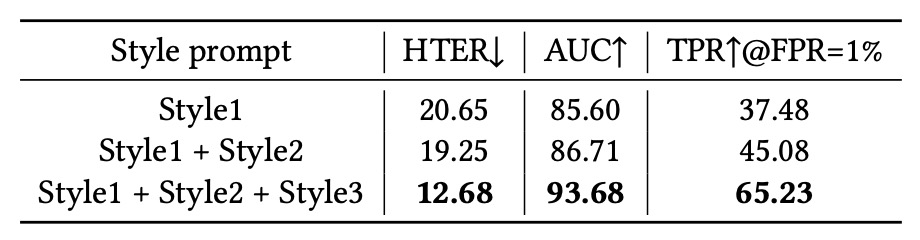

## 嘆息の壁

[**InstructFLIP: Exploring Unified Vision-Language Model for Face Anti-spoofing**](https://www.arxiv.org/abs/2507.12060)

---

顔認識技術は一面の鏡である。

それは人工知能が人間の外見を「見る」ことの進歩を映し出し、また私たちが「真実」を定義することの脆さを暴露する。

## 問題の定義

この技術は生体認証の周辺から日常へと入り込み、パスワードの代わりに、デバイスのロック解除に、さらには誰が国境を越えられるかを決定する役割を果たす。

しかし、高解像度の写真、一連のループ再生される動画、さらには顔の形が完璧なシリコンマスクでさえもシステムを騙せるとき、この鏡は信頼できないことを認めざるを得ない。

そこで Face Anti-Spoofing（FAS）が誕生した。研究者たちは二分類モデルから出発し、注意機構、生成対抗ネットワーク、補助学習モジュールを徐々に取り入れ、偽顔の虚像を見破ろうと試みてきた。

次に、Domain Adaptation（DA）や Domain Generalization（DG）が登場し、異なる機器や環境に対する補救策を提示した。しかしそれらは膨大な注釈コストと繰り返しの訓練を必要とし、「シーンが増えるごとにコストも増加する」という問題は業界が無視できない痛点となった。

2023 年、**FLIP** の登場が新たな可能性をもたらした。

それは初めて CLIP の言語モダリティを導入し、「顔の意味」を検出システムに取り込み、画像の真偽を言語で記述することを試みた。この手法は FAS にクロスモーダルの扉を開いたが、言語はあくまで補助的役割であり、意味が中核となるには至らなかった。

続いて、**CFPL-FAS** はこの道を引き継ぎ、より強力な BLIP-2 構造と Q-Former ブリッジモジュールを採用し、画像と言語特徴のより深い整合を目指した。構造化されたプロンプト設計を導入し、「攻撃タイプ」と「環境条件」を言語指令に変換し、モデルの文脈理解を改善した。

しかし、それでも「明確な注釈への依存」や「各ドメインごとの個別訓練」という枠組みから抜け出せず、汎化能力は依然として不安定であり、言語記述の能力も限定的で、真の意味理解には至っていなかった。

2025 年、**I-FAS** はさらにモデルの文脈理解を強調し、「プロンプトエンジニアリング」によって言語誘導の深度を高め、未知の攻撃タイプへの適応力を向上させた。効果は見られるものの、依然として従来の leave-one-out DG トレーニングフローに基づいており、計算資源の重複消費と統一的な汎化困難さが残った。

言い換えれば、これらの研究は FLIP から CFPL、そして I-FAS へと、FAS の意味的境界を拡大してきたものの、同じ壁の前で嘆息が残されている：

> **モデルは統一言語で世界を理解できず、多様な環境で一貫した推論を保てない。**

では、私たちは本当にもっと多くの訓練、より大きなモデルを必要としているのだろうか？言語にはまだ使われていない力があるのだろうか？言語を理解し、偽りを見抜き、一度に全体を学べるモデルを構築できるのだろうか？

## 解決策

FAS タスクにおいてモデルが直面する最大の課題の一つは、異なるデータセット、シーン、デバイスによる特徴分布のギャップである。

従来の解決策は「広く網を張る」方法を選ぶことが多い。複数のドメインで繰り返し訓練し、逐次検証することでクロスドメイン対応モデルを組み立てようとする。しかしこの方法は非常に高コストであり、ドメインが増えるたびに計算資源と訓練期間が比例して増加する。

この問題を解決するために、InstructFLIP は **統一的な汎化フレームワーク** を提案し、その核心は：

> **モデルに各顔の背後にある攻撃や環境を盲目的に推測させるよりも、明確な言語指令を直接与えるべきである。**

この戦略は重要なデータセットである **CelebA-Spoof** を基盤としている。

CelebA-Spoof は高度に意味注釈され、完全なシーン変数を備え、各画像に対して明確なプロンプト文を設計可能であり、モデルにすべての spoof タイプとシーン条件を一度に学習させることを可能にする。

意味空間を効果的にカバーするために、InstructFLIP の指令設計は明確に二種類に分けられる：

- **内容指令（Content Prompts）**： 「この画像はどの攻撃タイプか？」を問う。

  選択肢は、写真、スクリーン、平面マスク、部分遮蔽、3D 偽顔など、11 種の spoof タイプと真実の顔カテゴリを含む。例えば：

  > _“Choose the correct option for the following question: Which spoof type is in this image?”_

- **スタイル指令（Style Prompts）**： 「この画像の撮影環境は何か？」を問う。

  選択肢には照明条件（通常／逆光／暗所／強光）、シーン（屋内／屋外）、カメラ品質（低／中／高）が含まれる。例えば：

  > _“What is the illumination condition in this image?”_

  > _“What is the environment of this image?”_

  > _“What is the camera quality in this image?”_

このような言語構造は単に画像を多クラス分類問題に変換するのではなく、モデルに「このタスクが何か」を理解させ、指令に従って画像から対応する特徴領域を抽出させる。

### モデル構造

<figure style={{"width": "90%"}}>

</figure>

上図は InstructFLIP 全体のアーキテクチャ図であり、三つのコアモジュールに分かれる：

- **(a) 内容ブランチ（Content Branch）**
- **(b) スタイルブランチ（Style Branch）**
- **(c) 特徴融合および判定モジュール（Fusion + Classifier & Cue Generator）**

以下、データフローの順に沿って図を分解する。

### 内容ブランチ

内容ブランチは攻撃タイプに直接関わる意味表現の学習を担当し、入力画像に基づいてそれがどの spoof 攻撃に属するか、あるいは真実の顔かを判断できるモデルを目指す。

全体の流れは画像 $x$ から始まり、ビジュアルエンコーダー $E$ を通じて深層特徴 $f_c$ を取得し、画像の内容意味を表す。次に言語駆動の重要モジュール **Q-Former** に入り、言語指令と画像意味の橋渡しを行う。

具体的には、著者らは選択肢形式の内容プロンプト群を設計している。例えば：

> _"Choose the correct option for the following question: Which spoof type is in this image?"_

選択肢はリアルな顔（real face）から写真、スクリーン再生、2D マスク、3D マスクなど 11 種の spoof タイプに及び、これらの指令はまず指令埋め込みベクトル $T_c \in \mathbb{R}^{j \times d}$ に変換され、学習可能なクエリベクトル $Q_c \in \mathbb{R}^{k \times d}$ と結合されて Q-Former の初期入力となる：

$$
h = Q_c \oplus T_c
$$

Q-Former は内部で多層の注意モジュールを積み重ねる：

1. **自己注意（MSA）**：クエリと意味指令間の内部関係を更新：

$$
\tilde{h} = h + \phi(h)
$$

2. **クロスモーダル注意（MCA）**：更新された表現と画像内容特徴 $f_c$ の相互作用で重要な視覚意味を抽出：

$$
\hat{h} = \tilde{h} + \psi(\tilde{h}, f_c)
$$

この過程でクエリベクトルは「指令が求める意味目標に対応する」ことを学習する。例えば「この顔に疑わしい攻撃特徴があるか」「特定の spoof パターンを呈しているか」など。

最終的なクエリ表現は元の指令埋め込みと合わせてソフトプロンプトを形成し、LLM のフローズン層に入力され意味誘導的予測を行い、内容ブランチの予測結果 $p_c$ を出力する。

損失関数は標準的なクロスエントロピーを用いる：

$$
\mathcal{L}_c = - \sum y_c \log(p_c)
$$

ここで $y_c$ は正解ラベルである。この設計により内容ブランチは spoof タイプに関わる識別的手掛かりの学習に集中し、背景ノイズを排除して攻撃パターンの解析力を高める。

### スタイルブランチ

スタイルブランチは背景の観察者のような役割を持ち、「この顔がどのような環境で撮影されたか」を理解する。

FAS タスクのドメインシフトは多くの場合、攻撃手法の変化ではなく「環境やデバイス」の違いから生じる。例えば、夕暮れに低解像度で撮影された真顔は、明るい光で鮮明に撮られた偽顔より攻撃サンプルに近く見えるかもしれない。

これがスタイルブランチの必要性の理由であり、**偽りの判断を直接せずに「詐欺と関係なく判定を妨げる変動因子」を識別させることが目的である。**

構造は内容ブランチと対称的であり、一連のスタイルプロンプトを受け取る：

- “What is the illumination condition in this image?”
- “What is the camera quality in this image?”
- “Is this photo taken indoors or outdoors?”

これらの指令は埋め込みベクトル $T_s$ に変換され、学習可能なクエリベクトル $Q_s$ と結合されて Q-Former に送られる。この過程でモデルは「どのような環境条件下でどの視覚特徴が信頼できないか」を学ぶ。

特徴設計は内容ブランチと異なり：

1. ビジュアルエンコーダーの複数中間層の出力 $E_1(x), E_2(x), \dots, E_L(x)$ を抽出。

2. 各層に対し平均 $\mu_i$ と標準偏差 $\sigma_i$ を計算し統計表現を作成：

   $$
   s_i = \mu_i \oplus \sigma_i
   $$

3. 全層を結合しマルチスケールのスタイル特徴を構築：

   $$
   f_s = s_1 \oplus s_2 \oplus \cdots \oplus s_L \in \mathbb{R}^{2L \times d}
   $$

この設計はスタイル変換タスクの Adaptive Instance Normalization（AdaIN）に触発されたものである。

スタイルブランチの予測結果 $p_s$ も言語駆動の意味整合を経て、クロスエントロピー損失で識別精度を最適化する：

$$
\mathcal{L}_s = -\sum y_s \log(p_s)
$$

このブランチは最終的な spoof／real 判定には直接関与しないが、背景情報を提供し環境ノイズ抑制や意味推論強化に重要な役割を果たす。

### 特徴融合と判定モジュール

内容ブランチとスタイルブランチがそれぞれタスク意味およびシーン意味の解析を完了した後、InstructFLIP は両者を単純に連結して出力するのではなく、**意味誘導型の融合モジュール**を設計し、この二つの経路の知識を最終判定の根拠として統合している。

このモジュールの核心は Q-Former 構造内の注意機構であり、著者はまず内容ブランチとスタイルブランチで学習したクエリベクトル（$Q_c$, $Q_s$）を連結し融合クエリとする：

$$
Q = Q_c \oplus Q_s \in \mathbb{R}^{2k \times d}
$$

次に、このクエリと内容特徴 $f_c$ を再度クロスモーダル注意で相互作用させ、最終融合表現 $\hat{Q}$ を得る：

$$
\hat{Q} = Q + \psi(Q, \tilde{f_c})
$$

ここで特に注目すべきは、**スタイル特徴 $f_s$ は融合に含めていない**点である。これは意図的な判断であり、スタイル特徴はドメイン固有であるため加えると汎化性能を損なう可能性がある。

つまり、InstructFLIP はスタイルブランチを免疫機構として学習させつつも、最終判定では主導させていない。

融合後の表現 $\hat{Q}$ は以下の二つに分割される：

- **$t_{cls}$**：先頭トークンであり、spoofing 分類器 $C$ の入力として用いられ、不正サンプルか否かを予測する。
- **$t_{cue}$**：残りのトークン群で、ヒントマップ生成器 $G$ に入力され、顔中の異常可能性のある領域を示す二値化された **cue map** を生成する。

### 多目的学習

言語理解、視覚推論、説明可能な出力を同時に最適化するため、著者は複数損失関数の組み合わせを用いる：

$$
\mathcal{L} = \lambda_1 \mathcal{L}_c + \lambda_2 \mathcal{L}_s + \lambda_3 \mathcal{L}_{cls} + \lambda_4 \mathcal{L}_{cue}
$$

- $\mathcal{L}_c$ / $\mathcal{L}_s$：それぞれ内容・スタイルブランチの指令分類タスク（意味整合）から得られる損失。
- $\mathcal{L}_{cls}$：最終的な spoof/real 分類損失で、標準クロスエントロピーを用い、予測と正解との差を算出。
- $\mathcal{L}_{cue}$：ヒントマップ cue map の学習損失。one-class training に着想を得て次のように設計：

$$
\mathcal{L}_{cue} =
\begin{cases}
\frac{d^2}{\beta} & \text{if } d < \beta \\
d - \frac{\beta}{2} & \text{otherwise}
\end{cases}
$$

ここで $d = |p_{cue} - y_{mask}|$ は cue map と正解マスク間の差異、$\beta$ は L1/L2 損失切り替えの閾値である。

この設計によりモデルは「白いマップ＝詐欺あり、黒いマップ＝異常なし」として空間的なヒント機能を自律的に学習し、逆伝播信号を通じて視覚判定の一貫性と説明性を強化する。

### 実装詳細

InstructFLIP は **CelebA-Spoof (CA)** を唯一の訓練データセットとする。

このデータセットは 11 種の詳細な spoof タイプ（写真、動画、2D マスク、スクリーンなど）を網羅するだけでなく、次の完全な環境注釈も備えている：

- **照明条件（illumination）**
- **撮影環境（environment）**
- **カメラ品質（camera quality）**

これらの意味注釈は豊富な内容指令（content prompts）とスタイル指令（style prompts）の構築を可能にし、自然言語での特徴学習を促進する。

従来の leave-one-out や 1 対 1 訓練とは異なり、InstructFLIP は **単一訓練 → 複数データセット評価**の手法を採用し、以下の 7 つの公開 FAS データセットで汎化性能を評価する：

- **MSU-MFSD (M)**
- **CASIA-FASD (C)**
- **Replay-Attack (I)**
- **OULU-NPU (O)**
- **WMCA (W)**
- **CASIA-CeFA (C)**
- **CASIA-SURF (S)**

このプロトコルはより厳格な汎化シナリオを意味し、**モデルはターゲットドメインの調整なく未知領域の攻撃パターンとスタイル分布に直接対応する。**

モデル実装の設定は以下の通り：

- **入力処理**：すべての顔画像は MTCNN でアライメントされ、$224 \times 224$の RGB 画像として入力。
- **ビジュアルバックボーン**：CLIP の ViT-B/16 を特徴抽出器 $E$ として採用。
- **言語モデル（LLM）**：**FLAN-T5 base**を使用し、訓練時は凍結状態を維持。
- **訓練手法**：AdamW オプティマイザと OneCycleLR スケジューラを利用。初期学習率$1 \times 10^{-6}$、ピーク学習率$5 \times 10^{-6}$、weight decay は$1 \times 10^{-6}$。
- **訓練環境**：単一 NVIDIA RTX 4090、バッチサイズ 24、合計 20 エポック。
- **損失重み**：

  - $\lambda_1 = 0.4$（内容ブランチ）
  - $\lambda_2 = 0.4$（スタイルブランチ）
  - $\lambda_3 = 0.15$（最終分類器）
  - $\lambda_4 = 0.05$（ヒントマップ生成器）

この設定はモデルのデプロイ効率を犠牲にせず、意味学習の深さとリアルタイム性の両立を図っている。

評価指標は従来文献に倣い、以下の 3 つのクラシック指標を用いる：

- **HTER**（Half Total Error Rate）
- **AUC**（ROC 曲線下面積）
- **TPR\@FPR**（特定 False Positive Rate での True Positive Rate）

実験の安定性と信頼性確保のため、各モデルは **5 種類の異なる乱数シードで繰り返し訓練**され、平均性能が報告されている。

## 議論

InstructFLIP の統一設定下での実力を評価するため、著者は現行最代表的な FAS 手法を比較対象に含めている。多様な設計思想と技術路線を網羅し、以下を含む：

- **SSDG**：style separation によりドメイン不変特徴を強化。
- **ViT**：純粋視覚トランスフォーマ構造。本論文では zero-shot 設定を採用し、公平比較のため ViTAF few-shot 版は除外。
- **SAFAS**：self-adaptive filter による汎化能力強化。
- **FLIP**：初めて CLIP モデルを用いたクロスモーダル FAS の先駆的研究。
- **CFPL**：BLIP2 と Q-Former を導入し、FAS タスクでの言語指令の応用範囲を拡大。

**BUDoPT、DiffFAS、FGPL** はコード未公開のため比較から除外。

他の手法はすべて著者設計の統一実験プロトコルで再実装・再訓練され、公平性を確保している。

実験結果は下表の通り：

- **HTER（誤認率）**：InstructFLIP は全データセットで従来法を上回り、多くのシナリオで顕著な改善を示す：

  - MSU-MFSD (M)：**37%削減**
  - CASIA-FASD (C)：**47%削減**
  - Replay-Attack (I)：**3.5%削減**
  - OULU-NPU (O)：**16%削減**
  - WMCA (W)：**28%削減**
  - CASIA-SURF (S)：**25%削減**

- **AUC（曲線下面積）**：全面的に向上し、モデルの識別的意味特徴の安定学習を示す。

- **TPR\@FPR=1%（低誤検知率下の真陽性率）**：実用面で重要な指標であり、InstructFLIP は使用感と安全性の両立で優位を保つ。

総じて良好な結果ながら、**CASIA-CeFA** の成績は他よりやや控えめである。著者は以下を推測する：

- 本データセットは異文化背景や肌色、服装、習慣の差異を含み、視覚的変化がより繊細。
- 現行の指令設計は spoof と style の意味はカバーするものの、文化的文脈における微細な差異までは正確に捉えられていない。

これが今後の研究課題を示し、**言語で文化や地域固有の意味境界をより精緻に捉えるプロンプト設計の深化**が InstructFLIP の感度向上に繋がる可能性がある。

### モジュール貢献度分析

<figure style={{"width": "70%"}}>

</figure>

消去実験の冒頭で、著者は三つの主要モジュールの効果を評価した：

- **内容ブランチ（CB）**
- **スタイルブランチ（SB）**
- **ヒントマップ生成器（Cue）**

基準モデルは「言語プロンプトを用いず画像のみ入力」の従来 FAS モデルとし、公平な比較起点とした。

- CB のみ追加で誤認率が大幅減少し、意味識別能力が向上。細かな注釈が spoof タイプ識別に寄与することを示す。
- SB 追加でモデルの汎化力が飛躍的に改善、特に低誤検知（TPR\@FPR=1%）条件で顕著。スタイルモデリングが過学習抑制に有効であることを示す。
- Cue モジュールは最終融合に補助信号を加え、意味の明瞭さと判定の信頼性を高め、推論過程における「視覚的補助誘導」となる。

これらの結果は **InstructFLIP が単一技術の勝利ではなく、モジュール間の意味的補完によって堅牢な汎化推論力を実現していることを証明する。**

### LLM モジュールの影響

<figure style={{"width": "70%"}}>

</figure>

性能向上が大型言語モデル（LLM）の意味理解能力によるものか、meta-domain による構造的注釈によるものかを明らかにするため、著者は変種 **InstructFLIP†** を設計した：

- 内容ブランチ（CB）とスタイルブランチ（SB）は維持しつつ、LLM を軽量分類器に置き換え。

結果は以下の通り：

- 意味注釈と Q-Former 構造のみでも、従来の CFPL 等を超える性能を発揮。
- さらに LLM（FLAN-T5）を統合することで、性能が一層向上し、言語推論と構造的監督の相補性が確認された。

言い換えれば、**意味推論は唯一の解決策ではないが、構造化監督と組み合わせることで単独技術を大きく凌駕する効果を生む。**

### Spoof タイプ分類の詳細度

<figure style={{"width": "70%"}}>

</figure>

この実験では、spoof タイプの「意味分類詳細度」がモデル性能に与える影響を評価した。print/replay/2D マスクなどを細分化し、訓練時のクラス数を段階的に増加させた。

結果は、**より多くの細分類がクラス内差異の学習を助け、意味的境界の認識力を強化する**ことを示した。

これはすべてのラベルを単純に「spoof」か「real」の二択にするのではなく、**意味的精度がモデル汎化において重要な要素である**ことを示唆する。

### Style Prompt の多様性

<figure style={{"width": "70%"}}>

</figure>

最後に、異なる数の style prompt が性能に与える影響を検証した。以下を順に追加：

- Style 1：照明条件
- Style 2：撮影環境
- Style 3：カメラ品質

結論は、**style prompt は単なる付加的パラメータではなく、モデルの特徴分離能力を根本的に変える鍵である**ということ。これによりモデルは「非詐欺要因」への感度を持ち、ノイズや意味の矛盾を効果的に除去し、汎化性能を強化する。

## 質的分析

量的指標に加え、著者は一連の質的観察を通じて InstructFLIP の実推論性能を解析した。成功例、失敗例、公開 VLM モデルとの比較を含む。

公平かつ意味の完全性を保つため、各サンプルに対し四種類のプロンプトを設計：

- **Content**：攻撃タイプ検出
- **Style1**：照明条件
- **Style2**：撮影環境
- **Style3**：カメラ品質

このプロンプト設計は下図に示され、意味と視覚の対応関係を明確にし、状況基盤能力を向上させる。

<figure style={{"width": "70%"}}>

</figure>

### 成功事例分析

図(a)はライブ顔サンプルが正しく真実の顔と分類され、偽造スコアが**0.001**とほぼゼロの誤予測確率を示す例。

同様に図(b)では、平板スクリーン再生の偽造画像が正確に識別され、偽造スコアは**0.998**と高い自信度を示す。

成功例に共通するのは：

- **LLM が出力する意味的予測**（spoof タイプ、照明、環境、画質）がグラウンドトゥルースと完全に一致。
- **Cue map** が疑わしいテクスチャや偽造境界を正確に示し、最終判断の合理性と説明性を高める。
- **未知のドメイン条件下でも**モデルが安定した推論を行い、言語指令による意味誘導の汎化性を示す。

### 失敗事例分析

優れた性能にもかかわらず、InstructFLIP は一部条件で誤判リスクを抱える。

失敗例は以下に分類：

- **偽陽性（False Positive）**

  図(c)では、ポスター攻撃サンプルを誤って真実の顔と判定。推測される理由は：

  - ポスター素材が顔の質感に近く、グロス（艶）特徴の判別が困難。
  - 照明を Normal と誤認し、実際の Backlight でないと誤解。輝度勾配に対する感度向上が必要。

- **偽陰性（False Negative）**

  図(d)では、真実の顔を誤ってスクリーン再生と判定。照明と環境は正確だが、**反射面特徴の過学習**により誤誘導された可能性がある。さらにカメラ画質も過大評価され、**鮮明さと真実性の判断ロジックが未完全に解離している**。

これらは、**意味的一貫性は完璧な識別を保証しない**こと、モデルは素材細部や反射環境への感度強化が必要であることを示唆する。

### 公開 VLM モデルとの比較

InstructFLIP の指令理解優位性を検証するため、代表的な二モデルを対照に選定：

- **InstructBLIP**：言語整合能力は高いが spoof 特化力は不足。
- **GPT-4o**：強力な言語表現力を持つが、明確な分類予測機能を持たない。

fake と live の各サンプルに完全な content + style 指令を与えた結果、GPT-4o は多くの場合回答を拒否、または曖昧な説明に終始し、spoof タイプや環境条件の明確提示が困難だった。InstructBLIP は部分的に正確な予測を示すが、多くの誤認が残り、InstructFLIP の精度には及ばなかった。

総合的に、InstructFLIP は意味整合性と推論能力において、他の二モデルを上回る安定性と正確性を示した。

## 結論

InstructFLIP は CFPL の意味駆動 FAS 研究の流れを継承し、両者は Q-Former と多モーダル指令設計を採用する点で表層的に類似するが、本質的には以下の三点で大きく改良されている：

まず、meta-domain 訓練戦略により InstructFLIP は冗長な leave-one-out 設定に依存せず、一度の訓練で複数未知シーンに汎化し、展開コストを大幅に削減。

次に、spoof タイプと環境要因を双ブランチ構造で明示的に分離・最適化・整合し、攻撃識別時に非意味的ノイズを意図的に排除。意味の明瞭化と汎化の強靭性を向上。

最後に、InstructFLIP はクエリ融合（Query Fusion）と cue map 生成器を導入し、LLM デコードなしでも即時推論を実現。推論プロセスの軽量化と実装適性を高めた。必要に応じ LLM モジュールは残し、モデル判断の意味的根拠説明と推論・解釈の柔軟切替を可能とする。

エンジニアリングの視点からは、InstructFLIP は言語推論力を犠牲にせず、巨大 LLM の計算負担に縛られることもない。適切に設計すれば言語は効率的監督手段となり、指令自体がモデルとタスク仕様の最も自然なインターフェースとなる。
