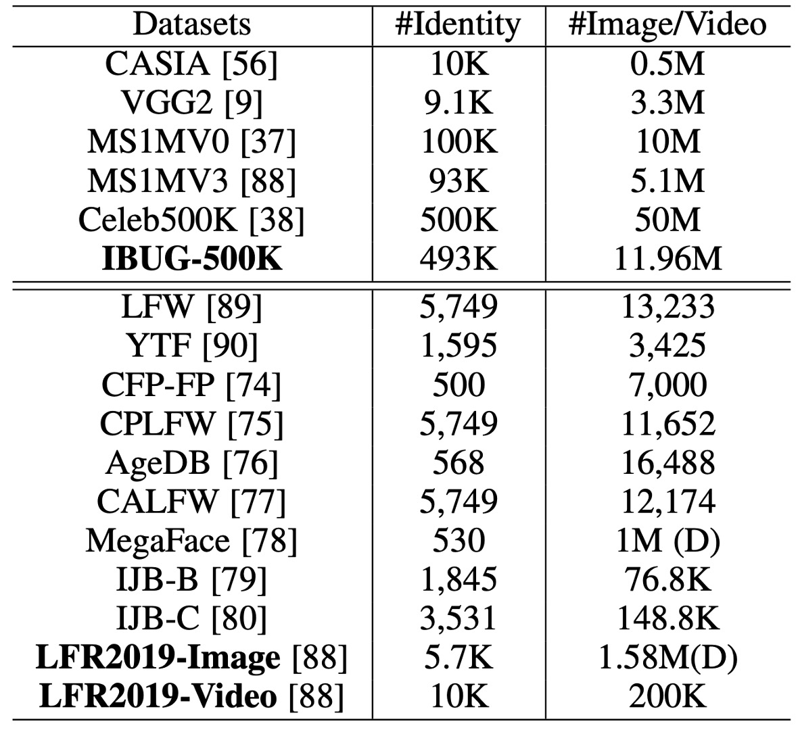
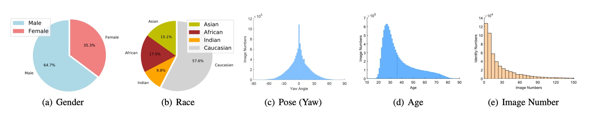

## 反余弦損失

[**ArcFace: Additive Angular Margin Loss for Deep Face Recognition**](https://arxiv.org/abs/1801.07698)

---

これは顔認識の盛り上がりの年です。

距離学習の概念はこの段階で導入され、A-Softmax から CosFace、そしてこの記事の ArcFace へと続きます。この一連の損失関数は、顔認識におけるマージン問題を解決することを目的としています。

## 問題の定義

余計な説明は省き、直接 Softmax から説明を始めましょう。

$$
L_{\text{Softmax}} = \frac{1}{N}\sum_{i=1}^{N}-\log\left(\frac{e^{f_{y_i}}}{\sum_{j=1}^{C}e^{f_j}}\right)
$$

ここで、$f$は特徴ベクトル、$y_i$は$i$番目の画像のクラス、$C$はクラスの数、$N$はバッチサイズです。

ここでの$f_j$は通常、全結合層の活性化関数で、$f_j = W_j^Tx + B_j$の形で表されます。ここで$W_j$は全結合層の重み、$B_j$はバイアス項です。

$B_j = 0$に設定すると、$f_j = W_j^Tx$となり、これをベクトルの内積の形で表すことができます：

$$
f_j = \|W_j\|\|x\|\cos\theta_j
$$

ここで$\theta_j$は$W_j$と$x$の間の角度です。

ここまでで、特に変更はありません。Softmax 損失関数の計算過程を説明したに過ぎません。

### CosFace の振り返り

- [**[18.01] CosFace: 大余弦損失**](../1801-cosface/index.md)

次に、$\|W_j\|$と$\|x\|$を L2 正規化して 1 に固定します。こうすることで$f_j = \cos\theta_j$となります。

CosFace の論文では、元々の$f_j$を$f_j= \cos\theta_j - m$に変更しました。

定数$m$を引くことは、分類境界に「余量」を導入することに相当し、モデルに分類時にもっと自信を持たせることが求められます。これによりクラス間の間隔を効果的に広げ、モデルが異なるクラスのサンプルを判別する能力を向上させます。言い換えれば、モデルはサンプルを正しく分類するために、より高い信頼度（より大きな余弦類似度）を必要とするようになり、クラス間の重複を減らすのに役立ちます。

しかし、目標はクラス間のマージンを増加させることなので、なぜ$m$を$\cos\theta$に作用させるのでしょうか？

### なぜ直接$\theta$に作用させないのか？

これが著者がこの記事で解決しようとする問題です：

**クラス間のマージンを増加させることが目標であるなら、$\theta$に直接作用させるべきではないか！**

## 問題の解決

### モデルアーキテクチャ


上図は ArcFace のモデルアーキテクチャです。

しかし、この図が気に入らないかもしれませんので、実装の詳細を見てみましょう：

```python
# ArcFaceの実装（InsightFaceによる）

class ArcFace(torch.nn.Module):

    def __init__(self, s=64.0, margin=0.5):
        super(ArcFace, self).__init__()
        self.s = s
        self.margin = margin
        self.cos_m = math.cos(margin)
        self.sin_m = math.sin(margin)
        self.theta = math.cos(math.pi - margin)
        self.sinmm = math.sin(math.pi - margin) * margin
        self.easy_margin = False


    def forward(self, logits: torch.Tensor, labels: torch.Tensor):
        index = torch.where(labels != -1)[0]
        target_logit = logits[index, labels[index].view(-1)]

        with torch.no_grad():
            target_logit.arccos_()
            logits.arccos_()
            final_target_logit = target_logit + self.margin
            logits[index, labels[index].view(-1)] = final_target_logit
            logits.cos_()
        logits = logits * self.s
        return logits
```

このコードの部分に注目してください：

```python
with torch.no_grad():
    target_logit.arccos_()
    logits.arccos_()
    final_target_logit = target_logit + self.margin
    logits[index, labels[index].view(-1)] = final_target_logit
    logits.cos_()
```

この部分は、まず logit を弧度に戻し、その後 margin を加え、再度 cos 値に戻すという処理です。デフォルトの margin は 0.5 ラジアンで、これは約 28.6 度に相当します。つまり、例えばモデルが元々予測した角度が 60 度だとすると、margin を加えると 88.6 度となり、これは CosFace の概念と同様に、モデルの予測難易度を増加させ、分類能力を向上させるのです。

### 何が違うのか？

著者は論文の中で、異なる margin が分類に与える影響を比較しています：


上図では、横軸と縦軸が 2 つのクラスに対応する$\theta_1$と$\theta_2$で、最左は L2 正規化された Softmax の結果で、2 つのクラスの間には明確な境界があります。角度が 60 度と 120 度だとすると、この 2 つのクラスの間の境界は 90 度となります。重なりのない領域ですが、境界付近の特徴の識別度は高くありません。

2 番目の図は SphereFace の結果で、これは乗法角度マージン、すなわち$f_j = \cos(m\theta_j)$です。この方法の基本的な仮定は、各クラスが異なる超球面上に位置しているというものですが、欠点はすべての$\theta$に対して一貫性がなく、角度が小さくなるにつれてマージンも減少し、$\theta$が 0 に近づくと、境界が完全に消失することです。

次に CosFace では、マージンが余弦値に作用するので、角度空間に投影すると分類境界は曲線となり、最終的には ArcFace のように、マージンが角度に直接作用するため、分類境界は直線となります。

### 拡張された式

CosFace の「加法余弦マージン（additive cosine margin）」、ArcFace の「加法角度マージン（additive angular margin）」、さらに以前の SphereFace 論文で提案された「乗法角度マージン（multiplicative angular margin）」を統合すると、これら 3 つのマージンを 1 つの一般的な式で表すことができます：

$$
f_j =
\begin{cases}
\cos(m_1\theta_{y_i} + m_2) - m_3 & \text{if } j = y_i, \\
\cos\theta_j & \text{if } j \neq y_i.
\end{cases}
$$

そのため、損失関数は次のように表せます：

$$
L_{\text{ArcFace}} = -\frac{1}{N}\sum_{i=1}^{N}\log\left(\frac{e^{s(f_{y_i})}}{e^{s(f_{y_i})} + \sum_{j\neq y_i}e^{s(f_j)}}\right)
$$

上記の式に基づいて、異なる損失関数を再確認してみましょう：

- CosFace では、$m_1 = 1$、$m_2 = 0$、$m_3 = 0.35$；
- ArcFace では、$m_1 = 1$、$m_2 = 0.5$、$m_3 = 0$；
- SphereFace では、$m_1 = 1.35$、$m_2 = 0$、$m_3 = 0$。

:::tip
この段落を理解した後、あなた自身の損失関数を提案することもできます。例えば、$m_1 = 1.35$、$m_2 = 0.25$、$m_3 = 0.15$に設定すれば、それは新しい損失関数になります。
:::

### 訓練と検証データセット



1. **訓練データセット**:

   - **CASIA**
   - **VGG2**
   - **MS1MV0**

     - データセットは緩やかなクロップバージョンです。
     - 元のデータのノイズ率は約 47.1%～ 54.4%と推定されます。
     - 半自動の方法で清掃され、**MS1MV3**となりました。

   - **Celeb500K**

     - **MS1MV0**と同様の方法で収集されました。
     - Google で有名人リストを使って検索し、上位にランキングされた顔画像をダウンロードしました。
     - 50 万人の ID に対して 2500 万枚の画像が収集されました。
     - RetinaFace を使い、50×50 以上の顔を検出しました。

   - **IBUG-500K データセット**

     - ID 文字列を使って重複する ID（約 50K）を削除し、その後、MS1MV0 と Celeb500K を自動で清掃して結合しました。
     - 最終的に 493K ID の 1196 万枚の画像が得られ、**IBUG-500K**という名前が付けられました。
     - 下の図は、このデータセットの性別、民族、姿勢、年齢、画像数の分布を示しています。

       

2. **検証データセット**:

   - **LFW & CFP-FP & AgeDB**

     - モデルの収束状態を素早く確認するために使用されます。

   - **CPLFW & CALFW**

     - より大きな姿勢と年齢の変化を持つ最新のデータセットです。

   - **MegaFace & IJB-B & IJB-C**

     - 大規模な画像データセットです。

   - **LFR2019**
     - 様々な番組、映画、テレビドラマから 10,000 人の ID を収集し、合計 200,000 本の動画が得られました。各動画の長さは 1 秒から 30 秒まで様々です。

### 訓練設定

1. **顔の標準化クロップ：**

   - RetinaFace によって予測された 5 つの顔のポイントを使用して、112×112 の標準化された顔クロップを生成します。

2. **ネットワークアーキテクチャ：**

   - 埋め込みネットワークとして ResNet50 と ResNet100 の CNN アーキテクチャを使用し、これらのアーキテクチャはボトルネック構造を含みません。
   - 最後の畳み込み層の後に、BN-Dropout-FC-BN 構造を使用して最終的な 512 次元の埋め込み特徴を取得します。

3. **訓練設定：**

   - 特徴スケール`s`は 64 に設定され、ArcFace の角度マージン`m`は 0.5 に設定されます。
   - すべての認識実験には MXNet を使用します。
   - バッチサイズは 512 に設定し、8 台の NVIDIA Tesla P40 (24GB) GPU でモデルを訓練します。
   - モメンタムは 0.9 に設定され、ウェイト減衰は 5e−4 に設定されます。

## 討論

### 異なる Loss の比較


1. **角度マージン設定：**

   - CASIA データセットで ResNet50 を使用して観察したところ、最適なマージンは 0.5 でした。
   - SphereFace と CosFace の最適なマージンはそれぞれ 1.35 と 0.35 でした。

2. **モデルの性能：**

   - SphereFace と CosFace の実装では、これらの設定で優れた性能を達成し、収束の問題はありませんでした。ArcFace は、すべての 3 つのテストセットで最高の検証精度を達成しました。

3. **組み合わせマージンフレームワーク：**

   - 組み合わせマージンフレームワークで実験を行ったところ、CM1 (1, 0.3, 0.2) と CM2 (0.9, 0.4, 0.15)が最良の性能を示しました。組み合わせマージンフレームワークは、単独の SphereFace や CosFace よりも優れたパフォーマンスを発揮しましたが、性能の上限は ArcFace に制限されます。

4. **Norm-Softmax とトリプレットロス：**

   - Norm-Softmax をクラス内損失と組み合わせた場合、CFP-FP と AgeDB の性能が向上しました。
   - Norm-Softmax をクラス間損失と組み合わせた場合、精度はわずかに向上しました。
   - トリプレットサンプルでマージンペナルティを使用した場合、ArcFace での方が効果的なグローバルな比較ができるため、ローカルな比較が効果的ではないことが示されました。

Intra-loss、Inter-loss、Triplet-loss を ArcFace に統合した場合、明確な改善は見られませんでした。そのため、著者は ArcFace がすでにクラス内の密度、クラス間の差異、分類のマージンを効果的に強化していると考えています。

### 検証データセットの性能


ResNet100 を使用して MS1MV3 と IBUG-500K で訓練した ArcFace モデルは、LFW と YTF データセットでベースラインモデル（例えば SphereFace や CosFace）を上回り、追加された角度マージンペナルティが深層学習特徴の識別能力を大幅に強化したことを示し、ArcFace の有効性を示しています。

マージンに基づくソフトマックス損失は、最近の方法で広く使用されており、LFW と YTF での性能はそれぞれ 99.8%と 98.0%近くに達しています。しかし、ArcFace は依然として最も競争力のある顔認識手法の 1 つです。

---


LFW と YTF データセットに加えて、ArcFace は CFP-FP、CPLFW、AgeDB、CALFW でも性能を報告しています。これらのデータセットでは、より大きな姿勢や年齢の変化が示されており、ArcFace はこれらのデータセットでも優れた性能を示しました。

---


ArcFace は IJB-B および IJB-C データセットで TPR（@FPR=1e-4）を大幅に改善し、ソフトマックスベースの手法と比較して約 3 ～ 5%の向上を見せました。IBUG-500K データセットと ResNet100 で訓練した ArcFace モデルは、IJB-B および IJB-C でそれぞれ TPR（@FPR=1e-4）を 96.02%と 97.27%に向上させました。

:::info

- **IJB-B データセット**

  1,845 人の被験者、21.8K の静止画像、55K のフレームがあり、7,011 本の動画から取得されました。

- **IJB-C データセット**

  IJB-B の拡張版で、3,531 人の被験者、31.3K の静止画像、117.5K のフレームがあり、11,779 本の動画から取得されました。

- IJB-B および IJB-C には 2 つの評価プロトコルがあります：1:1 検証と 1:N 識別。
  :::

## 結論

ArcFace の核心思想は、特徴空間に角度マージンを導入することにより、クラス内の密度とクラス間の差異を強化し、複数の顔認識ベンチマークで卓越した性能を示すことです。

:::tip
実際に使用する際、ArcFace は訓練データがクリーンであると仮定しているため、雑然としたデータセットはモデルの性能に大きな影響を与える可能性があります。しかし、公開されているデータセットはどれもノイズが多いのではないでしょうか？

この点について、著者は

別の視点を論文で提案しています：**Sub-center ArcFace**。簡単に言うと、各クラスに複数のクラスタセンターを割り当て、ノイズを異なるクラスタセンターに分散させるというものです。


これは ArcFace の改良で、雑然としたデータセットを効果的に処理できます。しかし、これによりアルゴリズムの特徴統合能力に影響が出るため、使用時にはこの点に注意してください。
:::
