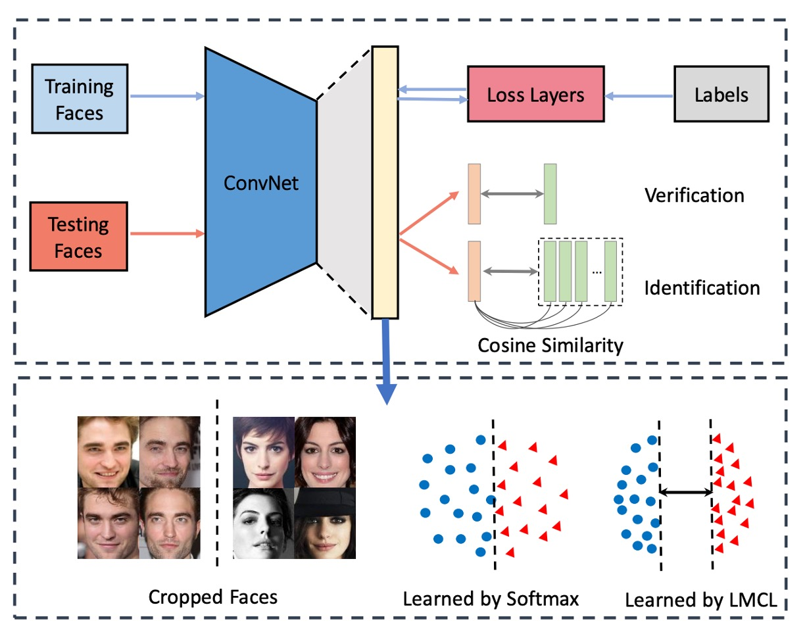
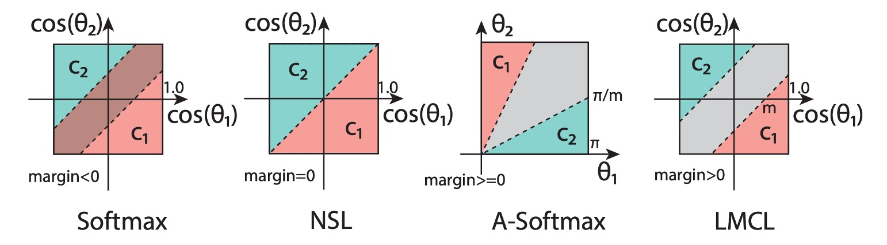

# [18.01] CosFace

## 大きな余弦損失

[**CosFace: Large Margin Cosine Loss for Deep Face Recognition**](https://arxiv.org/abs/1801.09414)

---

顔認識のタスクは、深層学習が流行する前から研究者の関心を引きました。これは日常生活で多数のアプリケーションが見られる数少ない分野の一つであり、この分野は過去十数年間のホットなトピックとなっています。

## 問題の定義

顔認識の問題は、一般的な分類問題とは異なります：

- **顔は本当に似ている！**

ImageNet などのデータセットでの分類問題とは異なり、顔認識の問題は、同じ人物の写真であっても、異なる照明、角度、表情、さらにはカメラの違いによって写真が異なることです。

一般的に、この分野では顔の 2 つの特性について議論します：

1. **クラス内差異が大きい**：同じ人物の写真間での差異は通常非常に大きいです。なぜなら、照明、角度、表情、年齢などの要因が写真に影響を与えるからです。
2. **クラス間差異が小さい**：顔の基本的な構造は似ており、両目、鼻、口などがあるため、異なる人物の写真間での差異は通常小さいです。

:::tip
**でも顔の差異は大きいと思うのですが？**

- あなたの脳は顔を区別することに慣れているため、顔の間に大きな差異を感じることができます。しかし、もし異なる種族（例えば猫）を考えた場合、「顔」だけを見て、10 匹以上の「猫の顔」を識別できますか？
  :::

### 顔認識システム



一般的な顔認識システムは、いくつかの部分に分かれています：

1. **特徴抽出器**：通常は畳み込みニューラルネットワーク（CNN）で、顔の画像を固定長の特徴ベクトルに変換します。
2. **距離学習器**：2 つの特徴ベクトル間の距離を計算するために使用され、デプロイメント時には削除されます。

---

「**特徴抽出器**」の部分はあまり議論する必要はありません。なぜなら、これは最新のバックボーンネットワークに合わせて進められるからです。

特徴抽出器を通過した後、我々は特徴ベクトル$f$を得ることができます。現在最も一般的な次元は 512 次元であり、過去の研究では、512 次元の長さが理論的に全世界のすべての顔を表現するのに十分であるとされています。

このベクトルが、顔認識の分野で議論される「ポイント」になります。過去の研究では、Softmax 損失関数を使用して訓練されたモデルは能力が制限され、境界ケースの区別能力が不足していました。

そして、これが本論文で解決しようとしている問題です。

## 解決された問題

### 損失関数

ここでは、著者がどのようにして元の Softmax 損失関数を改善したかを一歩ずつ見ていきましょう。

1. **Softmax 損失関数**：

   $$
   L_{\text{Softmax}} = \frac{1}{N}\sum_{i=1}^{N}-\log\left(\frac{e^{f_{y_i}}}{\sum_{j=1}^{C}e^{f_j}}\right)
   $$

   ここで $f$ は特徴ベクトル、$y_i$ は $i$ 番目の画像のクラス、$C$ はクラスの数、$N$ はバッチサイズです。

   ここでの $f_j$ は通常、全結合層の活性化関数であり、$f_j = W_j^Tx + B_j$ という形で表現できます。ここで $W_j$ は全結合層の重み、$B_j$ はバイアス項です。

   ここで著者は $B_j = 0$ として、$f_j = W_j^Tx$ とし、次にベクトルの内積形式で表現します：

   $$
   f_j = \|W_j\|\|x\|\cos\theta_j
   $$

   ここで $\theta_j$ は $W_j$ と $x$ の間の角度です。

   ここまででは、Softmax 損失関数の計算過程を記述しただけであり、何も変更していません。

2. **Normalized Softmax Loss (NSL)**：

   次に、著者は Normalized Softmax Loss (NSL)という改善方法を提案しました。

   $\|W_j\|$ を L2 正規化して 1 に固定し、$\|x\|$ を固定長さ $s$ にすると、$f_j = s \cos\theta_j$ になります。

   NSL は、重みベクトル$W_j$と特徴ベクトル$x$のノルムを固定することによって、ユークリッド空間における変化を排除し、角度の変化だけに注目します。$W_j$ と $x$ のノルムが固定されると、損失関数は角度だけに依存します：

   $$
   L_{\text{NSL}} = \frac{1}{N}\sum_{i}-\log\left(\frac{e^{s \cos(\theta_{y_i})}}{\sum_{j} e^{s \cos(\theta_j)}}\right)
   $$

   この方法の利点は、特徴学習が主に角度空間に集中するため、特徴の識別性が向上することです。

3. **Large Margin Cosine Loss (LMCL)**：

   しかし、NSL の特徴識別性はまだ十分ではありません。特徴の識別度をさらに向上させるために、著者は余弦マージン（cosine margin）を導入し、それを Softmax の余弦式に自然に組み込みました。

   2 クラス分類の状況を考え、$\theta_i$ を学習された特徴ベクトルとクラス $C_i$ の重みベクトルとの間の角度とします。

   NSL は、$\cos(\theta_1) > \cos(\theta_2)$ を強制することによって、クラス $C_1$ と $C_2$ の区別を実現します。

   大きなマージン分類器を構築するために、さらに以下を要求します：

   - $\cos(\theta_1) - m > \cos(\theta_2)$
   - $\cos(\theta_2) - m > \cos(\theta_1)$

   ここで、$m \geq 0$ は余弦マージンの大きさを制御する固定パラメータです。$\cos(\theta_i) - m$ は $\cos(\theta_i)$ より小さくなるため、この制約は分類を厳格にします。そして、異なるクラスの視点から見ても、この制約は満たさなければなりません。

   最後に、著者は正式に Large Margin Cosine Loss（LMCL）を定義しました：

   $$
   L_{\text{LMCL}} = \frac{1}{N}\sum_{i}-\log\left(\frac{e^{s(\cos(\theta_{y_i}) - m)}}{e^{s(\cos(\theta_{y_i}) - m)} + \sum_{j \neq y_i} e^{s \cos(\theta_j)}}\right)
   $$

   この制約の下では：

   $$
   W = \frac{W^*}{\|W^*\|}, \quad x = \frac{x^*}{\|x^*\|}, \quad \cos(\theta_j, i) = W_j^T x_i
   $$

   ここで $N$ は訓練サンプルの数、$x_i$ は $i$ 番目の特徴ベクトルで、その真のクラスは $y_i$ に対応します。$W_j$ は $j$ 番目のクラスの重みベクトルで、$\theta_j$ は $W_j$ と $x_i$ の間の角度です。

これらの公式を見た後、下の図を見て、この損失関数の意味を理解できます：



図では、最初の Softmax 損失関数は L2 正規化されていないため、異なるクラス間の境界が重なっています。

次に、NSL の改良を見てみると、異なるクラス間に境界が現れますが、この時点ではその境界には距離がないため、境界付近での判定が不安定になる可能性があります。

最後に、LMCL の改良後、異なるクラス間の境界がより明確になり、モデルは訓練中にこの境界の制約を受けることで、特徴ベクトルが角度空間でより区別しやすくなります。

もう一つは A-Softmax という過去の改良方法で、これは以下の制約を課します：

- $\cos(m\theta_1) \geq \cos(\theta_2)$
- $\cos(m\theta_2) \geq \cos(\theta_1)$

この方法の欠点は、A-Softmax がすべての$\theta$に対して一貫性がないことです：角度が減少するにつれて、境界も小さくなり、$\theta = 0$の時、境界は完全に消失します。この場合、モデルは非常に小さな角度の特徴ベクトルの識別に失敗する可能性があります。

:::tip
このような境界に集中した改良方法は、後に「Margin-based Loss」と総称されます。
:::

### ハイパーパラメータ $s$

超球面上で識別性のある特徴を学習するには、余弦マージンが特徴の識別能力を強化する重要な部分です。

LMCL において、余弦マージンには下限があります：

$$
s \geq \frac{C - 1}{C} \log \frac{(C - 1)P_W}{1 - P_W}
$$

ここで $C$ はクラス数、$P_W$ はクラスセンターの期待最小後続確率です。

これは、最良の分類性能を得るためには、$s$ はクラス数の増加に従って大きくなるべきであることを意味します。

特徴次元数がクラス数を超えると、余弦マージンの上限は小さくなります。したがって、大きな半径を持つ超球面は、クラス内の距離が小さく、クラス間の距離が大きい特徴の埋め込みには必要不可欠です。

### ハイパーパラメータ $m$


上の図は、異なる$m$が特徴空間に与える影響を示しています。

$m$ が増加するにつれて、クラス間の境界がより明確になることがわかります。

---

2 クラス分類を考え、正規化された特徴ベクトル $x$ が与えられたとします。

$W_i$ は正規化された重みベクトル、$\theta_i$ は $x$ と $W_i$ の間の角度です。

NSL における決定境界は $\cos \theta_1 - \cos \theta_2 = 0$ で定義され、これは $W_1$ と $W_2$ の角度の平分線に相当します。つまり、NSL の監督下でモデルは特徴空間を 2 つの近い領域に分割し、境界付近の特徴は非常にぼやけており、どちらのクラスにも属することが許容されます。

これに対して、LMCL の決定境界は $\cos \theta_1 - \cos \theta_2 = m$ で表されます。これにより、$\theta_1$ は $\theta_2$ よりもかなり小さい必要があります。したがって、クラス間の分散は増加し、クラス内の分散は減少します。最大角度のマージンは $W_1$ と $W_2$ の間の角度に依存します。

もしクラス$i$のすべての特徴ベクトルがその対応する重みベクトル $W_i$ と完全に一致すると仮定した場合、この極端な状況では、決定境界の境界は最大値に達します（すなわち、余弦マージンの厳密な上限）。

一般的な場合、すべての特徴が分離され、$C$ クラスがあると仮定します。余弦マージン $m$ の理論的な範囲は次のように推測されます：

$$
0 \leq m \leq (1 - \max(W_i^T W_j)), \quad i, j \leq n, \, i \neq j
$$

Softmax 損失は、異なるクラスの重みベクトル間の角度を最大化し、完璧な分類を実現しようとします。

したがって、Softmax 損失の最適解は、重みベクトルが単位超球面上に均等に分布することです。

この仮定に基づき、余弦マージン $m$ の変動範囲は次のように推論できます：

$$
0 \leq m \leq 1 - \cos\left(\frac{2\pi}{C}\right), \quad (K = 2)
$$

$$
0 \leq m \leq \frac{C}{C - 1}, \quad (C \leq K + 1)
$$

$$
0 \leq m \leq \frac{C}{C - 1}, \quad (C > K + 1)
$$

ここで、$C$ は訓練クラス数、$K$ は学習する特徴の次元です。

これらの不等式は、クラス数が増えるにつれて、クラス間の余弦マージンの上限が減少することを示しています。特に、クラス数が特徴次元数を大きく上回る場合、余弦マージンの上限はさらに小さくなります。

実際には、$m$ は理論的な上限に達することはなく、すべての特徴ベクトルはその対応するクラスの重みベクトルに近づきます。$m$ が大きすぎると、モデルは収束できなくなります。なぜなら、余弦制約が厳しくなり、満たすのが難しくなるからです。また、$m$ が大きすぎると、ノイズの多いデータに対してモデルが敏感になります。

### 実装の詳細

理論は方法の実行可能性を証明するためにあります。

実際には、CosFace の実装は非常に簡単で、すぐに書くことができます：

```python
import torch
import torch.nn as nn

class CosFace(nn.Module):

    def __init__(self, s=64.0, m=0.35):
        super(CosFace, self).__init__()
        self.s = s
        self.m = m

    def forward(self, logits: torch.Tensor, labels: torch.Tensor):
        index = torch.where(labels != -1)[0]
        target_logit = logits[index, labels[index].view(-1)]
        final_target_logit = target_logit - self.m
        logits[index, labels[index].view(-1)] = final_target_logit
        logits = logits * self.s
        return logits
```

上記の実装は、2 つのことを行っています。Softmax 計算で得られた logits から $m$ を引き、次に $s$ を掛けるだけです。

これで調整された logits が得られ、その後は一般的な CrossEntropyLoss を使用できます。

## 討論

### m の影響の探索


1. **実験設計**：

   - $m$ を 0 から 0.45 まで変化させて実験を行いました。
   - 小型の訓練データセット（CASIA-WebFace）を使用して CosFace モデルを訓練しました。
   - LFW および YTF データセットで性能を評価しました。

2. **実験結果**：

   - マージンがない（$m = 0$）モデルの性能が最も低かったです。
   - $m$ が増加するにつれて、両方のデータセットで精度が向上しました。
   - $m = 0.35$ の時点で性能が飽和しました。
   - $m$ が 0.45 を超えると、モデルは収束しませんでした。

3. **結論**：
   - マージン $m$ は学習された特徴の識別能力を効果的に向上させました。
   - 今後の実験では、$m$ を 0.35 に固定することにしました。

### 特徴正規化の影響


1. **実験設計**：

   - 特徴正規化を使用した場合と使用しない場合の CosFace モデルを比較しました。
   - CASIA-WebFace データセットで訓練し、$m$ を 0.35 に固定しました。
   - LFW、YTF、MegaFace Challenge 1 (MF1) データセットで性能を評価しました。

2. **実験結果**：

   - 正規化されていないモデルは、最初に Softmax 損失で初期化され、その後 LMCL で監視されました。
   - 特徴正規化を行ったモデルは、三つのデータセットすべてで、正規化を行わないモデルを上回りました。

3. **結論**：
   - 特徴正規化は基本的な分散を除去し、学習された特徴が角度空間でより識別的になることを示しました。
   - 実験により、特徴正規化の有効性が確認されました。

### 他の損失関数との比較


1. **実験設計**：

   - CAISA-WebFace データセットでモデルを訓練しました。
   - SphereFace で使用された 64 層 CNN アーキテクチャと同じものを使用して訓練しました。
   - LFW、YTF、MF1 データセットで実験比較を行いました。

2. **比較設定**：

   - SphereFace のモデル構造（64 層の ResNet 型 CNN）と実験設計を厳密に守り、他の損失関数と公正に比較しました。

3. **実験結果**：
   - LMCL は三つのデータセット全てで競争力のある結果を示しました。
   - LMCL は特徴正規化を施した A-Softmax（表中では A-Softmax-NormFea として示されている）よりも性能が上でした。
   - 特に YTF および MF1 データセットにおいて、LMCL は他の損失関数を大きく上回る結果を示しました。

## 結論

本論文では、CosFace という損失関数、すなわち大きな余弦マージン損失（LMCL）が提案され、深層学習モデルの特徴識別能力と分類性能を向上させることを目的としています。著者は元の Softmax 損失関数の限界を詳しく分析し、余弦マージンと特徴正規化技術を導入して、より効果的な特徴学習を実現しました。

CosFace の提案は、顔認識や他の高度な識別特徴を必要とする応用シーンにおいて、より精度が高く効率的なモデルを開発するための新たなアプローチと方法を提供しています。
