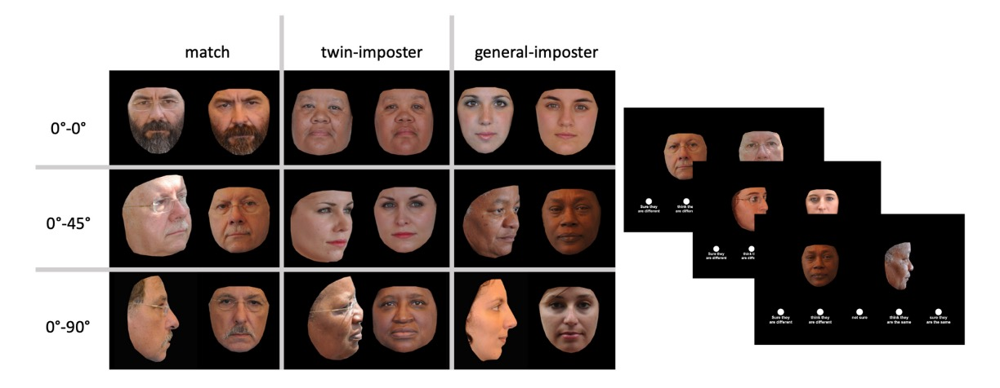

## 双子識別の視点

[**Twin Identification over Viewpoint Change: A Deep Convolutional Neural Network Surpasses Humans**](https://dl.acm.org/doi/pdf/10.1145/3609224)

---

双子の識別の問題は、機械視覚研究における挑戦の一つです。

本論文は、人間と深層畳み込みニューラルネットワーク（DCNN）を同卵双子の身元確認における精度で比較し、視点の変化におけるパフォーマンスをテストすることを目的としています。

研究者は、これら二つのシステムが非常に似ている顔の識別における違いと、実際のアプリケーションでのこれらのシステムの信頼性について理解したいと考えています。

## 他の論文からのレビュー

もともと私たちが見たかったのはこの論文でした：

- [**[21.12] Monozygotic twin face recognition: An in-depth analysis and plausible improvements**](https://www.sciencedirect.com/science/article/abs/pii/S0262885621002365)

しかし、この論文の PDF は有料でダウンロードする必要があります。

その後、この有料論文を引用した他の論文があり、その内容が大幅にレビューされています。

うれしいことに、これがちょうど良いタイミングです！それでは、一緒に見ていきましょう！

### DCNN 以前のアルゴリズム

2011 年から 2014 年の間、いくつかの研究が商業用顔認識アルゴリズムの同卵双子識別における性能をテストし、その結果は当時の顔認識技術が同卵双子を効果的に区別できないことを示しました。当時のコンピュータベースの顔認識システムは、主成分分析（PCA）や手動で選択された特徴を使用して顔画像を処理し、対数尤度関数を使って誤認識率を減少させていました。これらの研究はほぼ完全にノートルダム双子データセット（ND-TWINS-2009-2010）の顔画像に依存していました。

これらの初期の研究では、いくつかの双子について 2009 年と 2010 年に撮影された写真から画像を取得でき、遅延認識テストを支援しました。これらのデータセットの可用性と品質は、双子の顔認識に関するいくつかの研究を促進しました。例えば、ある研究では、参加者が同卵双子の兄弟姉妹（異なるアイデンティティ試験）と同じアイデンティティの画像ペアを同じ数だけ確認する認証タスクを完了しました。すべての画像ペアは同じ照明条件で撮影されていました。結果は、人間が画像ペアを 2 秒間だけ確認するよりも、より多くの時間をかけて決定を下す場合のパフォーマンスが良かったことを示しており、これは同卵双子を識別する際に時間が影響することを示しています。

テストされたコンピュータアルゴリズムでは、商業用アルゴリズム（Cognitec）のみが人間の性能に近いが、わずかに劣っていました。また、画像条件が変化することで、これらの初期のアルゴリズムは同卵双子を区別する際の誤報率が増加することがわかりました。

### 深層学習のアプローチ

深層学習のアプローチ、特に深層畳み込みニューラルネットワーク（DCNN）は、自動顔認識の分野で最新技術の進展に大きな成功を収めました。これらのネットワークの強力な利点の一つは、画像や外見の変化を一般化できることです。DCNN を同卵双子を区別するために適用する試みは少ないですが、すでにいくつかの初期的な成功が得られています。

例えば、ある研究では、PCA、方向性勾配ヒストグラム（HOG）、および局所二値模式（LBP）に基づく局所特徴抽出アルゴリズムの組み合わせが ND-TWINS-2009 データセット上で物体訓練された CNN よりも正確に動作したと報告されています。また別の研究では、基準となる顔の類似性測定を作成し、家庭関係のない「類似」アイデンティティの影響を測定するためにその基準を使用しました。彼らは、上記の閾値の定義に基づき、15,455 のアイデンティティのうち 6,153 が 1 つ以上の潜在的な類似者を持っていることを発見し、大規模データセットに潜在的な類似者が多数存在することを示しました。

さらに、最近の研究では、双子識別に特化した深層ネットワークを双子識別の問題に適用するのは合理的であることが示されています。例えば、いくつかの研究では、大規模データセットで初期訓練を行い、その後同卵双子を区別するよう最適化を行い、良好な結果が得られました。ただし、これらの研究の主要な制限は、データセットが公開されていないため、実験結果の再現性と検証が難しい点です。

アメリカ国立標準技術研究所（NIST）が行った顔認識ベンダーテスト（FRVT）も同卵双子の識別問題を検証しました。研究は、FRVT に提出されたすべてのアルゴリズムが、万分の一の誤報の閾値で同卵双子の偽装を検出できないことを示しました。これらの結果は貴重な視点を提供していますが、さまざまな理由により、研究結果から導き出された結論には限界があります。

本研究では、研究者は高精度の DCNN を選択し、人間と機械の類似度評価を関連付けて、人間と DCNN の間で高度に似ている画像に対する認識がどのように異なるかをテストしました。これにより、アルゴリズムテストで使用された完全に同じ顔の刺激と視点条件に対する人間の基準テストが提供されるだけでなく、双子を含む非常に似ている顔に対する顔認識システムの信頼性についても理解が深まります。

## 定義問題

さて、前回の文献レビューを終えたところで、元々見たかった論文に戻りましょう。

同卵双生児は人間の目にも機械視覚システムにも非常に挑戦的であるため、この論文が行うことは非常にシンプルです：

- **つまり、人間と機械が同卵双生児を区別するパフォーマンスを比較することです。**

研究者は、コンピュータビジョンシステムと人間の認知の違いを理解することで、機械視覚システムを最適化し、同卵双生児の識別精度を向上させる方法を見つけようとしています。

## 解決問題

### 実験 1：人間による同卵双生児の識別

実験 1 では、研究者は ND-TWINS-2009-2010 データセットを使用して、人間の参加者による双子の識別パフォーマンスを測定しました。

研究者はテキサス大学ダラス校（UTD）から 87 名の学生参加者を募集し、参加者は授業の単位を報酬として得ました。

各視点条件（正面対正面、正面対 45 度、正面対 90 度）には 29 名の参加者がいます。参加者は 18 歳以上で、視力が正常または矯正後正常である必要がありました。

参加資格は Qualtrics 調査による自己報告で確認されました。すべての実験手順は UTD の機関審査委員会によって承認されました。

- **実験設計**

  研究者は画像ペア内の顔のアイデンティティマッチング（認証）をテストし、刺激の種類に基づいてテストを行いました。画像ペアは同じアイデンティティ（同一アイデンティティペア）または異なるアイデンティティでした。異なるアイデンティティペアの中では、双子の偽装ペアと一般的な偽装ペアに分けられました。同一アイデンティティペアは同じアイデンティティの 2 枚の異なる画像で構成されます。双子の偽装ペアは同卵双生児の兄妹で構成されています。一般的な偽装ペアは、異なる無関係な人物の画像ペアです。各タイプの画像ペアは、3 つの視点条件すべてでテストされました。

  アイデンティティマッチングの精度は、2 つの条件の AUC を計算することで測定されました：（a）同一アイデンティティペアと双子の偽装ペア、（b）同一アイデンティティペアと一般的な偽装ペア。

- **手順**

  参加者はまず資格を確認するためのスクリーニングアンケートを完了しました。このアンケートでは、参加者が 18 歳以上で、視力が正常または矯正後正常であることを確認しました。条件を満たした参加者は、オンラインのインフォームド・コンセントフォームに案内されました。参加者がインフォームド・コンセントフォームを完了した後、研究時間を設定するためのアクセスコードが与えられました。参加者は指定された時間に、特定の Microsoft Teams リンクを通じて研究助手と会いました。

  研究者はタスクを簡単に説明し、参加者が一連の顔画像ペアを見て、各ペアが同一人物か 2 人の異なる人物かを判定するための確定的評価を行うことを説明しました。参加者には実験の中で同卵双生児が登場する可能性があることが伝えられました。

  各試験では、顔画像ペアが画面に並べられます。参加者は 5 段階評価で、画像ペアが同一人物か異なる人物かを判断するよう求められました。回答オプションは以下の通りです：（1）確定的に異なる人物、（2）異なる人物だと思う、（3）不確か、（4）同一人物だと思う、（5）確定的に同一人物。

  参加者はマウスを使用して評価を選択し、画像と評価スケールは参加者が選択するまで画面上に表示され続けました。実験は PsychoPy でプログラムされました。各参加者の試験の表示順序はランダムでした。

### 実験 2：DCNN による同卵双生児の識別

アルゴリズムのテストでは、ResNet-101 アーキテクチャに基づいた深層畳み込みニューラルネットワーク（DCNN）を使用しました。このネットワークは、インターネット上から収集した野外データセットである Universe データセットで訓練されました。このデータセットには 5,714,444 枚の画像が含まれており、58,020 のユニークなアイデンティティが含まれています。訓練データセット内の画像の属性は、ポーズ、照明、解像度、年齢などで大きく異なります。Universe データセットの人口構成は不明です。

このネットワークは 101 層を持ち、誤差信号の振幅を維持するためにスキップ接続を使用しています。L2 ノルムを学習過程で一定に保つために、Crystal loss が適用され、alpha パラメータは 50 に設定されています。

また、ネットワークの訓練の前処理ステップとして、顔画像は内部の顔を含むようにクロップされ、128×128 サイズに整列されてからネットワークに入力されました。このプロセスはすべての画像のポーズに対して同じように適用されます。完全に訓練されたネットワークが終了した後、倒数第二の全結合層の出力が各画像のアイデンティティ表現特徴を生成するために使用されます。

## 討論

### 実験結果

上の図では、赤い点はコンピュータビジョンシステムの結果、その他の点は人間参加者の結果を示しています。

すべての条件で、一般的な偽装条件におけるアイデンティティマッチング精度は、双子の偽装条件よりも明らかに高かったです。

画像間の視点差が増すにつれて、精度は低下し、特に双子の偽装条件での低下幅が顕著でした。

1. **AUC 測定方法**

   - 各参加者は、各視点条件で 2 つの条件の AUC を計算しました：
     - 一般的な偽装条件での画像ペア
     - 双子の偽装条件での画像ペア

2. **AUC 計算の基準**

   - 2 つの条件で、同一アイデンティティの画像ペアは正しい認証反応を生成しました。
   - 一般的な偽装条件の誤報は、2 つの異なる無関係なアイデンティティを示す画像ペアから発生しました。
   - 双子の偽装条件の誤報は、同卵双生児の画像ペアから発生しました。

3. **人間実験結果**

   - 一般的な偽装条件、正面対正面：0.969
   - 双子の偽装条件、正面対正面：0.874
   - 一般的な偽装条件、正面対 45 度側面：0.933
   - 双子の偽装条件、正面対 45 度側面：0.691
   - 一般的な偽装条件、正面対 90 度側面：0.869
   - 双子の偽装条件、正面対 90 度側面：0.652

4. **DCNN 実験結果**

   人間データ収集実験で視覚した各画像ペアに対して、DCNN は類似度スコアを生成しました。AUC を計算することで、DCNN の識別精度を測定しました。正しい反応は同一アイデンティティの画像ペアから得られ、誤報は異なるアイデンティティの画像ペアから得られました。DCNN のパフォーマンスは上記の図に示され、赤い円で示されており、人間の個体パフォーマンスデータの上に重なっています。

   - 一般的な偽装条件に対して、DCNN は完璧なアイデンティティマッチングパフォーマンスを得ました（AUC = 1.0）。
   - 双子の偽装条件に対して、DCNN のアイデンティティマッチングパフォーマンスは依然として高かったです（AUC = 0.96）。

## 結論

本研究は、同卵双生児の識別における表現遺伝的生物学的特徴の重要性を強調しています。指紋や虹彩模様が最も信頼できる方法と考えられていますが、顔認識技術もその可能性を示しています。

深層畳み込みニューラルネットワークは、異なる視点や照明条件でも高い精度を維持でき、初期の顔認識アルゴリズムに比べて顕著な進歩を示しました。

この論文の実験結果は、DCNN がすべてのテスト条件でほとんどの人間参加者を超える精度を達成し、特に挑戦的な双子識別タスクにおいて優れた結果を示したことを示しています。
