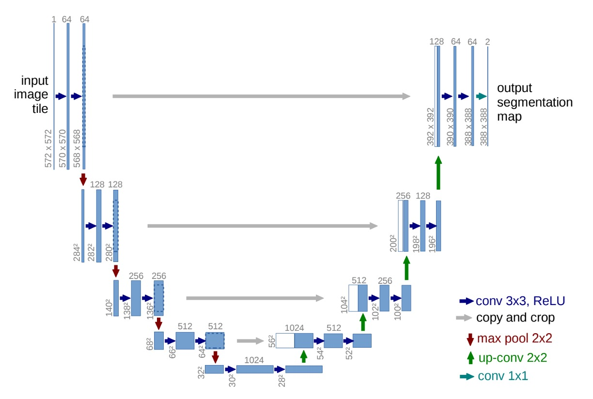

## 融合の序章

[**U-Net: Convolutional Networks for Biomedical Image Segmentation**](https://arxiv.org/abs/1505.04597)

---

VGG が登場したばかりの時期に、まだ解決されていないニーズがありました。

研究者たちは、従来の CNN アーキテクチャでは、十分な細粒度が提供できず、生物医学画像の分割という課題には対応できないことに気付きました。

そして、この研究が生まれました。この論文は、画像分割におけるクラシックな作品として位置付けられています。

## 問題の定義

隣の画像分類の領域では、皆が ImageNet を使いこなし、満足しているようですが、

生物医学画像分割の研究者たちはそうではありません。この分野では、訓練に使えるデータが非常に少なく、深層学習の訓練に必要なデータ量を満たすことができません。

問題解決の方向も明確ではなく、かつては訓練データを小さなブロックに分割して、より多くの訓練サンプルを生成する方法がありました。しかし、こうした方法では、文脈情報が失われ、分割精度が低下してしまいます。

そのタイミングで、別の研究が全畳み込みネットワーク（FCN）のアーキテクチャを提案し、著者にとって一つのインスピレーションとなりました。

- [**[14.11] Fully Convolutional Networks for Semantic Segmentation**](https://arxiv.org/abs/1411.4038)

  

  <figure style={{"width": "70%"}}>
  
  </figure>
  

おそらくこのアーキテクチャを生物医学画像分割に応用することで、文脈情報の喪失の問題を解決できるのではないかと考えたのです。

## 問題の解決

全画像を使用することで文脈情報の喪失問題は解決されましたが、データ不足の問題は依然として残ります。

そこで著者は、U-Net アーキテクチャを提案しました。以下の図のように：

<figure style={{"width": "80%"}}>

</figure>

高解像度の特徴マップを繰り返し使用することで、分割精度を向上させるとともに、モデルが求めるデータ量を削減することができます。

ここで、数字部分は一旦無視してください。著者は畳み込み層でパディングを使っていないので、畳み込み層を通るたびに特徴マップのサイズが小さくなります。このため、このアーキテクチャを初めて見る人は数字に惑わされて、設計の本質を正しく理解できないかもしれません。

まず、この図を半分に切り、左側を見てみましょう：

<figure style={{"width": "60%"}}>

</figure>

ここがよく言われる Backbone 部分です。この部分は、好きなアーキテクチャに簡単に切り替えることができます。例えば、MobileNet が好きなら MobileNet を、ResNet が好きなら ResNet を使います。

基本的な Backbone 設計には、5 層のダウンサンプリングがあり、それぞれ上図の 5 つの出力層に対応しています。

次に右側を見てみましょう：

<figure style={{"width": "60%"}}>

</figure>

ここがよく言われる Neck 部分です。この部分の特徴は、最下層からアップサンプリングが行われることです。方法としては単純な補間や、より複雑な逆畳み込みを使うことができますが、この論文では逆畳み込みが使われています。

アップサンプリング後、より高解像度の特徴マップが得られます。この時、最下層の特徴マップとその上の層の特徴マップを融合します。融合方法としては、単純に結合するか、加算する方法がありますが、この論文では結合が使われています。

このプロセスを経て、最終的に元の画像と同じサイズの分割結果が得られます。分割結果はチャンネル数で制御できます。二値分割なら 1 チャンネルで済み、マルチクラス分割の場合は複数のチャンネルが必要です。

:::tip
加算を選択すれば、別のクラシックな作品である FPN になります。

- [**[16.12] FPN: ピラミッド構造**](../1612-fpn/index.md)
  :::

## 討論

### ISBI Cell Tracking Challenge 2015

著者は U-Net を ISBI 2014 および 2015 年の細胞追跡チャレンジに応用しました：

- PhC-U373 データセットでは、92%の IOU を達成し、当時の 2 位（83%）を大きく上回りました。
- DIC-HeLa データセットでは、77.5%の IOU を達成し、同様に 2 位（46%）を大幅に超えました。

これらの結果は、U-Net が異なるタイプの顕微鏡画像分割タスクにおいて卓越した性能を示し、他の既存の方法を大きく上回ることを示しています。

## 結論

U-Net の設計方法は、高解像度の特徴マップを保持し、文脈情報を融合することで分割精度を向上させるとともに、データ量の要求を削減します。このアーキテクチャはシンプルで拡張しやすく、細胞分割、器官分割、病変検出などのさまざまな画像分割タスクに適用可能です。

FPN と比較すると、結合の構造はより多くのパラメータと計算量を伴うため、パラメータ量に制限がある場合には一定の問題が生じます。各アーキテクチャには長所があり、複数の設計方法を学び、タスクのニーズに最適なアーキテクチャを選択することが重要です。
