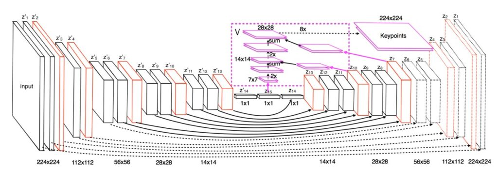

## 忘れられた長老

[**Stacked Hourglass Networks for Human Pose Estimation**](https://arxiv.org/abs/1603.06937)

---

もしあなたが異なる論文の間をよく徘徊している開発者であれば、Hourglass アーキテクチャは必ずしも馴染みがなくても、決して不明ではないでしょう。まずはこのアーキテクチャについて簡単に紹介しましょう：

Hourglass アーキテクチャは人体姿勢推定タスクのために設計されています。このアーキテクチャは、すべてのスケールの特徴を包括的に処理し統合することによって、人体に関連するさまざまな空間的関係を最適に捉えることを目指しています。研究チームは、下から上への処理と上から下への処理を繰り返し適用し、さらに中間での監視トレーニングを組み合わせることで、ネットワークの性能を大幅に向上させることができると示しました。そのため、この新しいアーキテクチャを「スタックド・アワーグラスネットワーク」と名付けました。このネットワークは、連続したプーリングとアップサンプリングのステップに基づいており、最終的な予測結果を生成します。

この論文が発表された時期は FPN よりも半年以上早かったですが、なぜその認知度の差がこんなにも大きいのでしょうか？最も直感的に感じることは論文の引用数です。2023 年 8 月時点で、FPN は 20,816 回引用されていますが、Hourglass は 5,365 回です。同じようなアーキテクチャ設計なのに、引用数が 4 倍も違うのはなぜでしょうか？

- **ちょっと待って、あなたはそれらが同じだと言いましたか？**

## モデルアーキテクチャ

以前 FPN の話題を扱ったことがあるので、そのアーキテクチャには馴染みがあるでしょう。一方、今回取り上げる Hourglass アーキテクチャは以下の通りです：

一見すると、これらは全く異なるアーキテクチャのように見えますが、実際には論文の記述に従ってこのモデルを一通り見ていきましょう：

1. **異なるスケールの情報のキャプチャ**

   あなたが 1 枚の画像を観察しているとしましょう、その画像には 1 人の全身が写っています。この人の姿勢を正確に理解するためには、全身と顔や手などの詳細部分を同時に注視する必要があります。しかし、これらの情報は異なるスケールに存在しているかもしれません。アワーグラス設計の目的は、これらの異なるスケールの情報を同時にキャプチャできるようにすることです。

2. **アワーグラス構造の設計**

   このモデルの構造は、まさにアワーグラスのような形です。特徴を抽出するための一連の畳み込み層と、画像の解像度を低減させるための最大プーリング層で構成されています。これにより、各解像度で空間的情報を保持し、詳細が失われることを防ぎます。

3. **アップサンプリングと特徴の統合**

   ネットワークが低解像度を処理した後、アップサンプリングを行い、画像を拡大するようにします。同時に、異なるスケールの特徴を組み合わせます。これにより、全身の情報と詳細を統合することができます。

4. **最終的な予測**

   最後に、ネットワークは一連の処理を経て最終的な予測を生成します。この予測は、異なる位置に特徴を示すヒートマップの集まりのようなものです。ここで、ネットワークは画像内で人体の関節がどこに存在するか（肘、膝など）を予測しようとします。

最後の第 4 部分は特定の分野の応用に関わる部分で、ここでは気にしません。

モデルアーキテクチャの図をもう一度描きます：

緑色で囲まれた部分は Backbone に該当し、N 回のダウンサンプリングが行われています。論文では、ここでのダウンサンプリングは一連の畳み込み層と最大プーリング操作で行うことが記載されています。次にアップサンプリングのプロセスに入り、特徴マップの解像度を逐次的に拡大し、加算します。チャンネルの整列操作は、1×1 の畳み込みを使って実現されます。

ここまでくると、かなり明確になったのではないでしょうか？

特徴融合の方法を見ると、Hourglass は FPN であり、FPN は Hourglass だということがわかります！

もちろん、彼らの適用シーンは異なります。Hourglass は実際には最も解像度の高い特徴マップ（P1）だけを使用し、それを複数回スタックしてキーポイントを抽出する効果を達成しています。一方、FPN は多層をスタックすることには特に言及していません（実際には可能ですが）、主に異なる解像度の特徴マップ（P3, P4, P5）を使用し、異なる受容野（Receptive Field）の特徴マップを通じて多尺度物体検出の目的を達成しています。

それでは、なぜこれら二つの論文の引用数にこんなにも差があるのでしょうか？

実際、推測でしか答えられませんが、適用シーンが異なり、物体検出の方が人気があるため、これが一因でしょう。もう一つの可能性は、論文の構成にあります。Hourglass の論文では「多層スタック」と「中間監督」の重要性が強調されているため、FPN と比較してその構成が注目されることが少なかったのかもしれません。

## Hourglass の起源？

Hourglass の論文をよく読んでみると、実はもっと前の文献で非常に似た構造が提案されていることがわかります：

[**[15.07] Bottom-Up and Top-Down Reasoning with Hierarchical Rectified Gaussians**](https://arxiv.org/abs/1507.05699)

この文献では、このアーキテクチャを「Hourglass」とは呼んでいません。単に「Bottom-Up」と「Top-Down」の構造と説明しています。以下はその文献からの抜粋です：

> 本論文の主な目的は、「双方向」の構造を探ることにあり、上から下へのフィードバックを考慮しています：ニューロンは上層および下層のニューロンから影響を受けます。この文献では、ニューロンを修正された潜在変数として扱い、二次エネルギー関数内で操作する方法を示します。著者は、修正線形単位を持つリカレントニューラルネットワークを使用して最適化される RGs が、GPU で効率的に最適化できることを示しています。

え、これって何を言っているのでしょうか？

簡単に言うと：

この論文では、ニューロンを微調整する新しい方法を探求し、特定のタスクに適応できるようにしています。この方法は、画像などのデータをよりよく処理するための数学的なモデルに適用されています。研究者たちは、この方法が特定の数学的問題を解くことで最適化でき、その問題は特別なリカレントニューラルネットワークを使用して解決できることを示しています。この構造は、計算リソースをより効率的に活用できることを意味します。

理解できないかもしれませんが、まあこれは本論文の焦点ではないので大丈夫です。最も早くこのアーキテクチャを提案した文献を探しているだけです。下の図は彼らが使用したモデル構造です：

この似たような構造を見て、Hourglass のインスピレーションの源だと認識できるかもしれませんが、果たしてこれが最初のアーキテクチャ設計なのでしょうか？

実を言うと、必ずしもそうではありません。

なぜなら、この論文の半年前にはすでに—

- [**U-Net: Convolutional Networks for Biomedical Image Segmentation**](https://arxiv.org/abs/1505.04597)

が発表されており、U-Net の多尺度接続構造も実はこれと似たようなものです。違いは U-Net が concat 操作を使用している点です。しかし、残念ながらこの論文は U-Net を引用していないため、著者がその前作についてどのように評価しているのかを見ることはできません。

## 結論

Hourglass と FPN は異なる分野で使用される 2 つのアーキテクチャですが、実際には特徴融合ネットワークの本質は同じで、同じアーキテクチャの異なる使い方に過ぎません。

同じ基盤アーキテクチャの上で、異なる問題を解決するために、異なる応用フローが発展しました。その中で、FPN は特徴ピラミッドを通じて異なるスケールの情報を処理し、主に物体検出やセグメンテーションなどのタスクに使用されます。一方、Hourglass ネットワークは、複数層の構造を通じて異なる詳細レベルで特徴を抽出し、特に密な予測タスクに適しています。例えば、姿勢推定などのタスクに非常に有効です。

もしあなたがこれらの 2 つのアーキテクチャの本質について困惑していたなら、この記事がその解答を提供できたことを願っています。
