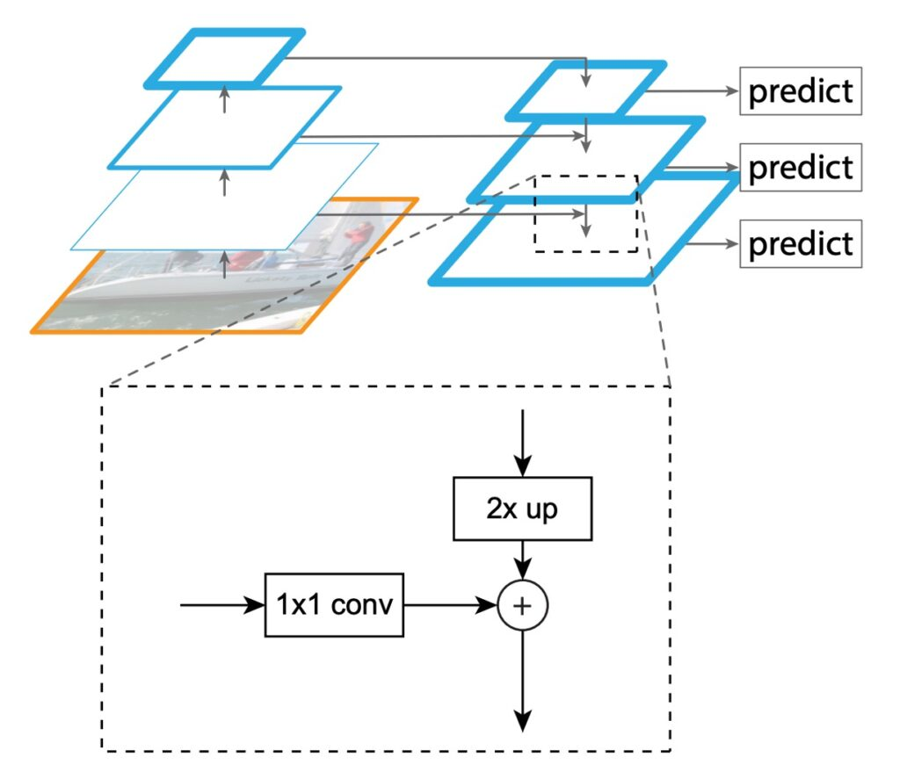
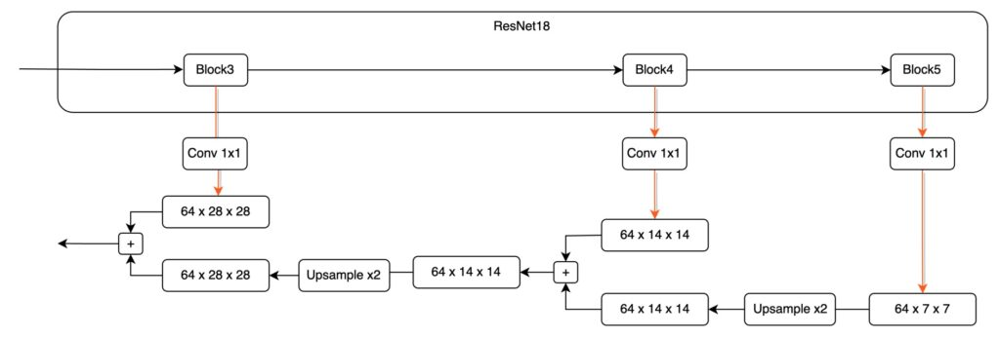
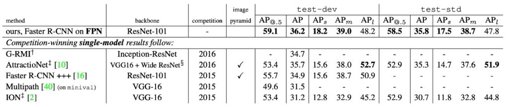

# [16.12] FPN

## ピラミッド構造

[**Feature Pyramid Networks for Object Detection**](https://arxiv.org/abs/1612.03144)

---

シーンを考えてみましょう。

一般的な畳み込みネットワークモデルの操作フローを考えます。まず、3 x 224 x 224 の入力サイズを持つ元の画像が与えられ、次に一層一層降採樣され、最終的には 256 x 7 x 7 の高次元のセマンティック特徴が得られます。通常、約定俗成のモデルでは、最後の出力が画像サイズの 1/32 となり、例えば 224 x 224 の元画像に対して最終的に得られる特徴マップのサイズは 7 x 7 になります。

この特徴マップにはさまざまな呼び方があります。例えば：

- 低解像度の特徴マップ（元画像と比較して最終的な特徴マップは 1/32 のサイズ）
- 高次元のセマンティック特徴（画像全体の特徴を凝縮し、大きな受容野を持つため）
- 上層の特徴（bottom ｜元画像 -> C1 -> C2 -> … -> C5 ｜ top）

この設計は分類タスクには問題ありません。なぜなら、分類タスクは画像全体の内容を参照して、最終的に一つまたは複数の可能な分類結果を出力することができます。

しかし、物体検出ではこれが通用しません。前述の通り、この特徴マップは 1/32 のスケールです。この時、「検出したい物体」が画像内で 32 x 32 ピクセルより小さい場合、それは降採樣の過程で「消えてしまいます」。モデルは最終的な特徴マップでそれを見つけることができません。

まあ、「消えてしまう」という表現は少し誇張かもしれませんが、実際にはモデルが畳み込み操作を使って降採樣を行っている場合、その物体は近くのピクセルに自身を依存させるかもしれません。

:::tip
もしこうした超自然的な表現が受け入れられない場合でも問題ありません。要するに、モデルがその物体を見ることは困難であり、微小な特徴を記録するために余分な容量を消費し、最終的に全体のパフォーマンスが期待通りにはいかなくなります。
:::

これが意味するのは、物体検出のパフォーマンスを向上させるためには、これらの特徴を保持するために何かをしなければならないということです。

2015 年末ごろ、SSD（Single Shot MultiBox Detector）が提案されました：

- **[SSD: Single Shot MultiBox Detector (2015.12)](https://arxiv.org/abs/1512.02325)**

この年、主に改善対象となったのは YOLO v1 です。

SSD は、YOLO v1 のアーキテクチャを基に、異なるスケールの特徴マップを予測ヘッドに加え、高次元の特徴（P3 ～ P5）を統合して予測を行うことで、ピラミッド型の特徴階層構造を初めて試みました。これは特長金字塔ネットワークの先駆者的存在と言えます。ただし、計算量が大きく、また低次元特徴が高次元特徴のセマンティクスを参照できないという欠点があります。

## 問題の定義

本論文では、著者は次の主要な問題を明確に指摘しています：

1. **特徴金字塔の限界**

   従来の特徴金字塔戦略は、過去の手動特徴時代において多尺度物体の認識の主なツールとして使用されていました。しかし、深層学習時代においては、これらの方法は現在の要求を満たしていません。主な問題は、異なるスケールの特徴を処理する能力が相対的に弱いことです。特に、大量の画像データに直面したとき、その処理速度はリアルタイムアプリケーションの要求を遠く下回ります。さらに、この方法は単に特徴の縮小を行っただけで、より深い特徴の融合や最適化を行っていないため、その認識効果は制限されています。

2. **SSD の限界**

   上記の問題を解決するために、SSD は新しい戦略として登場し、深層畳み込みネットワークの特徴金字塔階層構造を利用しようとしました。目標は、従来の特徴金字塔戦略を完全に置き換えることでした。しかし、SSD の設計にはいくつかの明確な欠陥が存在します。特に、低次の特徴を再利用せず、既に計算された高解像度層を再利用する代わりに新しい層を追加して金字塔を構築します。このアプローチは計算の複雑さを増大させ、また金字塔内の高解像度マッピングの重要性を無視しています。小さい物体の検出にはこれらの高解像度マッピングが不可欠ですが、SSD のこの戦略はその点を無視しています。

## 解決策

### FPN モデル設計

FPN の主な目的は、SSD の設計方法を改善することです。著者は、畳み込みネットワークの特徴階層構造の金字塔形状を維持しつつ、すべてのスケールで強力なセマンティックな特徴金字塔を作成する構造を提案しました。

この目標を達成するために、著者は次の構造を設計しました：

- **上から下への通路と横方向接続を通じて、低解像度特徴と高解像度特徴を結びつける。**

この一文が説明された後、この論文はほぼ終わりです。あとは実装とテストの部分です。

それでも、著者が提供するいくつかの実装の詳細を見てみましょう。

1. **Bottom-up 経路**

   

   最初の部分は、Bottom 特長から Top 特長へのデータパスです。ResNet18 を例に取ると、224 x 224 x 3 の画像が ResNet18 を通過した後、異なる解像度の特徴マップが 5 種類得られます。これらの特徴マップには以下のように定義を加えます：

   - P1：1/2 サイズの特徴マップ、サイズは 64 x 112 x 112。
   - P2：1/4 サイズの特徴マップ、サイズは 64 x 56 x 56。
   - P3：1/8 サイズの特徴マップ、サイズは 128 x 28 x 28。
   - P4：1/16 サイズの特徴マップ、サイズは 256 x 14 x 14。
   - P5：1/32 サイズの特徴マップ、サイズは 512 x 7 x 7。

   この画像は、モデルの降採樣過程を通過し、論文ではこれを Bottom-up 経路と呼びます。

   ほとんどのモデル設計では、P1 や P2 の特徴マップは金字塔特徴として使用しません。なぜなら、これらの特徴マップのサイズは依然として非常に大きく、大量の計算リソースを占めるからです。

2. **Top-down 経路と横方向接続**

   先程のステップを思い出してください。入力データは左側から右側に流れます。

   特徴金字塔設計の第 2 段階は、特徴を「右から左」に再度統合することです。

   ここで P4 ～ P5 を拡大して見てみましょう：

   

   この融合過程では、まず、高次元の特徴マップのサイズが小さいため、最初にそれを処理する必要があります。

   ここで P5 特徴マップを 1 回アップサンプルし、サイズの一致を確保します。

   次に、これら 2 つの異なる次元の特徴マップを加算したいと思います。しかし、これには別の課題があります。チャンネル数が一致しません。

   上図に示すように、Block5 から出力された特徴マップは 512 チャンネルですが、Block4 から出力された特徴マップは 256 チャンネルです。チャンネル数が一致しないため、直接加算することはできません。この問題を解決するために、1×1 の畳み込みフィルターを使って特徴マップのチャンネル数を調整する必要があります。チャンネル数の調整方法には特定の規定はありませんが、実際の状況に応じて適切なチャンネル数を事前に定義することができます（例えば 64 に設定）。

   各 P1 ～ P5 の特徴マップは、チャンネル数の一致を確保するために 1×1 の畳み込み層を通過させ、チャンネルを合わせることで問題を解決します。

   チャンネルとサイズが整った後、異なる層の特徴マップを直接加算して融合操作を完了させます。

   これをもう一度行うと、さらに実感が湧くかもしれません。次に P4 から P3 への融合を見てみましょう。

   

   最後に、実際の設計は次のようになります：

   

   :::tip
   各スケールの特徴マップを縮尺してから特徴を融合することは、エンジニアリング実装において一般的な設計方法です。
   :::

## 討論

### 本当に改善されたのか？

結果を先に言います：改善されました。

論文の著者はこれを説明するために多くの実験データを行い、記事の最後でいくつかの重要なグラフを紹介しています。まず、論文内で提供されている消融実験を見てみましょう：

この表では、異なるコンポーネントを削除した場合の結果を示しています。表 (d) は top-down コンポーネントを削除したもの、(e) は横方向接続を削除したもの、(f) は特徴金字塔の特徴表示方式を削除したものです。

どのコンポーネントを削除しても、パフォーマンスが大幅に低下することがわかります。

次の表を見てみましょう：

著者は、この方法を COCO コンペティションの優勝モデルの単一モデル結果と比較しました。2016 年の優勝者 G-RMI や 2015 年の優勝者 Faster R-CNN+++と比較して、FPN 単体のモデルはこれらの強力な競争相手を上回りました。テスト開発セットでは、FPN は既存の最良結果を 0.5 ポイント AP 向上させました。

## 結論

FPN は、さまざまなバックボーンネットワークと組み合わせることができる強力な特徴金字塔を構築するための簡潔なフレームワークを提案しました。この方法は、いくつかの強力なベンチマークモデルや競技会の優勝者において顕著な改善を示しました。

FPN は、次の 2 点を述べています：

- 1 つ目は、多尺度の特徴融合技術が必要である場合、異なるスケールの特徴を融合する技術を考慮すべきであるということ。
- 2 つ目は、特徴融合技術は次の 3 つの言葉で表せるということ：「下から上、上から下、そして加算する」。

この論文以降、特徴融合戦略の改善方法や効率向上、融合の重みの調整方法など、さまざまな議論が展開されています。
