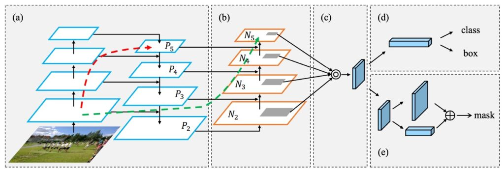

## 私にショートカットをくれ

[**Path Aggregation Network for Instance Segmentation**](https://arxiv.org/abs/1803.01534)

---

クラシックな FPN が提案された後、「どのようにしてより効率的に特徴融合を行うか？」が研究課題として浮上しました。

今回は、同じく非常にクラシックなアーキテクチャである PANet を見ていきましょう。

## 問題の定義

PANet の論文では、主に FPN アーキテクチャと比較しています。まだ FPN に不慣れな方は、こちらを参照してください：

- [**[16.12] FPN: ピラミッド構造**](../1612-fpn/index.md)

以前 FPN について話した時の小さな結論を思い出してください：「下から上、上から下、そして加算する。」

この設計について、PANet はそれだけでは不十分だと考えています。以下は論文の著者からの引用です：

> The insightful point that neurons in high layers strongly respond to entire objects while other neurons are more likely to be activated by local texture and patterns manifests the necessity of augmenting a top-down path to propagate semantically strong features and enhance all features with reasonable classification capability in FPN.
>
> Excerpted from PANet

この部分はそのまま翻訳すると日本語では美しさが失われるため、そのまま残しておきます。簡単に言うと、上層のニューロンは全体の物体を認識し、下層のニューロンは局所的なテクスチャやパターンを認識するため、特徴を融合するルートが 1 つでは不十分で、もう少し加えるべきだということです。

この段落で論文の核となる機能が説明されています。

図とともに見ていきましょう。まず「high layers」に対応するのは Block5 です。この層のニューロンは広い受容野（Receptive Field）を持ち、大きな物体に注目できます。一方、P1 や P2 といった比較的低い層の特徴は「local texture and patterns」に関連しており、局所的な特徴やテクスチャに注目します。

FPN の設計では、低層（例：P1）が高層（例：P5）の特徴を参照することができますが、逆に高層（例：P5）が低層（例：P1）の情報を参照するには、数百層の畳み込みが必要になります、選択されたバックボーンネットワークによって異なります。

これではあまりにも違いすぎるため、改善が必要だというわけです。

## 解決策

### PANet モデル設計

上の図が著者が提案した改善方法です。まず図(a)は、これまで見てきた FPN アーキテクチャです。次に図(b)では、著者が追加した新しいパスが示されています。コンセプトとしては、「元々のパスが長すぎる（図の赤線）」ので、そこに「下から上へのショートカット（図の緑線）」を加えるというものです。図(c)と図(d)は Head 構造に関する部分であり、今回は割愛します。

### パス集約ネットワーク（Path Aggregation FPN）

最後にパス集約モジュールの実装方法について詳しく見ていきます。各ビルディングブロックでは、低層からの特徴マップ（Ni）と一層上の特徴マップ（Pi+1）を組み合わせ、新しい特徴マップ（Ni+1）を作成します。

各特徴マップ（Ni）については、まず 3×3 の畳み込み演算を使用し、stride=2 で画像の空間サイズを半分に縮小して処理するデータ量を減らします。図 1 の中で N2 は P2 そのもので、処理は行われません。

次に、特徴マップ（Pi+1）の各小さなブロックとサイズを縮小した特徴マップ（Ni）の対応する小ブロックを加算します。その後、再度 3×3 の畳み込み演算を行い、結合後の特徴マップを処理します。この過程を繰り返し、最上層の特徴マップ（P5）に近づくまで続けます。

このビルディングブロック内で、PANet は特徴マップのチャネル数を 256 に保ち、各畳み込み後に ReLU を追加することで、モデルがより有用な特徴を学習できるようにしています。

最後に、これらの新しい特徴マップを統合し、それらを基に提案された特徴グリッドを結びつけます。これにより、PANet アーキテクチャは特徴の重要性を保持しつつ、情報の流れを強化し、後続のタスクの基盤をしっかりと築きます。

## 討論

### 基本的な FPN と比べてどうか？

このアーキテクチャを深く理解していくと、著者が最適化の過程で多くの分析と実験を行っていることがわかります。

いくつかの注目すべきポイントを見ていきましょう。

まず「多尺度訓練（MST）」という要素に注目します。これを加えると、元々のモデルの AP スコアが 2％向上します。

次に「複数 GPU の BatchNorm」が加えられ、これによってさらに 0.4％の向上が見られました。その後、論文で強調された「自下から上へのパス強化（BPA）」が加わると、さらに 0.7％の向上が見られました。この結果、BPA が効果的に情報の階層構造を構築し、モデルのパフォーマンスをさらに高めたことが示されています。

この消融実験では、「MST」と「BPA」の直接比較が見えにくくなっていますが、実験自体は非常に有意義です。

## 結論

PANet は FPN の設計理念を踏襲しながら、どのようにして多尺度の特徴融合問題をより良く解決できるかを探求し、更なる革新を加えました。このアーキテクチャは、さまざまなバックボーンネットワークと効果的に組み合わせ、強力な特徴金字塔を構築できるだけでなく、多尺度タスクに優れた性能向上を提供します。

PANet の論文は、以下の 2 点を伝えています：

まず、多尺度の問題に直面した場合、特徴融合をどのように行うかを考慮する必要があるということ。PANet の設計概念は、さまざまなスケールの特徴に焦点を当て、それらを強化し、融合する方法を探求しています。

次に、FPN の「下 → 上、上 → 下、そして加算する」の考え方に対して、PANet では「下 → 上、上 → 下、下 → 上、そして加算する」としました。

特徴融合の過程でまだ解決すべき問題はあります。例えば、加算融合と接続融合の比較、融合効率の向上、融合の重みの調整などです。これらは今後の研究でさらに探求されるでしょう。
