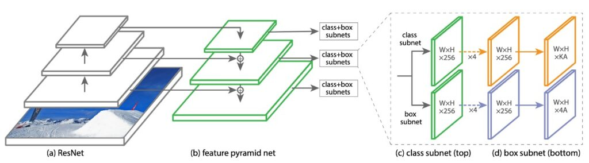
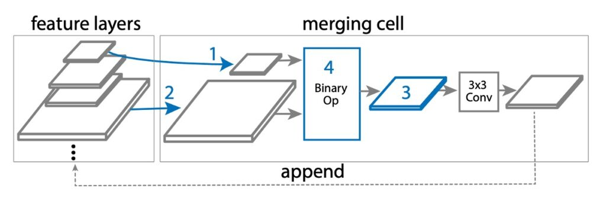
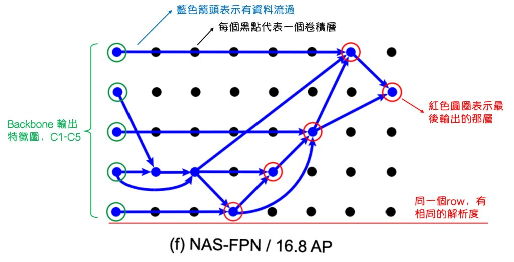
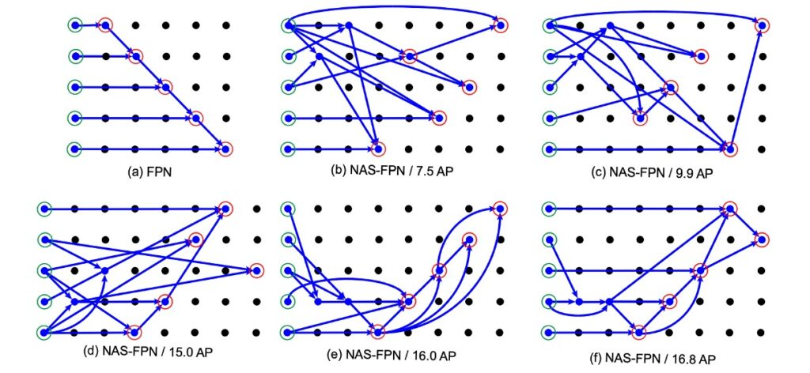

## お金があれば自由だ

[**NAS-FPN: Learning Scalable Feature Pyramid Architecture for Object Detection**](https://arxiv.org/abs/1904.07392)

---

FPN が提案された後、特徴融合は熱心に議論されている問題となり、ここでは時間順にいくつかの論文を列挙してみます：

- **2017.01** -> [DSSD : Deconvolutional single shot detector](https://arxiv.org/abs/1701.06659)
- **2017.07** -> [RON: reverse connection with objectness prior networks for object detection](https://arxiv.org/abs/1707.01691)
- **2017.07** -> [Deep layer aggregation](https://arxiv.org/abs/1707.06484)
- **2017.09** -> [StairNet: top-down semantic aggregation for accurate one shot detection](https://arxiv.org/abs/1709.05788)
- **2017.11** -> [Single-shot refinement neural network for object detection](https://arxiv.org/abs/1711.06897)
- **2018.03** -> [Path Aggregation Network for Instance Segmentation](https://arxiv.org/abs/1803.01534) (< PANet がここに)
- **2018.08** -> [Scale-transferrable object detection](https://ieeexplore.ieee.org/document/8578160)
- **2018.08** -> [Deep feature pyramid reconfiguration for object detection](https://arxiv.org/abs/1808.07993)
- **2018.10** -> [Parallel feature pyramid network for object detection](https://link.springer.com/chapter/10.1007/978-3-030-01228-1_15#chapter-info)

その中でもよく耳にするのは PANet ですが、上記のいくつかの論文も数百から千回以上の引用があり、時間があればそれらを読むこともできます。

さて、どれを選ぶべきでしょうか？

Google もこの問題に興味を持ち、彼らはこの論文を提案しました：NAS-FPN。

その核心概念を探ってみると、こうです：「どれが良いか分からないから、アルゴリズムを使って…」

- **一発検索しよう！**

:::tip
え、違う？この結論は少しおかしい？

実際、これが Google らしいやり方です。

例えば、以前の NasNet シリーズはネットワークアーキテクチャを検索して最終的にもう一つの論文、EfficientNet が整理されました。これもご存じかもしれません。

ネットワークアーキテクチャだけでなく、チップ設計も NAS を使えます。現在では特徴融合にも NAS を使用しているわけで、実際には非常にシンプルな操作です。
:::

## NAS とは？

NAS は神経アーキテクチャ検索（Neural Architecture Search）の略で、深層学習の分野で重要な研究方向の一つです。主な目的は、特定のタスクを解決するための最適な神経ネットワークアーキテクチャを自動的に見つけることです。神経ネットワークアーキテクチャは、通常、複数の層、ニューロン、および接続から構成され、これらのアーキテクチャの設計がモデルの性能に大きな影響を与える可能性があります。

従来、神経ネットワークの設計は通常専門家によって行われ、多くの実験と調整が必要です。これは時間がかかり、専門知識を要するプロセスです。NAS の目的は、このプロセスを自動化し、機械に最適な神経ネットワークアーキテクチャを探索・発見させることです。

NAS では、検索空間が定義され、この検索空間にはすべての可能な神経ネットワークアーキテクチャの変種が含まれます。そして、遺伝的アルゴリズム、強化学習、進化的アルゴリズムなどの異なる検索戦略を使用して、システムは自動的にこれらのアーキテクチャを生成・評価・選択し、特定のタスクで最良のパフォーマンスを発揮するアーキテクチャを見つけます。

一般的に、NAS の長所と短所は次の通りです：

### 長所

- **自動化**：最適な神経ネットワークアーキテクチャを自動的に探索でき、人工での調整や設計の作業量を削減し、時間とリソースを節約できます。
- **最適化**：特定のタスクやデータセットに対して最適なネットワーク構造を見つけ、モデルの性能を向上させ、場合によっては人工設計されたモデルを超える可能性があります。
- **柔軟性**：特定のタスクやアーキテクチャに限定されず、さまざまなアプリケーションシーンに適応でき、特定のニーズに合わせたモデルを生成できます。
- **革新性**：新しい神経ネットワーク構造を発見するのに役立ち、革新的なモデルアーキテクチャが生まれる可能性があります。これにより深層学習の発展が進みます。

### 短所

- **計算リソースの消費**：検索プロセスには大量の計算リソース（GPU や TPU）が必要で、多くの時間もかかります。これが実際のアプリケーションに制約を与える場合があります。
- **複雑さ**：検索空間の大きさと可能な組み合わせの数が膨大で、検索プロセスが非常に複雑になる可能性があり、効果的な検索を行うために高度なアルゴリズムや技術が必要です。
- **データセット依存**：見つかった最適なアーキテクチャは、使用するデータセットに強く依存する可能性があり、他のデータセットでは必ずしも良い結果を出すわけではありません。
- **ランダム性**：検索プロセスにはランダム性が含まれており、異なる検索実行で異なる結果が得られる可能性があります。これにより、結果の安定性が課題となることがあります。

## 実際は短所が多い

NAS の長所と短所を見た後、柔軟性と革新性に非常に興味があるかもしれませんが、実際には 90%以上の業界関係者が自分の検索システムを構築するためのリソースを持っていません。通常、この技術の成果を利用することになりますが、次の問題がすぐに発生します：

- **私の使用シナリオは論文と同じですか？**

ここでの使用シナリオには、推論データの特徴分布、訓練データの特徴分布、解決すべき問題の検索空間などが含まれます。もし答えが「いいえ」なら、最適化されたアーキテクチャは、おそらく、もしかしたら、あなたのケースには…

- **適していないかもしれません。**

この論文で何を言おうとしているのか？

まず、私たちもその 10%の人々かもしれません。そして、この論文はどのように検索アーキテクチャを設計し、自分の使用シナリオに最も適した特徴融合方法を見つけるかを示しています。次に、この論文は自動検索後の結果を示し、これらの結果が私たちの設計にインスピレーションを与えてくれるかもしれません。

## 解決策

### NAS-FPN モデル設計

この研究の主な目的は、より良い FPN アーキテクチャを見つけることです。学術界で一般的に使用される言葉では、モデルの最初に基本的なアーキテクチャ（Backbone）があり、これを自由に変更できます。例えば、ResNet や MobileNet などです。

次に FPN 部分は通常「Neck」と呼ばれ、ここでは多尺度の特徴接続が行われます。これが今議論している範囲です。

ちなみに、Neck の後ろには解決すべき問題が続き、それは「Head」と呼ばれます。

日常の作業環境では、エンジニアは通常、この 3 つの部分を中心に変更、テスト、関連するディスカッションを行います。

この研究では、著者は「RetinaNet」というアーキテクチャをベースに使用しました。RetinaNet の Backbone は ResNet を使用し、Neck は FPN を採用しています。

:::tip
RetinaNet の論文の主題は実際には FocalLoss で、RetinaNet アーキテクチャは FocalLoss の適用のために簡単に組み合わせられたものです。
:::

### マージングセル（Merging Cell）

NAS-FPN では、元々の FPN 設計を基に、「マージングセル」という新しい概念を提案しています。

マージングセルは、小さなモジュールで、2 つの異なる入力特徴層を「結合」して新しい出力特徴層を作成します。この結合プロセスには以下の手順が含まれます：

1. 最初の特徴層を選択します：複数の候補特徴層（C3、C4、C5 など）から 1 つを選び、これを hi と呼びます。
2. 次の特徴層を選択します：再度複数の候補特徴層から 1 つを選び、これを hj と呼びます。
3. 出力特徴のサイズを決定します：結合後の新しい特徴層のサイズとなる解像度を選びます。
4. 結合操作を選択します：特定の数学的操作（加算やグローバルプーリングなど）を使用して hi と hj を結合します。

手順 4 では、検索空間で 2 つの二項演算が設計されています：加算とグローバルプーリングです。これらを選んだ理由は、簡単で効率的であり、追加の学習可能なパラメータを追加しないからです。

もし hi と hj のサイズが異なる場合、結合前にアップサンプリングまたはダウンサンプリングを使ってサイズを一致させます。結合後、新しい特徴層は ReLU 活性化関数、3×3 の畳み込み層、BatchNorm 層を経て、その表現能力が強化されます。これにより、FPN は複数のマージングセルを通じて特徴層を結合・改善し、最終的により優れた多尺度特徴層（P3、P4、P5 など）を生成します。

## 討論

実験データによると、訓練ステップが増えるにつれて、コントローラーはより良いサブネットワークアーキテクチャを生成できるようになります。このプロセスはおおよそ 8000 ステップ後に安定状態に達します。つまり、新たに生成されたユニークなアーキテクチャの数は収束し始めます。

最終的に、報酬最適化結果に基づいて、著者は AP スコアが最も高いアーキテクチャを選び、さらなる訓練と評価を行いました。

このアーキテクチャは、最初の 8000 ステップでサンプリングされ、その後の実験で何度もサンプリングされました。

次に、著者は NAS アルゴリズムで得られた FPN アーキテクチャを示しました：

この図は複雑に見えますが、理解しにくいけれども、すごい感じがします。

実際には、注釈を加えたら次のように簡単に理解できます：

注釈後、NAS-FPN の結果をよく見ることができます。

最初に(a)の FPN は本物の FPN ではなく、「類 FPN」です。出力特徴マップの方法やデータフローの順序は FPN に似ていますが、元の FPN 内部にはこれほど多くの畳み込み層はありません。

次に、NAS-FPN の実験結果を見ると、(b) -> (f)の順に AP スコアが向上し、検索アーキテクチャの方法が最終的に PANet の設計理念が正しいことを検証しています。図(f)では次のようになります：

- データは上から下に融合しなければならない
- データは再度下から上に融合しなければならない
- 細かい部分は少し異なるかもしれませんが、意味は伝わっていれば良いのです。

## 結論

これまでの研究では、特徴融合アーキテクチャは多くが人工的に設計され、実験によって得られました。この方法の信頼性と規模には常に疑問の声が上がっています。

実際、実験的な研究はある程度の洞察を提供できますが、その価値は実験の規模や設計に依存することが多いです。

結論として、「理論的根拠」が不足している可能性がある結論を受け入れ、「実験」で得られた結果を受け入れることはできます。

しかし、これらの文献を他人に「実験」の規模が十分であると納得させる方法は？

＊

ここで、NAS-FPN は精密な検索アーキテクチャと前代未聞の計算規模を通じて（おそらく他の企業よりも多くの資金があり、この計算を行うことができる）、この問題に新しい視点を提供しました。

これにより、PANet の設計理念が正しいことが確認され、接続方法に潜む非効率的な問題が明らかになりました。

この NAS によって得られた結合方法は、先行研究の信頼性を高め、今後の研究に新たな方向を提供するでしょう。
