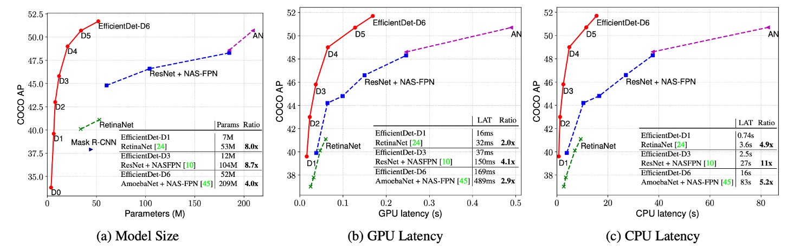

# [19.11] EfficientDet

## BiFPN こそが本体

[**EfficientDet: Scalable and Efficient Object Detection**](https://arxiv.org/abs/1911.09070)

---

約半年前、Google は NAS-FPN を提案しましたが、どうやら社内の他の人々はこれが良い方向だとは思わなかったようです。

そのため、彼らは NAS-FPN から得られた検索結果を完全に捨て、FPN を基にして新たに特徴融合モジュールを再設計し、それを BiFPN と名付けました。

## 問題の定義

FPN という革新的な作業は、発表されて以来、さまざまな物体検出タスクに広く適用されています。

その後、さまざまな変種や改善方法が提案されてきましたが、大まかな進展の軌跡を以下の図で見ることができます：

最左端の FPN から始まり、異なる解像度の特徴マップで特徴融合を行い、最深部の特徴マップからアップサンプリングして、再び浅い特徴マップに加算する流れです。

その後、PANet は単純に 1 本の線を加えるだけでは不十分だと考え、新たにもう 1 本のラインを加えて、さらに一度下採樣を行い加算するという方法を提案しました。この方法の目的は、最も浅い層から最も深い層への特徴融合ショートカットを構築し、モデルが異なる層の特徴をより良く利用できるようにすることです。

- [**[18.03] PANet: 給我一條捷徑**](../1803-panet/index.md)

次に NAS-FPN が自動検索の方法を提案し、多層の特徴融合構造を計画してモデルが最適な特徴融合方法を自動的に見つけ出すという方法を取りました。しかし、この方法の欠点も明白で、それは説明可能性や制御の難しさです。

- [**[19.04] NAS-FPN: 有錢就是任性**](../1904-nasfpn/index.md)

そのため、この論文では、同じく Google の著者が NAS の方法を考慮せず、PANet の利点に立ち返り、以下の 2 点に重点を置いています：

- **特徴融合は単純に加算するだけではなく、特徴の重要性を考慮して加重して加算するべきである。**
- **FPN の層数はモデルの規模に応じてスケーリングすべきである。**

## 解決策

### モデルアーキテクチャ

著者は BiFPN の有効性を示すために、RetinaNet というクラシックな物体検出モデルを選び、FPN の特徴融合モジュールを BiFPN に変更しました。

上の図で最左端は Backbone で、これは本文の重点ではありません；最右端は Head で、これも本文の重点ではありません。私たちは中間の BiFPN に集中する必要があります。

この設計は PANet を基にしていくつかの改善が施されています。これを小さな絵で描いてみましょう：

1. **クロススケール接続：**

   PANet から改善が始まり、ここではクロススケール接続が追加され、各接続に対して「加重」加算が行われます。したがって、各ノードには新しい重みパラメータが追加されます。

   

2. **低貢献ノードの削除：**

   上の図を見てください。最深部に 1 つの接続しかないノードがあり、これは明らかに非効率的です。削除してしまったほうが良いでしょう。また、最浅層のノードはそれ以上上層の特徴を受け取る必要がないため、2 つのノードは機能が重複しており、これも削除できます。

   

これら 2 つのステップを完了すると、BiFPN の構造が得られます。

著者はこの構造を「モジュール」と見なしており、この単位で複数の層を積み重ねることができます。これにより、モデルの規模が大きくなるにつれて、さらに多層の特徴融合が可能になります。

:::tip
元の PANet ではこの概念は示されていませんでした。彼らは 1 層のアップサンプリングと 1 層のダウンサンプリングしか行っていませんでした。しかし、モジュールスタッキングの概念を導入することで、FPN と PANet 両方にこのスタッキング操作を適用することができ、これによりモデルの性能が向上します。
:::

### モデルスケーリング

新しいアーキテクチャに加えて、著者は EfficientNet のアイデアを踏襲し、モデルスケーリングの概念を提案しました。

その意味は、Backbone がスケーリングできるのであれば、FPN もスケーリングできるべきだということです。これにより、さまざまな規模のモデルにうまく適応できます。実験を通じて、上の表では異なる規模のモデルに対する BiFPN のスケーリング構成を示しており、モデルの規模が大きくなるにつれて、BiFPN の層数とチャネル数が増加していることがわかります。

### 加重平均

最後に、著者は加重特徴マップの重みをどのように設計するかについて議論しました。

論文では、3 つの設計方法が提案されています：

1. 無制約融合：重みに制約をかけず、モデルに学習させますが、結果は非常に不安定であり、そのため後続では議論しません。
2. Softmax 融合：重みを Softmax 計算で処理し、重みの合計が 1 になるようにします。
3. ReLU 制限：重みを ReLU 計算で処理し、正の値にし、その後、重みの合計を 1 に制約します。

上の図では、著者は 2 番目と 3 番目の実験結果を示しており、ReLU と Softmax の効果は一致していますが、ReLU の方が 30%速かったため、著者はこの設計方法を推奨しています。

## 討論

### COCO でのパフォーマンス

著者は COCO 2017 検出データセットを基に実験を行い、118,000 枚の訓練画像を使用しました。

訓練中、著者は確率的勾配降下法（SGD）最適化器を使用し、モメンタムは 0.9、重み減衰は 4e-5 に設定されました。学習率は初期サイクルで 0 から 0.16 まで線形に増加し、その後コサイン減衰規則を用いてアニーリングが行われました。また、各畳み込み操作後に同期バッチ正規化が導入され、バッチ正規化の減衰係数は 0.99、epsilon 値は 1e-3 に設定されました。

モデルは SiLU（Swish-1）を活性化関数として使用し、安定性を高めるために、指数移動平均の減衰係数 0.9998 を適用しました。訓練中、著者は焦点損失関数を使用し、α は 0.25、γ は 1.5 に設定されました。データ拡張戦略には水平反転とスケーリングのジッターが含まれており、画像のサイズは元のサイズの 0.1 倍から 2.0 倍にランダムに調整されました。また、評価過程ではソフト NMS（非極大値抑制）が使用されました。

訓練リソースについて、著者は EfficientDet-D0 から D6 モデルを 32 個の TPUv3 コアで 300 サイクル訓練し、EfficientDet-D7 および D7x モデルは 128 個の TPUv3 コアで 600 サイクル訓練し、バッチサイズは 128 に設定されました。

実験結果は、EfficientDet が異なる精度とリソース制限のもとで優れた効率を示すことを示しています。以前の検出器と比較して、EfficientDet モデルはサイズを 4〜9 倍縮小し、FLOPs（浮動小数点演算回数）は 13〜42 倍減少しました。特に、EfficientDet-D0 は YOLOv3 と同等の精度を維持しつつ、FLOP 数は 28 倍減少しました。RetinaNet や Mask-RCNN と比較して、EfficientDet は同様の精度を保ちながら、パラメータ数は 8 倍、FLOP は 21 倍減少しました。

高精度設定では、EfficientDet-D7x はテスト開発セットで 55.1 AP を達成し、既存技術を大きく上回り、精度が 4 AP 向上した一方で、効率は 7 倍向上しました。また、著者は Titan-V FP32、V100 GPU FP16、およびシングルスレッド CPU での推論遅延を比較し、V100 の推論遅延には端対端の前処理と後処理が含まれており、EfficientDet の推論速度の優位性を示しました。

## 結論

従来の FPN アーキテクチャと比較して、BiFPN は選択的加重と軽量化設計により、計算コストを大幅に増加させることなく、より良い多尺度特徴融合効果を実現しました。

:::tip
シンプルで使いやすい、実装モデルの良きパートナーとして、ここで試してみることをお勧めします。

- [**docsaidkit/torch/neck/bifpn**](https://github.com/DocsaidLab/DocsaidKit/blob/main/docsaidkit/torch/neck/bifpn.py)
  :::
