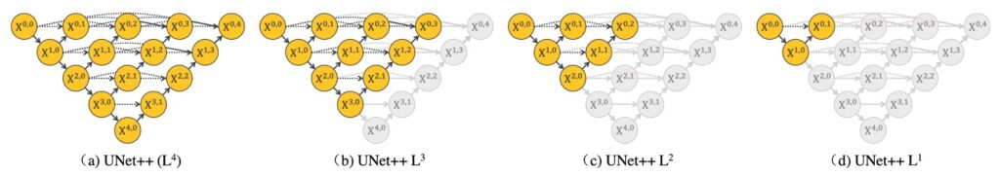

## 微妙なウェブスピナー

[**UNet++: Redesigning Skip Connections to Exploit Multiscale Features in Image Segmentation**](https://arxiv.org/abs/1912.05074)

---

この論文の著者は、U-Net を出発点として、元の U-Net アーキテクチャの設計問題を探求しています。

著者の言葉をそのまま引用すると：

> 「この三年間動かなかったトポロジー構造に本当に問題がないのでしょうか？」
>
> Excerpted from [**研習 U-Net**](https://zhuanlan.zhihu.com/p/44958351)

著者は、U-Net が問題を抱えているだけでなく、問題が多すぎると考えています。

## 問題の定義

一般的な U-Net の深さは 5 層のダウンサンプリングであり、上の図の(d)のように表現されます。

なぜ 3 層ではなく、7 層でもないのでしょうか？ネットワークの設計はどれほど深くすべきなのでしょうか？

多くの深層学習の応用において、ネットワークの深さは通常、性能と学習能力に直接的な影響を与える重要なパラメータです。

この問題の各側面をさらに探ってみましょう：

1. **特徴表現能力**

   ネットワークの深さは、その特徴表現能力を決定します。簡単に言うと、深いネットワークは通常、より複雑で抽象的な特徴を学習することができます。画像分割、物体検出、分類などのタスクにおいて、この抽象的な特徴を獲得する能力は非常に重要です。浅いネットワークは、より単純で局所的な特徴しかキャッチできません。

2. **計算複雑度**

   ネットワークの深さが増すと、計算の複雑度とパラメータの数は急激に増加します。これにより、訓練と推論の時間コストが増大するだけでなく、計算リソースも大量に必要となります。リソースが限られている場合、適切なネットワーク深度を見つけることは課題です。

3. **過学習と汎化能力**

   深いネットワークは通常、モデルの複雑度が高くなるため、特にデータが少ない場合には過学習を引き起こしやすくなります。一方で、浅いネットワークは汎化能力が高いことが多いですが、表現能力が犠牲になることがあります。

4. **最適化の難易度**

   ネットワークの深さを 100 層にすることは可能です（もし画像が十分大きければ）が、ネットワークが深くなるにつれて、パラメータの最適化がどんどん難しくなります。例えば、勾配消失や勾配爆発といった問題が発生する可能性があり、それを解決するためには特定の初期化方法や最適化手法が必要となります。

5. **理論と実際**

   理論的には、深いネットワークは少ないノード数と計算量で同じ関数を表現できますが、実際には適切なネットワーク深度を見つけることは容易ではありません。深すぎても浅すぎても、特定のタスクをうまくこなせない可能性があります。

6. **データセットとタスクの特性**

   異なるデータセットやタスクには異なるネットワークの深さが必要です。複雑なパターンを捉えるために深いネットワークが必要なタスクもあれば、そこまで深くないネットワークで十分なタスクもあります。

7. **可解釈性とデバッグの難しさ**

   ネットワークが深くなると、モデルの可解釈性が低下する可能性があり、モデルの挙動を理解してデバッグすることが難しくなります。

「どれほど深いか？」という問題を掘り下げて研究することで、ネットワークの深さが深層学習モデルの性能や効果にどのように影響するか、そして具体的な実践で合理的な選択と設計をどのように行うかをより良く理解できるようになります。

## 解決策

### UNet++ モデル設計

画像分割などの問題を扱う際、理想的な状況は、ネットワークが異なる深さの特徴を十分に学習し、画像データをより良く理解し処理できることです。

著者はこの問題に関して、異なる深さの特徴をより良く統合し、ネットワークの性能を最適化するためのいくつかの独創的なネットワーク構造設計を提案しています。

以下は、いくつかの核心的な設計思想とアプローチです：

1. **統一構造（U-Net）**

   - 目的：ネスト型 U-Net の統一構造を定義すること
   - この設計では、異なる深さの U-Net を統一されたアーキテクチャで統合します。この構造では、すべての U-Net が少なくとも部分的に同じエンコーダを共有し、それぞれ独自のデコーダを持っています。この設計により、異なる深さのデコーダが同じネットワーク構造の下で独立して動作できるようになり、異なる深さがネットワークの性能に与える影響を観察し比較するための特殊な視点を提供します。

2. **U-Net アップグレード版（UNet+）**

   - 目的：長接続が有効かどうかを検証する対照群
   - この設計は U-Net の進化版で、元々の長いジャンプ接続を放棄し、隣接するノードを短いジャンプ接続で結びつけています。この設計により、深いデコーダが浅いデコーダに監督信号を送ることができ、より良い情報伝達と特徴統合が実現します。この設計は、異なる深さのデコーダ間の協力がネットワーク全体の性能にどう影響を与えるかを探求することを目的としています。

3. **U-Net 進化版（UNet++）**
   - 目的：長接続が有効かどうかを検証する実験群
   - UNet++は U-Net の進化版で、デコーダを接続することによって密な接続を持つジャンプ接続を実現しています。この設計により、ジャンプ接続を通じて密な特徴の伝播が可能となり、より柔軟な特徴融合が実現します。UNet++は、異なる深さによる課題に対応するために、1 つの統一された構造でより柔軟で効率的な特徴抽出と融合を実現しようとしています。

これらの設計を通じて、著者は元々の U-Net アーキテクチャの利点を保持しつつ、ネットワーク深さ選択の問題を可能な限り解決し、異なる深さの特徴を統合することによって、画像分割タスクなどでの性能を向上させることを目指しています。

もちろん、このアーキテクチャ設計が突然こうなったわけではなく、途中で著者の考えや変更がありました。その過程に関する詳細は、著者自身が書いた記事に記載されています。

## 討論

上記の内容について、いくつかの問題について議論します：

### 単なるパラメータの増加に過ぎないのか？

著者はこの疑問に対して実験を設計し、元の U-Net の幅を UNet++と同等のパラメータ数にした結果を比較しました。この操作は少し荒っぽかった（著者曰く）ものの、結果としてパラメータを単純に増やしただけでは次の結果になりました：

- **特に顕著な改善はありませんでした。**

深層学習では、通常、パラメータが多いほどモデルの表現能力が高くなりますが、これが必ずしも良い結果を生むわけではありません。過剰なパラメータは過学習を引き起こす可能性があり、特にデータが少ない場合に問題となります。また、パラメータが増えると、計算や記憶のリソースも大幅に増加し、これも望ましくない場合があります。UNet++はネットワーク構造の最適化を通じて、単純にパラメータを増加させることなく、最適なパラメータ利用を実現しました。

### 深度監督とモデル剪枝

深層学習のネットワーク構造を探求する際、特に画像分割タスクにおける U-Net アーキテクチャでは、深度監督（Deep Supervision）とモデル剪枝（Model Pruning）という概念が非常に重要です。これらの技術は、ネットワークの学習効率を高め、精度を保持しながらモデルの規模を大幅に削減することができ、特にリソースが制限された環境、例えばモバイルデバイスなどで推論を加速させるのに役立ちます。

1. **深度監督（Deep Supervision）**

   

   深度監督の核心的なアイデアは、ネットワークの異なる段階で追加の損失関数を導入し、浅いネットワーク構造であっても効果的に勾配更新を得られるようにすることです。各層のサブネットワークに補助的な損失を加えることで、U-Net の各段階が明確な監視信号を受け取ることができ、全体的なネットワークの学習を促進します。U-Net++アーキテクチャでは、さらに深度監督を加えることで、各サブネットワークの出力を画像の分割結果として扱い、勾配消失の問題に対処する自然で直接的な解決策を提供します。

2. **モデル剪枝（Pruning）**

   

   モデル剪枝は、モデルの規模を効果的に削減する技術の一つです。各サブネットワークの検証セットでの性能を評価することで、精度を損なうことなく冗長なネットワーク構造を削除することができます。推論段階では、実際の必要に応じて適切なネットワークの深さを選択し、性能と計算コストのバランスを取ることができます。

   UNet++構造とモデル剪枝の概念について議論した後、その実行可能性と重要性について次のように分析できます：

   - **実行可能性**

     - 深度監督と多層出力：UNet++構造は深度監督を通じて多層出力を持っており、これにより各サブネットワークが独立して画像の分割結果を出力できます。この設計により、各サブネットワークのパフォーマンスを個別に評価でき、剪枝の基盤を提供します。
     - モデル剪枝：テスト段階では、いくつかのサブネットワークが満足のいく結果を出せば、他のサブネットワークを剪枝しても、前段階のサブネットワークの出力には影響しません。ただし、訓練時には剪枝された部分が逆伝播において重要な役割を果たし、これらが訓練過程での重みの更新に寄与します。この設計により、ネットワークの性能を維持しながら剪枝を行うことが可能になります。

   - **重要性**

     - 計算効率とリソース使用：剪枝を行うことで、モデルのサイズは大幅に削減されます。例えば、L2 層の出力が十分に満足であれば、多くのパラメータを剪枝することができ、計算と記憶の要求を大幅に減らすことができます。これは、リソースが制限された環境（例：モバイルデバイス）でモデルを運用する際に非常に重要です。
     - 加速：剪枝されたネットワークは推論速度を劇的に向上させることができます。例えば、L4 を L2 に置き換えることで処理速度が 3 倍向上する可能性があります。これは即時またはほぼ即時の応答が求められるアプリケーションにとって非常に重要です。
     - 柔軟なネットワーク構造：合理的な剪枝により、UNet++は柔軟なネットワーク構造を提供し、タスクの要求やデータセットの難易度に応じてネットワークの深さを調整し、性能と効率のバランスを達成します。

   - **精度とモデルサイズのバランス**

     - データセットの難易度とネットワーク深さの関係により、剪枝を行うことで、より簡単なデータセットには小さなモデルを使用しつつ、精度を維持することができます。この設計により、UNet++は高い精度を維持しながら、モデルのサイズと計算コストを削減することができます。

   UNet++アーキテクチャの実装において、深度監督とモデル剪枝を適用することで、良好な分割性能を維持しつつ、モデルのパラメータ数を大幅に削減しました。これにより、モデルはモバイルデバイスでの実行効率を高め、ネットワーク設計の柔軟性と調整可能性に新たな視点を提供しています。

## 結論

UNet++における深度監督とモデル剪枝の実装を通じて、画像分割タスクの最適化におけるこの手法の潜在能力が観察されました。

深度監督はモデルが異なるネットワーク層でより良い特徴表現を得られるようにし、剪枝は性能を保持しながら計算と記憶の要求を削減する効果的な方法を提供します。これはリソースが制限されたシナリオにおいて特に重要です。

ただし、エンジニアリングの観点から見ると、これらの手法にはいくつかの課題もあります：

最も直感的なのは、剪枝の程度が検証セットのパフォーマンスに依存しており、これがモデルのパフォーマンスの不安定さを引き起こす可能性があることです。適切に剪枝を行わないと、モデルが失敗するリスクもあります。

これらの問題を解決するための一つの方向性は、適応的剪枝戦略を採用し、異なる段階で剪枝の程度を動的に調整したり、複数目的の最適化方法を探求して精度と効率のバランスを取ることです。また、クロスデータセット検証や転送学習技術を使用して、モデルの汎化能力と安定性を向上させる方法も考えられます。

実際の運用において、深度監督とモデル剪枝の実施はネットワーク設計と訓練の複雑さを増し、エンジニアは剪枝戦略を調整して検証するために追加の時間とリソースを投入する必要があり、開発サイクルが延長する可能性もあります。

この論文は特徴融合の最適化方法について新しい視点を提供しますが、一定の技術的難易度も伴うため、さらなる研究と実践を通じて解決すべき課題があります。この研究が研究者の仕事に有益な参考と洞察を提供できることを願っています。
