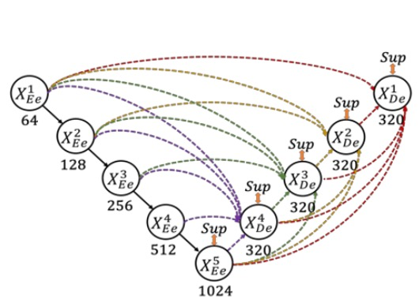

## 設計変更 UNet++

[**UNet 3+: A Full-Scale Connected UNet for Medical Image Segmentation**](https://arxiv.org/abs/2004.08790)

---

これは医療分野における論文で、目的は医療画像のセグメンテーションです。

著者は UNet++ の構造を改良するアイデアを思いつきましたが、「UNet+++」という名前では研究者の美的感覚が表現できないと感じました。

そこで「UNet 3+」に名前を変更しました！

## 問題の定義

U-Net と言えば、誰もがよく知っている構造で、次のようになっています：

<figure style={{"width": "50%"}}>

</figure>

この古典的な構造は、スキップ接続を使って高次の意味情報と低次の詳細情報を結びつけ、医用画像のセグメンテーションなどで顕著な成果を上げてきました。

しかし、いくつかの問題があります。まず、多尺度特徴は段階的なダウンサンプリングとアップサンプリングの過程で希薄化し、モデルが異なる尺度の情報を十分に活用できず、セグメンテーション精度を向上させることができません。次に、従来の UNet のスキップ接続は、意味的に不一致な高層と低層の特徴を直接融合し、パフォーマンスの低下を引き起こします。

そこで、UNet++はネストされた密なスキップ接続を通じてこの意味的なギャップを減らし、全体の構造を次のように変更しました：

<figure style={{"width": "50%"}}>

</figure>

しかし、この論文の著者は、この構造には冗長な接続が多すぎて効率が不足していると考えました！

接続方法を変更するべきだと考えています。

## 解決方法

### モデル構造

<figure style={{"width": "50%"}}>

</figure>

ここで著者は UNet のダウンサンプリング層をエンコーダ（encoder）、アップサンプリング層をデコーダ（decoder）として定義しています。UNet 3+では、著者はエンコーダとデコーダの間のスキップ接続を再設計し、多尺度特徴をより完全に統合できるようにしています。

上図のように、各デコーダ層は、より小さい尺度のエンコーダ特徴、同尺度のエンコーダ特徴、およびより大きい尺度のデコーダ特徴を同時に統合し、特徴の集約を行います。

同一のデコーダ層で、これら 5 つの同じ空間解像度を持つ特徴を集めた後、チャンネル数を統一し、それらを接続し、1 層の畳み込み + BN + ReLU を経て特徴の集約を完了させ、最終的に分割予測結果を直接出力します。そして、真値と対応する監督を行い、この論文では「全尺度の深層監督」と呼ばれています。

### 損失関数

器官の境界を強調するために、著者は多尺度構造的類似度（Multi-scale Structural Similarity、MS-SSIM）を損失関数の 1 つとして導入しました。

直感的に、MS-SSIM は局所的なブロック（patch）の類似度を比較するもので、境界部分での分割結果が真値と大きく異なる場合、MS-SSIM は高いスコアを得て、訓練中に大きなペナルティが与えられます。

数学式は以下の通りです：

$$
\ell_{\text{ms-ssim}}(p,g)
= 1 - \prod_{s=1}^S
\Biggl(
  \frac{2\mu_p^s \mu_g^s + c_1}{(\mu_p^s)^2 + (\mu_g^s)^2 + c_1}
\Biggr)^{\alpha_s}
\Biggl(
  \frac{2\sigma_{pg}^s + c_2}{(\sigma_p^s)^2 + (\sigma_g^s)^2 + c_2}
\Biggr)^{\beta_s}
$$

- $p$ と $g$ はそれぞれ分割結果と真値を示し、$p$ と $g$ の局所ブロックサイズは $N \times N$ です。
- $\mu_p^s, \mu_g^s$ は第 $s$ 層尺度での $p$ と $g$ の平均、$\sigma_p^s, \sigma_g^s$ は標準偏差、$\sigma_{pg}^s$ は両者の共分散です。
- $\alpha_s, \beta_s$ は異なる尺度での輝度とコントラスト（または類似度評価）の重みを制御します；$c_1=0.01^2, c_2=0.03^2$ は分母がゼロになるのを防ぐためのスムージング項です。
- 実験では 5 層尺度 (S=5) が使用されました。

MS-SSIM の値が大きいほど、類似度が高いことを意味し、対応する損失関数は小さくなります。

著者は MS-SSIM 損失、Focal 損失、および IoU 損失を組み合わせ、ピクセルレベル、パッチレベル、マップレベルの三層損失を得ました：

$$
\ell_{\text{seg}}
= \ell_{\text{focal}}
+ \ell_{\text{ms-ssim}}
+ \ell_{\text{iou}}
$$

この組み合わせにより、「ピクセル単位の誤差」、「局所領域の構造的類似度」および「全体画像の領域重なり率」を同時に考慮し、より良いセグメンテーション性能を達成しています。

### Classification-guided Module (CGM)

<figure style={{"width": "80%"}}>

</figure>

一般的な医用画像セグメンテーションでは、入力画像に対象器官が含まれていないにもかかわらず、「偽陽性」の誤ったセグメンテーションが発生する可能性があります。

このような状況を避けるために、著者は「追加の分類タスク」を通じてセグメンテーションモデルを指導する方法を提案しています。まず、画像にその器官が含まれているかを判断し、もし「含まれていない」と判定された場合、最終的な出力は空白のセグメンテーション結果とすることが求められます。もし「含まれている」と判定された場合のみ、セグメンテーション結果を保持します。

具体的な方法は、上図のように、まずエンコーダの最終層 $E^i_5$（最も深い層で、最も強い意味情報を持つ）に簡単な分類ネットワークを接続します。これをドロップアウト、畳み込み、最大プーリングを経て、sigmoid を通してサイズが 2 のベクトル（「器官あり / 器官なし」の確率）を出力します。

最終的に、推論段階で argmax を用いて 2 クラス分類結果を取得し、単一の 0 または 1 を得ます。この 0/1 の結果は、デコーダ各層のセグメンテーション画像と掛け合わせて使用されます。もし分類結果が 0（器官なし）であれば、セグメンテーション結果はクリアされ、1（器官あり）の場合は元のセグメンテーション画像が保持されます。

### 実験設定

著者は 2 つの器官を対象に検証を行いました：肝臓（liver）と脾臓（spleen）。

研究では、一般的で認知された挑戦的な LiTS 肝臓セグメンテーションデータセットと、病院倫理審査を通過した脾臓の内部データセットを使用し、「器官のサイズや形状の違い」、および「異なる患者間の個体差」など、実際のシナリオを十分に考慮しました。

- **肝臓データセット (LiTS 2017 Challenge)**
  - 合計 131 組の造影剤を使用した 3D 腹部 CT スキャン。
  - 103 組は訓練用、28 組はテスト用。
- **脾臓データセット（病院取得、倫理審査通過）**
  - 合計 49 組の CT スキャン（40 組訓練、9 組テスト）。

訓練を加速させるため、入力画像は 3 つのチャネルを使用します：

- **現在の CT スライス**
- **前のスライス**
- **次のスライス**

これにより、ネットワークは上下隣接するスライスの文脈情報を同時に受け取ることができ、器官の境界をセグメンテーションするのに役立ちます。また、著者は画像を$320 \times 320$のサイズにトリミングしています。

評価指標として**Dice 係数**を使用してセグメンテーションの品質を測定し、各 3D 体積（volume）に対して計算を行っています。

## 討論

### UNet と UNet++との比較

著者は**UNet 3+**を古典的なモデルである**UNet**および改良されたモデル**UNet++**と実験的に比較しました。これらの比較では、すべて**focal loss**を損失関数として使用し、VGG-16 および ResNet-101 の 2 つのバックボーンネットワークでテストを行いました。

上表は著者が肝臓と脾臟データセットで得た実験結果を示しており、次のことがわかります：

- UNet 3+（深層監督なし）は、すでに平均精度で UNet および UNet++を超え、VGG-16 では約 2.7 ポイント、ResNet-101 では約 1.6 ポイントの改善が見られました（2 つの器官データセットで平均）。
- さらに、もし多尺度深層監督（UNet 3+の完全版）を追加すると、異なるサイズの器官（肝臓および脾臟）を処理する際に約 0.4 ポイントの追加改善が得られます。

結果は、多尺度特徴を十分に活用し、深層監督機構を取り入れることで、UNet 3+がより少ないパラメータでセグメンテーションのパフォーマンスを向上させることを示しています。

### SOTA との比較

<figure style={{"width": "70%"}}>

</figure>

著者は**ResNet-101 バックボーン**を持つ UNet 3+を複数の先進的な手法と比較しました。すべての手法はテスト時に「単一モデル」を使用し、「後処理技術」を一切使用しませんでした。

上表の結果は、混合損失関数（ピクセル、パッチ、マップなど異なる階層の最適化）がセグメンテーションのパフォーマンスを大幅に向上させることを示しています。特に**パッチレベルの MS-SSIM 損失**が境界に高い重みを与え、「境界認識（boundary-aware）」効果を改善します。

さらに、CGM は複雑な背景領域での誤ったセグメンテーションを効果的に回避できます。もしモデルがその画像に器官がないと判断した場合、偽陽性を即座に排除できます。

最終的に、UNet 3+は肝臓分割（Dice = 0.9675）および脾臟分割（Dice = 0.9620）で最良の成績を達成し、2 位の手法に対してそれぞれ 0.0334 および 0.0296 高いスコアを記録しました。

### 可視化結果

<figure style={{"width": "80%"}}>

</figure>
<figurecaption>ピンク色の領域はTP、黄色の領域はFN、緑の領域はFP</figurecaption>

---

上図は、ResNet-101 をバックボーンにした UNet、UNet++、および UNet 3+（多尺度深層監督）による肝臓データセットでのセグメンテーション結果を示しています。

観察すると、UNet 3+は器官の位置をより正確に捉え、境界処理においても優れており、境界はより連続的で滑らかです。小さな器官組織や局所的な詳細にも良好なセグメンテーションの一貫性を維持しています。

## 結論

この論文は非常に読みやすく、著者が行ったことは次の通りです：

1. **スキップ接続の再設計**：多尺度特徴を完全に統合し、デコーダ層で深層監督を行う。
2. **MS-SSIM 損失の導入**：局所領域の構造的類似度を強調し、境界認識を促進する。
3. **CGM モジュール**：追加の分類タスクを通じてセグメンテーションモデルを指導し、偽陽性を回避する。

これらの改良により、UNet 3+は肝臓および脾臟のセグメンテーションで最良の成績を収め、他の先進手法よりも少ないパラメータと優れた境界の一貫性を提供しました。
