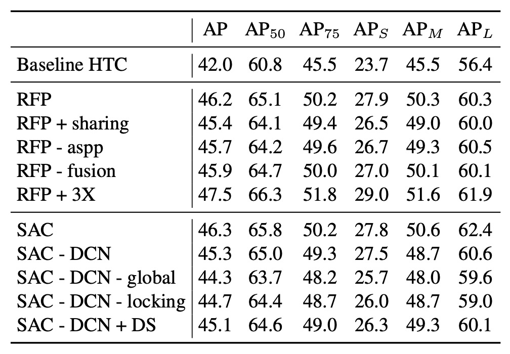

## 再帰的特徴ピラミッド

[**DetectoRS: Detecting Objects with Recursive Feature Pyramid and Switchable Atrous Convolution**](https://arxiv.org/abs/2006.02334)

---

単純に FPN 構造を研究することは、すでに限界に達しているようです。

しかし、Google Research はこのテーマに対して新たな試みをしたいと考えており、バックボーンとネックの設計を統合することで、新しい設計方向を見つけられるかもしれません。

## 問題の定義

これまでの主要な成果である PANet、BiFPN、NAS-FPN などは、すべて FPN を基にした改良であり、ピラミッドの基本構造を壊すことはありませんでした。

しかし、特徴融合の問題は解決されていません。（評価データセットのパフォーマンスはまだ飽和していない。）

より豊富な特徴が必要であり、それによって評価データセットで新たなパフォーマンスを達成できる可能性があります。

:::tip
過去の研究に興味があれば、以下の論文をご参照ください：

- [**[18.03] PANet: 私にショートカットをくれ**](../1803-panet/index.md)
- [**[19.04] NAS-FPN: お金があれば自由だ**](../1904-nasfpn/index.md)
- [**[19.11] EfficientDet: BiFPN こそが本体**](../1911-bifpn/index.md)
  :::

## 問題の解決

### 再帰的特徴ピラミッド

<div align="center">
<figure style={{"width": "90%"}}>

</figure>
</div>

再帰的特徴ピラミッド（Recursive Feature Pyramid、RFP）は、著者が本論文で提案した新しい設計方式です。RFP の「R」は再帰的（Recursive）を意味し、FPN の出力を「再度」バックボーンネットワークに送ることを表しています。

上図の（a）は従来の FPN 構造で、（b）は著者が提案した RFP 構造です。バックボーンネットワークはフィードバックされた特徴を受け取ると、それを再度抽出して融合し、再び FPN の処理を通じて「何度も考え、何度も修正する」効果を得ます。

以前の BiFPN の設計概念を思い出してください。複数の特徴ピラミッドを接続して多尺度の情報を融合することで、「強力なネック」を訓練することが目的でした。一方、RFP では特徴マップをバックボーンネットワークに送るので、「強力なバックボーン」の訓練が目的です。つまり、BiFPN は後段の特徴融合の強化に焦点を当て、RFP はバックボーンに何度も「再度画像を見直す」機会を与えて、全体的な特徴表現能力を向上させることに重点を置いています。

最後に、上図の（c）は、最終的に接続される方法を示しています。N 回目の再帰的特徴マップを最終的な予測ヘッドと残差接続し、再帰的なプロセスを通じて勾配信号を安定的に伝達し、特徴の安定性を維持できるようにしています。

### 空洞畳み込み

次の章に進む前に、前提知識を補足します：空洞畳み込みとは何でしょうか？

空洞畳み込み（Atrous Convolution）は、畳み込みカーネル内に空洞（dilation holes）を挿入する技術で、追加のパラメータや計算量を増やすことなく受容野を拡大することを目的としています。これにより、モデルは「局所的な詳細」と「全体的な情報」の両方に同時に注目することができ、セマンティックセグメンテーションや物体検出などのタスクで特に効果的です。

:::tip
DeepLab シリーズの研究では、空洞畳み込みは特徴抽出に広く使用されています。
:::

標準の畳み込みでは、カーネルの範囲がそのサイズに制限され、広範囲の情報を一度に捉えることはできません。受容野を拡大するために多層の畳み込みを重ねることは可能ですが、計算コストが大きくなります。空洞畳み込みは、畳み込みカーネル内に「間隔」を挿入することで、固定サイズのカーネルがいくつかのピクセルを飛ばし、計算量を増やすことなく受容野を拡大します。

次に、異なる空洞率（Atrous Rate）での 3×3 畳み込みがどのように機能するかを図で見てみましょう：

- **(a) 標準畳み込み（空洞率 = 1）**

  ```bash
  X  X  X
  X  X  X
  X  X  X
  ```

  - 畳み込みカーネルがカバーする範囲が小さく、局所的な詳細を学習するのに適しています。

- **(b) 空洞畳み込み（空洞率 = 2）**

  ```bash
  X  -  X  -  X
  -  -  -  -  -
  X  -  X  -  X
  -  -  -  -  -
  X  -  X  -  X
  ```

  - 各重みの間隔が 1 ピクセル（`-`は飛ばされたピクセル）で、受容野が倍に拡大します。

- **(c) 空洞畳み込み（空洞率 = 3）**

  ```bash
  X  -  -  X  -  -  X
  -  -  -  -  -  -  -
  -  -  -  -  -  -  -
  X  -  -  X  -  -  X
  -  -  -  -  -  -  -
  -  -  -  -  -  -  -
  X  -  -  X  -  -  X
  ```

  - 各重みの間隔が 2 ピクセルで、さらに受容野が拡大します。

空洞率$r$を調整することで、モデルは異なるスケールの特徴を柔軟に学習でき、セマンティックな理解能力を向上させることができます。

### 切替可能な空洞畳み込み

切替可能な空洞畳み込み（Switchable Atrous Convolution、SAC）は、著者が本論文で提案したもう一つの重要な設計で、目的は同じ畳み込みカーネルが異なる空洞率の間で「動的に切り替わる」ことです。

SAC の構造は以下の図に示されています。これには三つの主要部分が含まれています：

<div align="center">
<figure style={{"width": "90%"}}>

</figure>
</div>

1. 前段の**Global Context**モジュール（左側の Pre-Global Context）
2. 中央の**SAC 主体**
3. 後段の**Global Context**モジュール（右側の Post-Global Context）

Global Context 部分は一旦置いておき、SAC 主体の設計を見てみましょう：

著者は$\text{Conv}(x, w, r)$を、入力$x$に対して重み$w$と空洞率$r$で作用させた畳み込み演算を表し、出力を$y$とします。

普通の 3×3 畳み込みを SAC に変換するための数学式は以下のように表されます：

$$
\underbrace{\text{Conv}(x,\, w,\, 1)}_{\text{標準畳み込み}}
\;\;
\xrightarrow{\text{SACに変換}}
\;\;
$$

$$
S(x)\,\cdot\,\underbrace{\text{Conv}(x,\, w,\, 1)}_{\text{空洞率=1}}
\;+\;
\bigl[\,1 - S(x)\bigr]\;\cdot\;\underbrace{\text{Conv}\bigl(x,\; w + \Delta w,\; r\bigr)}_{\text{空洞率=r}}
$$

ここで：

- $r$は SAC の空洞率のハイパーパラメータ（実験ではデフォルトで$r=3$）。
- $w$は元々の事前学習された重みです。
- $w + \Delta w$は空洞率$r$に対応する重みで、$\Delta w$は学習可能なパラメータで、初期値は 0 です。
- $S(x)$は「スイッチ関数」で、ピクセル単位で「標準畳み込み」または「空洞率が大きい畳み込み」のいずれを優先するかを動的に決定します。

:::tip
論文では$S(x)$の実装方法として、入力$x$に平均プーリングを適用し、その後 1×1 畳み込みを通し、最後に Sigmoid 関数を適用しています。これにより、位置依存の注意分布が得られ、モデルは空間的な位置に基づいて感受野のサイズを動的に調整できます。
:::

こうすることで、$S(x)$が 1 に近づくと、出力は空洞率=1 の畳み込みから多くの情報を受け取ります。逆に、$S(x)$が 0 に近づくと、空洞率$r$の畳み込みが優先されます。$S(x)$は訓練中に更新されるため、ネットワーク全体が異なる空間位置に対して感受野のサイズを動的に調整でき、マルチスケールな物体に適応できます。

次に問題になるのは：

- **もし、標準畳み込みの重み$w$と空洞率$r$の重みを独立に学習させると、事前学習された重みを十分に活用できなくなり、モデル全体を最初から訓練する必要があります。**

これに対し、著者は「重みロックメカニズム」を提案しました。これにより、一方の重みは$w$のままとし、もう一方の重みは$w + \Delta w$として、事前学習された重みを保持しながら、$\Delta w$は訓練中に空洞率$r$の畳み込みの挙動を微調整できます。

---

最後に、Global Context モジュールの設計に戻ります。SAC 主体の前後には軽量な「Global Context モジュール」が接続されています。

このアプローチは SENet に似ていますが、著者は以下の 2 つの変更を加えました：

1. 1×1 畳み込み層のみを使用し、追加の非線形性（ReLU など）は使用しません。
2. 出力された特徴を、SENet のように Sigmoid を通して掛け算するのではなく、元の特徴に加算します。

具体的な手順は、上図を参照してください。まず入力に対してグローバル平均プーリング（Global AvgPool）を適用し、次に 1×1 畳み込みでチャネルをスケーリングし、最後にこれらのグローバル情報を元の特徴マップに加算します。

:::tip
SENet を見たことがない読者は、以前の記事を参考にできます：

- [**[17.09] SENet: 強く絞ってください**](../../lightweight/1709-senet/index.md)
  :::

## 討論

ここでは、**RFP（再帰的特徴ピラミッド）** と **SAC（切替可能な空洞畳み込み）** が実験でどのように効果を発揮したかを中心に見ていきます。

### RFP と SAC の効果

<div align="center">
<figure style={{"width": "90%"}}>

</figure>
</div>

著者は COCO データセットを使用して実験を行い、**HTC + ResNet-50 + FPN** をベースモデルとして、そこに RFP と SAC をそれぞれ追加し、最終的に両者を組み合わせて**DetectoRS**モデルを構築しました。

実験結果では、RFP と SAC はそれぞれ AP を 4%以上向上させ、bounding box と mask の AP に顕著な改善をもたらしました。RFP と SAC を加えた後、推論速度は若干の低下が見られましたが、「大幅な」低下ではなく、依然として許容範囲内でした。

両者を組み合わせた（DetectoRS）モデルは、評価データセットで**49.0% box AP と 42.1% mask AP**を達成し、推論速度は約 3.9fps となり、性能と効率のバランスが取れていることが示されました。

:::tip
HTC の詳細について知りたい方は、以下の論文を参照できます：

- [**[19.01] Hybrid Task Cascade for Instance Segmentation**](https://arxiv.org/abs/1901.07518)
  :::

### RFP と SAC の消融実験

<div align="center">
<figure style={{"width": "70%"}}>

</figure>
</div>

まず、RFP の消融実験を見てみましょう：

- **RFP + sharing**：RFP の繰り返し（unrolled）過程で、バックボーンの各ステージ（B1, B2）が同じ重みを共有する場合です。この結果、重みを共有することで改善は見られるものの、「共有しない」場合ほど顕著な改善は得られませんでした。
- **RFP - aspp**：フィードバックリンクで使用される ASPP モジュールを除去した場合です。ASPP は多尺度情報を提供しており、これを除去するとパフォーマンスが低下しました。
- **RFP - fusion**：融合モジュール（Fusion Module）を無効化した場合です。融合がなくなると、複数回の再帰的特徴の統合が欠け、同様にパフォーマンスが低下しました。
- **RFP + 3X**：unrolled ステップ$T$を 2 から 3 に増加させた場合です。この変更により**1.3%**の box AP の向上が見られ、「より多くの回数（3 回）見る」ことが特徴表現の強化に寄与することが分かりましたが、計算コストが高くなります。

---

次に SAC の消融実験です：

- **SAC - DCN**：Deformable Convolution（DCN）を使用せず、空洞畳み込みのみを使用した場合です。この結果、DCN を追加したバージョンよりも AP が低くなりました。
- **SAC - DCN - global**：DCN を使用しない場合に、さらに SAC の前後の Global Context モジュールを削除した場合です。この操作により AP が再度低下しました。
- **SAC - DCN - locking**：SAC の「ロック機構」を無効にし、第二の空洞率畳み込みを$w + \Delta w$ではなく$\Delta w$で直接使用した場合です。この結果、AP が低下し、「ロック機構」が事前学習された重みを保持しながら、空洞率$r$の畳み込み挙動を学習する重要性が示されました。
- **SAC - DCN + DS（デュアルスイッチ）**：元の「S(x)」と「1 - S(x)」の設計を 2 つの独立したスイッチ S1(x)と S2(x)で置き換えた場合です。この結果、前向きな改善は見られず、元の一正一負の設計の方が効果的であることが示されました。

---

上記の分析から、RFP と SAC は推論速度を維持しながら、HTC の性能を大きく向上させ、COCO で競争力のある検出およびセグメンテーション結果を達成しました。これにより、両者の革新的な設計の有効性と実行可能性が証明されました。

### 他の方法との比較


上表の結果は 4 つのカテゴリに分けられています：

1. 一段階（one-stage）検出器
2. 複数段階（multi-stage）検出器
3. HTC
4. 著者の DetectoRS 結果

また、**Test-Time Augmentation（TTA）**を使用したかどうかで分類され、第三の列では TTA を使用したモデルが示されています。

異なる論文で使用される TTA の方法や規模は異なり、例えば CBNet は強力な TTA を使用しており、AP を 50.7%から 53.3%に向上させています。一方、DetectoRS は ResNeXt-101-32x4d バックボーンを使用した場合、TTA による AP の増加は 1.4%にとどまりました。

全体的な結果は、公平なテスト条件下で DetectoRS が bounding box の精度において他の先進的な手法と比較して明確な優位性を示していることを示しています。

:::tip
**TTA とは？**

TTA（Test-Time Augmentation）は「テスト時に入力データに多様な処理を行い、その後複数回の推論結果を統合する」方法です。これは、訓練過程を変更せずに推論段階での精度と安定性を向上させる「多くを試して精度を得る」戦略ですが、推論時間が増えるというコストが伴います。
:::

:::info
論文には、インスタンスセグメンテーションやパノラミックセグメンテーションなど、他の分野における実験結果も含まれていますが、本文では省略しています。興味のある読者は原文を参照してください。
:::

## 結論

本論文では、**再帰的特徴ピラミッド（RFP）**と**切替可能な空洞畳み込み（SAC）**の 2 つのコア概念が提案され、両者を組み合わせて**DetectoRS**モデルが作成されました。

「マクロレベル」で見ると、RFP はフィードバックメカニズムを通じて FPN の出力を再びバックボーンの各段階に注入し、より深い特徴強化を実現しています。一方、「ミクロレベル」では、SAC は切替可能な空洞畳み込みを使ってモデルが感受野を柔軟に調整できるようにし、特徴学習の多様性を向上させています。

特徴融合の観点から、バックボーンとネックを同時に考慮する設計アプローチは、今後の研究方向の一つかもしれません。
