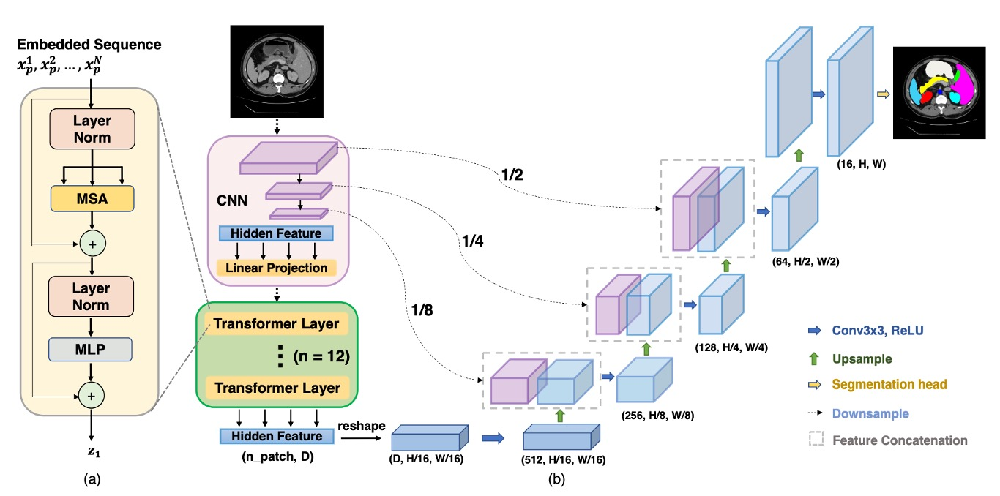

## 単に畳み込みだけでは足りない

[**TransUNet: Transformers Make Strong Encoders for Medical Image Segmentation**](https://arxiv.org/abs/2102.04306)

---

ViT は 2020 年末に提案され、その後関連するアプリケーションは急速にさまざまな分野に広がりました。

今回は U-Net と ViT を組み合わせた論文を見ていきます。記事自体は難しくなく、U-Net と ViT の概念を少し理解していれば、すぐに把握できます。

:::tip
前提知識が必要な読者は、以下の過去の記事を参考にできます：

- [**[15.05] U-Net: 融合の序章**](../1505-unet/index.md)
- [**[20.10] ViT: 新世界の開拓者**](../../vision-transformers/2010-vit/index.md)
  :::

## 問題の定義

CNN における注意機構の導入は新しいことではありませんが、医療画像分割分野においてはまだあまり一般的ではありません。

誰もやっていない？それが最大の問題です！

著者は ViT のように、「シーケンスからシーケンス」へのアプローチを取り、画像を多くのパッチに分割し、直接 Transformer に渡すことで、画像の全体的な特徴を学べるのではないかと考えました。

しかし、もし単純なアップサンプリングを使って、Transformer が生成した低レベルの特徴を元のサイズに戻すだけでは（アップサンプルなどを適用しても）、最終的に粗い分割結果しか得られません。Transformer は全体情報を処理するのが得意ですが、局所的な境界や細部に関しては特別に強化していません。

ViT では通常、パッチサイズは 16×16 に設定されており、画像分類には十分ですが、分割タスクでは各ピクセルの位置精度が求められます。つまり、パッチサイズを 8×8、あるいは 4×4 に縮小しなければなりません。しかし、パッチサイズが小さくなるほど計算量が増え、Transformer の計算量が爆発的に増加し、訓練できなくなります。

そのため、「多尺度ダウンサンプリング」と「解像度」の問題を先に解決する必要があります。

## 解決方法

明らかに、ViT をそのまま画像分割タスクに適用するのは不可能です。そのため、著者は以下のようなハイブリッドアーキテクチャを提案しました：

<figure style={{"width": "90%"}}>

</figure>

まず、CNN を使って特徴抽出を行います。これは一般的なバックボーンの部分で、1/2、1/4、1/8、1/16 の解像度の特徴マップが得られます。

Transformer の計算複雑度を考慮して、ここでは 1/16 の解像度の特徴マップのみを使用し、$1 \times 1$のパッチサイズで画像をシーケンスに変換し、Transformer で全体的な特徴を抽出します。

Transformer が自己注意計算を完了した後、より「全体的」な特徴表現を取得し、そのシーケンスを再び 1/16 の解像度の特徴マップに戻します。そして、CNN の段階的なアップサンプリング（U-Net のデコーダのような方法）を使用して、他の解像度の特徴マップと融合します。これにより、全体的な情報の利点を保持しつつ、スキップ接続を使って局所的な細部も補完し、最終的に精緻な分割結果を得ることができます。

:::tip
ここでは、ViT と U-Net の詳細な実装については省略していますが、過去に説明した内容をご参照ください。
:::

## 討論

- 上表の CUP は、カスケードアップサンプラーを指し、直接アップサンプリングとの効果を比較しています。

---

**Synapse 多器官分割データセット**で、著者は 4 つの先行 SOTA 手法（V-Net、DARR、U-Net、AttnUNet）と比較しました。

また、**CUP**と**ハイブリッドエンコーダ**の性能を検証するため、以下の変種を比較しました：

- **ViT-None**：ViT をエンコーダとして使用し、単純なアップサンプリングを使ってデコード
- **ViT-CUP**：ViT をエンコーダとして使用し、CUP デコーダを使用
- **R50-ViT-CUP**：ResNet-50 + ViT をエンコーダとして使用し、CUP デコーダを使用
- **TransUNet**：R50-ViT-CUP + U-Net スタイルのスキップ接続

公平な比較のため、U-Net と AttnUNet のエンコーダも**ImageNet 事前学習の ResNet-50**に置き換え、ViT-Hybrid バージョンとの整合性を保っています。

- **直接アップサンプリング vs. CUP**：上表の**ViT-None vs. ViT-CUP**を参照すると、Dice Similarity Coefficient（DSC）が 6.36%向上し、Hausdorff 距離が 3.50mm 減少したことがわかります。これにより、CUP デコーダが単純なアップサンプリングよりも医療画像分割に適しており、境界の細部をより精緻に復元できることが証明されました。
- **ViT vs. R50-ViT**：上表の**ViT-CUP vs. R50-ViT-CUP**を参照すると、DSC がさらに 3.43%向上し、Hausdorff 距離がさらに 3.24mm 減少したことが示されています。結論として、純粋な ViT は高次の意味を捉えることができても、医療画像の境界や細部を保持するのが難しく、CNN + ViT のハイブリッドエンコーダは低次の特徴の欠如を効果的に補っています。

最後に、TransUNet と他の手法との比較では、DSC が 1.91%から 8.67%の範囲で向上し、最良の CNN 手法である R50-AttnUNet と比較して TransUNet はさらに 1.91%向上しています；R50-ViT-CUP と比較しても、TransUNet は 6.19%向上しています。

著者は、単純な CNN は豊富な局所細部を捉えることができても、全体的な視野が欠けているため、純粋な ViT は全体的な意味を捉えることができても、医療画像の境界や細部を保持するのが難しいことを分析しました。TransUNet はスキップ接続を通じて全体的な情報と局所的な情報を統合し、すべての SOTA 手法を上回る結果を達成し、現在の医療画像分割の新しい基準となっています。

## 結論

TransUNet は、Transformer の強力な全体的自己注意機構を活用し、CNN の低次元細部表現と組み合わせることで、従来の FCN アーキテクチャの制限を突破し、医療画像分割で優れた性能を発揮しています。

U 型ハイブリッドアーキテクチャを通じて、TransUNet は既存の CNN ベースの自己注意法よりも優れており、医療画像分割に新しい解決策を提供し、この分野における Transformer の潜力と実用性を証明しました。
