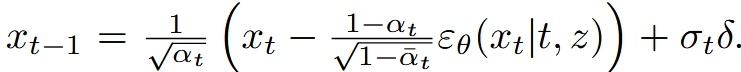
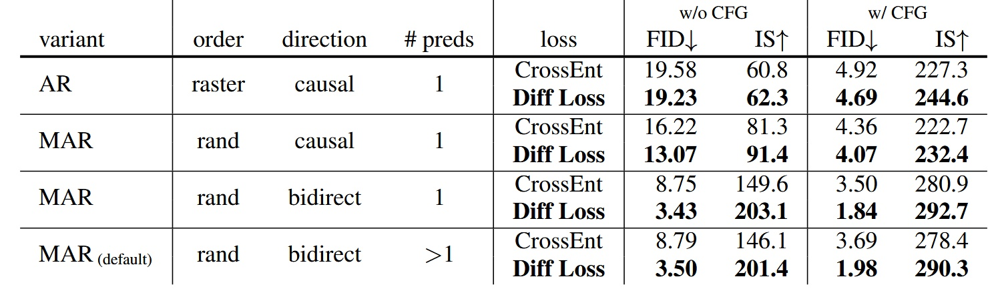
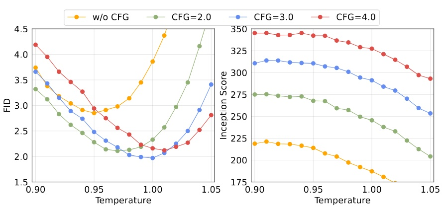
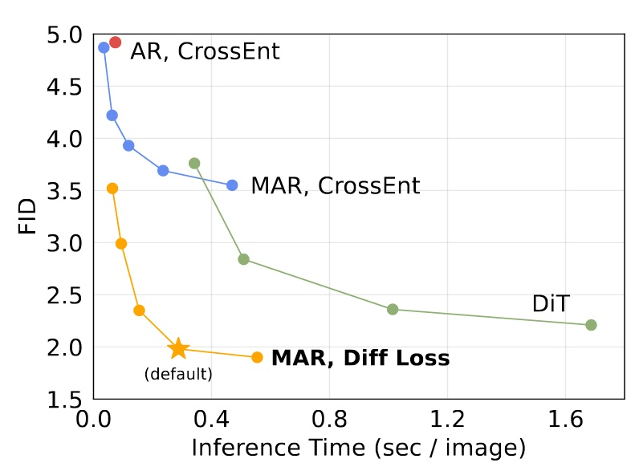

## 再び生成の秩序を鍛え直す

[**Autoregressive Image Generation without Vector Quantization**](https://arxiv.org/abs/2406.11838)

---

:::info
本記事は [**nbswords の Medium**](https://medium.com/@nbswords/autoregressive-image-generation-without-vector-quantization-516b68b5acfa) に同時公開されています。
:::

現在の自己回帰型画像生成モデルは、NLP 分野の自己回帰モデルの成功を模倣するために、画像をベクトル量子化（VQ）して複数のトークンに離散化する手法が一般的ですが、著者はこの離散空間が自己回帰型画像生成に必須ではないと考え、連続空間に基づく自己回帰画像生成モデルを提案しました。これにより、より高い精度と高速な推論時間を両立しています。

## 背景知識

### ベクトル量子化（Vector Quantization, VQ）

これは長年用いられているベクトル探索の高速化技術であり、特徴空間のベクトル（埋め込みベクトル）を複数のグループに分割し、各グループを代表するベクトルをインデックスとして扱い、すべての代表ベクトルのインデックスを含むコードブックを通じてベクトル群を管理します。

<figure style={{"width": "60%"}}>

</figure>

詳しい方法は [Survey Of Vector Space Search](https://medium.com/@nbswords/survey-of-vector-space-search-26555890ca5e) や [Vector quantization wiki](https://en.wikipedia.org/wiki/Vector_quantization) を参照してください。

### 自己回帰型画像生成（Auto-regressive image generation）

初期の Visual Autoregressive Model (VAR)は、画像生成タスクを GPT のような自己回帰型テキスト生成として直接模擬し、画像の各ピクセルを一つのカテゴリとして扱い、モデルは categorical cross entropy で多クラス予測を行います。Google の[Image Transformer, 2018](https://arxiv.org/abs/1802.05751)や OpenAI の[ImageGPT, 2020](https://cdn.openai.com/papers/Generative_Pretraining_from_Pixels_V2.pdf)がこの方法に該当します。

画像生成速度を上げるため、現在の自己回帰画像生成モデルでは VQ を導入した 2 段階学習が一般的です。第 1 段階で latent space 上で画像復元に用いる codebook を学習し、第 2 段階で学習した codebook に基づいて自己回帰的に画像を生成します。

- 例として[VQ-VAE, 2017](https://arxiv.org/abs/1711.00937)

  - Encode 段階では CNN で画像特徴を抽出し、feature map $z_e$ に対して VQ を行い、各グループの代表ベクトル（紫色のベクトル、$e_1$ ～ $e_K$）を取得します。次に $z_e$ の各特徴点と代表ベクトル間の距離を計算し、最も近い代表ベクトルのインデックスで置換し $q(z|x)$ を得ます。これが離散特徴です。
  - Decode 段階では $q$ からマッピングされた $Z_q$ を用いて画像を生成します。

<figure style={{"width": "80%"}}>

</figure>

自己回帰モデルで VQ を使い画像生成を高速化するのは魅力的ですが、欠点はないのでしょうか？

もちろんあります。1. VQ エンコーダの訓練が難しい 2. VQ によって復元画像の品質が低下する点です。

## 方法

### VQ を捨てて、Diffusion を採用

Diffusion モデルは画像の全ピクセルやトークンの結合確率分布を表現できるなら、なぜ各トークンの条件付き確率分布を表現できないのか？

- Diffusion は入力のプロンプトや画像を条件にノイズから画像を生成する

<figure style={{"width": "80%"}}>

</figure>

- 今回はTransformerの出力を条件としてノイズから生成（Transformerの入力については後述）

<figure style={{"width": "80%"}}>

</figure>

彼らの手法は、各トークンの条件付き潜在変数 z を自己回帰的に予測し、小さな MLP の Diffusion モデルでノイズ除去（denoising）を行い、出力 x の確率分布 p(x|z) を得る

<figure style={{"width": "60%"}}>

</figure>

元のカテゴリカルクロスエントロピーに代えて Diffusion Loss を提案

<figure style={{"width": "60%"}}>

</figure>

<figure style={{"width": "60%"}}>

</figure>

- $ε$ は(0,1)の正規分布からサンプリングされたノイズ
- $ε_θ$ は小さな MLP で、$ε_θ(x_t|t,z)$ は時間 $t$ と条件 $z$ をもとに入力 $x_t$ からノイズベクトル $ε_θ$ を推定するモデル

  - $t$ はノイズスケジュールのタイムスタンプ、$z$ は Transformer が文脈から生成した条件ベクトル

最後に、DDPM 同様に推論時には逆拡散過程（reverse diffusion process）で画像を生成（$x_t$ から $x_0$ へ）

<figure style={{"width": "60%"}}>

</figure>

また、Diffusion モデルの画像生成では「温度（temperature）」という超パラメータがあり、温度が高いほど生成のランダム性が大きく、低いほど少ない。今回のモデルでは温度 $\tau$ \* $\sigma_t \delta$ を使い調整。この手法は[Diffusion Models Beat GANs on Image Synthesis](https://arxiv.org/abs/2105.05233)に由来。

これは VAE の条件生成と DDPM のノイズ除去を巧みに組み合わせ、VAE で画像特徴を圧縮し DDPM で画像を生成するという非常に洗練された手法である。

<figure style={{"width": "80%"}}>

</figure>

### Autoregressive と Masked Generative Models の概念を融合

本モデルは[MAE (Masked Autoencoders Are Scalable Vision Learners), 2021](https://arxiv.org/abs/2111.06377)の作者である愷明氏の発想を踏襲し、MAE の考えを取り入れている。

- 主に MAE の後続研究[MaskGIT, 2022](https://arxiv.org/abs/2202.04200)と[MAGE, 2022](https://arxiv.org/abs/2211.09117)を参考に、いずれも Transformer を用いた Masked Autoregressive(MAR)である。MaskGIT は bidirectional transformer decoder で複数トークンを同時予測する点が貢献、MAGE は画像表現学習と画像合成の統合が貢献。
- 本作でも MAE の双方向注意機構を用い、マスクトークン [m]を中間層に置き全トークンが互いを参照可能にし、マスクされていないトークンのみで損失を計算する。

  - これは一般的に言われる causal attention や bidirectional attention とは異なるため、理解したい場合は MAE 論文を参照。
  - この設計により画像生成性能が向上する反面、Transformer の訓練・推論で kv cache を使った高速化ができなくなる。ただし複数トークンを同時予測するため速度低下は限定的。

<figure style={{"width": "60%"}}>

</figure>

- 下図は通常の順次 AR、ランダム順序での AR（1 トークンマスク）、今回の複数トークン同時予測 AR（複数トークンマスク）の比較。ここで Transformer への入力が masked image である理由が明かされる。

<figure style={{"width": "60%"}}>

</figure>

## 実装

- Diffusion Loss：cosine 型ノイズスケジュール、訓練時は DDPM を 1000 ステップ、推論時は 100 ステップで実行
- Denoising MLP（小型 MLP）：3 層 1024 チャネルブロック、各ブロックに LayerNorm、線形層、SiLU 活性化関数、Residual 接続を含む。実装上は AdaLN で Transformer の出力 z を LayerNorm 層に組み込む
- Tokenizer：LDM 公開の Tokenizer を利用、VQ-16 と KL-16 を含む。VQ-16 は VQ-GAN ベースで GAN loss と知覚損失を用い、KL-16 は KL ダイバージェンス正則化で VQ に依存しない
- Transformer：Tokenizer 処理済みのトークン列を受け取り、位置エンコードと [CLS] トークンを付加、32 層 1024 チャネルの Transformer ブロックを通す ViT を使用
- Masked autoregressive models：訓練時は [0.7, 1.0] のマスキング率で、0.7 はランダムに 70%のトークンをマスク。短すぎるシーケンスを避けるため常に 64 個の [cls] トークンでパディング。推論時はマスキング率を 1.0 から 0 へ段階的に下げ、cosine スケジュールでステップ数調整。デフォルトは 64 ステップ。
- ベースラインの Autoregressive Model：causal attention を用いた GPT モデルで、入力に [cls] を付け、kv cache と温度パラメータを利用。

## 実験

モデル実験設定はすべて AR/MAR-L（約 4 億パラメータ）、400 エポック、ImageNet 256×256

### Diffusion Loss と Cross-entropy Loss の比較

すべての AR/MAR バリエーションにおいて、Diffusion Loss を使った方が性能が良い。中でも AR の改善は最小で、下に行くほど改善が大きく、MAR+bidirect+複数予測モデルの改善が最大。Diffusion Loss が MAR モデルにとって重要であることが示されている。

- Diffusion Loss は他の拡散モデルでも使われる CFG（Classifier-Free Guidance）を用いて生成性能を向上させている
- Fréchet Inception Distance (FID) は数値が低いほど良い、Inception Score (IS) は高いほど良い。両者は生成画像の品質評価指標

<figure style={{"width": "80%"}}>

</figure>

### トークナイザー

異なるトークナイザーを使い Diff Loss と組み合わせた効果を検証。離散空間から連続空間へ脱却したため、トークナイザーは制限されず、Diff Loss は連続・離散どちらのトークナイザーにも適用可能。

- VQ-16：VQ-VAE の VQ 前の連続潜在表現をトークン化したもの。前述の通り、VQ-16 と KL-16 は LDM 提供のもので、ImageNet で学習している（OpenImages ではない）
- Consistency Decoder：非 VQ のトークナイザーで、[DALL·E 3](https://github.com/openai/consistencydecoder)由来
- reconstruction FID (rFID)：低いほど良く、トークナイザー評価指標

<figure style={{"width": "80%"}}>

</figure>

結果として、連続型トークナイザーの KL-16 は離散型 VQ-16 より良い性能を示し、Consistency Decoder のような異なるトークナイザーにも対応可能なことを示している。

### Denoising MLP

パラメータ数の異なる MLP の性能比較。幅（width）1024 が最良の性能を示す。

<figure style={{"width": "60%"}}>

</figure>

### Diffusion Loss のサンプリングステップ数

Diffusion のステップ数による生成品質の影響。ステップ数 100 で十分良い性能を得られる。

<figure style={{"width": "80%"}}>

</figure>

### Diffusion Loss の温度パラメータ

Diff Loss における温度設定も重要。

<figure style={{"width": "60%"}}>

</figure>

### スピードと精度のトレードオフ

kv cache を使用できないため、この評価は重要。A100 を用い、バッチサイズ 256 で計測。

<figure style={{"width": "60%"}}>

</figure>

- MAR: 各点は異なる自己回帰ステップ数（8 ～ 128）
- DiT: 各点は異なる拡散ステップ数（50, 75, 150, 250）、DiT-XL を使用
- AR: kv cache を使用

kv cache なしでも推論速度は悪くないが、デフォルト設定（ステップ 64）はやや遅い。

### システムレベルの比較

他モデルとの比較。最大モデル MAR-H が最良の性能を示すが、MAR-L も十分良好。

<figure style={{"width": "80%"}}>

</figure>

## 結論

本研究は自己回帰画像生成の従来手法を打破し、Diffusion と MAE を融合した新たな方向性を切り拓いた。単純な DDPM を使った実証に留まるが、より優れた拡散モデルの適用でさらなる性能向上が期待される。今後の派生研究に期待したい。

最後に一部の生成画像を掲載。

<figure style={{"width": "60%"}}>

</figure>

## 参考文献

[https://zhouyifan.net/2024/07/27/20240717-ar-wo-vq/](https://zhouyifan.net/2024/07/27/20240717-ar-wo-vq/)
