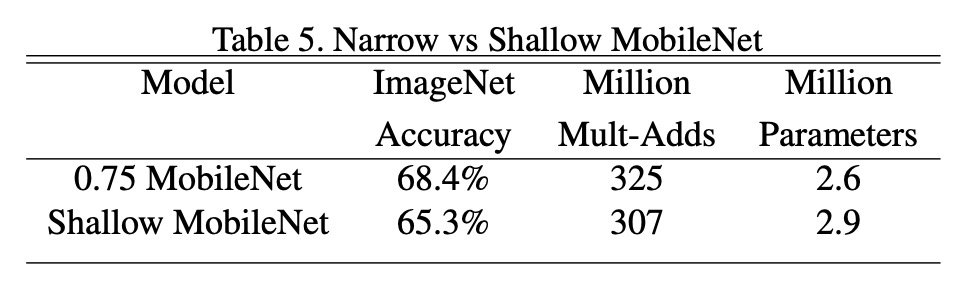

## 深層分離可能な畳み込みの発揚者

[**MobileNets: Efficient Convolutional Neural Networks for Mobile Vision Applications**](https://arxiv.org/abs/1704.04861)

---

深層分離可能な畳み込みは、標準的な畳み込みを二つの独立した層に分解するニューラルネットワークの構造です：深層畳み込みとポイント畳み込み。

この構造は、モデルのパラメータ数と計算量を減少させることができ、これによりモデルを軽量化し、モバイルデバイスなどのリソースが制限された環境に非常に有用です。

この論文は深層分離可能な畳み込みについて述べていますが、実際にはこの構造の創始者は別の人物です：

- [**Rigid-motion scattering for image classification**](https://arxiv.org/abs/1403.1687)

MobileNets の著者は、彼らの主な貢献は「深層分離可能な畳み込み」という構造を畳み込みニューラルネットワークに体系的に適用し、ImageNet で良好な結果を得たことだと述べています。

それが現在有名な： **MobileNet-V1** です。

## 問題の定義

近年の発展において、人々は小型で効率的なニューラルネットワークの構築にますます興味を持っています。

しかし、小型ネットワークに関する多くの論文は「サイズに焦点を当て、効率を考慮していません」。

明らかに、小さくて速いネットワーク構造こそが私たちが本当に必要とするものです。

:::tip
論文では明確には述べられていませんが、この言葉が指すのは [**SqueezeNet**](https://arxiv.org/abs/1602.07360) であると推測できます。
:::

## 問題の解決

### 深層分離可能な畳み込み

<div align="center">
<figure style={{"width": "60%"}}>

</figure>
</div>

従来の畳み込み層は、入力特徴マップを複数チャネルの畳み込みフィルターで処理して新しい特徴マップを生成します。このプロセスでは、各出力チャネルで全ての入力チャネルの情報を考慮するため、計算コストが高くなります。一方、深層分離可能な畳み込みはこのプロセスを二段階に分解します。最初に深層畳み込みを行い、各入力チャネルに独立したフィルターを適用して入力データの一つのチャネルのみを処理し、その後、ポイント畳み込みでこれらの出力チャネルを組み合わせます。

深層畳み込みは入力特徴マップのチャネル数を変更せず、各チャネルに対して空間的なフィルタリングを行います。各チャネルには独立した畳み込みフィルターが使用され、入力特徴マップに M 個のチャネルがある場合、M 個の深層畳み込みフィルターが存在します。ポイント畳み込みは 1×1 の畳み込みフィルターを使用して、これらのフィルタリングされたチャネルを線形結合し、最終的な出力チャネルを生成します。この分解方式の主な利点は、計算量の大幅な削減です。

深層畳み込みの計算コストは、$DK \times DK \times M \times DF \times DF$ であり、ここで$DK$は畳み込みフィルターの空間的なサイズ、$DF$は入力特徴マップのサイズ、$M$は入力チャネル数です。

ポイント畳み込みの計算コストは$M \times N \times DF \times DF$であり、ここで$N$は出力チャネル数です。

この二つのステップのコストを合計しても、従来の畳み込み$DK \times DK \times M \times N \times DF \times DF$に比べて依然として低くなります。

したがって、深層分離可能な畳み込みを使用することで、比較的高い精度を保ちながら、モデルの計算要求とパラメータ数を大幅に減少させ、計算リソースが制限されたデバイスでの実行に非常に適しています。

:::info

PyTorch を用いて深層分離可能な畳み込みを実装してみましょう：

```python
import torch
import torch.nn as nn
import torch.nn.functional as F

class DepthwiseSeparableConv(nn.Module):

    def __init__(self, n_in, n_out, kernel_size, padding=0, stride=1):
        super(DepthwiseSeparableConv, self).__init__()
        self.depthwise = nn.Conv2d(n_in, n_in, kernel_size=kernel_size, padding=padding, stride=stride, groups=n_in)
        self.pointwise = nn.Conv2d(n_in, n_out, kernel_size=1)

    def forward(self, x):
        out = self.depthwise(x)
        out = self.pointwise(out)
        return out
```

この論文の実装では、各畳み込み層の後に Batch Normalization と ReLU 活性化関数を接続していることが言及されています。以下のように：

<div align="center">
<figure style={{"width": "60%"}}>

</figure>
</div>

そのため、実装方法は次のように変更できます：

```python
import torch
import torch.nn as nn
import torch.nn.functional as F

class DepthwiseSeparableConv(nn.Module):

    def __init__(self, n_in, n_out, kernel_size, padding=0, stride=1):
        super(DepthwiseSeparableConv, self).__init__()
        self.depthwise = nn.Conv2d(n_in, n_in, kernel_size=kernel_size, padding=padding, stride=stride, groups=n_in)
        self.pointwise = nn.Conv2d(n_in, n_out, kernel_size=1)
        self.depth_bn = nn.BatchNorm2d(n_in)
        self.depth_relu = nn.ReLU()
        self.point_bn = nn.BatchNorm2d(n_out)
        self.point_relu = nn.ReLU()

    def forward(self, x):
        x = self.depthwise(x)
        x = self.depth_bn(x)
        x = self.depth_relu(x)
        x = self.pointwise(x)
        x = self.point_bn(x)
        x = self.point_relu(x)
        return x
```

:::

## ネットワークアーキテクチャ

論文によると、MobileNet-V1 のネットワークアーキテクチャは、「**最初の 3x3 だけが通常の畳み込みフィルターであり**」、その他はすべて深層分離可能な畳み込みが積み重ねられています。

> MobileNet の構造は前のセクションで述べたように、最初の層を除いて、深層分離可能な畳み込みで構成されています。

全体の構造は以下の表の通りです：

<div align="center">
<figure style={{"width": "60%"}}>

</figure>
</div>

## トレーニングのテクニック

MobileNet-V1 の著者は、トレーニングの過程でいくつかのテクニックを使用してモデルの性能を向上させました：

- より少ない正則化とデータ増強を使用、なぜなら小さなモデルは過学習の問題が少ないからです。
- 深層分離可能な畳み込みフィルターにはほとんどまたは全く重み減衰（L2 正則化）を適用しない。
- RMSprop をオプティマイザとして使用し、より小さい学習率を使用。
- Inception-V3 に似た非同期勾配降下を採用。

:::tip
非同期勾配降下（Asynchronous Gradient Descent）は、特に分散コンピューティング環境で深層学習のトレーニングに使用される最適化技術です。従来の同期勾配降下では、すべての計算ノード（またはワーカー）が勾配計算を完了した後にモデルの更新が行われます。これに対して、非同期勾配降下では、各計算ノードが独立して勾配を計算し、他のノードの計算結果を待たずに共有モデルを更新します。
:::

## 討論

全体の実験設計では、上記のネットワークアーキテクチャがベースラインとして使用され、著者はさらに二つの定数パラメータを導入しました：

- **幅の乗数 $\alpha$**：ネットワークの幅、つまり各層の出力チャネル数を制御します。
- **解像度の乗数 $\rho$**：入力画像の解像度を制御します。

### 深層分離可能な畳み込みの性能

<div align="center">
<figure style={{"width": "80%"}}>

</figure>
</div>

全畳み込みと比較して、深層分離可能な畳み込みは ImageNet での精度が 1%しか低下せず、掛け算の回数とパラメータ数を大幅に削減しました。

### 深さか幅か？

<div align="center">
<figure style={{"width": "80%"}}>

</figure>
</div>

モデルの幅を減らすと精度が 2.2%低下し、モデルの深さを減らすと精度が 5.3%低下します。

これにより、計算リソースが制限されている場合、モデルの深さを減らすよりも幅を減らすことが推奨されることがわかります。

### 他のモデルとの比較

<div align="center">
<figure style={{"width": "80%"}}>

</figure>
</div>

MobileNet を元の GoogleNet と VGG16 と比較しました。

MobileNet は VGG16 とほぼ同じ精度を持ちながら、サイズは 32 倍小さく、計算強度は 27 倍減少しました。また、GoogleNet よりも精度が高く、サイズが小さく、計算量が 2.5 倍以上減少しています。

ほぼ同じサイズで計算量が 22 倍減少した状態でも、MobileNet は Squeezenet に比べて約 4%の精度向上を示しました。

## 結論

MobileNet-V1 の登場により、深層分離可能な畳み込み技術は正式に一般の視野に登場しました。この構造は、比較的高い精度を保ちながら、モデルのサイズと計算要求を大幅に削減し、リソース制限のある環境で複雑な深層学習モデルを実行する課題を解決しました。

この論文は、リソースが限られた環境で深層学習モデルを展開するための効果的なソリューションを提供しただけでなく、その設計理念は後の多くの軽量深層学習アーキテクチャの開発に影響を与え、深層学習アーキテクチャのモバイルデバイスやエッジコンピューティングでの応用をさらに推進しました。

:::tip
MobileNet は後続で V2、V3、V4 のバージョンも発表され、モデルの性能と効率がさらに向上しました。この一連の研究成果は、実際のアプリケーションで広く成功を収め、軽量深層学習モデルのクラシックな作例となっています。
:::
