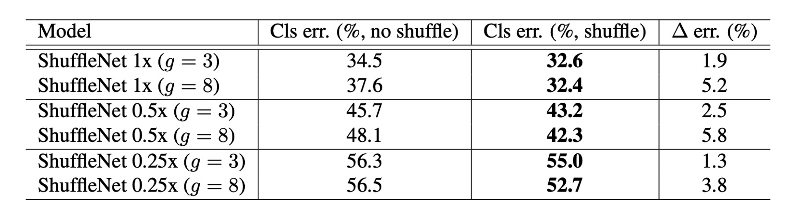

# [17.07] ShuffleNet

## チャネルシャッフルネットワーク

[**ShuffleNet: An Extremely Efficient Convolutional Neural Network for Mobile Devices**](https://arxiv.org/abs/1707.01083)

---

軽量ネットワークの競争はまだ始まったばかりです。

ShuffleNet もこのタイミングで戦いに加わりました。

## 問題の定義

### 計算量と速度の不一致

本研究では、著者は前回の研究と同様に、同じ問題に取り組んでいます：

- **如何にして、計算能力が非常に限られているモバイルデバイス向けに、高精度を維持しながら効率的なニューラルネットワークを設計するか？**

MobileNet や SENet などのモデルが計算コストを低減する方向に進んできましたが、これらのモデルは非常に低い計算予算（例えば 150 MFLOPs 未満）では性能の向上余地があります。

著者は、既存の効率的なモデルが「**実際のハードウェアでの推論時間と期待される性能の間に大きなギャップがあることが多い**」と指摘しています。

### 大量の 1x1 畳み込み


MobileNet-V1 では、著者はネットワーク全体の計算量を分析しました（上の表参照）。

本論文の著者は、大量の 1x1 畳み込みが計算量の主要な要因であると考え、計算量を減らすためにこの視点からアプローチすべきだと述べています。

## 問題の解決

### グループ畳み込み


主要な課題は、1x1 畳み込みの計算量をどう削減するかです。著者は、グループ数を増やすことが解決策だと考えています。

入力チャネル数と出力チャネル数が 128 の場合、グループを使用しない場合、1x1 畳み込みは各出力チャネルに対して全ての入力チャネルを計算するため、掛け算の総数は$128 \times 128 = 16,384$回です。しかし、グループ数を 8 に設定すると、各グループに含まれるチャネル数は$128 / 8 = 16$となります。この場合、各グループ内部での畳み込み計算は 16 個の入力チャネルと 16 個の出力チャネルの掛け算に関わるため、各グループの計算量は$16 \times 16 = 256$回になります。全体で 8 つのグループがあるため、掛け算の総数は$256 \times 8 = 2,048$回です。

比較すると、グループ畳み込みは計算量を元の 1x1 畳み込みの約 12.5%、16,384 回から 2,048 回に減少させることができます。

しかし、無料のランチはありません。

グループ畳み込みは確かに計算量を減らしますが、次の問題が発生します：**グループ畳み込みはチャネル間の関連性を破壊します**（上図（a）参照）。

最終的にネットワーク全体の性能が大きく低下します。

### チャネルシャッフル

グループ畳み込みが引き起こす問題を解決するために、著者は新しい操作を提案しました：**チャネルシャッフル**（上図（b）参照）。

その概念はこうです：グループがチャネル間の情報の流れを制限するので、異なるグループのチャネルをシャッフルして、チャネル間の関連性を保持できるようにするのです。

この操作は理解しにくいかもしれませんが、シャッフル関数を実装すると、この操作の意義が理解できるようになります。

```python
import torch

def shuffle_channel(x: torch.Tensor, groups: int) -> torch.Tensor:
    batch_size, num_channels, height, width = x.size()
    channels_per_group = num_channels // groups

    x = x.view(batch_size, groups, channels_per_group, height, width)
    x = x.permute(0, 2, 1, 3, 4).contiguous()
    x = x.view(batch_size, num_channels, height, width)
    return x
```

上記の関数のように、まずチャネル数をいくつかのグループに分割し、次にチャネルの位置を移動させることでチャネルシャッフルの効果が得られます。例えば、元のチャネルが：AAA, BBB, CCC だった場合、シャッフル後は：ABC, ABC, ABC になります。

シャッフルとはいえ、ランダムではなく規則的なシャッフルであり、異なるグループのチャネルが互いに情報を交換できるようにするのが目的です。

### シャッフルモジュールの配置位置


最後にシャッフルモジュールの配置位置についてです。上図に示すように、ShuffleNet ユニットの設計は、残差ブロックのボトルネックユニットからのインスピレーションを受けています。特にその残差パスでは、計算効率の高い$3 \times 3$深層畳み込みを使ってボトルネック特徴マップを処理しています。この基盤の上に、グループ逐点畳み込みを使って従来の$1 \times 1$畳み込みに置き換え、チャネルシャッフル操作を組み合わせることで、ShuffleNet ユニットのコア構造が形成されました（上図（b）参照）。

ショートカットパスとチャネル次元を回復するために、ユニット内の 2 番目の逐点畳み込みもグループ化されますが、その後に追加のチャネルシャッフル操作は行われません。これにより操作の簡潔さが保たれています。この構造では、バッチ正規化（BN）と非線形活性化の使用は他の研究と似ており、深層畳み込み後にすぐに ReLU を使用するという一般的な提案は採用されていません。

また、ストライドの使用に関して、ShuffleNet ユニットには 2 つの主要な調整が行われました（上図（c）参照）：

- まず、ショートカットパスに$3 \times 3$の平均プーリング操作を導入しました。
- 次に、逐要素加算の代わりにチャネル連結を行い、計算コストをほとんど増加させずにチャネル次元を拡張しました。

この設計により、ユニット内のすべてのコンポーネントが効率的に計算され、特にグループ逐点畳み込みでチャネルシャッフルが実現されています。

### モデルアーキテクチャ


上述のすべてのモジュールを基に、最終的に ShuffleNet の全体アーキテクチャが構成されました（上表参照）。右側には$g=1$から$g=8$までの表があり、この$g$はグループ数です。

著者はここで、グループ数を増やすことで計算量を減少させることを考慮し、各モデルが一貫した計算量を持つように、一貫した比較基準を提供するために、グループ数を増加させるとともに、ネットワークの各層のチャネル数も増加させました。

## 討論

### グループ畳み込みの効果


1. **モデルサイズとグループ数の影響**：

   実験では、ShuffleNet モデルの異なるグループ数（1 から 8）を比較し、異なるネットワーク複雑度（1x, 0.5x, 0.25x）を考慮しました。同じ複雑度では、グループ畳み込み（特に大きなグループ数、例えば g=8）がモデルの分類性能を向上させることが多いことがわかりました。最も基本的な ShuffleNet 1x モデルでは、最大グループ数が性能を 1.2%向上させ、より小さなモデルである ShuffleNet 0.5x と 0.25x では、それぞれ 3.5%と 4.4%の性能向上が見られました。

2. **性能の飽和と低下**：

   一部のモデル、例えば ShuffleNet 0.5x では、グループ数が大きく（例えば g=8）なると、分類性能が飽和または低下することがあります。これは、各畳み込みフィルターの入力チャネル数が減少し、表現能力が損なわれる可能性があるためです。

3. **小さなモデルでは大きなグループ数が効果的**：

   ShuffleNet 0.25x のような小さなモデルでは、大きなグループ数が通常、より良い結果をもたらします。これは、より広い特徴マップが小さなモデルに対して有利であることを示しています。

### チャネルシャッフルの効果



明らかに、チャネルシャッフルは常に異なる設定で分類スコアを向上させます。

### 他のモデルとの比較


さまざまな複雑度レベルで、ShuffleNet は MobileNet よりも優れた性能を示しました。

- ShuffleNet 1× の精度は MobileNet より 3.1%高く、計算コストは増加しました（500 MFLOPs 増加）
- 約 40 MFLOP の小さなネットワークでは、ShuffleNet は MobileNet より 7.8%優れた性能を示しました。
- ShuffleNet は精度が同じであれば、他の人気のあるネットワークモデルよりも高い効率を示しました。例えば、AlexNet と比較して、ShuffleNet は理論的に 18 倍速いです。

:::tip
特に SE モジュールを統合した ShuffleNet 2× は、top-1 誤差率が 24.7%に達しました。

理論的な複雑度はほとんど増加しませんが、論文内では、この構成の ShuffleNet が実際には元のバージョンよりも 25%から 40%遅くなることが言及されています。
:::

### 実際の推論速度の評価


著者は、ShuffleNet の ARM モバイルデバイスでの推論速度を評価し、他のモデルと比較しました。

1. **グループ数と効率**：ShuffleNet モデルでは、より大きなグループ数（g=4 または g=8）が通常、より良い性能を提供しますが、現在の実装では効率が低いことがあります。経験的には、g=3 が精度と実際の推論時間の間で適切なバランスを提供します。

2. **理論と実際のパフォーマンス差**：実際の加速と理論的な複雑度との間には顕著な差があります。理論的には 4 倍の複雑度を減らすことで、実際には約 2.6 倍の加速が得られることが示されています。

3. **AlexNet との比較**：理論的な加速比は 18 倍ですが、ShuffleNet 0.5× モデルは、AlexNet と同等の分類精度を持ちながら、実際には約 13 倍の加速比を達成しました。これにより、ShuffleNet は従来の AlexNet やその他の古いモデルまたは加速手法に対して顕著な速度優位性を示しています。

## 結論

多くのモバイルデバイス向けの軽量モデルは、ハードウェア上での実際の推論時間と期待される性能の間に大きな差があることがよくあります。

ShuffleNet は、グループ畳み込みとチャネルシャッフル操作を導入することによって、計算量を効果的に削減し、高精度を保ちながら、計算能力が非常に限られたモバイルデバイス向けに効率的なニューラルネットワークを設計しました。このデザインの考え方は非常に興味深く、さらに効率的なニューラルネットワークモデルを設計するための出発点となり得ます。
