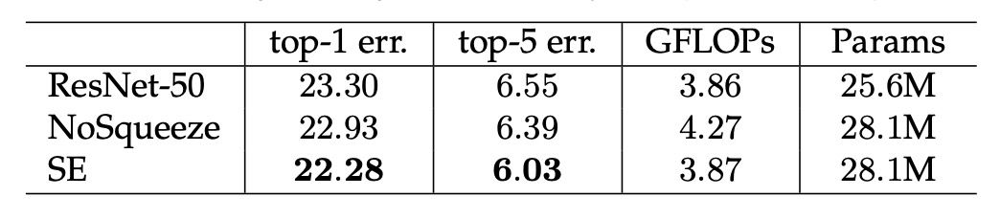
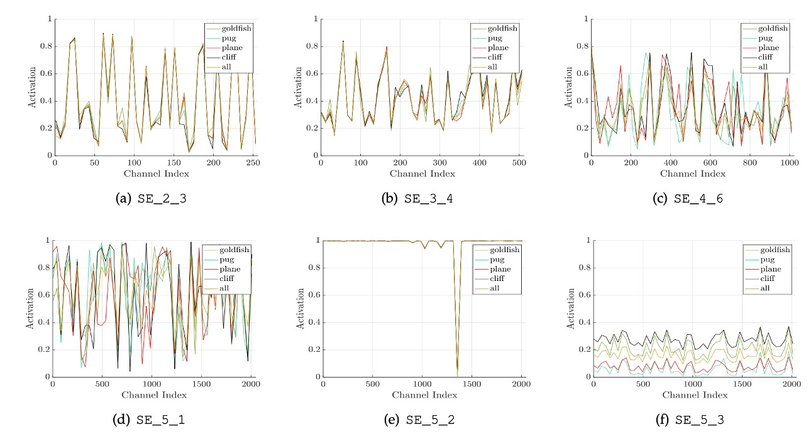

## 強く絞ってください

[**Squeeze-and-Excitation Networks**](https://arxiv.org/abs/1709.01507)

---

これは、誰もが ImageNet のランキングを争っている時代であり、さまざまなネットワークアーキテクチャが次々と登場しています。

SENet というネットワークアーキテクチャの提案は、ネットワーク内の異なるチャネル間の全体的な相互関係を改善し、ネットワークのパフォーマンスを向上させることを目的としています。

## 問題の定義

過去の研究で、VGG や ResNet からの一つの観察結果は、深さを増すことでモデルの品質が向上し、残差接続の手法がネットワークがより良い特徴を学習するのに役立つことを示しています。

また、グループ畳み込みの自然な進化から、後の Inception シリーズに見られるように、多分岐設計がネットワークのパフォーマンスを向上させました。

これらの研究は実際には一つの仮定を反映しており、それは：

- **ネットワークのチャネル間の関係は「局所的」な受容野を持つ非識別的な関数の組み合わせとして表現できる**というものです。

そして、この考え方が著者が問題だと考える点です：

- **なぜ私たちは局所的な受容野だけを考慮し、全体的な受容野を考慮していないのか？**

## 問題の解決

著者はネットワークのチャネル間に全体的な情報を導入したいと考えていますが、計算量とパラメータを増やさずにこれを実現したいと考えています。

そのため、計算量をあまり増やさずに全体的な情報を導入するために、Squeeze-and-Excitation モジュールを提案しました。

### モデルアーキテクチャ


これは、論文を読むよりもコードを見た方が簡単なネットワークアーキテクチャです。

始める前に、まず実装してみましょう：

```python
import torch
import torch.nn as nn

class SEBlock(nn.Module):

    def __init__(self, in_channels, reduction_ratio=16):
        super(SEBlock, self).__init__()
        self.squeeze = nn.AdaptiveAvgPool2d(1)
        self.excitation = nn.Sequential(
            nn.Conv2d(in_channels, in_channels // reduction_ratio, kernel_size=1, stride=1, padding=0, bias=False),
            nn.ReLU(),
            nn.Conv2d(in_channels // reduction_ratio, in_channels, kernel_size=1, stride=1, padding=0, bias=False),
            nn.Sigmoid()
        )

    def forward(self, x: torch.Tensor) -> torch.Tensor:
        # x: (B, C, H, W)

        # (B, C, H, W) -> (B, C, 1, 1)
        out = self.squeeze(x)

        # (B, C, 1, 1) -> (B, C//16, 1, 1) -> (B, C, 1, 1)
        out = self.excitation(out)

        # (B, C, H, W) * (B, C, 1, 1) -> (B, C, H, W)
        return x * out
```

そうですね？論文を読むよりコードを見る方が簡単です！

SENet では、全体的な情報を導入する方法として Global Average Pooling を使用しています。

特徴マップの各チャネルの特徴値を平均化し、その後、全結合層を通じて各チャネルの重要性の重みを得ます。

この全体的な情報は実際にはそれほど多くはありませんが、実験においてこの設計がネットワークのパフォーマンスを向上させることが証明されています。

:::tip
1x1 畳み込みを使用して全結合層を実装することで、permute や reshape を避けて手間を省いています。
:::

次に、コードを見た後に、著者が描いた図を見てみましょう：

<div align="center">
<figure style={{"width": "60%"}}>

</figure>
</div>

図のように、SENet では以下の手順が進行します：

1. **Global Pooling**：全体的な情報。
2. **FC**：次元削減。
3. **ReLU**：非線形性の導入。
4. **FC**：次元拡張。
5. **Sigmoid**：各チャネルの重要性重みを取得。

ここで`Sigmoid`を選択したのは、著者が各チャネル間で競争関係を作らず、相互に組み合わせることを望んでいるからです。

つまり、各チャネルが保持するかどうか（すなわち重み）だけを考慮し、相互抑制の競争関係を生じさせる必要はないということです。

## 討論

### 画像分類の効果の表示


SENet はどんなネットワークにも挿入でき、パラメータ数を大幅に増やすことなく効果を発揮します。

例えば、ResNet-50 と SE-ResNet-50 の比較を見てみましょう：

224 × 224 ピクセルの入力画像に対して、ResNet-50 は 1 回の前向き伝播で約 3.86 GFLOP の計算量が必要です。

各 SE ブロックは、圧縮段階でグローバル平均プーリング操作を使用し、活性化段階で 2 つの小型の FC 層を使用します。縮小率を 16 に設定した場合、SE-ResNet-50 は約 3.87 GFLOP の計算量が必要で、元の ResNet-50 と比較して約 0.26%増加しました。

パラメータ数の増加は約 10%で、これは表には記載されていませんが、論文には記載されています。

パラメータ数は少し増えたものの、元々の ResNet-50 が ResNet-101 のパフォーマンスに追いつく効果が得られました。

:::info
著者はパラメータ数の増加のほとんどがネットワークの末端にあることを分析しており、末端の全結合層を削除すれば、パラメータ数の増加は 4%に減少し、ImageNet の top-5 精度は 0.1%減少することが分かっています。
:::

### 軽量モデルでの効果の表示


SENet を MobileNet に適用した効果も非常に良く、ImageNet での top-1 誤差率が 3.1%減少しました。

ShuffleNet でも効果が良好で、top-1 誤差率が 1.6%減少しました。

:::tip
もう少しで MobileNet-V3 を作るところだった。（？？？）
:::

### Squeeze の重要性



著者は SENet の Squeeze 部分を削除しても効果があることを確認しました！

しかし、比較するとそれほど驚くべき結果ではなく、Squeeze を使用することで 1.02%向上し、削除後は 0.37%の向上に留まりました。

### Excitation の重要性



著者は異なるカテゴリ（金魚、ハバ犬、飛行機、崖）におけるネットワークの異なる層での活性化分布を研究し、いくつかの結論をまとめました：

- ネットワークの初期層では、異なるカテゴリの活性化分布は似ているが、深い層では活性化値がよりカテゴリ特異的になる。
- ネットワークの深層（例えば SE_4_6 や SE_5_1）では、特定のチャネルの活性化値が強いカテゴリの好みを示しており、SE モジュールがこれらの層で特徴の識別に顕著な影響を与えることを示しています。
- SE_5_2 層では多くの活性化値が 1 に近づく傾向が観察され、この状況では SE モジュールが恒等演算子として機能し、特徴の再調整を行わなくなります。
- ネットワークの末端では、SE モジュールの重要性が減少し、これらのモジュールを削除してもパフォーマンスにわずかな影響しかなく、パラメータ数を大幅に削減できます。

これらの観察結果は、SE モジュールがネットワークの異なる層で異なる役割を果たしており、深層学習モデルにおける特徴抽出と処理の理解と最適化に非常に重要であることを示しています。

### その他の実験結果

著者はモデル内のさまざまな部分について実験を行い、いくつかの結論をまとめました：

1. `Signoid`が最も効果的で、`Tanh`が次に効果があり、`ReLU`が最も劣っていました。
2. `AvgPool`は`MaxPool`より良い。
3. SE モジュール内の Reduction Ratio を 16 に設定することで最適な重みが得られました。

詳細な表は原論文を参照してください。これらの実験は主にエンジニアリングの実践に関連しており、ここでは一つ一つ詳述することは控えます。

## 結論

SENet はネットワークに SE ブロックを導入することで、ネットワークの学習と一般化能力を効果的に向上させました。

その主要な貢献は、注意機構を簡潔に畳み込みネットワークに統合することにあり、ネットワークが重要な特徴に焦点を合わせることを可能にしました。

この方法の成功は、内部特徴の表現能力を強化することが、深層学習モデルのパフォーマンスを大幅に向上させることを証明しています。

:::tip
`Squeeze-and-Excitation`モジュールは計算コストの増加が比較的小さいですが、その後の多くの研究で、このアーキテクチャが時折パフォーマンスのボトルネックになることが発見されました。

リアルタイムシステムや計算リソースが非常に限られた環境に展開する際は、開発者はその性能向上と追加の計算負担のバランスを考慮する必要があります。
:::
