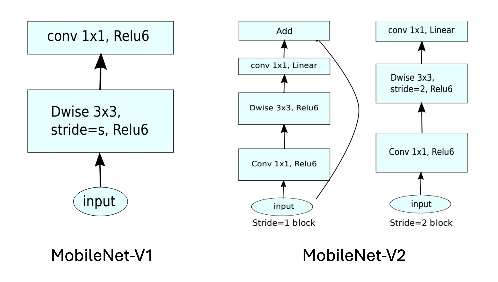

## ボトルネック内の鍛錬

[**MobileNetV2: Inverted Residuals and Linear Bottlenecks**](https://arxiv.org/abs/1801.04381)

---

MobileNet は軽量の深層学習ネットワークで、モバイルデバイス上で効率的な画像認識を実現することを目的としています。

初代 MobileNet では、著者は「深層可分離畳み込み（Depthwise Separable Convolution）」の概念を提案し、パラメータ数と計算量を減少させました。

本論文では、著者はこのアイデアを引き継ぎ、パフォーマンスを向上させる新しい方法を模索しています。

:::tip
もしこの論文が初めてなら、その多くの用語に圧倒されるかもしれません。

したがって、最初にコードの実装を見ることを強くお勧めします。

ですが、すでにこのページに来ているので、一緒に見ていきましょう。
:::

## 問題の定義

### 線形ボトルネック

著者が最初に議論したい問題は、線形ボトルネックです。

画像認識に使用される深層畳み込みニューラルネットワークを考えてみましょう。各畳み込み層は、画像の特徴を含む三次元のアクティベーションテンソル（高さ × 幅 × 深さ）を生成します。

例えば、最初の層はエッジや色の変化を識別し、より深い層は複雑な形状や物体の部分を識別するかもしれません。

ニューラルネットワークの各層では、アクティベーションテンソルは高次元空間に存在していると見なすことができます。この空間の有意義なデータ構造（論文内で「興味のある多様体（manifold of interest）」と呼ばれています）は、重要な情報を失うことなく低次元の部分空間にマッピングできる理論的な可能性があります。なぜなら、データは元の空間では高次元ですが、しばしばいくつかの低次元構造の周りに分布しているからです。

:::tip
例えば、128 の特徴量を変換行列で 2 次元特徴に射影した場合、変換情報を保持したまま、この 2 次元空間の特徴を逆変換行列を使って 128 次元空間に戻すことができます。
:::

この性質を効率的に活用するために、ネットワーク設計は線形ボトルネック層を導入してデータの次元を削減できます。この方法は MobileNetV1 でうまく活用されました。

しかし、非線形操作（ReLU など）が導入されると、状況が複雑になります。

ReLU の効果は、各要素に線形しきい値処理を行い、負の値をゼロにすることです。これによりデータの分布が変わり、新しい幾何構造（例えば射線や分割線形曲線）が生じます。

:::tip
前述の例で説明すると、128 の特徴量を変換行列で 2 次元特徴に射影し、その後 ReLU を適用します。もしそのうちの一つの特徴量がゼロ未満であれば、その特徴量はゼロになります。これにより、元の 2 次元特徴空間内の点の集合が 2 つの部分に分割され、逆変換行列は元の 128 次元特徴空間を完全には復元できません。
:::

この問題を避けるためには、非線形変換後でも十分な情報を保持できるように、次元を十分に大きく保つことが重要です。以下の図に示されています：

<div align="center">
<figure style={{"width": "85%"}}>

</figure>
</div>

図の左端は入力です。異なる次元に射影され、ReLU 操作を経た後、右側の分布が異なることが示されています。

十分な次元数を選ばないと、ReLU 操作を経て元の分布が破壊され、一部の情報が永遠に失われることがわかります。

### 残差ネットワーク

次に、残差ネットワークについて見てみましょう。ここでは ResNet 論文に載っている図を使います：

<div align="center">
<figure style={{"width": "60%"}}>

</figure>
</div>

通常の残差ネットワークでは、最初に 1x1 畳み込み層で次元を削減し、次に 3x3 畳み込み層で情報を統合し、最後に再度 1x1 畳み込み層で次元を拡張します。そして、元の入力を加算します。

先ほど言及した線形ボトルネックを考慮すると、この残差モジュール内では、次元削減の過程で ReLU という非線形操作が導入され、その結果、情報が失われることになります。

もし情報が多く失われるとどうなるのでしょうか？

深い残差ネットワーク内の「残差分岐」が機能しなくなり、単なる飾りとなり、計算リソースが無駄に使われてしまいます。

## 問題の解決

問題を解決するために、著者は元の残差モジュールを修正し、圧縮次元を膨張次元に変更し、深層可分離畳み込みをその中に導入しました。

この新しい残差モジュールは著者によって「線形ボトルネックを持つ逆向残差（Inverted residual with linear bottleneck）」と呼ばれています。

### 逆向残差


残差モジュール全体の変更は上図のように示されています。

1. 元々の ResNet の圧縮次元の 1x1 畳み込み層を膨張次元の 1x1 畳み込み層に変更しました。
2. 元々の 3x3 畳み込み層を深層可分離畳み込みに変更しました。
3. 元々の ReLU 関数を全て ReLU6 関数に変更しました。

:::tip
申し訳ありませんが、私たちが描いた図は簡単すぎるかもしれません。論文内の多くの図は理解しにくいため、ここでは載せません。興味があれば論文で直接ご覧ください。
:::

### 拡張ボトルネック（論文付録 A）

ボトルネック変換には 2 つの主要な操作があります：線形変換と ReLU 活性化関数。このプロセスは$ A \text{ReLU}(Bx) $として表現できます：

1. **線形変換 $Bx$：** ここで、$x \in \mathbb{R}^n$は n 次元のベクトルであり、画像内のピクセル点を表すベクトルやその他のタイプのデータである可能性があります。$B$は$m \times n$の行列で、元の n 次元ベクトル$x$を m 次元空間に変換します。このステップの目的は、異なる次元で入力データの特徴を再構成することです。これには次元削減（$m < n$の場合）、次元拡張（$m > n$の場合）、または同次元空間への変換（$m = n$の場合）が含まれます。

2. **非線形活性化関数 ReLU：** ReLU 関数、すなわち修正線形単位（Rectified Linear Unit）は、$Bx$の結果に適用されます。この関数の数式は$\text{ReLU}(z) = \max(0, z)$であり、$z$はスカラーまたはベクトルです。ベクトルの場合、ReLU 関数は各要素に独立して作用します。このステップは非線形性を導入し、モデルの表現能力を増加させます。線形モデルでは複雑なデータ構造やパターンを捉えることができません。

3. **第 2 の線形変換 A：** ReLU 活性化後の結果は、再び$n \times m$の行列$A$によって変換されます。このステップでは、特徴をさらに調整し、後続のニューラルネットワーク層または最終出力要求に適合させます。

ボトルネック変換の効果を分析する際に、最初に考慮すべきは$m$（出力次元）と$n$（入力次元）の関係です：

- **$m ≤ n$の場合**：このような変換では非線形性を保持しつつ、情報が失われる可能性があります。出力次元が入力次元より小さいか等しい場合、一部の入力情報は変換後に完全には回復できません。
- **$n < m$の場合**：このような変換は強い非線形性を表現でき、元の入力を高い確率で回復できるため、非常に可逆的です。

最後に、著者は拡張層のボトルネック構造が、流形崩壊（すなわち情報の喪失）を防ぐだけでなく、ネットワークがより複雑な関数を表現できるのに役立つと指摘しています。

### モデルアーキテクチャ

<div align="center">
<figure style={{"width": "80%"}}>

</figure>
</div>

最後に、全体のモデルアーキテクチャです。上の図から、MobileNetV1 と比較して、MobileNetV2 では残差モジュールがさらに統合されています。

ここではさらに少し進めて、実際に実装してみましょう。

```python
import torch.nn as nn


class InvertResidual(nn.Module):

    def __init__(self, inp, oup, stride, expand_ratio):
        super(InvertResidual, self).__init__()
        self.stride = stride
        self.is_shortcut = stride == 1 and inp == oup
        hidden_dim = int(inp * expand_ratio)

        self.conv = nn.Sequential(
            # pw
            nn.Conv2d(inp, hidden_dim, 1, 1, 0, bias=False),
            nn.BatchNorm2d(hidden_dim),
            nn.ReLU6(),
            # dw
            nn.Conv2d(hidden_dim, hidden_dim, 3, stride, 1, groups=hidden_dim, bias=False),
            nn.BatchNorm2d(hidden_dim),
            nn.ReLU6(),
            # pw-linear
            nn.Conv2d(hidden_dim, oup, 1, 1, 0, bias=False),
            nn.BatchNorm2d(oup),
        )

    def forward(self, x):
        if self.is_shortcut:
            return x + self.conv(x)
        else:
            return self.conv(x)
```

モジュールを作成したら、次はモデルを組み立てます。

論文の設定を参考にしてください：

<div align="center">
<figure style={{"width": "60%"}}>

</figure>
</div>

入力画像のサイズは 224x224 で、出力クラス数は 1000 です……

うーん、これらのパラメータは重要ではありませんが、モデルの実装には影響しません。

論文ではモデルをスケーリングする必要があると述べているので、モデルの幅をスケーリングするためのパラメータ`width_mult`を使用します。

ここでは最終出力層を除き、モデルの主体部分のみを実装します。つまり、特徴抽出部分です。

```python
import torch.nn as nn

class MobileNetV2(nn.Module):

    def __init__(self, width_mult=1.):
        super(MobileNetV2, self).__init__()

        # setting of inverted residual blocks
        self.settings = [
            # t, c, n, s
            [1, 16, 1, 1],
            [6, 24, 2, 2],
            [6, 32, 3, 2],
            [6, 64, 4, 2],
            [6, 96, 3, 1],
            [6, 160, 3, 2],
            [6, 320, 1, 1],
        ]

        # building first layer
        input_channel = int(32 * width_mult)
        self.first_layer = nn.Sequential(
            nn.Conv2d(3, input_channel, 3, 2, 1, bias=False),
            nn.BatchNorm2d(oup),
            nn.ReLU6()
        )

        # building inverted residual blocks
        layers = []
        for t, c, n, s in self.settings:
            output_channel = int(c * width_mult)
            for i in range(n):
                layers.append(
                    InvertResidual(
                        input_channel,
                        output_channel,
                        stride=s if i == 0 else 1,
                        expand_ratio=t
                    )
                )
                input_channel = output_channel
        self.layers = nn.Sequential(*self.layers)

        # building last several layers
        last_channel = int(1280 * width_mult) if width_mult > 1.0 else 1280
        self.last_layer = nn.Sequential(
            nn.Conv2d(input_channel, last_channel, 1, 1, 0, bias=False),
            nn.BatchNorm2d(oup),
            nn.ReLU6()
        )

    def forward(self, x):
        x = self.first_layer(x)
        x = self.layers(x)
        x = self.last_layer(x)
        return x
```

:::tip
**なぜ nn.Conv2d の bias を False に設定するのか？**

それは、`Batch Normalization`で既にバイアス項があるため、Conv2d 内で新たにバイアス項を加える必要がないからです。
:::

## 討論

### 画像分類性能

<div align="center">
<figure style={{"width": "80%"}}>

</figure>
</div>

上の表からわかるように、MobileNetV2 は ImageNet での性能が MobileNetV1 よりも向上しています。

計算量がほぼ半分の状態で、MobileNetV2 の精度は MobileNetV1 より約 1.4%高く、推論速度は約 30%向上しています。

- 300M 計算量の規模では、数ヶ月前に発表された ShuffleNet を超えました。
- 600M 計算量の規模では、NASNet を超え、同時に CPU での実行速度でも NASNet より約 20%速くなっています。

## 結論

本研究では、著者は MobileNetV2 がいかにしてモバイルデバイスでの高性能と低消費電力の要求に効果的に対応できるかを示しました。

線形ボトルネック層と逆向残差モジュールの使用により、モデルは軽量性を保ちながら、情報の流れを効果的に管理し、伝達過程での情報損失を減少させています。

この設計思想は、モデルが入力データを表現する能力を高めただけでなく、モバイルデバイスでの性能向上にも寄与しています。

今後の研究では、このアーキテクチャの可能性をさらに探求し、モデルの軽量化を維持しながら、さらなる性能向上と汎化能力の向上を目指していく予定です。
