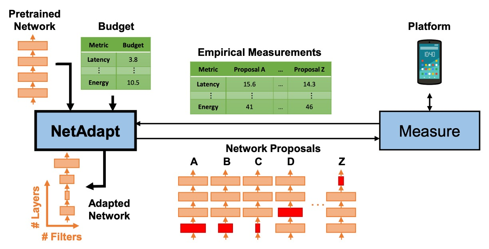
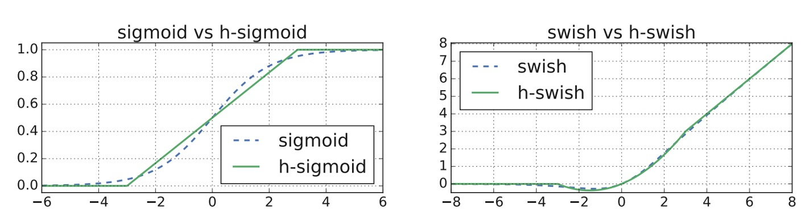
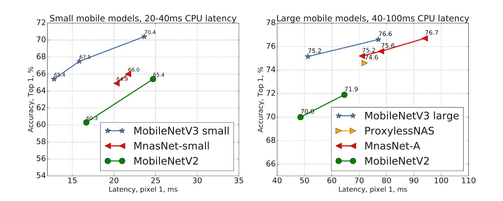
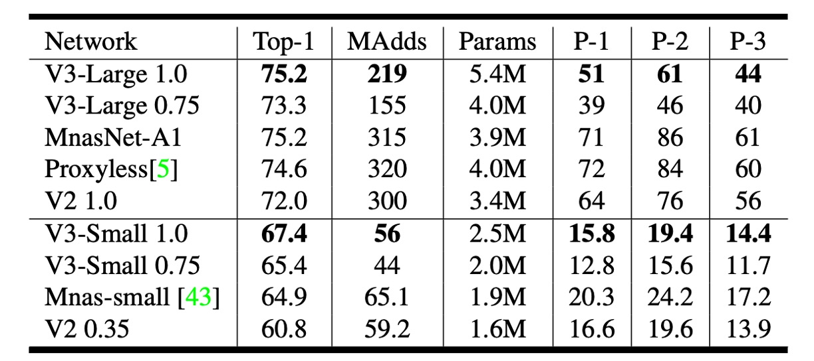
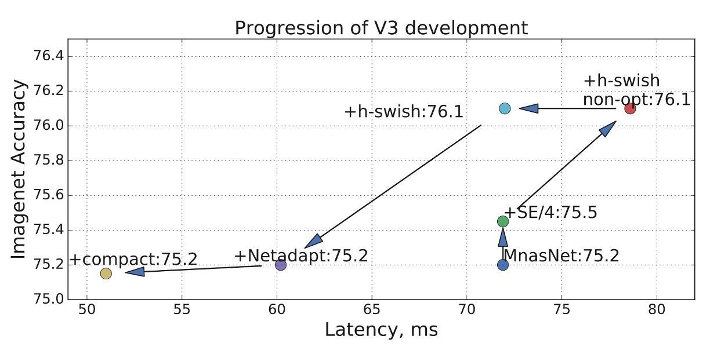

## カスタマイズ検索アーキテクチャ

[**Searching for MobileNetV3**](https://arxiv.org/abs/1905.02244)

---

先日、SENet はほぼ MobileNet-V3 を発表するところでした！

しかし、最終的には発表が中止され、論文にはほんの一節だけが残されました。

- [**SENet - 軽量モデルの効果展示**](../1709-senet/index.md#軽量モデルでの効果の表示)

Google チームも MobileNet の発展を続けたいと考え、MobileNet-V3 の探索を始めました。

## 問題の定義

実際、問題はほとんどありません。

著者たちは単により良い MobileNet を見つけたかったのです。

そこで、二つの方向性を考えました：

1. **ネットワークアーキテクチャ探索技術の使用**：いわゆる NAS（ニューラルネットワークアーキテクチャ探索）。
2. **NetAdapt アルゴリズムの使用**：モバイル CPU 向けに調整を行うためのものです。

## 問題の解決

### MobileNet-V2 モジュール

<figure style={{"width": "70%"}}>

</figure>

### MobileNet-V3 モジュール

<figure style={{"width": "70%"}}>

</figure>

上の二つのアーキテクチャ図を比較すると、MobileNet-V3 の改善点がわかりますか？

その違いは、拡張層（expansion layer）に `Squeeze-and-Excitation` モジュールが追加されたことです。

約 1 年前に発表された論文 `MnasNet` では、すでに `MobileNet-V2` をベースに `Squeeze-and-Excitation` モジュールが追加されていました。

- [**[18.07] MnasNet: Platform-Aware Neural Architecture Search for Mobile**](https://arxiv.org/abs/1807.11626)

`MobileNet-V3` では、このモジュールがさらに改善され、非常に遅い `Sigmoid` 関数を取り除き、代わりに `Hard-Sigmoid` 関数を使用するようになりました。

:::tip
多くの人が `Squeeze-and-Excitation` モジュールは `MobileNet-V3` で提案されたものだと思っていますが、実は違います！
:::

### ネットワークアーキテクチャ探索

新しいモジュールが準備できたので、次の問題は「どうやって積み重ねるか？」です。

この部分では、`MnasNet` の方法を踏襲し、RNN ベースのコントローラを使用してネットワークアーキテクチャを探索します。

その後、ネットワークアーキテクチャに `NetAdapt` アルゴリズムとその他の最適化を適用します。

- [**[18.04] Netadapt: Platform-aware neural network adaptation for mobile applications**](https://arxiv.org/abs/1804.03230)

  

   <figure style={{"width": "70%"}}>
   
   </figure>
   

:::tip
この部分は本文の重要な部分ではないので、ネットワークアーキテクチャを調整するためのものだということを理解しておけば十分です。
:::

### 網路結尾變更

基於 MobileNetV2 的反向瓶頸結構和變體的模型使用 1x1 卷積作為最後一層，以便擴展到更高維度的特徵空間。也就是上圖中 `Original Last Stage` 內的 1280 維度的部分。

為了擁有豐富的預測特徵，這一層很重要，但這是以額外延遲為代價的。

為了減少延遲並保留特徵，作者將這一層移動到全局平均池化「之後」，也就是上圖中 `Efficient Last Stage` 的樣子。

原本計算時採用 7x7 的解析度，經過調整後，就是在 1x1 的解析度上進行計算，可以節省一定量的計算資源。

### 縮減初始濾波器

作者觀察到在 MobileNetV2 中，初始的 32 濾波器通常都是「鏡像」，也就是說其實一半的濾波器是多餘的。

因此，在這裡作者將初始濾波器從 32 減少到 16，同時加入 `hard-swish` 啟動函數，來保持模型的表現。

### 非線性啟動函數

作者在論文中大量採用了 `hard-swish` 和 `hard-sigmoid` 這兩種啟動函數。

這裡簡單看一下這些啟動函數的差異：

1. **ReLU (Rectified Linear Unit)**

   - **定義**：$ f(x) = \max(0, x) $
   - **特點**：當輸入 $ x $ 為正數時，輸出就是 $ x $；當輸入 $ x $ 為負數時，輸出為 0。
   - **用途**：由於其計算簡單和非飽和性質，ReLU 在許多深度學習模型中被廣泛使用。

2. **Swish**

   - **定義**：$ f(x) = x \cdot \sigma(x) $，其中 $ \sigma(x) $ 是 Sigmoid 函數 $ \sigma(x) = \frac{1}{1 + e^{-x}} $。
   - **特點**：Swish 函數是自我閘化的啟動函數，它結合了線性和非線性特性。
   - **用途**：在某些深度學習任務中，相較於 ReLU 和其他啟動函數，Swish 顯示了更好的性能。

3. **Hard-Swish**

   - **定義**：$ f(x) = x \cdot \text{relu6}(x+3)/6 $，其中 $\text{relu6}(x) = \min(\max(0,x), 6)$。
   - **特點**：Hard-Swish 是 Swish 函數的一種簡化形式，具有更快的計算速度和較低的計算成本。
   - **用途**：常用於需要高效計算的應用場景，如移動設備或邊緣裝置上的神經網路模型。

4. **Sigmoid**

   - **定義**：$ f(x) = \frac{1}{1 + e^{-x}} $
   - **特點**：輸出範圍在 0 到 1 之間，常用於將輸出壓縮到一個限定範圍內。
   - **用途**：由於其良好的概率解釋，經常用於二分類問題的最後輸出層。

5. **Hard-Sigmoid**
   - **定義**：$ f(x) = \max(0, \min(1, \frac{x+1}{2})) $
   - **特點**：這是 Sigmoid 函數的一種簡化版，其計算速度更快，適合於執行效率要求高的場合。
   - **用途**：與 Sigmoid 類似，但更常用於需要高效計算的模型中。

### 網路架構（大）

經過了上面的規畫，最後透過網路架構搜索，得到了一個新的 MobileNet-V3 模型。

下表的讀法，大部分和 `MobileNet-V2` 一樣，新的地方是：

- **SE**：表示是否使用了 `Squeeze-and-Excitation` 模組。
- **NL**：表示是否使用了非線性啟動函數。
- **HS**：表示是否使用了 `hard-swish` 啟動函數。
- **RE**：表示是否使用了 `ReLU` 啟動函數。
- **NBM**：表示沒有使用 `Batch Normalization`。

<figure style={{"width": "70%"}}>

</figure>

### 網路架構（小）

針對小型模型，作者們也展示了搜索的結果。

<figure style={{"width": "70%"}}>

</figure>

## 討論

### ImageNet 實驗結果

<figure style={{"width": "80%"}}>

</figure>

從上圖可以看出，MobileNetV3 優於目前最先進的模型，例如 MnasNet、ProxylessNas 和 MobileNetV2。

### 移動裝置評估

<figure style={{"width": "70%"}}>

</figure>

作者在上表中報告了不同 Pixel 手機上的浮點效能。

上表中 P-1 表示 Pixel 1，P-2 表示 Pixel 2，P-3 表示 Pixel 3，單位是推論速度 ms，在基於單核心的表現。

### 優化紀錄

<figure style={{"width": "70%"}}>

</figure>

上圖展示了作者們在本論文中的優化紀錄。

從 MnasNet 開始，逐步添加 `SE` 和 `h-swish`，最終使用 `Netadapt` 進行網路架構搜索，得到最後的結果。

## 結論

移動設備的市場很大，算力有限，因此需要更「客製化」的模型。

這篇論文展示了如何通過網路架構搜索和 NetAdapt 演算法，在 Pixel 手機上實現了更好的效能。

未來或許能夠拓展到 Pixel、Apple、Samsung 各種不同手機上的統一架構。

不管是對手機使用者，還是對我們這種模型開發者，這都是一個好消息。
