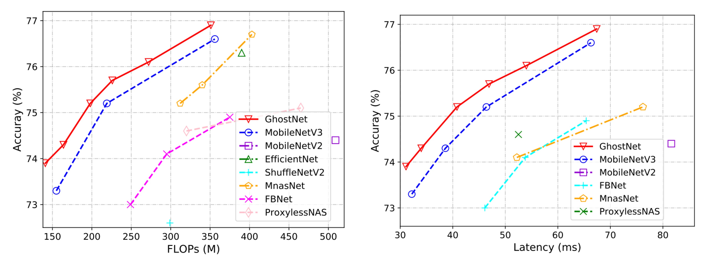

## 特徴マップのゴースト

[**GhostNet: More Features from Cheap Operations**](https://arxiv.org/abs/1911.11907)

---

MobileNet が提案された後のしばらくの間、依然として多くの研究者が軽量ネットワークの性能向上に取り組んでいました。

本論文では特に「特徴マップの冗長性」の問題に焦点を当てて研究しています。

## 問題の定義

<figure style={{"width": "70%"}}>

</figure>

畳み込みネットワークの特徴マップは、通常、大量の冗長な情報を含んでおり、これらの冗長情報は一定の計算資源を占有し、ネットワークの性能に悪影響を与えます。

上図はその簡単な例で、特徴マップの一部の領域が重複しており、これらの重複した領域はネットワークの性能にはあまり役立たない可能性があります。

## 問題の解決

一般的に、よく使われる方法は二つあります。一つはモデル圧縮、もう一つはモデルをよりコンパクトにすることです。

### モデルアーキテクチャ

<figure style={{"width": "70%"}}>

</figure>

GhostNet では、著者は新しいモデルアーキテクチャを提案しました。上図に示されるように、通常の畳み込みネットワークとは異なり、GhostNet のモジュールは二段階のプロセスで機能します：

1. 最初に畳み込み操作を使用して、入力特徴マップのチャンネルを圧縮し、「ベース特徴マップ」A を得ます。
2. 次に、ベース特徴マップ A に基づいて各チャンネルに線形計算を行い、「ゴースト特徴マップ」B を得ます。

最後に、ベース特徴マップ A とゴースト特徴マップ B を連結（Concatenate）操作で融合させ、最終的な特徴マップを得ます。

ここでの線形計算は畳み込み計算よりも簡単であるため、GhostNet は計算量を大幅に削減することができます。

:::tip
論文で言われている「各チャンネルの「Cheap」線形計算」とは、実際にはグループ化された畳み込み（Grouped Convolution）のことです。この方法は計算量を削減し、効率を向上させることができます。
:::

### モジュール構成

<figure style={{"width": "60%"}}>

</figure>

- **ゴーストボトルネック**

  ゴーストモジュールの利点を活かし、著者は小型 CNN 向けにゴーストボトルネック（G-bneck）を導入しました。この設計は ResNet の基本的な残差ブロックに似ており、複数の畳み込み層とショートカットが組み合わされています。

  ゴーストボトルネックは主に二つの積み重ねられたゴーストモジュールで構成されています。最初のゴーストモジュールは拡張層として機能し、チャンネル数を増加させ、拡張比は出力チャンネル数と入力チャンネル数の比率として定義されます。二番目のゴーストモジュールはチャンネル数を減らしてショートカットパスと一致させ、このショートカットをこれらの二つのゴーストモジュールの入力と出力の間に接続します。

  バッチ正規化（BN）と ReLU 非線形性は各層に適用されます。また、MobileNetV2 の提案に基づき、二番目のゴーストモジュール後には ReLU を使用しません。

- **GhostNet**

  ゴーストボトルネックに基づき、著者はゴーストネットワーク（GhostNet）を提案しました。

  このアーキテクチャは基本的に MobileNetV3 の設計を踏襲し、そのボトルネックブロックをゴーストボトルネックに置き換えています。ゴーストネットワークは一連のゴーストボトルネックで構成され、最初の層は 16 個のフィルタを持つ標準的な畳み込み層で、その後、チャンネル数が増加するゴーストボトルネックが続きます。これらのゴーストボトルネックは、入力特徴マップのサイズに応じて異なる段階に分かれます。

  各段階の最後のボトルネックを除き、そのステップ幅は 2 で、残りのすべてのボトルネックのステップ幅は 1 です。最終的に、グローバル平均プーリングと畳み込み層を通じて特徴マップを 1280 次元の特徴ベクトルに変換し、最終分類を行います。

  一部のゴーストボトルネックでは、残差層に Squeeze-and-Excitation（SE）モジュールも適用されています。MobileNetV3 と比較すると、ゴーストネットワークではハードスイッチ関数（hard-swish）は使用していません。これは遅延が大きいためです。

- **幅乗数**：

  ゴーストネットワークの基本的なアーキテクチャは低遅延で高精度を提供しますが、特定の状況ではより小さく、より高速なモデルが必要であったり、特定のタスクでより高い精度が求められる場合もあります。

  これらの異なるニーズに応じて、各層のチャンネル数にファクター$\alpha$（幅乗数）を掛けることができます。これにより、ネットワーク全体の幅を一貫して変更でき、モデルのサイズと計算コストを約$\alpha^2$で制御できます。

  通常、$\alpha$が小さいほど遅延と性能が低下し、大きいほど性能が向上します。この設計の柔軟性により、ゴーストネットワークはさまざまなアプリケーションや要求に適応できます。

最終的なモデル構成は以下の表の通りです：

<figure style={{"width": "60%"}}>

</figure>

## 討論

### ImageNet での性能

提案されたゴーストネットワークの優位性を確認するために、著者は ImageNet の画像分類タスクで実験を行いました。

ここでは、過去の文献で使用されているトレーニング設定を遵守しましたが、バッチサイズが 1024 で、8 つの GPU でトレーニングする際に初期学習率を 0.4 に設定しました。すべての結果は、ImageNet の検証セットで単回切り取り（single-crop）の top-1 性能を使用して報告されています。ゴーストネットワークの場合、メインの畳み込み層のカーネルサイズを k=1、すべてのゴーストモジュールのパラメータ s=2、d=3 に設定しました。これらの設定は比較的シンプルです。

著者は、MobileNet シリーズ、ShuffleNet シリーズ、ProxylessNAS、FBNet、MnasNet など、いくつかの現代的な小型ネットワークアーキテクチャを競争相手として選び、結果をまとめたのが上の表です。

これらのモデルは、通常モバイルアプリケーション向けに約 50、約 150、200-300 MFLOPs の 3 つの計算複雑度レベルに分けられます。結果を見ると、これらの小型ネットワークでは、一般により大きな FLOP がより高い精度につながることが示されています。ゴーストネットワークは、さまざまな計算複雑度レベルで他の競争相手よりも優れており、計算リソースを利用して特徴マップを生成する効率が高いことが分かります。

実際の推論速度では、提案されたゴーストネットワークがモバイルアプリケーション向けに設計されているため、著者は TFLite ツールを使用して ARM ベースの携帯電話上での実際の推論速度を測定しました。文献でよく見られる設定に従い、バッチサイズ 1 で単一スレッドモードで実行しました。

下の結果から、ゴーストネットワークは同じ遅延で MobileNetV3 より約 0.5%高い top-1 精度を示し、ゴーストネットワークは同様の精度でより少ない実行時間で性能を達成できることがわかります。例えば、ゴーストネットワークは 75.0%の精度で 40ms の遅延を持つのに対し、MobileNetV3 は同じ精度で約 45ms を要します。

:::tip
論文では、推論速度のテストは ARM アーキテクチャの携帯電話で、TF-Lite を使用して行われました。実際にはどの携帯電話を使用したかは記載されていませんが、同様の設定とモデルであっても、異なるブランドの携帯電話ではパフォーマンスが異なる場合があります。

したがって、GhostNet を使用する際には、読者が自分で実験を行い、推論速度が自身の要求に合っているか確認することをお勧めします。
:::

## 結論

現在の深層ニューラルネットワークの計算コストを削減するために、本論文では新しいゴーストモジュールを提案し、効率的なニューラルネットワークアーキテクチャを構築しました。この方法は、元のモデルをコンパクトなモデルに変換する即座に使用可能なモジュールであり、かなりの性能を保持しつつ実現できます。

ニューラルネットワークの開発過程において、GhostNet アーキテクチャは選択肢の一つとなり、特にリソースが限られた状況下では、GhostNet はさらに多くの可能性を提供するかもしれません。
