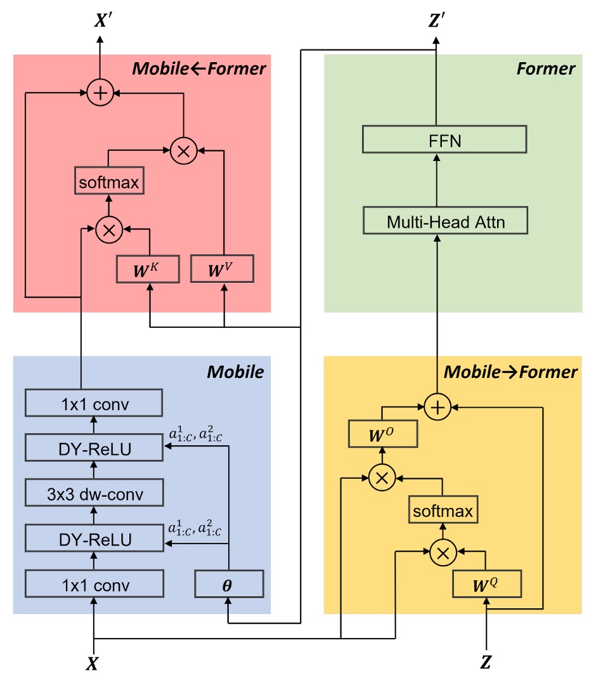
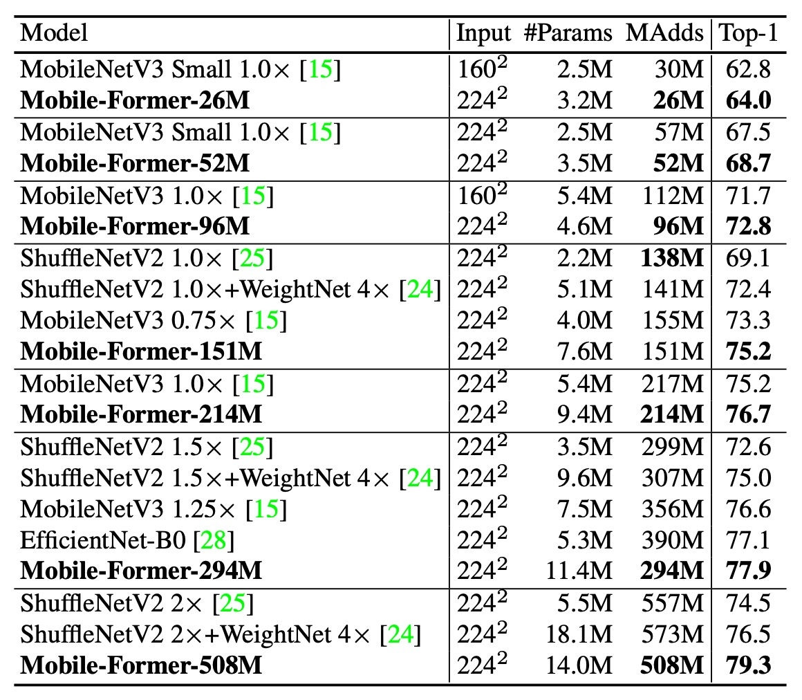
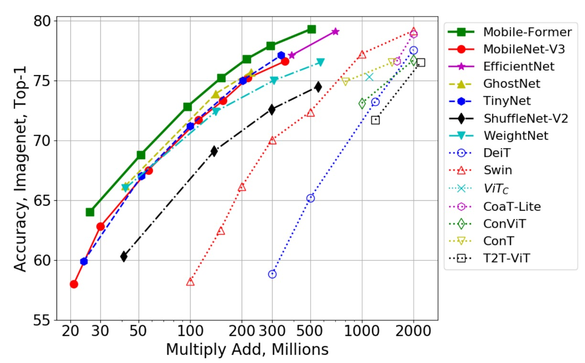

## 双方向接続ブリッジ

[**Mobile-Former: Bridging MobileNet and Transformer**](https://arxiv.org/pdf/2108.05895)

---

ViT をモバイルデバイス上で動かすために、研究者たちは様々な方法を考案しました。

## 問題の定義

実行できないわけではありませんが、遅いのです。

ViT のアーキテクチャは、スマートフォンではサポートが不十分で、ハードウェアアクセラレーションの利点を享受することが難しいのです。

本論文の著者は次のように考えました：

- **「MobileNet の上に、少しだけ Transformer のアーキテクチャを加えよう！」**

## 問題の解決

### モデルアーキテクチャ

著者は双方向接続ブリッジアーキテクチャを提案し、MobileNet と Transformer を並列に接続しました。

詳細なフローは次の図の通りです。手順に従って説明します：

1. **青いブロック**：入力画像は MobileNet の特徴抽出層を通じて特徴マップを得ます。
2. **黄色いブロック**：同時に、入力画像は Transformer ブロックを通じて、クロスアテンションメカニズムで特徴を抽出します。
   - このステップでは、著者は事前に学習可能なトークンを準備します。トークンの数は最大でも 6 個です。
   - これらのトークンをクエリとして扱い、特徴マップをキーとバリューとして使用します。
3. **緑のブロック**：クロスアテンション後、次に自己注意（Self-Attention）を計算します。
4. **赤いブロック**：最初のステップで得られた出力を、3 番目のステップで得られた出力に対してクロスアテンションを行います。
5. 最後に、4 番目のステップの出力は次の MobileNet ブロックの入力となり、同時に 3 番目のステップの出力は次の Transformer ブロックの入力となります。

各注意機構では、著者は線形投影計算を省略して、パラメータ数と計算量を減らします。例えば、一般的な入力では $x$ を $W_q x$、$W_k x$、$W_v x$ に変換して計算しますが、ここでは $x$ 自身で計算を行います。

その他の細かい設計として、FFN では膨張比率を 4 から 2 に変更したり、Dynamic ReLU の入力を緑のブロックの出力に変更したり（元々は平均プーリングと MLP を使用）、正規化には Post-LN を使用するなどがありますが、ここでは詳細を省略します。

:::tip
この論文で注目すべき点は、緑のブロックの出力が赤いブロックに送られるだけでなく、青いブロックにも送られ、Dynamic ReLU の入力として使用されることです。

この操作には大きな議論の余地があり、モデルの速度を遅くする大きな要因の一つであることは間違いありません。
:::

### アーキテクチャのパラメータ

下記の表は、元々の MobileNet-V3 アーキテクチャに基づき、著者が各ブロックを Mobile-Former ブロックに変更したものです。

## 討論

### ImageNet 上での性能

著者は ImageNet データセットで画像分類実験を行いました。ImageNet データセットには 1000 クラスがあり、1,281,167 枚の訓練画像と 50,000 枚の検証画像があります。

訓練設定では画像解像度を 224×224 に設定しました。すべてのモデルはゼロから訓練され、AdamW 最適化アルゴリズムを使用して 450 エポックで訓練され、余弦学習率減衰を採用しました。バッチサイズは 1024 です。データ増強技術には Mixup、AutoAugment、Random Erasing が含まれています。異なるモデルの複雑さに応じて、異なる初期学習率、重み減衰、ドロップアウトを使用しました。

上の表は Mobile-Former とクラシックな効率的 CNN との比較を示しています。これらの CNN には MobileNetV3、EfficientNet、ShuffleNetV2 などが含まれており、比較範囲は 26M から 508M FLOP です。

Mobile-Former はほとんどのグループで、より低い計算コスト（FLOP）で効率的な CNN を上回り、150M FLOP 付近のグループでは Mobile-Former の FLOP が ShuffleNet/WeightNet より若干高くなっていますが、その Top-1 精度は顕著に高い（75.2% 対 69.1%/72.4%）。

---

次に、著者は Mobile-Former を他の視覚 Transformer モデルと比較しました。これには DeiT、T2T-ViT、PVT、ConViT、CoaT、ViTC、Swin が含まれます。

すべての変種は 224×224 の画像解像度で、教師ネットワークによる蒸留訓練は行われていません。Mobile-Former は計算コストが他の Transformer 変種の 30% に過ぎないにもかかわらず、より高い精度を達成しました。これは Mobile-Former が少ないトークンでグローバルな相互作用をモデル化し、MobileNet を効果的に利用して局所的な特徴を抽出しているためです。

Mobile-Former（450 エポックで訓練し蒸留なし）は、教師ネットワークを使用した蒸留訓練を 1000 エポック行った LeViT（精度 77.9% 対 76.6%、FLOP 294M 対 305M）を上回っています。

---

上の図は、著者が Mobile-Former を他の CNN モデル（例えば GhostNet）や視覚 Transformer の変種（例えば Swin や DeiT）と比較した結果を示しています。

Swin と DeiT の FLOP 範囲は 100M から 2G で、ネットワークの幅と高さを慎重に縮小することで実現されています。Mobile-Former はこれらの CNN や ViT 変種を明確に上回り、MobileNet と Transformer の組み合わせによる並列設計の利点を示しました。視覚 Transformer が低 FLOP 範囲で効率的な CNN に劣ることは明らかですが、この研究は適切なアーキテクチャ設計によって、Transformer も低 FLOP 範囲で効果的に機能することを証明しました。

### アブレーション実験

では、Mobile-Former のどの部分が性能に最も影響を与えているのでしょうか？

著者はアブレーション実験を行い、Mobile-Former の異なる部分を消去して、その性能への影響を観察しました。

上の表の実験結果では、MobileNet に Former と橋渡し（Mobile→Former と Mobile←Former）を加えた場合、計算コストはわずか 12% 増加しましたが、Top-1 精度は Mobile のベースラインより 2.6% 向上しました。

また、Mobile サブモジュールで Dynamic ReLU を使用することで、Top-1 精度はさらに 1.0% 向上しました。Dynamic ReLU のパラメータは最初のグローバルトークンから生成され、これにより Mobile-Former の並列設計が有効であることが証明されました。

---

上記の表は、Former 内で使用する異なる数のグローバルトークンによる ImageNet 分類結果を示しています。これらのトークンの次元は 192 です。

興味深いことに、1 つのグローバルトークンのみを使用しても良好な結果（Top-1 精度 77.1%）が得られます。3 個と 6 個のトークンを使用することで、精度はそれぞれ 0.5% と 0.7% 向上しました。6 個を超えるトークンを使用すると、精度の向上は止まりました。このようなグローバルトークンのコンパクト性こそが、Mobile-Former の効率性の鍵となっています。

## 結論

Mobile-Former は、MobileNet と Transformer を並列に設計することで、高効率な視覚モデルを実現しました。

しかし、著者は次のようにも述べています：Mobile-Former は大きな画像を処理する際には MobileNetV3 よりも高速な推論速度を誇りますが、画像のサイズが小さくなると、Mobile-Former の速度は遅くなります。特にモバイルデバイス上では、この差がより顕著になるでしょう。この点については、今後の研究者によってさらに探求されるべき問題です。

:::tip
この論文で言及されている MobileNet-V3 のデータは古く、現代的なトレーニングプランで最適化されていない結果です。読者は MobileNet-V4 の論文で最新の情報を確認できます。

- [**[24.04] MobileNet-V4: 五年後の相続**](../2404-mobilenet-v4/index.md)

おそらくこの新しい基盤上で、Mobile-Former は異なる結果を見せることでしょう。
:::
