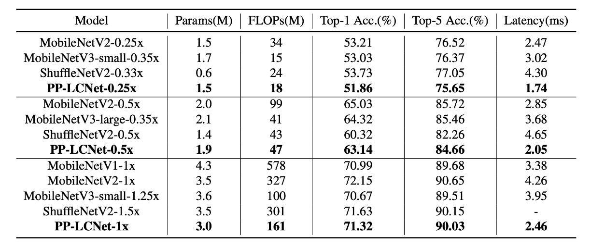

# [21.09] PP-LCNet

## 速度の限界を探る

[**PP-LCNet: A Lightweight CPU Convolutional Neural Network**](https://arxiv.org/abs/2109.15099)

---

軽量モデルの競争には、いくつかの主要な方向性があります。

- 一つは、**パラメータ数を最適化してモデルのサイズを減らすこと**。
- 二つ目は、**計算量（FLOPs）を最適化し、計算コストを減らしてモデルの速度を向上させること**。
- 三つ目は、**推論時間を最適化すること**。

え、待って？

パラメータ数と計算量を最適化することは、推論時間を最適化することと同じではないのか？

多くの人はこう考えがちです：「パラメータ数と計算量を最適化すれば、自然に推論時間も速くなるだろう」と。

- **答えは：違う！**

---

簡単な例を挙げてみましょう：

- ResNet のスキップ接続
- GoogleNet の Inception モジュール
- 異なるモジュール間でのパラメータ共有

これらの操作は、パラメータ数や計算量が同じ場合でも、推論時間を増加させる原因となります。

その理由は、メモリの読み取りや複数の分岐アーキテクチャ間での待機によるものです。

しかし、この論文ではこの問題について深く掘り下げて議論することはなく、他の論文でさらに議論を深めることになります。

## 問題の定義

この論文では、いくつかの問題を解決することを目的としています：

1. **遅延を増加させずに、ネットワークがより強力な特徴表現を学習する方法は？**
2. **軽量モデルの精度を CPU 上で向上させる要素は何か？**
3. **異なる戦略を効果的に組み合わせて、CPU 上で軽量モデルを設計する方法は？**

## 解決策

### モデルアーキテクチャ

<figure style={{"width": "80%"}}>

</figure>

著者は上記の問題を解決するためにいくつかの戦略を提案しています。

1. **DepthSepConv**

   著者は、[**MobileNetV1**](https://arxiv.org/abs/1704.04861) で提案された DepthSepConv を基本ブロックとして使用しています。ここでは、ショートカットや結合（concat）などの操作を使用しないため、計算効率が向上します。

   特に過去の研究では、小さなモデルでショートカットを使うことは性能向上にはあまり効果がないことが証明されています。

   一方、Intel CPU では、Inverted Block や ShuffleNet Block に特化した最適化が施されており、推論時により良い性能を発揮します。

2. **HSwish**

   ReLU 活性化関数は確かに最速ですが、必ずしも最良ではありません。

   現在では Swish、Mish、GELU など、多くの改良された活性化関数が存在しており、これらはモデルのパフォーマンスを向上させます。

   著者は [**MobileNetV3**](https://arxiv.org/abs/1905.02244) で提案された HSwish を参考にしており、この活性化関数は速度を保ちながら、モデルの性能を向上させます。

   :::tip
   Hswish 関数の式は次の通りです：

   $$ \text{Hswish}(x) = x \frac{\text{ReLU6}(x+3)}{6}, \text{ReLU6}(x) = \min(\max(x, 0), 6) $$

   ここで、$\text{ReLU6}(x)$ は ReLU 関数の変種で、入力 $x$ の値を 0 と 6 の間に制限します。

   この関数の特徴は次の通りです：

   - **非線形性**：深層学習モデルに必要な非線形処理能力を提供し、複雑なデータパターンを学習します。
   - **有界性と滑らかさ**：$\text{ReLU6}$ の制限により、Hswish 関数は $-3$ から無限大の範囲で有界であり、比較的滑らかです。
   - **計算効率**：構造が比較的シンプルなため、計算が効率的であり、計算リソースが限られているデバイスでの使用に適しています。

   :::

3. **SEBlock**

   このアーキテクチャは、次の論文に由来します：

   - [**Squeeze-and-Excitation Networks**](https://arxiv.org/abs/1709.01507)

   このモジュールは、SENet が 2017 年の ImageNet チャレンジで優勝するのに役立ちました。

   ただし、Intel CPU 上ではこのモジュールが推論時間を増加させるため、著者はここで簡素化を行い、ネットワークの末端にのみ配置しました。

   実験の結果、この設計は精度を向上させる一方で、推論速度が低下することはありませんでした。

4. **大きなカーネルの畳み込み**

   [**MixNet**](https://arxiv.org/abs/1907.09595) では、著者が異なるサイズの畳み込みカーネルがネットワークの性能に与える影響を分析し、最終的に同じ層で異なるサイズの畳み込みカーネルを混合しました。

   ただし、この自由な混合はモデルの推論速度を低下させるため、著者はここでも簡素化を行い、ネットワークの末端にのみ配置しました。

   ネットワークの末端では、3x3 の畳み込みを 5x5 の畳み込みに変更することで、モデルの精度を向上させました。

5. **最後に追加した全結合層**

   モデルが小さすぎて情報容量が不足していたため、著者はネットワークの最後に 1280 次元の全結合層を追加しました。

## 討論

### 実験結果

<figure style={{"width": "50%"}}>

</figure>

<figure style={{"width": "80%"}}>

</figure>

著者は ImageNet-1k データセットで実験を行いました。このデータセットには 128 万枚の訓練画像と 1000 クラスの 5 万枚の検証画像があります。

- **訓練設定**：

  - 最適化には SGD（確率的勾配降下法）を使用し、モーメンタムは 0.9、重み減衰は 3e-5（大きなモデルの場合は 4e-5）です。
  - バッチサイズは 2048、学習率は 0.8 から開始し、余弦退火スケジュールで調整されます。
  - 訓練プロセスは 360 エポックで、5 回の線形ウォームアップエポックを含みます。
  - 画像前処理には、224×224 ピクセルへのランダムクロップとランダム水平反転が含まれます。

- **評価フェーズ**：

  - 評価時には、まず画像の短辺を 256 ピクセルに調整し、次に 224×224 ピクセルの中心クロップを行います。

- **精度向上技術**：

  - SSLD 蒸留法を使用すると、PP-LCNet の精度が顕著に向上します。表 3 では、PP-LCNet と他の最先端モデルとの比較が示されています。

上記の図表から、PP-LCNet は計算量とパラメータ数がほぼ同じで、精度が同等であるにもかかわらず、推論速度は他のモデルに比べて 1.5 倍以上速いことがわかります。

### アブレーション実験

1. **SE モジュール（Squeeze-and-Excitation）**:

   - SE モジュールは、チャネル間の関係に対する注意を強化することで、モデルの精度を向上させます。
   - ネットワークの末端に SE モジュールを追加することは、他の場所に追加するよりも効果的です。

   したがって、PP-LCNet では、推論速度と精度のバランスを取るために、最後の 2 つのブロックに SE モジュールを優先して追加しています。

2. **大きなカーネルの使用**:

   - 大きなカーネル（例えば 5×5）は精度を向上させますが、ネットワークのすべての場所に追加するのは適していません。
   - SE モジュールと同様に、大きなカーネルはネットワークの末端に配置する方が効果的です。

   したがって、特定の層にのみ 5×5 の深層分離畳み込みカーネルを使用し、他の層では 3×3 のカーネルを維持します。

3. **異なる技術の統合効果**:

   - H-Swish と大きなカーネルは、ほとんど推論時間を増加させることなく性能を向上させます。
   - 適量の SE モジュールを追加することで、さらに性能が向上します。
   - グローバル平均プーリング（GAP）の後に大きな全結合層を使用すると、精度が顕著に向上します。
   - ドロップアウト戦略を適用することも、モデルの精度を向上させるのに役立ちます。

## 結論

この研究では、著者は軽量な Intel CPU 向けのネットワークを開発する方法に焦点を当てており、推論時間を増加させることなくモデルの精度を向上させることを目的としています。

広範な実験と手法の最適化を通じて、さまざまな視覚タスクで優れた性能を発揮するネットワークアーキテクチャを提案し、特に精度と速度のバランスにおいて優れたパフォーマンスを示しました。

:::info
このモデルは非常に小さく、精度も悪くなく、推論速度も非常に速いです。

モバイルアプリケーションやモデル規模に制限がある状況では、通常最初に考慮すべき選択肢となります。
:::
