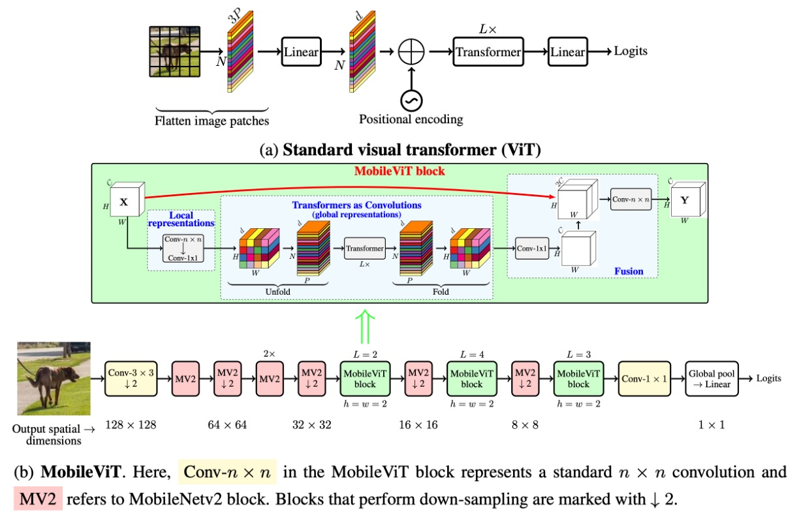
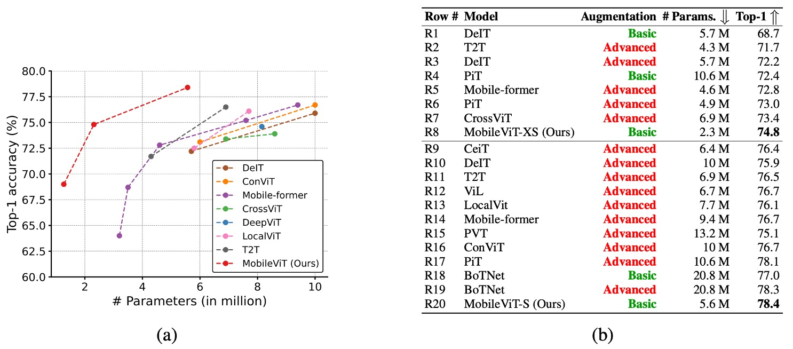

# [21.10] MobileViT

## 設計変更による畳み込みカーネルの変更

[**MobileViT: Light-weight, General-purpose, and Mobile-friendly Vision Transformer**](https://arxiv.org/abs/2110.02178)

---

Microsoft が **Mobile-Former** を発表してからほぼ 1 ヶ月後、Apple もこの問題に対する解決策として **MobileViT** を提案しました。

## 問題の定義

根本的な問題は、ViT がモバイルデバイス上でパフォーマンスが悪いことです。

Mobile-Former が採用した並列接続橋構造とは異なり、MobileViT は畳み込み操作における「最も重要な」行列乗算部分を自己注意機構に置き換えることで、畳み込みカーネルの受容野を広げ、モデルのパフォーマンスを向上させることを目指しています。

この論文の手法を理解するためには、まず畳み込み操作を振り返る必要があります。

## 問題解決

### 畳み込みの復習

畳み込み操作を高速化するために、その操作を「**unfold**」と「**fold**」に分解することができます。この分解により、畳み込みを行列乗算問題として見ることができ、特定の最適化シナリオでより効率的に計算できます。

- **1. Unfold 操作**

  Unfold（または「im2col」）操作は、入力テンソル（例えば画像）を行列乗算に適した形状に展開する操作です。

  例を挙げると、$3 \times 3$ の入力行列 $X$ が次のように与えられているとします：

  $$
  X = \left[\begin{matrix}
  1 & 2 & 3 \\
  4 & 5 & 6 \\
  7 & 8 & 9
  \end{matrix}
  \right]
  $$

  $2 \times 2$ の畳み込みカーネル $K$ は次のように与えられます：

  $$
  K = \left[\begin{matrix}
  1 & 0 \\
  0 & -1
  \end{matrix} \right]
  $$

  従来の畳み込みでは、畳み込みカーネルが入力行列上をスライドして畳み込み値を計算しますが、ここでは unfold を使ってこの過程を行列乗算に変換します。$2 \times 2$ のスライディングウィンドウを使って、次の 4 つの$2\times 2$の領域（ウィンドウ）を行列 $X$ から展開できます：

  $$
  \left[\begin{matrix}
  1 & 2 \\
  4 & 5
  \end{matrix}\right],
   \left[\begin{matrix}
  2 & 3 \\
  5 & 6
  \end{matrix}\right],
  \left[\begin{matrix}
  4 & 5 \\
  7 & 8
  \end{matrix}\right],
  \left[\begin{matrix}
  5 & 6 \\
  8 & 9
  \end{matrix}\right]
  $$

  次に、これらのウィンドウを行ベクトルに展開し、行列を形成します：

  $$
  X_{\text{unfold}} = \left[\begin{matrix}
  1 & 2 & 4 & 5 \\
  2 & 3 & 5 & 6 \\
  4 & 5 & 7 & 8 \\
  5 & 6 & 8 & 9
  \end{matrix}\right]
  $$

- **2. 行列乗算**

  現在、展開された入力行列 $X_{\text{unfold}}$ を畳み込みカーネル $K$ の展開後の行ベクトル（$K$ を 1 次元ベクトルにフラット化したもの）と行列乗算を行います：

  $$
  K_{\text{flat}} = \left[\begin{matrix} 1 & 0 & 0 & -1 \end{matrix}\right]
  $$

  $$
  Y_{\text{flat}} = X_{\text{unfold}} \times K_{\text{flat}}^T
  $$

  ここで、$K_{\text{flat}}$ は $1 \times 4$ のベクトル、$X_{\text{unfold}}$ は $4 \times 4$ の行列で、両者を掛け合わせると $4 \times 1$ の出力ベクトルが得られます：

  $$
  Y_{\text{flat}} = \left[\begin{matrix}
  1 \cdot 1 + 2 \cdot 0 + 4 \cdot 0 + 5 \cdot (-1) \\
  2 \cdot 1 + 3 \cdot 0 + 5 \cdot 0 + 6 \cdot (-1) \\
  4 \cdot 1 + 5 \cdot 0 + 7 \cdot 0 + 8 \cdot (-1) \\
  5 \cdot 1 + 6 \cdot 0 + 8 \cdot 0 + 9 \cdot (-1)
  \end{matrix}\right]
  =
  \left[\begin{matrix}
  -4 \\
  -4 \\
  -4 \\
  -4
  \end{matrix}\right]
  $$

- **3. Fold 操作**

  「Fold」操作は、行列乗算の結果を出力の形状に再構成する操作です。この例では、上記で得られたベクトルを$2\times 2$ の出力行列に変換します：

  $$
  Y = \left[\begin{matrix}
  -4 & -4 \\
  -4 & -4
  \end{matrix}\right]
  $$

「**unfold**」と「**fold**」操作により、畳み込み問題を行列乗算問題に変換することができ、この方法は特定のシナリオで畳み込み計算を高速化するのに役立ちます。

### モデルアーキテクチャ

前述の畳み込みの紹介を終えた後、論文のアーキテクチャを正式に見ていきましょう。

最初は上の図が非常に複雑に見えましたが、前の説明があったおかげで今では非常にシンプルに感じます。

「**unfold**」の後、畳み込みカーネルのサイズで行列乗算を行う代わりに、自己注意機構を使用します。元の畳み込み運算では、畳み込みカーネルは局所的な情報交換しか行いませんが、自己注意機構では、各位置が他のすべての位置の情報を見れるようになり、グローバルな情報交換が実現されます。

当然ながら、この操作は計算コストが高いため、すべての位置には適用できません。著者は一部の場所で置き換えを行っています。以下の図のように：

畳み込みネットワークの後ろの 3 つのステージにおいて、著者は畳み込みカーネルを自己注意機構に置き換えました。この変更により、パラメータ数が削減され、モデルの効率が向上しました。

### 実験設定

著者は、ImageNet-1k データセットを使用して MobileViT モデルをゼロから訓練しました。

このデータセットには 128 万枚のトレーニング画像と 5 万枚の検証画像が含まれています。訓練プロセスには PyTorch を使用し、8 台の NVIDIA GPU 上で 300 エポック行いました。オプティマイザとしては AdamW を選択し、損失関数は平滑化パラメータ 0.1 のラベル平滑交差エントロピー損失を使用しました。実効バッチサイズは 1,024 画像で、マルチスケールサンプラーを使用しました。

学習率は最初の 3,000 回のイテレーションで 0.0002 から 0.002 にゆっくりと増加し、その後、コサイン減衰規則に従って 0.0002 まで減少します。L2 重み減衰は 0.01 に設定されています。データ拡張技術にはランダムリサイズクロッピングと水平反転が含まれています。モデルのパフォーマンスは、単一のクロップでの top-1 精度を用いて評価され、推論時にはモデルの重みの指数移動平均を使用しました。

:::tip
マルチスケールサンプラーはこの論文で提案された訓練技術であり、実験結果によると、マルチスケールサンプラーを使用することで最終的に約 0.5%の精度向上が見られました。しかし、これは訓練の技術であり、論文自体の主要な貢献ではありません。興味がある読者は、原文を参照してさらなる詳細を理解することができます。
:::

## 討論

### ImageNet におけるパフォーマンス

- **MobileViT は軽量 CNN より優れている**：

  - 異なるネットワーク規模において、MobileViT のパフォーマンスは、MobileNetv1、MobileNetv2、ShuffleNetv2、ESPNetv2、MobileNetv3 などの複数の軽量 CNN モデルを超えています。
  - 例えば、モデルサイズが約 250 万パラメータの場合、MobileViT は ImageNet-1k の検証セットで次のようなパフォーマンスを示しました：
    - MobileNetv2 より 5%高い
    - ShuffleNetv2 より 5.4%高い
    - MobileNetv3 より 7.4%高い。

- **MobileViT は重量級 CNN より優れている**：

  - MobileViT は ResNet、DenseNet、ResNet-SE、EfficientNet などの重量級 CNN モデルをも超えています。
  - 例えば、MobileViT は EfficientNet と同程度のパラメータ数で、精度が 2.1%高いです。

---

上の図では、赤色の `advance` は高度な強化技術を使用したことを示し、緑色の `basic` は基本的な強化技術のみを使用したことを示しています。高度な強化技術には Mixup、CutMix、RandAugment などの技術が含まれます。

- **ViT バリエーションとの比較**：

  - MobileViT は、DeIT、T2T、PVT、CAIT、DeepViT、CeiT、CrossViT、LocalViT、PiT、ConViT、ViL、BotNet、Mobile-former などの ViT バリエーションと比較されました。
  - 高度な強化技術を必要とする ViT バリエーションと異なり、MobileViT は基本的な強化技術のみを使用し、パラメータ数が少ないにもかかわらず、より良いパフォーマンスを実現しています。
    - 例えば、MobileViT は DeIT より 2.5 倍小さく、性能は 2.6%向上しています。

MobileViT は CNN の利点に似ており、最適化しやすく、安定しているため、新しいタスクやデータセットに容易に適用可能です。

:::tip
この論文で言及されている MobileNet シリーズのデータは古いものであり、現代的な訓練計画で最適化された結果ではありません。最新の情報は MobileNet-V4 の論文で確認できます。

- [**[24.04] MobileNet-V4: 五年後の相続**](../2404-mobilenet-v4/index.md)
  :::

## 結論

MobileViT は ImageNet-1k 上で多くの軽量および重量級 CNN モデルより優れたパフォーマンスを示しましたが、モバイルデバイスでの推論速度には依然として課題があります。

著者は論文の最後で、ViT ベースのネットワークアーキテクチャは CNN ベースのものと比べて、モバイルデバイス上での推論速度において約 1 桁の差があることを指摘しています。これは明らかに FLOPs やパラメータ数の最適化だけでは解決できない問題です。

この差が生じる主な理由は二つです：

1. GPU 上のトランスフォーマーには専用の CUDA カーネルがあり、これらのカーネルは ViT で標準で使用され、GPU 上でのスケーラビリティと効率を高めます。
2. CNN はバッチ正規化の畳み込み層との統合など、複数のデバイスレベルの最適化から恩恵を受けています。これらの最適化は遅延とメモリアクセスを改善します。

したがって、現時点では、ViT に関連するモデルをモバイルデバイスで推論するには多くの課題があります。今後、さらなるハードウェアおよびソフトウェアの最適化により、この問題が解決されることを期待しています。
