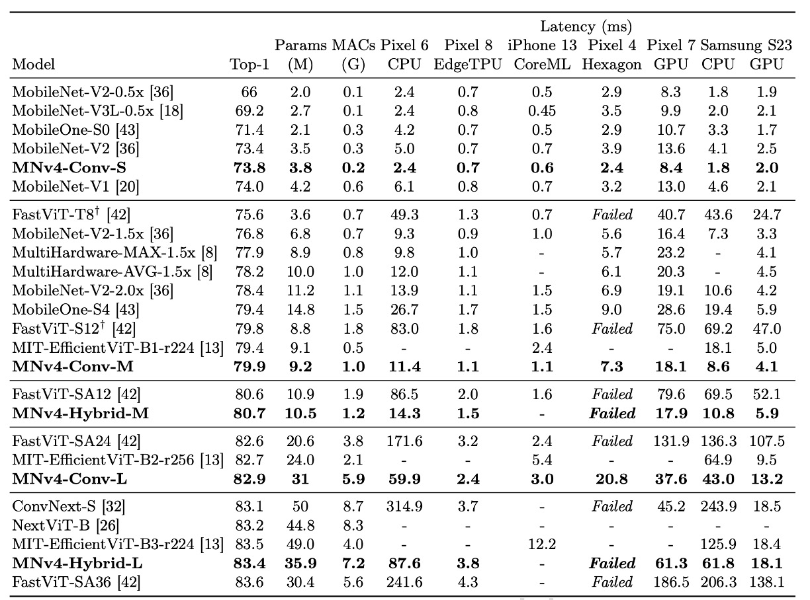
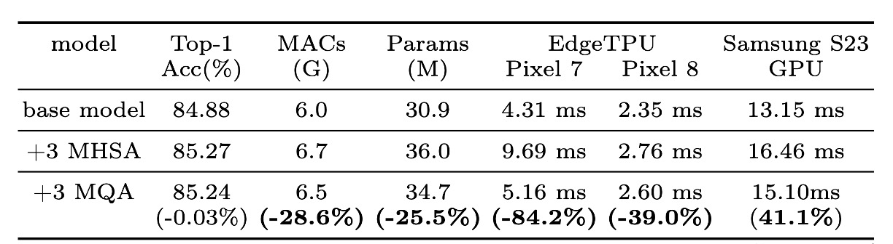

## 五年後の継承

[**MobileNetV4 - Universal Models for the Mobile Ecosystem**](https://arxiv.org/abs/2404.10518)

---

MobileNetV3 の発表から既に五年が経過しました。

この期間、学術界では多くの進展があり、より優れたネットワークアーキテクチャや多頭注意機構の適用シーンなどが登場しました。

## 問題の定義

新しい武器が登場すると、それを試してみたくなり、それらを MobileNet に統合してさらに良い効果が得られるかもしれないと考えます。

まずは、最近流行している注意機構が注目されます。この分野の過去の研究は、主に 2 つの流派に分かれています：

### 混合型注意

これらは CNN と Transformer の利点を融合させ、注意機構を軽量化ネットワークに適用することを目指しています。

代表的な研究は以下の通りです：

- [**[21.08] Mobile-Former: Bridging MobileNet and Transformer**](https://arxiv.org/abs/2108.05895)
- [**[21.10] MobileViT: Light-weight, General-purpose, and Mobile-friendly Vision Transformer**](https://arxiv.org/abs/2110.02178)
- [**[23.03] FastViT: A Fast Hybrid Vision Transformer using Structural Reparameterization**](https://arxiv.org/abs/2303.14189)

### 高効率型注意

この流派は、MHSA（多頭自己注意機構）の効率化に焦点を当てています。元々の $O(n^2)$ の計算量を $O(n)$ に削減することを試みています。

- [**[21.07] CMT: Convolutional Neural Networks Meet Vision Transformers**](https://arxiv.org/abs/2107.06263)
- [**[22.05] EfficientViT: Multi-Scale Linear Attention for High-Resolution Dense Prediction**](https://arxiv.org/abs/2205.14756)
- [**[22.06] Separable Self-attention for Mobile Vision Transformers**](https://arxiv.org/abs/2206.02680)
- [**[22.07] Next-ViT: Next Generation Vision Transformer for Efficient Deployment in Realistic Industrial Scenarios**](https://arxiv.org/abs/2207.05501)
- [**[22.12] Rethinking Vision Transformers for MobileNet Size and Speed**](https://arxiv.org/abs/2212.08059)

### 異なる畳み込みネットワークアーキテクチャ

注意機構に加えて、いくつかのネットワークアーキテクチャの総括的研究も行われています：

- [**[22.01] ConvNeXt: 卷積を再び偉大に**](../../classic-cnns/2201-convnext/index.md)

これも参考にできる対象となります。

## 問題解決

### ネットワークアーキテクチャ

著者はまず、MobileNet-V2 の反転ボトルネック（Invert Residual Block、論文中で IB と略称）を拡張しました。

まず図にある `Inverted Bottleneck` は MobileNet-V2 の基本構造で、この部分は既に馴染みがあると思います。

次に、著者はこの構造の前にもう一つの `Depthwise Convolution` を追加し、前面と中央の部分が「自由に組み合わせられる」ようにしました。

これにより、次の 4 つの異なる組み合わせを配置することができます：

1. 両方を選択：Extra DW
2. 最初の DW を選択：Conv Next 構造
3. 中央の DW を選択：元の IB
4. 両方を選択しない：純粋な FFN

このように自由に組み合わせられるモジュールは、論文中で `UIB`（Universal Inverted Bottleneck）と呼ばれています。

:::info
`UIB` 以外にも、論文では別の `Alternative Fused IB` が紹介されています。

これは、後続の NAS 検索のために固定されるコンポーネントであり、検索空間を構築する際の一つの規則は：

- 初期レイヤーを固定：第一段階で `Conv2D`（3x3 カーネル、stride=2）から始め、第二段階で `FusedIB` を使用して効率と精度のバランスを取ります。
  :::

### Mobile MQA

畳み込みネットワークのアーキテクチャ設計が完了した後、著者は新しい注意機構モジュールを導入します：Multi-Query Attention（MQA）。

このアーキテクチャは以下に基づいています：

- [**[19.11] MQA: 共有キーと値**](../../transformers/1911-mqa/index.md)

もし注意機構の基本構造を覚えていれば、これが Query、Key、Value の 3 つの部分で構成されていることが分かります。

多頭注意機構では、各ヘッドが独自の Query、Key、Value を持ちます。

このモジュールの主なアイデアは、各ヘッドが異なる Query を持ちながら、共通の Key と Value を使用することです。

過去の実験で、この設計はモデルのパフォーマンスを低下させることなく、バッチサイズが比較的小さいときに計算量を大幅に削減できることが証明されています。

移動デバイスでは、推論時のバッチサイズが通常 1 であるため、ほとんど問題にはなりません。

:::tip
著者は、彼らが MQA を軽量ネットワークに適用した最初の研究であると述べています。
:::

文字データの注意機構とは異なり、ここでは画像における注意機構が使用されています。

また、著者は別の論文を参照しています：

- [**[21.02] PVT: 空間縮減注意機構**](../../vision-transformers/2102-pvt/index.md)

この論文では空間縮減注意モジュール（Spatial-Reduction Attention、略して SRA）が提案されています。

簡単に言うと、注意機構を実行する前に特徴マップを空間的に縮小し、計算量を削減する方法です。

これら二つのアプローチを組み合わせることで、SRA の注意機構を MQA に置き換え、プーリング操作を畳み込みに変更すると、本論文で提案された Mobile MQA が得られます。

:::tip
上記に挙げた 10 篇近くの良い論文は後で整理しておきます……あぁ、忙しい。
:::

### クロスデバイス最適化

本論文の核心目標は、異なるデバイスで最適化を実現することです。

:::tip
以前の MobileNet-V3 の研究では、Pixel シリーズに対してのみ最適化が行われていました。
:::

実験を通じて著者は次のような重要な洞察を得ました：

1. **マルチパス効率の問題**：
   - 畳み込み組み合わせや類似のマルチパス設計は、FLOPs の計算は低いものの、メモリアクセスの複雑性により効率が低い。
2. **ハードウェアサポートの重要性**：
   - 高度なモジュール（例：Squeeze and Excite（SE）、GELU、LayerNorm）は、移動デバイスでうまくサポートされていない。
   - LayerNorm は BatchNorm より劣位にあり、SE は移動デバイスのアクセラレーターでは遅い。
3. **シンプルさの力**：
   - ReLU、Conv2D、DW-Conv2D、BatchNorm といったシンプルなモジュールは、移動デバイスで優れたサポートを受けている。

これらの洞察に基づき、NAS の検索時に検索システムは広くサポートされている標準的なモジュールを優先し、`UIB` と `MQA` モジュールを組み合わせて検索を行います。

## 討論

### ImageNet の実験結果

:::info
上記の表では、MobileNet シリーズ（V1、V2、V3）はすべて現代的な訓練プランで再訓練されており、そのため元の論文のデータよりパフォーマンスが高くなっています。
:::

MNv4 モデルは、効率性だけでなく、異なるハードウェアプラットフォームでの互換性も示し、モバイルエコシステム内でシームレスにデプロイ可能で、プラットフォーム固有の調整なしに使用できます。

1. **CPU 上でのパフォーマンス**：MNv4 モデルは MobileNetV3 の 2 倍の速度を誇り、同精度の他のモデルよりも顕著に高速です。
2. **EdgeTPU 上でのパフォーマンス**：MNv4 は MobileNet V3 の 2 倍の速度を記録しました。
3. **GPU および Apple ANE 上でのパフォーマンス**：S23 GPU や iPhone 13 の CoreML 上でも、MNv4 は優れたフロントエンド性能を発揮しました。
4. **競合モデルとの比較**：
   - **FastViT**：Apple Neural Engine で第 2 位ですが、GPU でのレイテンシは MNv4 の 5 倍以上。
   - **EfficientViT**：GPU 上で良好なパフォーマンスを示しますが、Apple Neural Engine でのレイテンシが高い。
   - **MobileNet V3**：CPU 上で良いパフォーマンスを示しますが、他のハードウェアプラットフォームではパフォーマンスが低下します。

著者は、MNv4 の成功が UIB ブロック、強化された NAS レシピ、および巧妙に設計された検索空間の使用に起因していることを述べています。

このモデルの汎用性は、モバイルモデルのさまざまなハードウェアプラットフォームで最適なパフォーマンスを達成する新たな基準を設定しました。

### MQA の効果

実験により、MQA がハイブリッドモデルにおいて優れた効果を示すことが確認されました。

上の表に示すように、MHSA と比較して、MQA は EdgeTPU と Samsung S23 GPU で 39% 以上の加速を実現し、品質損失はほぼゼロ（-0.03%）となりました。

MQA は MAC とモデルパラメータを 25%以上削減しました。

### MNv4-Conv-S

論文で提案された 4 つのモデルの中で、MNv4-Conv-S が最小のモデルです。

他のモデルアーキテクチャについては、論文を参照してください。

<figure style={{"width": "70%"}}>

</figure>

## 結論

これはモバイルエコシステム全体で効率的に機能する汎用かつ高効率なモデルです。

MobileNetV4 は、一連の革新と技術的最適化により、モバイル CPU、GPU、DSP、専用アクセラレータでパレート最適性能を達成しました。これは他の軽量モデル研究では非常に稀です。

:::tip
パレート最適（Pareto Optimality）は、経済学や工学でよく使われる概念で、他者の状況を悪化させることなく、ある一方の状況を改善できない最適状態を示します。この概念はイタリアの社会学者ヴィルフレド・パレート（Vilfredo Pareto）に由来します。
:::

＊

過去の開発経験では、新しい軽量モデルが登場するたびに、さまざまな携帯電話でテストを行っていました...

- 最高のものを見つけるためではなく、どの携帯電話が問題を起こすかを調べていたのです。

2023 年に大きな注目を浴びた `FastViT` 構造では、iPhone を離れた後、性能の低下が困惑するほど大きかったのです。

Google が事前にテストしてくれたおかげで、私たちは直接使用することができました。
