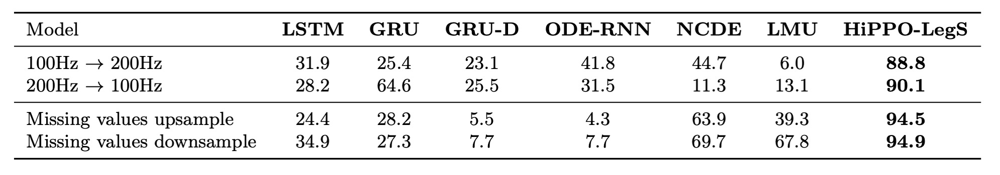
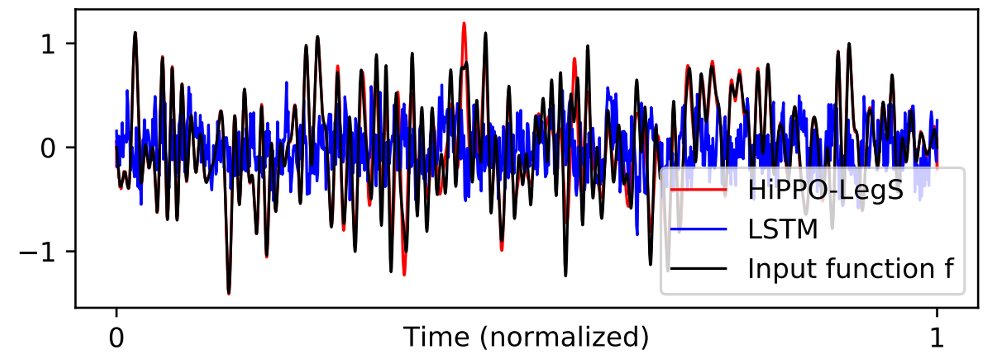

# [20.08] HiPPO

## カバの記憶

[**HiPPO: Recurrent Memory with Optimal Polynomial Projections**](https://arxiv.org/abs/2008.07669)

---

私たちはすでに **S4** を読んでいます。研究の文脈をよりよく理解するために、この論文をもう一度見返してみましょう。

正直に言うと、この著者の論文は非常に数学的で、開いて読むためには勇気を出さなければなりません。

:::tip
S4 の内容についてもっと知りたい場合は、以下の別の記事をご覧ください：

- [**[21.11] S4: マンバの序曲**](../2111-s4/index.md)
  :::

## 問題の定義

RNN の勾配消失と爆発の問題は、誰もが少しは知っていることでしょう。

これは構造に固有の特性ではありますが、緩和する方法はいくつかあります。例えば、LSTM や GRU のようなゲートを追加する方法や、Fourier Recurrent Unit や Legendre Memory Unit (LMU)のような特殊な基底を使用する方法です。

しかし、これは本質的な解決策ではありません！問題を隠すことができても、問題が存在しなくなるわけではありません。

著者はこれらの方法を支持していません。彼らは、これらの方法に共通する問題があると考えています：

1. **記憶機構を説明する統一的な理論フレームワークがない。**
2. **通常、入力シーケンスの長さや時間尺度についての事前情報が必要である。**

事前に時間尺度を知ることなく、理論的な基盤を持ちながら長期依存性の問題を処理できる方法を見つけることができるのでしょうか？

## 問題の解決

まず、RNN のシナリオを再考してみましょう。

### シーケンスの圧縮表現

つまり、時間とともに変化する入力関数 $f(t)$ が与えられた場合、私たちは各時間点 $t \geq 0$ で、過去のすべての歴史的情報（すなわち、開始時刻 0 から時間 $t$ までのシーケンスまたは信号の断片 $f(x)$, $x \le t$）を基にして意思決定、予測、または表現を行いたいと考えています。

しかし、全ての歴史 $f_{\le t} := \{ f(x) \mid x \le t \}$ をそのまま保存することは非現実的です。時間が進むにつれてデータ量は無限に増加し、保存や計算が非常に困難になるからです。

したがって、私たちは「**有界次元の圧縮表現**」を必要とします！

つまり、各時刻において、有限のパラメータ（数値）を使用して過去のすべての情報を近似的に表現することを望みます。

次に、私たちは有界次元の関数部分空間 $G$ を選択し、その中で最良の近似を見つける必要があります。

著者は自然で一般的な選択肢を選びました：**多項式空間**。

$G$ を多項式によって張られる空間としましょう：

$$
G = \{ \text{polynomials } p(x) : \deg(p) < N \}.
$$

この部分空間では、近似関数 $g$ を次のように表現できます：

$$
g(t) = \sum_{n=0}^{N-1} x_n p_n(t),
$$

ここで、$p_n(t)$ は一組の基底多項式（例えば、$p_n(t)=t^n$ やより適切な直交多項式系）であり、$x_n$ は私たちが維持し更新すべき係数です。$N$ は固定されているため、過去の歴史を圧縮して近似するために保存するべき係数は $N$ 個だけで済みます。

:::tip
**なぜ多項式を選ぶのか？**

多項式は非常に一般的な基底だからです：

1. 数学的に、多項式の密度は多くの関数を任意に近似することを保証します（$N \to \infty$ のとき）。
2. 直交多項式には、多項式最良近似係数の計算が閉じた形で解けるという多くの優れた性質があります。
3. フーリエ級数など、他の基底系も適切な変換の下で多項式の一種として見ることができます。

良いものは使わない手はないですよね？
:::

:::tip
**温度監視の例を挙げると：**

例えば、$f(t)$ が時間 $t$ におけるセンサーが測定した温度であり、過去の温度履歴を基にして未来の傾向を予測したいとしましょう。過去の全ての温度を記録するには無限のメモリが必要です；しかし、多項式近似を用いて過去の温度変化の全体的な傾向を表現できます。例えば、$N=3$ の場合、次のように表現できます：

$$
g(t) = x_0 + x_1 t + x_2 t^2
$$

これにより、最近の時間における温度変化の特徴を表すことができます。時間が進むにつれて、私たちは $x_0, x_1, x_2$ をオンラインで更新し、温度履歴に対する「圧縮された記述」を保持します。

これで、HiPPO フレームワークがやろうとしていることが少しは感じられましたか？
:::

### 近似的優劣

これが次の核心的な問題を引き起こします：

- **「近似」をどのように定義し、「近似の優劣」をどのように量化するか？**

近似がうまくいっているかどうか、つまり「近似の優劣」は、「距離の概念」を用いて測定できます。

一般的に、私たちは数直線上に長さがあり、平面上には距離があり、さらに高次元の空間にも距離があることを知っています。関数空間（各関数を 1 つの点として考える）にも同様に「距離」を定義できますが、その距離の定義方法は積分を通じて行われます。

著者の考えは次のようになります：

> **もし 2 つの関数が各時間点で非常に近い値を持っているなら、それらは「距離が近い」と言います；逆に、多くの場所で一致しない場合、それらは「距離が遠い」と言います。**

数学的には、「測度」(measure) $\mu$ と対応する「加重内積」(weighted inner product) を導入することによって、関数間の距離を定義します：

1. **測度 $\mu$**

   ここで、測度は「加重システム」として理解できます。これは、時間軸上でどの時間点が重要であるかを示すために使用されます。

   もし最新のデータをより重視したいのであれば、「最新の時間区間」に大きな重みを与え、過去の時間点には小さな重みを与えます。あるいは、すべての時間点を均等に扱うこともできます。

2. **加重内積 $\langle f,g \rangle_\mu$**

   2 つの関数 $f$ と $g$ の間の「内積」を次の式で定義します：

   $$
   \langle f,g \rangle_\mu = \int_0^\infty f(x)g(x) \, d\mu(x).
   $$

   直感的に言えば、もし $f$ と $g$ が多くの時間点で値が非常に似ていて、しかも正の値であれば、その積分は大きくなり、内積も大きくなります。逆に、もしそれらがしばしば一方が正で一方が負であるか、または差が大きい場合、その積分は小さく、場合によってはゼロに近くなり、内積は小さくなります。

二次元空間でベクトルの長さが $\sqrt{x^2 + y^2}$ であるように、関数空間では内積を用いて関数の「長さ」や「ノルム」を定義します：

$$
\| f \|_{L^2(\mu)} = \sqrt{\langle f,f \rangle_\mu} = \sqrt{\int_0^\infty f(x)^2 \, d\mu(x)}.
$$

もし関数 $f$ の値が大きければ、そのノルムは大きくなります；もし $f$ がゼロに近ければ、そのノルムは小さくなります。

最後に、比較的簡単な関数 $g$ を用いて $f_{\le t}$（0 から$t$までの歴史的データを表す）を近似しようとした場合、この計量構造の下で、両者の差異を次のように計算できます：

$$
\| f_{\le t} - g \|_{L^2(\mu)} = \sqrt{\int_0^\infty [f(x) - g(x)]^2 \, d\mu(x)}.
$$

この積分は、基本的に 0 から無限大までの時間区間で、$f$ と $g$ の差 $(f(x)-g(x))$ を平方し、加重して積分することで、**$(f(x)-g(x))^2$** を計算します：

1. もしほとんどの時間点で差が小さければ、その積分結果は小さくなり、$f$ と $g$ は非常に近いことを示します。
2. もし多くの時間点で差が大きければ、その積分結果は大きくなり、$f$ と $g$ の差が大きいことを示します。

## HiPPO フレームワーク

ここまでで、私たちは「記憶」の問題を「オンライン関数近似問題」として定義しました。つまり、任意の時間 $t$ において、$N$ 次元の部分空間（通常は多項式によって張られる）を用いて、入力関数が区間 $[0,t]$ で累積する歴史 $f_{\le t}$ を近似するというものです。

この目標を達成するために、次に解決すべき問題は次の通りです：

> **新しいデータ $f(t)$ が次々に到来する中で、どのようにオンラインで近似係数を更新し、常にその多項式が $f_{\le t}$ に近づくようにするか？**

### 直交多項式と係数の射影

1. **適切な基底 $\{g_n\}_{n<N}$ の選択：**

   近似が良い数学的性質を持つように、測度 $\mu^{(t)}$ に対応する直交多項式を部分空間 $G$ の基底として選びます。この基底の重要な利点は、直交性により、関数の「最適近似係数」を閉形式で求められることであり、その後の更新が簡潔に表現できることです。

2. **「最適近似射影」の求解：**

   $g(t) \in G$ が $f_{\le t}$ を近似する最適な多項式であるとき、$g(t)$ は次のように書けます：

   $$
   g(t, x) = \sum_{n=0}^{N-1} c_n(t) g_n(x)
   $$

   ここで、$c_n(t)$ は時間 $t$ における最適近似係数であり、定義により、$c_n(t)$ は内積を使って求められます：

   $$
   c_n(t) = \langle f_{\le t}, g_n \rangle_{\mu(t)}.
   $$

   直交性により、$c_n(t)$ を求めることは明確で実行可能な操作となります。

### 微分方程式への変換

現在の重要な問題は次の通りです：

> **どのように「時間 $t$ の変化」に従って $c(t) = [c_0(t), c_1(t), \dots, c_{N-1}(t)]^\top$ を更新するか？**

$f_{\le t}$ と測度 $\mu^{(t)}$ が時間とともに変化するため、$c_n(t)$ を $t$ に関して微分することを考えます。

詳細な数学的導出の結果、次のような式が得られます：

:::tip
著者は論文の付録で完全な導出過程を示していますので、ここではその部分を省略させていただきます。
:::

$$
\frac{d}{dt} c(t) = A(t) c(t) + B(t) f(t),
$$

ここで、$A(t)$ は $N \times N$ の行列、$B(t)$ は $N \times 1$ のベクトルであり、両者は測度と直交多項式の性質に基づいて決定されます。

これは、「最適近似係数の時間的な進化」を常微分方程式（ODE）で記述できることを意味します。

理論的には、この ODE を解くことで、オンラインで $c(t)$ を更新することができます。

しかし実際には、連続時間で ODE を正確に解くことはできませんが、離散化手法（例えばオイラー法やその他の数値的手法）を用いて、それを線形再帰形式に変換することができます。

そのため、新しい $f(t)$ の値が現れるたびに、次のように更新することができます：

$$
c_{t} = A c_{t-1} + B f(t),
$$

これにより、RNN のように、各ステップで $O(N^2)$（または特定の構造を利用してさらに低く抑えられる場合もある）で更新することが可能になります。

### HiPPO 抽象化

前の章で、私たちは「記憶の表現」問題を関数近似問題として定義しました：

- 任意の時間点 $t$ において、私たちは有限次元の方法で全歴史信号 $f_{\le t}$ を表現したいと考え、選択された計量においてこの近似が最適であることを確保したいと考えています。

著者はここでいくつかの重要な演算子を導入しています：

1. **投影演算子 $proj_t$：**

   - 入力：歴史的関数片段 $f_{\le t}$、つまり関数 $f$ が時間区間 $[0, t]$ で定義されている部分。
   - 出力：多項式 $g^{(t)} \in G$、ここで $G$ は $N$ 次元の多項式部分空間。

   この $g^{(t)}$ は、計量 $L^2(\mu^{(t)})$ の下で $f_{\le t}$ を最適に近似する多項式です。

   言い換えれば、$proj_t(f)$ は $f$ の $[0, t]$ の歴史を表す「最適多項式近似」を見つけます。

2. **係数抽出演算子 $coef_t$：**

   - 入力：多項式 $g^{(t)}$。
   - 出力：$c(t) \in \mathbb{R}^N$、つまりこの多項式が正交多項式基底の下で表される係数ベクトル。

   $g^{(t)}$ は $N$ 次元の部分空間の要素であるため、選択された正交基底（測度 $\mu^{(t)}$ によって定義）を用いて、$g^{(t)}$ を一意に次のように表現できます：

   $$
   g^{(t)}(x) = \sum_{n=0}^{N-1} c_n(t) \, g_n(x).
   $$

これら二つの演算子を組み合わせると、$hippo = coef_t \circ proj_t$ となり、この組み合わせは元の関数 $f(t)$ をその最適な多項式近似の係数 $c(t)$ に直接マッピングすることができます：

$$
(hippo(f))(t) = coef_t(proj_t(f)).
$$

このようにして、私たちは $c(t) \in \mathbb{R}^N$ を維持することで、動的に更新し、有限次元の歴史的記憶表現を得ることができます。

定義自体は簡単ですが、$proj_t(f)$ を直接計算するのは簡単ではありません。

著者はここで、$c(t)$ の更新規則を理論的に導出し、ODE で表現できることを示しました：

$$
\frac{d}{dt} c(t) = A(t)c(t) + B(t)f(t),
$$

ここで、$A(t)$ と $B(t)$ は測度 $\mu^{(t)}$ と基底選択によって決定される行列とベクトルです。

:::tip
**なぜ重要か？**

この ODE を通じて、私たちは各時間で複雑な投影問題を解く必要はなく、時間を前進させることで（または離散化して）$c(t)$ を現在の歴史に対する最適近似係数ベクトルとして維持できます。

さらに、この ODE を離散化することで、次のような線形再帰式が得られます：

$$
c_{k+1} = A' c_k + B' f_k,
$$

ここで、$A', B'$ は $A(t), B(t)$ の離散化結果です。

この離散化された再帰関係を用いることで、私たちは非常に効率的にオンラインで記憶表現を更新できます：

- 新しい入力値 $f_k$ が到来するたびに、前の状態 $c_k$ を基にして $c_{k+1}$ を計算します。

この方法により、元々複雑に見えた最適投影問題が実用的になります。
:::

最後に、著者は論文にかわいらしいカバのイラストと一枚の図を添えて、このプロセスを説明しています：

<figure style={{"width": "90%"}}>

</figure>

近似関数の簡略化プロセスは、以下の四つのステップに分かれています：

1. **任意の関数 $f$**：左上の図には、$t \ge 0$ で定義された関数曲線 $f(t)$ が表示されています。これは時間に応じて変化する信号入力を示します。
2. **各時間 $t$ において最適投影 $g^{(t)}$ を計算**：

   図の 2 番目の枠では、任意の時間 $t$ において、$f_{\le t}$ を近似する多項式 $g^{(t)}$ を見つけようとしている様子が示されています。

   図では、$g^{(t)}$ が $f(t)$ に近い関数曲線として描かれており、現在の時間範囲 $[0, t]$ を考慮し、選択した測度 $\mu^{(t)}$ によって定義された内積空間で最適な近似を判断します。

3. **係数表示と動的（ODE）**：

   3 番目の枠には、$g^{(t)}$ を正交多項式基底の線形組み合わせとして書き、係数 $c(t)$ を得る過程が示されています。

   この時、著者の理論結果は $c(t)$ が次の線形微分方程式（ODE）に従うことを示しています：

   $$
   \frac{d}{dt}c(t) = A(t)c(t) + B(t)f(t).
   $$

   これにより、問題は計算可能な動的システムに簡略化されます。

   最小誤差問題を反復して解くのではなく、時間とともに $c(t)$ を更新するだけです。

4. **離散化とオンライン更新**：

   最後に、実際のデータは離散的なシーケンス（例えば $f_0, f_1, \dots$）であるため、ODE を離散化し、図の一番右にある状態を得ます：

   $$
   c_{k+1} = A' c_k + B' f_k.
   $$

   これは簡潔な再帰関係であり、特別な「RNN のような」構造と見なすことができます。前の時間ステップの状態 $c_k$ と現在の入力 $f_k$ を与えることで、状態 $c_{k+1}$ を更新できます。

### HiPPO 応用例

:::tip
ここまで来ると少し疲れてきたかもしれませんが、まだ半分の進行度です。もう少し頑張りましょう！
:::

HiPPO が実際にどのように適用されるかを理解しやすくするために、著者は二つの一般的な「記憶方法」を例として挙げています：**スライディングウィンドウ (Sliding Window)** と **指数減衰 (Exponential Decay)**。

- **1. スライディングウィンドウ (LegT) 測度**

  スライディングウィンドウは直感的な記憶方法で、一般的なシナリオは、室内でリアルタイムの映像ストリームを監視することです。

  通常、私たちは直近の数秒間に起きたことに関心があり、古い映像は重要ではありません。したがって、私たちは「ウィンドウの長さ」$\theta$を設定し、直近の$\theta$秒の映像のみを保存し、それ以前の映像を削除します。これは、時間軸上で固定長のウィンドウを移動させ、そのウィンドウ内の「最新」の歴史だけを見るようなものです。

  数学的には、この「[ $t-\theta, t$ ] の区間内で均等な重みを与える」というアイデアは測度を通じて表現できます：

  $$
  \mu^{(t)}(x) = \frac{1}{\theta} I_{[t-\theta,\, t]}(x),
  $$

  $I_{[t-\theta, t]}$ は指示関数で、区間 $[t-\theta, t]$ 内の時間点のみが考慮されることを示します。

  この測度の下での HiPPO 投影問題は、理論的な導出を通じて線形時不変 ODE の一式に変換できます：

  $$
  \frac{d}{dt} c(t) = -A c(t) + B f(t),
  $$

  そして、$A$ と $B$ は明確な閉形式を持ち、この式は以前提案された **Legendre Memory Unit (LMU)** の更新規則そのものであることがわかります。

  LMU はもともと直感的に構築された方法ですが、HiPPO は LMU がスライディングウィンドウ型の記憶機構の一特例であることを示し、その原理に厳密な数学的解釈を与えています。

- **2. 指数減衰 (LagT) 測度**

  もう一つの一般的なシナリオは、無限の過去の歴史を同時に考慮したいが、過去の情報が時間と共に重要度が低くなるというものです。

  数学的には、指数減衰の方法で歴史に重みを付けます：

  $$
  \mu^{(t)}(x) = e^{-(t-x)} I_{(-\infty,t]}(x),
  $$

  これにより、最新の時間点の歴史が最も影響力を持ち、過去に遡るほど影響が小さくなりますが、完全には消えません。

  同様に、HiPPO を通じて、この測度に対応する ODE と線形再帰更新規則を導出することができます：

  $$
  A_{nk} =
  \begin{cases}
  1 & \text{if } n \geq k \\
  0 & \text{if } n < k
  \end{cases}, \quad B_n = 1.
  $$

  この式は「無限長の記憶」だが「漸進的に減衰する」記憶機構を記述しており、金融、信号フィルタリング、信号加重平均など、さまざまな実際のアプリケーションに役立ちます。

---

著者はこれら二つの例を通じて、HiPPO フレームワークの汎用性を示しています。測度を変更することで、異なる特性の記憶更新規則を生成できることがわかります。

スライディングウィンドウと指数減衰はあくまで代表的な二つの測度に過ぎません。同じ導出プロセスを通じて、他の特殊な測度（例えば、Fourier、Chebyshev）や特定のタスクの要求に対応する公式を生成することができます。

### HiPPO 離散化

HiPPO は元々連続時間を前提に、ODE（常微分方程式）の一式を使って記憶状態 $c(t)$ の時間的な進化を記述しています。しかし、実際には我々が直面するのは離散的なシーケンスデータで、例えば毎日の株価、毎秒の温度計測値、または毎時刻の画像信号などです。

そのため、連続時間の ODE を離散化（discretization）する必要があります。つまり、時間を小さなステップ $\Delta t$ に分割し、連続的な進化方程式を離散的な更新式に変換することで、実際のシーケンスデータに適用できるようにします。

連続時間の場合、次のような式が与えられます：

$$
\frac{d}{dt} c(t) = u(t, c(t), f(t)),
$$

ここで、$f(t)$ は入力関数、$c(t)$ は状態ベクトル、$u$ は状態がどのように更新されるかを記述する関数です。

時間を小さなステップ $\Delta t$ に分け、各時間点 $t = k \Delta t$（ここで $k$ は整数）で状態を更新します。

最も基本的なオイラー前進法（Forward Euler）による離散化の方法は次の通りです：

$$
c(t+\Delta t) = c(t) + \Delta t \cdot u(t, c(t), f(t)).
$$

もし入力シーケンス $(f_0, f_1, f_2, \dots)$ がある場合、$f_k = f(k \cdot \Delta t)$ と仮定し、上記の式を使って状態 $c_k = c(k \cdot \Delta t)$ を 1 ステップずつ更新できます。

この離散化ステップを用いることで、コンピュータ上で「1 つのループ」を使って計算を行うことができます：

- 初期状態 $c_0$ から開始し、
- 新しいデータ点 $f_k$ が到着するたびに、$c_{k+1} = c_k + \Delta t \cdot u(k\Delta t, c_k, f_k)$ を更新します。

これにより、連続的な微分方程式を扱うことなく、離散時間の再帰式が得られます。

もしデータが等間隔でない場合（例えば、ある時間点に欠測値があったり、測定時間が不規則だったりする場合）でも、実際の「タイムスタンプ差」を自適応的な $\Delta t$ として利用することができます。これにより、HiPPO は不等間隔のステップにも自然に対応できます。単に 2 つの連続した有効データ点の時間差を $\Delta t$ として使用するだけで対応できます。

### HiPPO 低階投影

HiPPO の核心は、高次の多項式を使用して歴史的な記憶を近似することです。$N$ は多項式の次数を示します。$N$ が大きければ大きいほど、理論的にはより複雑な歴史的パターンを近似することができます。

では、もし $N=1$ のみを使用する場合、つまり一次の多項式を使って近似する場合、何が起こるのでしょうか？

HiPPO-LagT（指数減衰の例）を考えた場合、もし $N=1$ ならば、対応する ODE は非常にシンプルになります。$A=B=1$ となり、離散化後は次の式が得られます：

$$
c_{k+1} = (1-\Delta t)c_k + \Delta t f_k.
$$

この式は次のように解釈できます：

- $(1-\Delta t)$ は「古い記憶を保持する割合」
- $\Delta t$ は「新しい情報を注入する割合」

適切に $\Delta t$ を調整するか、またはそれをデータ駆動型の数値として扱うことで、次のことが分かります：

- **おお！この更新方式は、私たちがよく知っている Gated RNN ではないか！**

したがって、HiPPO の理論に基づけば、Gated RNN は HiPPO フレームワークの特例として見ることができ、ただ最低次の多項式投影を選択したに過ぎません。

実は、Gated RNN は「関数近似」の観点からも導き出すことができ、単なる経験的な設計の産物ではないということが分かります。

## 時間尺度穩健性

前の章で、HiPPO が適切な測度（measure）を選ぶことによって記憶機構の特性を決定することを学びました。以前に扱った測度、例えばスライディングウィンドウ（LegT）や指数減衰（LagT）は、時間範囲や時間間隔（例えば、LegT のウィンドウサイズ$\theta$や、LagT での離散化時の$\Delta t$）を示す超パラメータを必要とします。

しかし、実際には最適な時間尺度を事前に決定することができない場合や、データの分布が時間とともに変化する場合、固定された時間尺度は適用できなくなります。

この問題を解決するために、著者は本節で新しい測度を導入しています：

- **Scaled Legendre (LegS)**

この測度を通じて、特定の時間超パラメータを必要とせず、時間尺度に対して堅牢な記憶機構を構築することを目指しています。

### LegS 測度の定義

$$
\mu^{(t)}(x) = \frac{1}{t} I_{[0,t]}(x).
$$

この測度は、全ての歴史区間 $[0,t]$ に均等な重みを与えます。これは、スライディングウィンドウが直近の$\theta$秒に焦点を当てるのとは異なり、指数減衰が新しい情報に重みを置き、過去の情報の重みを急速に減少させるのとも異なります。

LegS は、時間とともに「ウィンドウ」が動的に拡張され、常に$0$から$t$までの全ての歴史を含むようなものです。

著者が論文で証明したように、HiPPO-LegS は連続時間および離散時間の両方で次の動的方程式を与えます：

- **連続時間の微分方程式は**

  $$
  \frac{d}{dt} c(t) = -\frac{1}{t} A c(t) + \frac{1}{t} B f(t).
  $$

- **離散時間での再帰関係は**

  $$
  c_{k+1} = \left(1 - \frac{A}{k}\right) c_k + \frac{1}{k} B f_k.
  $$

ここで、$A \in \mathbb{R}^{N \times N}$ と $B \in \mathbb{R}^{N \times 1}$ であり、$A$ と $B$ は次の特定の構造を持っています：

$$
A_{nk} =
\begin{cases}
\frac{\sqrt{2n+1}}{\sqrt{2k+1}} & \text{if } n > k \\[6pt]
n + 1 & \text{if } n = k \\[6pt]
0 & \text{if } n < k
\end{cases},
\quad
B_n = \sqrt{2n+1}.
$$

これらの式を通じて、時間尺度の超パラメータを必要としない記憶更新規則を得ることができます。

:::tip
簡単に言うと、この$(A, B)$の定義は、HiPPO-LegS で記憶表現を更新するために使われる「規則行列」(A) と「入力ベクトル」(B) を示しています。これらは、各時間ステップで、多項式基底の各階数係数($c_n(t)$)が現在の状態と新しい入力$f(t)$に基づいてどのように変化するかを決定します。

$A_{nk}$の定義は三つのケースに分かれます：

1. **$n = k$（対角成分）：**

   $$
   A_{nn} = n + 1.
   $$

   対角成分では、各要素$A_{nn}$は$n+1$です。
   直感的に言うと、これは「階数が$n$の係数」が自身の更新に対して何らかの線形比例（$n+1$）で影響を与えることを意味します。$n$が大きくなるほど、対角成分は大きくなり、より高次の多項式係数が更新時に強く自己スケーリングされることを示しています。

2. **$n > k$（対角線以下の成分）：**

   $$
   A_{nk} = \frac{\sqrt{2n+1}}{\sqrt{2k+1}}.
   $$

   $n$が$k$より大きい場合、これは行列の下部に位置する成分（対角線に対して）を意味します。
   これらの要素は、より高次の係数（行インデックス$n$）がより低次の係数（列インデックス$k$）に影響を与える様子を示し、その影響の程度は$\sqrt{2n+1}$と$\sqrt{2k+1}$に関連した比率で決まります。直感的に言うと、より高次の多項式係数が更新時に「低次の係数」の情報を参照し、階数に応じた重み比率で加わることを意味します。

3. **$n < k$（対角線上の成分）：**

   $$
   A_{nk} = 0.
   $$

   対角線上の成分はすべて 0 です。
   これは行列$A$が下三角行列であることを示しています。高次の多項式更新は「より高い階数」の係数から直接影響を受けません。情報の流れは下方向（低次から高次へ）であり、高次から低次へは流れません。

この構造により、多項式近似において、各階の係数の更新は、それより低次の係数情報を順番に参照し、特定の比例関係を通じて階数間の影響が秩序立てて制御されます。

---

次に$B$ベクトルの構造：

$$
B_n = \sqrt{2n+1}.
$$

$B_n$は、入力$f(t)$が第$n$階の多項式係数に与える影響度を制御します。

- $n$が大きくなると、$\sqrt{2n+1}$も大きくなり、高次の係数が入力$f(t)$に対してより強い応答を示すことを意味します。
- 直感的には、高次の多項式はより複雑な形状変化能力を持っているため、相対的に大きな重みを与えることで、関数を近似する際に高次成分がより柔軟に調整できることを示しています。
  :::

### 理論特性と優位性

HiPPO が提案する**LegS (Scaled Legendre)** 測度は、複数の面で優れた特性を示しています。

その特徴は、全歴史区間$[0,t]$に均等な重みを割り当てることにより、「時間尺度に対する堅牢性」、「計算効率の高さ」、「勾配の安定した伝播」および「近似誤差の制御可能性」といった利点を実現しています。

- **時間尺度の堅牢性 (Timescale Robustness)**

  LegS は固定された時間ウィンドウのサイズやステップサイズのパラメータを持たないため、時間の拡張や縮小に対して自然に適応することができます。著者は次のように数学的に示しています：

  > 任意の$\alpha > 0$に対して、$h(t) = f(\alpha t)$と定義した場合、
  >
  > $$
  > hippo(h)(t) = hippo(f)(\alpha t).
  > $$

  言い換えると、$\gamma: t \mapsto \alpha t$ が任意の時間スケール関数であれば、次の式が成り立ちます：

  $$
  hippo(f \circ \gamma) = hippo(f) \circ \gamma.
  $$

  これは、入力関数の時間軸を圧縮または引き伸ばすと、HiPPO-LegS に対応する近似係数も同じ比率で調整され、超パラメータを再設定することなく適用できることを意味します。

  対照的に、他の測度（例えば LegT や LagT）は、追加のウィンドウ長さ$\theta$やステップサイズ$\Delta t$といった超パラメータを必要とし、これらのパラメータは実際の問題で時間尺度の変化に影響されやすいため、慎重に調整する必要があります。

- **計算効率 (Computational Efficiency)**

  連続 ODE を離散化すると、各時間ステップで行列-ベクトル積を計算する必要があります。通常、これは$O(N^2)$の計算量が必要です。

  しかし、LegS の場合、特定の一般化された二重線形変換離散化方法を使用することで、各ステップの計算量を$O(N)$に抑えることができます：

  > HiPPO-LegS の離散再帰更新式は次のようになります：
  >
  > $$
  > c_{k+1} = \left(1 - \frac{A}{k}\right) c_k + \frac{1}{k} B f_k,
  > $$
  >
  > 適切な離散化条件の下で、毎回の計算は$O(N)$時間で完了します。

  $A$行列が特別な構造を持つため、$\Delta t$の選択に関わらず、計算を高速に実行できます。長いシーケンスの計算において、HiPPO-LegS は従来の RNN より約 10 倍高速です。

- **勾配の伝播 (Gradient Flow)**

  RNN は通常、「勾配消失」の問題に直面し、長期依存性を捉えるのが難しくなります。LegS に関して、著者は勾配の関係を分析し、指数的な勾配減衰を避けていることを示しました：

  > 任意の$t_0 < t_1$について、
  >
  > $$
  > \left\|\frac{\partial c(t_1)}{\partial f(t_0)}\right\| = \Theta\left(\frac{1}{t_1}\right).
  > $$

  勾配は$t_1$が大きくなるにつれて減少しますが、減少の度合いは$1/t_1$の程度であり、指数減衰ほど急激ではありません。これにより、LegS は長いシーケンスでも早期の情報を安定して保持することができます。

- **近似誤差の上界 (Approximation Error Bounds)**

  最後に、著者は LegS の関数近似における理論的精度を議論しています。

  $f$が L-Lipschitz の場合、次の式が成り立ちます：

  $$
  \|f_{\le t} - g^{(t)}\| = O\left(\frac{tL}{\sqrt{N}}\right),
  $$

  また、$f$が k 階有界導数を持つ場合は：

  $$
  \|f_{\le t} - g^{(t)}\| = O\left(\frac{t^k}{N^{k-\frac{1}{2}}}\right).
  $$

  これらの結果は、$N$を増加させることで安定的に近似誤差を減少させることができることを示しています。入力関数が滑らかであればあるほど、その近似精度はより顕著に向上します。

## 討論

著者は実験において、前述の HiPPO 手法を含むさまざまな方法を使用しています。これには、LegT、LagT、LegS などが含まれています。

- **LegT**：スライディングウィンドウの長さを示す超パラメータ$\theta$が必要です。

  もしデータの時間尺度が既知で理想的な値に設定されていれば、LegT は非常に良いパフォーマンスを発揮します。しかし、$\theta$が不適切（大きすぎる、または小さすぎる）である場合、そのパフォーマンスは大きく低下します。

- **LagT**：ステップサイズ$\Delta t$の超パラメータが設定され、パフォーマンスはその選択に依存します。
- **LegS**：この手法は時間尺度パラメータを必要とせず、理論的にはさまざまな時間尺度に対してより堅牢です。

さらに、著者は**Rand**という対照群を設計しました。これは、更新規則にランダムな$A$と$B$行列（適切に正規化された）を使用したもので、ランダムな行列の影響ではなく、「特定の動的設計」の重要性を確認するために、他の厳密に導出された HiPPO 動的と比較しています。

また、HiPPO を MGU（Minimal Gated Unit、簡略化された GRU）と組み合わせ、基本的なアーキテクチャとして使用しています。さらに、長期依存性に特化した RNN の変種である LSTM、GRU、expRNN、LMU も比較対象として使用されています。

すべての方法では、同じ隠れ層ユニットを設定し、記憶の次元$N$と隠れ状態の次元$d$を一致させ、モデルのスケールとパラメータ数がほぼ同じであることを確保しています。

### 長期記憶ベンチマークタスク

<figure style={{"width": "70%"}}>

</figure>

pMNIST タスクは、MNIST 手書き数字画像のピクセル順序をランダム化し、各ピクセルを順番にモデルに入力するものです。ピクセルの空間的隣接性がランダム化されているため、モデルは長期記憶を通じて、画像全体の情報を保持して統合し、分類する必要があります。このタスクは、長期依存性の能力を本当に試すものです。

上の表は、さまざまな HiPPO 実装とベンチマークモデルの精度を示しています。

- **HiPPO-LegS**はすべてのモデルの中で最良の性能を発揮し、他の HiPPO バージョンやベンチマークモデルより優れています。
- **LegT**は理想的なウィンドウ長さ$\theta$で、性能が LegS に近いですが、$\theta$の選択が不適切であると、パフォーマンスが大幅に低下します。
- **LagT**も適切な$\Delta t$の選択により良い結果を示します。

LMU はこのタスクにおける RNN 系モデルの SOTA（最先端）でありましたが、LegS は LMU やその他のシーケンスモデルを上回り、pMNIST で 98.3％のテスト精度を達成しました。これにより、「厳密シーケンスモデル」としての新たな SOTA を樹立しました。

:::tip
「厳密シーケンス」とは、モデルが長いシーケンスデータを処理する際に、入力値を一歩ずつ読み込まなければならないことを意味します。現在のステップで未来の情報を事前に見てはいけません。つまり、時間ステップ$t$が入力$f_t$を処理する際、モデルはすでに現れた過去の情報$f_1, f_2, \dots, f_{t-1}$のみを使用し、「未来のステップ（$f_{t+1}, f_{t+2}, \dots$）」を「盗み見する」ことはできません。RNN、LSTM、GRU などのモデルは本質的に時間軸に沿って逐次的に更新され、これは「厳密シーケンス」の精神に従っています。

一方、Transformer はアテンション機構を使用して、同じ時間に「同時に」シーケンス全体のすべての要素（または少なくとも大量の文脈情報）を見ることができます。これにより、RNN のように一歩ずつ進む必要はなく、現在の状態を決定するために過去の情報だけでなく、シーケンス全体のグローバルな情報にアクセスできるのです。この特性により、Transformer などのモデルはシーケンスの順序に厳密に従う必要がなく、ある意味で「ずるをする」ことができます。未来のステップの内容を同時に参照したり、訓練中にシーケンス内のすべての要素を並行して処理したりすることができます。
:::

### 時間尺度穩健性

シーケンスモデルは通常、適切な時間尺度の事前知識に基づいて恩恵を受けますが、これらの事前知識は追加の超パラメータとして提供され、必ずしも自動的に解決されるわけではありません。例えば：

- LSTM では、「忘却バイアス（forget bias）」パラメータが追加で調整が必要で、長期依存性の問題に対処します。
- HiPPO-LagT と HiPPO-LegT では、離散化時に適切なステップサイズ$\Delta t$やウィンドウサイズ$\theta$を選択する必要があります。

前節では、消融実験を行い、LegT のようなスライディングウィンドウメカニズムが$\theta$を正しく設定しないと、パフォーマンスが大きく低下することを示しました。

本論文では、著者は**Character Trajectories**データセットを実験ターゲットとして使用しています。

- [**[18.11] The UEA Multivariate Time Series Classification Archive**](https://arxiv.org/abs/1811.00075)

このデータセットでは、手書きの筆跡によって描かれた文字を正しく分類するというタスクです（固定サンプリングレートで収集された座標シーケンス）。「時間尺度の移行」をシミュレートするために、著者は以下の二つの標準的な時間系列生成プロセスを考慮しました：

1. **固定サンプリングレートでの変動 (Sampling Rate Change)**：
   トレーニング時とテスト時でサンプリングレートを異なるものにし、テストシーケンスの時間尺度がトレーニング時と異なるようにします。シーケンスの長さが変動するため、モデルはサンプリングレートの変更をシーケンス長から直接推測できません。

2. **不規則なサンプリング (Irregular Sampling) または欠測データ (Missing Data)**：
   この場合、シーケンスのタイムスタンプは一定間隔でない。テスト段階のタイムスタンプをスケールすることで、モデルが異なる時間尺度に自動的に適応できるかを確認します。

---

HiPPO フレームワークは入力データを連続関数として扱い、離散化によって離散入力と相互作用します。指定された離散化ステップに従って更新を行うため、HiPPO は欠測データや不規則なサンプリングのシナリオを簡単に処理できます。さらに、LegS の時間尺度不変性を組み合わせることで、著者は HiPPO-LegS がこれらの設定下で自動的に適応できることを予測しました。

この実験では、次のような不規則なサンプリングと欠測データを処理するように設計されたモデルと比較しています：

- **GRU-D**：観測値間の時間間隔を減衰メカニズムでモデル化。
- **Neural ODE モデル**：観測点間で ODE を使って状態の進化をシミュレートし、不規則なサンプリングに自然に対応。

実験結果は以下の通りです：

<figure style={{"width": "90%"}}>

</figure>

結果は、分布が変化しなければ、すべてのモデルが 95%以上の分類精度を達成することを示しています。しかし、テストの時間尺度がトレーニング時と異なる場合、HiPPO-LegS を除く他の方法はパフォーマンスが大幅に低下する可能性があります。

これに対して、HiPPO-LegS はほとんど影響を受けず、見えない時間尺度のシナリオでも安定した高品質な予測を維持し、時間尺度の変動に対する自然な適応能力を示しました。

### 可拡張性の検証

<figure style={{"width": "90%"}}>

</figure>

一般的に、LSTM が処理できるシーケンス長さは 100 から 1000 の間です。この範囲を超えると、LSTM は記憶の減衰の問題に直面し、長期依存性を保持できなくなります。

著者は HiPPO-LegS が超長シーケンスにおける性能を検証するため、非常に挑戦的な実験を設計しました：長さ$10^6$のホワイトノイズシーケンスに関数近似を行いました。

実験結果は、シーケンス長が数百万に達しても、LMU と HiPPO-LegS は入力関数を正確に再構築できることを示しています。

結果を視覚化すると、次の図のように、HiPPO-LegS はほぼ完全に入力関数の形状を一致させることができ、LSTM は完全に失敗し、こんなに長いシーケンスで安定した記憶を維持できませんでした。

<figure style={{"width": "90%"}}>

</figure>

理論的に$O(N)$の計算複雑度を持つ特徴に加え、実際の実装でも HiPPO-LegS は非常に効率的であることが確認されました。

著者は C++を使い、PyTorch でバインディングされた高速更新バージョンを実装しました。実測結果は、単一 CPU 環境下で HiPPO-LegS が毎秒 470,000 の時間ステップの更新を処理できることを示し、LSTM や LMU より約 10 倍速いことがわかりました。

## 結論

HiPPO フレームワークは記憶表現を時間とともに更新される最適な関数近似問題として扱い、時間変化の測度の導入により、既存の記憶機構を統合して説明します。

HiPPO-LegS は HiPPO フレームワークの一例として、理論的に「時間尺度の堅牢性」を目指し、実務においては長時間にわたる依存性の問題を効果的に処理でき、計算性能も非常に高いことを証明しました。

:::tip
ついにこの論文を読み終えました！

HiPPO はその後、S4 アーキテクチャに応用され、Mamba モデルがさらに発展しました。この理論フレームワークの実際の応用における強力さを確認できます。

最後に、読者には原論文を読むことをお勧めします。HiPPO の魅力をさらに深く感じ取ることができるでしょう。
:::
