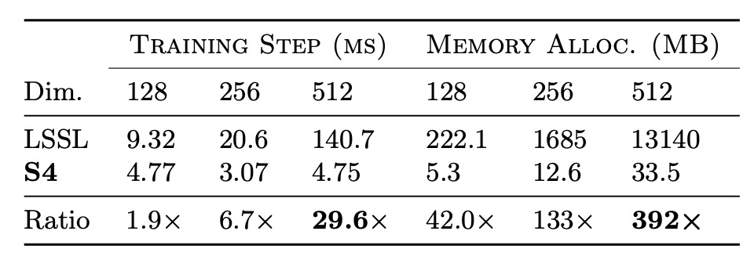
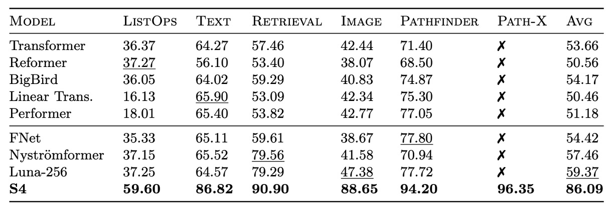
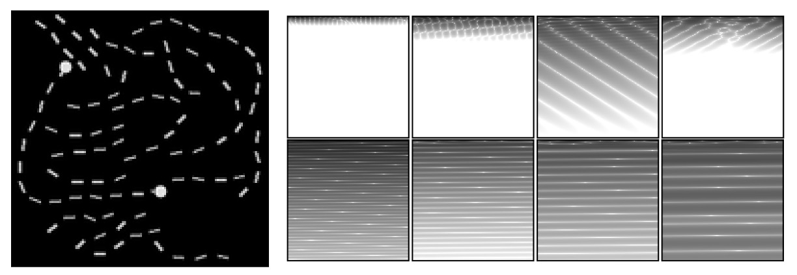
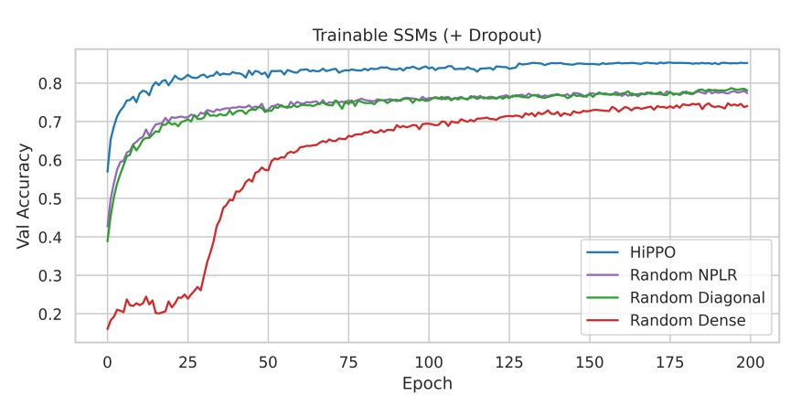

## マンバの序曲

[**Efficiently Modeling Long Sequences with Structured State Spaces**](https://arxiv.org/abs/2111.00396)

---

マンバを見てみたいと思いましたが、いくつかの前提知識を補完する必要があることが分かりました。

そのため、まずは S4 から始めます。

この論文は、現在の状態空間モデル（State Space Model, SSM）の問題を改善することを目的としています。

SSM について話すと、またその関連知識を補完しなければならないことになります。

:::tip
論文を読むのが謎解きをしているように感じる？
:::

## 状態空間モデル

:::info
著者も読者が不慣れだと理解しているため、論文の中でいくつかの基礎知識を提供しています。私たちも一緒に見てみましょう。
:::

状態空間モデル（State Space Model、略称 SSM）は、動的システムの挙動を記述するための数学的ツールです。制御工学、信号処理、経済学、そして近年では深層学習の分野でも広く使用されています。

SSM の核心的な考え方は、内部の「状態」を使ってシステムの動的な挙動を記述することです。これにより、外部の入力信号をシステム内部の状態にマッピングし、その後出力信号を生成します。このフレームワークは、システムの時間に伴う進化を捉えることができ、特に時系列データや動的過程を扱うのに適しています。

SSM はシステムの挙動を 2 つの核心方程式で記述します：

1. **状態方程式（State Equation）**：システムの状態が時間とともにどのように変化するかを記述します。

   $$
   \dot{x}(t) = A x(t) + B u(t)
   $$

   - **状態遷移行列 $A$**：システムの内部動態、例えば自然減衰や振動を決定します。
   - **入力行列 $B$**：入力がシステムの状態にどのように影響を与えるかを決定します。

2. **出力方程式（Output Equation）**：状態から出力をどのように得るかを記述します。
   $$
   y(t) = C x(t) + D u(t)
   $$
   - **出力行列 $C$**：どの状態が出力に影響を与えるかを決定します。
   - **直接伝達行列 $D$**：入力が出力に与える直接的な影響を記述します（もし存在すれば）。

したがって、初期状態 $x(0)$ と入力 $u(t)$ が与えられた場合、$x(t)$ と $y(t)$ を解くことができ、システムの時間に伴う進化を記述することができます。

:::tip
ここまで見てきて、RNN と非常に似ていると感じます。どちらも時系列データを扱い、隠れ状態を持っています。
:::

### HiPPO 理論

過去の研究では、基本的な SSM は実際のアプリケーションで十分なパフォーマンスを発揮しませんでした。その理由は、線形 1 階常微分方程式の解が指数関数的に増減するため、シーケンスの長さが増すにつれて勾配が指数関数的に消失または爆発し、モデルの学習能力に影響を与えるからです。このため、SSM は長期的な記憶を必要とするシーケンスタスクを処理するのが難しいという問題があります。

:::tip
つまり、勾配消失または勾配爆発の問題です。
:::

この問題を解決するために、LSSL モデル（Linear State Space Layer）は**HiPPO 理論**（High-order Polynomial Projection Operators）を導入しました。この理論は、連続時間での記憶を扱う数学的なフレームワークに焦点を当てています。

HiPPO は、特定の行列$A \in \mathbb{R}^{N \times N}$のクラスを提案しており、これらの行列が SSM の状態遷移方程式に使用されると、状態$x(t)$が入力履歴$u(t)$の情報を効率的に記憶することができます。

HiPPO 行列の数学的定義は以下の通りです：

$$
A_{nk} =
\begin{cases}
-\sqrt{\frac{2n+1}{2k+1}} & \text{if } n > k \\
-(n+1) & \text{if } n = k \\
0 & \text{if } n < k
\end{cases}
$$

- **$n > k$**：異なる階数間の相互作用を定義します。
- **$n = k$**：自己反射性（自身の影響）を示します。
- **$n < k$**：状態間に影響がないことを示します。

この行列構造は、時間における入力履歴の重要性を捉え、記憶の優先度を動的に調整します。Sequential MNIST タスクでは、HiPPO を置き換えた後のモデルの精度は**60%から 98%に向上**しました。これは、HiPPO 理論が長期的依存性の問題を効果的に解決し、SSM がシーケンスタスクを処理する際のパフォーマンスを向上させることを示しています。

:::tip
**HiPPO の直感的理解**

HiPPO 行列は、履歴信号を固定の次元に圧縮する方法として考えることができ、各タイムステップでこれらの圧縮された情報を更新していきます。例えば：

- 高次の信号はより注目されます（例えば、最近の入力は過去よりも重要です）。
- 低次の信号は徐々に薄れますが、依然として意味のある記憶を保持し、有効な履歴表現を実現します。

**では、RNN との違いは何ですか？RNN の隠れ層のように聞こえますか？**

HiPPO 行列は「連続時間の数学的フレームワーク」に基づき、入力履歴信号を圧縮して更新します。入力信号の動的な射影と多階構造化された記憶に重点を置き、直交基底を使用して過去の信号を効果的に表現します。一方、RNN の隠れ状態は「離散的な非線形更新ルール」に基づいており、通常はニューラルネットワーク自体が行い、活性化関数（例えば、$\text{tanh}$や$\text{ReLU}$）を使用して隠れ状態を更新し、非線形変換を通じて現在の入力を符号化します。

したがって、HiPPO 行列は「自然に」長期記憶をサポートし、特に直交多項式と特定の行列設計を通じて履歴情報を保持します。RNN の隠れ状態は、勾配の流れに大きく依存しており、勾配消失や爆発の影響を受けやすいため、長期的依存性の処理能力に限界があります。

LSTM や GRU は、この問題を解決するために設計された変種で、ゲート機構を使用して長期的記憶を保持しますが、この方法は依然として手動で設計された非線形更新ルールを必要とし、HiPPO の数学的構造化されたアプローチには劣ります。
:::

### 離散化

SSM が離散入力シーケンス $(u_0, u_1, \dots)$ を処理する場合、連続時間表現の式を離散化する必要があります。入力 $u_k$ は通常、連続信号 $u(t)$ の離散サンプリングから得られるため、次のように定義されます：

$$
u_k = u(k\Delta),
$$

ここで、$\Delta$ は時間ステップの長さであり、連続入力と離散入力の関係は $u_k = u(k\Delta)$ です。これは、$k$ 番目のサンプルが連続信号の時間 $k\Delta$ における値を示していることを意味します。

この変換を実現するために、一般的に使用される方法は**双線形法（bilinear method）**であり、これは連続状態行列 $A$ を離散バージョン $\bar{A}$ に変換します。

離散化された状態空間モデルは次のように表されます：

$$
\begin{aligned}
x_k &= \bar{A} x_{k-1} + \bar{B} u_k, \\
y_k &= \bar{C} x_k,
\end{aligned}
$$

ここで：

$$
\begin{aligned}
\bar{A} &= (I - \frac{\Delta}{2} A)^{-1} (I + \frac{\Delta}{2} A) \\
\bar{B} &= (I - \frac{\Delta}{2} A)^{-1} \Delta B \\
\bar{C} &= C
\end{aligned}
$$

- **$\bar{A}$** は離散状態行列で、隠れ状態の進化を記述します。
- **$\bar{B}$** は離散入力行列で、入力が状態にどのように影響するかを示します。
- **$\bar{C}$** は出力行列で、連続の状態と同様に、出力を計算します。

離散化後の式は、シーケンスからシーケンスへのマッピングを表し、各時間ステップでの隠れ状態 $x_k$ が前の状態 $x_{k-1}$ と結びついていることを示します。これはリカレントニューラルネットワーク（RNN）の構造に似ています。

$x_k \in \mathbb{R}^N$ は RNN の隠れ状態と見なすことができ、$\bar{A}$ はリカレント層の重み行列です。

:::tip
**これらの式は何をしているのか？**

これらの式は、連続時間システムを離散時間のバージョンに変換することを目的としており、その中の要素は次のように説明できます：

- **$A$**：この行列はシステム内部の状態が時間とともにどのように変化するかを記述します。システムの「自然の進化規則」や「内在的な特性」として理解できます。外部の影響がない場合、システムはどのように変化するのかを示しています。
- **$B$**：この行列は「外部入力」がシステム状態に与える影響を記述します。システムが外部の情報をどのように受け取るかを示しています。入力信号がシステム状態をどのように変化させるかを教えてくれます。
- **$C$**：この行列はシステムの「内部状態」を「観測可能な出力」に変換します。これはシステムの「表示装置」のように考え、システム状態が生成する出力結果を測定する方法です。
- **$\Delta$**：これは時間の間隔であり、システムをどのくらいの頻度で観察または更新するかを示します。たとえば、毎秒 1 回の更新。
- **$I$**：これは単位行列で、行列計算において「何も変化を加えない」役割を果たします。主に数学的計算を便利にするために使われます。

上記の要素に基づいて、式を分解してみましょう：

- **$\bar{A}$ の式**

  $$
  \bar{A} = \left( I - \frac{\Delta}{2} A \right)^{-1} \left( I + \frac{\Delta}{2} A \right)
  $$

  この式の目的は、連続時間の状態変化規則 $A$ を離散時間のバージョン $\bar{A}$ に変換することです。次のように理解できます：

  - **$\left( I + \frac{\Delta}{2} A \right)$**：この部分は、現在の状態に基づいて一歩前に予測したものです。システムがどのように変化するかを予測しています。
  - **$\left( I - \frac{\Delta}{2} A \right)^{-1}$**：この部分は、前の予測を修正し、予測の誤差を補正します。これにより、より正確な結果が得られます。

  要するに、$\bar{A}$ はシステムの状態が前の時刻から次の時刻にどのように移行するかを示しています。

- **$\bar{B}$ の式**

  $$
  \bar{B} = \left( I - \frac{\Delta}{2} A \right)^{-1} \Delta B
  $$

  この式の目的は、入力行列 $B$ を離散時間のバージョン $\bar{B}$ に変換し、各時間ステップで入力がシステム状態に与える影響を記述することです。

  最初に、$\Delta B$ は時間間隔 $\Delta$ 内で入力がシステムに与える直接的な影響を示します。

  次に、$\left( I - \frac{\Delta}{2} A \right)^{-1}$ を使って、この影響を調整し、システムの動的特性を考慮に入れて、離散時間でより正確な結果を得ます。

- **$\bar{C} = C$**

  出力行列 $C$ は変わりません。なぜなら、システムの出力測定方法は離散化の過程で調整する必要がないからです。

---

それでは、実際に使ってみましょう。

車を運転していると仮定すると、車の状態（例えば、速度や位置）は時間とともに変化します。

連続時間の式 $A, B, C$ は車の動的変化を記述しますが、私たちは一定の時間間隔（$\Delta$）でしか観察や制御ができません。

1. **$\bar{A}$**：離散的な時間ステップで、車の内部の変化（慣性や自然減速など）がどのように前の時刻の状態から次の時刻に進化するかを記述します。
2. **$\bar{B}$**：運転手の操作（アクセルやブレーキを踏むこと、入力として）によって、各時間ステップで車の状態にどのように影響を与えるかを記述します。
3. **$\bar{C}$**：速度計やオドメーターなどの計器を通して測定される車の速度や位置を記述します。この部分は離散化の過程で変更されません。
   :::

### 畳み込み表現法

上記の再帰的な式はシーケンスの関係を捉えることができますが、各ステップの計算が前のステップの結果に依存するため、GPU で効率的にトレーニングするのが難しくなります。

そのため、再帰的な式を畳み込み形式に変換する必要があります。初期状態 $x_{-1} = 0$ と仮定し、再帰的な式を順次展開します：

$$
\begin{aligned}
x_0 &= \bar{B} u_0, \\
x_1 &= \bar{A} \bar{B} u_0 + \bar{B} u_1, \\
x_2 &= \bar{A}^2 \bar{B} u_0 + \bar{A} \bar{B} u_1 + \bar{B} u_2, \\
&\dots
\end{aligned}
$$

出力 $y_k$ は次のようになります：

$$
y_k = \bar{C} x_k,
$$

つまり：

$$
y_k = \bar{C} \bar{A}^k \bar{B} u_0 + \bar{C} \bar{A}^{k-1} \bar{B} u_1 + \cdots + \bar{C} \bar{B} u_k.
$$

展開した後、この部分は畳み込み形式で表現できることがわかります：

$$
y = K * u,
$$

ここで：

$$
K = (\bar{C} \bar{B}, \bar{C} \bar{A} \bar{B}, \dots, \bar{C} \bar{A}^{L-1} \bar{B}),
$$

$K$ は、システムの出力が状態行列を通じて入力からどのように伝播されるかを記述した、私たちが馴染みのある畳み込みカーネルです。

## 問題の定義

:::tip
ようやく論文本体に戻れます、なかなか大変でしたね。
:::

著者は最初に、この論文の核心的な目標が、シーケンスモデルが「長距離依存（Long-Range Dependencies, LRD）」問題を扱う際のパフォーマンスボトルネック、特に長いシーケンスの処理における計算および記憶の要求の高さを解決することだと明確に述べています。

現在のほとんどのシーケンスモデルは「数千のタイムステップ」しか効果的に処理できませんが、現実世界の時間シーケンスデータは「数万のタイムステップ」の推論を必要とすることがよくあります。例えば、Path-X タスクのシーケンス長は 16384 であり、このような長距離のシナリオ（LRA）のベンチマークテストでは、既存のモデルは非常に低いパフォーマンスを示し、ランダム推測のレベルにすら届かないことがあります。

伝統的なモデル、例えば CTMs、RNNs、CNNs、Transformers などは、LRD に対応するために特別に設計された変種を提案しています。例えば、直交 RNNs、拡張畳み込み、高効率の Transformers などですが、これらの方法も依然として厳しいベンチマークテスト（LRA や原音分類など）で良好なパフォーマンスを示しません。

学界で主流の技術に加えて、SSM は理論的には可能性を秘めていますが、長い間深層学習に応用するのが難しかった理由は次の通りです：

- 深層 SSM は理論的には LRD を処理できますが、実際のタスクではパフォーマンスが限定的です。
- 線形状態空間層（LSSL）は、CTM、RNN、CNN の利点を統合し、LRD を解決する潜力を示していますが、計算および記憶の要求が高すぎ、実際のアプリケーションでは数値的に不安定な動作を示すことがあり、特に行列$A$の非常に不規則な性質により、従来のアルゴリズムは安定して適用するのが難しいです。

これらの課題を解決するために、著者は「構造化された状態空間モデル」、S4 を提案しています。

その目的は、状態行列$A$の再パラメータ化と周波数領域での生成関数計算を通じて、計算の複雑性と記憶要求を大幅に削減し、数値的に安定性を保ちながら解決することです。

### 問題の解決

離散時間状態空間モデル（SSM）において、計算が行列 $A$ の多重掛け算を伴う場合、これは計算の主要なボトルネックとなります：

- **時間計算量**：系列長 $L$ に対して、計算には $O(N^2L)$ 回の操作が必要です。
- **空間計算量**：隠れ状態を格納するために $O(NL)$ の空間が必要です。

ここで、著者は行列 $A$ を対角化し、より構造化された形式に変換することで計算を簡素化しました。

:::tip
**対角化**（Diagonalization）は、行列を簡単な形式に変換する数学的操作です。

その目的は、行列 $A$ を以下の形式で表現することです：

$$
A = V \Lambda V^{-1}
$$

ここで：

- **$\Lambda$** は対角行列で、非ゼロの要素が対角線上にあり、他の要素は 0 です。
- **$V$** は行列 $A$ の固有ベクトルから構成される行列です。
- **$V^{-1}$** は $V$ の逆行列です。

対角化の利点は、対角行列の計算（例えば掛け算、冪乗）は非常に効率的であり、多くの複雑な計算を簡素化できる点です。

例えば、行列 $A$ の高次冪 $A^{10}$ を計算する必要があるとしましょう。

- 直接計算する場合：9 回の行列掛け算が必要です。
- もし $A$ がすでに対角化されていれば：
  $$
  A^{10} = (V \Lambda V^{-1})^{10} = V \Lambda^{10} V^{-1}.
  $$
  - $\Lambda$ が対角行列であるため、$\Lambda^{10}$ を計算するのは各対角線要素について 10 回の冪乗計算を行うだけです。
  - 最後に、$V$ と $V^{-1}$ との行列掛け算を 2 回行うだけです。

対角化は、特に大規模な行列や頻繁な計算が行われる場合に、行列の高次計算の計算コストを大幅に削減できます。数値最適化の重要なツールです。
:::

状態空間モデル $(A, B, C)$ に対して、共役変換を行うと $(V^{-1} A V, V^{-1} B, C V)$ となります。

共役変換を通じて、著者は行列 $A$ を対角行列に変換し、計算を簡素化しました。これにより、計算式における行列 $K$ はヴァンダーモンド行列に変換され、計算量は $O((N + L) \log^2(N + L))$ に削減されます。

ただし、HiPPO 行列については、直接的な対角化には数値的な不安定性が伴います。なぜなら、対角化行列 $V$ の要素が指数的に増加し、数値計算が不可能になるからです。

### S4 のパラメータ化：正規加低ランク

原文の **Normal Plus Low-Rank**（略して NPLR）です。

前回の議論で著者は、共役変換を行う際に条件が良い行列 $V$ のみを使用すべきだと結論づけました。理想的には、行列 $A$ は単位行列（すなわち条件数が 1 の行列）で対角化可能です。

線形代数のスペクトル定理に基づき、この条件を満たす行列は正規行列であり、つまり $AA^* = A^* A$ を満たす行列です。しかし、この種の行列の範囲は限られており、特に HiPPO 行列はこの範疇に含まれません。

HiPPO 行列は正規行列ではありませんが、「正規行列」と「低ランク行列」の和として分解できます。この分解を直接使用して計算するのは効率的ではありません。なぜなら、この分解で行列の冪を求めるのは遅く、最適化も難しいからです。

この問題を克服するために、著者は以下の三つの技術を同時に使用しました：

- **技術一：生成関数を用いたスペクトル計算**
  - $K$ を直接計算するのではなく、その切り詰めた生成関数 $\sum_{j=0}^{L-1} K_j \zeta^j$ を使用し、単位根 $\zeta$ 上で計算した後、逆快速フーリエ変換（Inverse FFT）を使って $K$ を得る方法です。
- **技術二：行列の逆行列とウッドベリーの公式を利用**
  - 生成関数の中で行われる行列計算を高次冪ではなく逆行列の計算に変換します。
  - ウッドベリーの公式を使用して $(A + P Q^*)^{-1}$ を $A^{-1}$ の形式で表現し、対角行列の計算に簡素化します。
- **技術三：コーシー核に相当する計算**
  - 対角行列のケースでは、コーシー核 $\frac{1}{\omega_j - \zeta_k}$ を計算する問題に変換できます。これは安定しており、線形時間に近い問題で、既に効率的なアルゴリズムが存在します。
    - [**[13.03] Transformations of Matrix Structures Work Again**](https://arxiv.org/abs/1303.0353)
    - [**[15.06] Fast Approximate Computations with Cauchy Matrices and Polynomials**](https://arxiv.org/abs/1506.02285)

これらの技術は、正規加低ランク（NPLR）として分解できるすべての行列に適用できます。

ここで、著者は本論文の最初の定理を提案します：

- **定理 1：HiPPO 行列の NPLR 表現**

  すべての HiPPO 行列（例えば HiPPO-LegS, LegT, LagT）は、次の形式の NPLR 表現を持ちます：

  $$
  A = V \Lambda V^* - P Q^\top = V (\Lambda - (V^*P) (V^*Q)^*) V^*
  $$

  ここで、$V \in \mathbb{C}^{N \times N}$ は単位行列で、$\Lambda$ は対角行列、$P, Q \in \mathbb{R}^{N \times r}$ は低ランク行列の分解です。

### S4 計算複雜度

NPLR 行列は、対角行列と低ランク行列の形式（DPLR）に変換できますが、その要素は $\mathbb{R}$ から $\mathbb{C}$ に拡張される点に注意が必要です。

行列 $A$ が DPLR 形式で表されるとき、S4 は再帰および畳み込み演算において最適または近似最適な計算効率を達成します。

- **S4 再帰計算の定理と効率**

  - **定理 2：S4 再帰公式の計算効率**

    証明により、任意のステップ数 $\Delta$ において、再帰公式 (3) の各ステップの計算は $O(N)$ の計算量で行えることが示されました。ここで $N$ は状態空間の次元数です。

- **S4 畳み込み計算の定理と効率**

  - **定理 3：S4 畳み込みフィルタの計算効率**

    証明により、任意のステップ数 $\Delta$ において、SSM の畳み込みフィルタ $K$ の計算は 4 回の Cauchy 行列の積に帰着し、計算量は $\tilde{O}(N + L)$ で、空間量は $O(N + L)$ であることが示されました。

:::tip
証明部分については、論文を参照してください。内容が非常に多いため、詳述は省略します。
:::

定理 3 は本研究の中心的な技術的貢献であり、そのアルゴリズムは NPLR S4 パラメータ化の設計動機を体現しています。完全なアルゴリズムのフローは以下の通りです：

<figure style={{"width": "80%"}}>

</figure>

S4 は再帰運算において線形計算量 $O(N)$ を達成し、畳み込み運算においては $\tilde{O}(N + L)$ を達成しています。これにより、高効率と安定性を兼ね備え、SSM 計算の理論的および実用的基盤を提供しています。

### S4 層のアーキテクチャ詳細

初期化時に、S4 層の状態空間モデル (SSM) の行列 $A$ は HiPPO 行列として設定され、「定理 1」に基づき、この SSM は $(\Lambda - P Q^*, B, C)$ と単位行列等価であることが示されます。これらのパラメータは、S4 層の $5N$ 個の訓練可能なパラメータを構成します。

深層 SSM は $H$ 個の独立した SSM 複製から構成され、各複製は同じパラメータを持ちながら、位置線形層によって特徴を混合します。この設計により、S4 層は多次元特徴を処理し、各位置で独立した状態遷移を行うことができます。多層構造を通じて、S4 層は深層非線形ネットワークを形成します。

全体のアーキテクチャは、他のシーケンスモデル（例：Transformers、RNNs、CNNs）と一致する出力形状を提供し、$(\text{バッチサイズ}, \text{シーケンス長}, \text{隠れ次元})$ の形式です。

他のモデルと比較して、S4 は畳み込みニューラルネットワーク (CNN) に似た特徴を持ちます。元々は線形変換ですが、複数の層構造内での非線形変換を通じて、全体の深層 SSM は非線形になります。また、S4 層内での $H$ 特徴間のブロードキャスト処理方法は、深層可分畳み込み（Depthwise-Separable Convolution）に似ていますが、S4 の畳み込み核はグローバルなものです。

以下の表は、S4 層と他のシーケンスモデルの計算複雑度を比較したものです：

<figure style={{"width": "80%"}}>

</figure>

## 討論

### 効率ベンチマークテスト

<figure style={{"width": "60%"}}>

</figure>

著者は、S4 のトレーニング速度とリソース効率を評価するため、効率ベンチマークテストを実施し、最初に LSSL との比較を行いました。

実験結果は上表に示されており、S4 は実際の層サイズにおいて、LSSL に比べて速度とメモリ効率が数桁優れていることが確認されました。

次に、著者は S4 を Linear Transformer や Performer などの高効率 Transformer モデルと比較しました。その結果は下表に示されており、パラメータ量が一致した場合、S4 は最適な Transformer のバリアントと同等の速度とメモリ使用量を示しました。

<figure style={{"width": "60%"}}>

</figure>

### 長距離推論の安定性

<figure style={{"width": "80%"}}>

</figure>

著者はさらに、S4 の長距離推論における安定性を調べ、S4 と他のモデルが LRA や原始的な音声分類などの難易度の高いタスクでどのようにパフォーマンスを発揮するかを比較しました。

S4 は LRA でのパフォーマンスが全ての基準モデルを大きく上回り、平均 80.48%の精度を達成し、すべての基準モデルの平均は 60%未満でした。S4 は Path-X タスクを成功裏に達成し、長距離依存を処理する能力を示しました。

S4 は SC10 データセットで 98.3%の分類精度を達成し、すべてのベースラインモデルを上回りました。これは強力な LRD モデルが、手動設計された前処理手法を超えて、原データからより多くの情報を抽出できることを証明しています。

### 可視化分析

<figure style={{"width": "85%"}}>

</figure>

著者は S4 の学習表現を可視化することにより、さらにその性能を分析しました。

上図は、トレーニングされた S4 モデルが LRA Path-X タスクでどのようにパフォーマンスを発揮したかを示しています。SSM の畳み込みカーネル$K \in \mathbb{R}^{16384}$を$128 \times 128$の画像に再構成して可視化しています。

左側の図は Path-X タスクの一例で、このタスクではモデルが 2 つのマーカーが 1 本の経路で繋がっているかを判定します。

上部（第一層の畳み込みカーネル）は S4 モデルの第一層からのもので、学習された局所的な文脈特徴を示しています。これらの畳み込みカーネルは、画像内の少数行の局所パターンに焦点を当て、大部分のグローバル情報を無視しています。

下部（最後の層の畳み込みカーネル）は S4 モデルの最後の層からのもので、グローバルな構造的特徴を示しています。これらの畳み込みカーネルは、全体の文脈（16384 ピクセル）を跨いで、グローバル情報を学習し、異なる空間周波数パターンを捉えています。

結果として、S4 の畳み込みカーネルは、シーケンスデータの 2D 構造的特徴を捉えることができ、長距離依存に対する深い理解を示しています。

### 汎用モデルとしての可能性

著者は S4 が汎用的なシーケンスモデルとして機能するかを探るため、一連の実験を行いました。

**画像生成：CIFAR 密度推定**

<figure style={{"width": "70%"}}>

</figure>

CIFAR 密度推定は、人気のある自己回帰的画像モデリングのベンチマークです。画像は 3072 個の RGB サブピクセルを含むシーケンスにフラット化され、1 つずつサブピクセルが予測されます。

結果は、S4 が 2D 構造の偏りを持たないにもかかわらず、このタスクで専用設計されたモデルと競り合えることを示しています。

---

**テキスト生成：WikiText-103**

<figure style={{"width": "70%"}}>

</figure>

WikiText-103 は、言語モデリングのクラシックなベンチマークであり、モデルはコンテキスト順序に基づいてシーケンス内のトークンを予測する必要があります。

結果は、S4 が Transformer の自己注意層を置き換えることによって、Transformer とのパフォーマンスのギャップを大幅に縮小し（わずか 0.8ppl の差）、無注意モデルでは新たな SOTA を達成（他のモデルより 2ppl 以上優れている）ことを示しています。

---

**時系列予測：気象データ**

S4 を時系列予測問題に適用し、そのパフォーマンスを専用に設計された Informer と比較しました。

結果は、S4 が 5 つの予測タスクの 40/50 設定でベースラインを上回り、特に長いシーケンスの予測において顕著なパフォーマンスを示したことを示しています。例えば、30 日間の気象データを予測する際に、平均二乗誤差が 37%減少しました。

---

複数の実験から、S4 は汎用的なシーケンスモデルとしての潜力を示し、LRD 問題を効果的に処理し、さまざまな分野やタスクで優れたパフォーマンスを発揮しています。高効率な生成能力、異なる解像度に適応する柔軟性、弱い構造的偏りに対する強力な性能は、シーケンスモデリング研究における重要な候補モデルとして位置づけられます。

### HiPPO の重要性

S4 の重要な設計の 1 つは、HiPPO 行列を使用して SSM を初期化することです。

最後に、著者は消融実験を通じて、各コンポーネントの重要性を検証し、次の問いに答えようとしました：

1. HiPPO 初期化の重要性はどのようなものか？
2. HiPPO を基に SSM を訓練することは必要か？
3. S4 の効果は NPLR パラメータ化に起因し、HiPPO とは関係ないのか？

すべての実験は Sequential CIFAR-10 タスクに基づいており、このタスクの結果は他の設定にも適用可能です。モデルは最大 100K の訓練可能なパラメータに制限され、簡単な階段学習率スケジューラを使用し、正則化は行われません。

---

**実験 1：制約のない SSM 初期化**

- **初期化方法の比較**

  - **ランダムガウス初期化**：行列$A$をランダムなガウス分布で初期化します。
  - **HiPPO 初期化**：HiPPO 行列を使用して初期化します。
  - **ランダム対角行列**：$A$をランダム対角行列に設定し、S4 の NPLR パラメータ化は使用しません。
  - 上記の初期化方法について、$A$行列を凍結した場合と訓練した場合を比較します。

  実験結果は、SSM を訓練することで、すべての初期化方法において性能が向上し、特にランダム初期化モデルの性能向上が顕著であることを示しました。

  異なる初期化方法における検証セットでの性能差が明確でした。すべてのモデルが訓練セットで完璧な精度に達する一方、検証セットでの精度の差は**15%以上**であり、HiPPO 初期化が最も優れた汎化性能を示しました。

---

**実験 2：NPLR パラメータ化と HiPPO の組み合わせ**

<figure style={{"width": "80%"}}>

</figure>

HiPPO 初期化が S4 の効果の主要な要因であり、NPLR パラメータ化だけではないことを検証します。

実験結果は、NPLR パラメータ化のみを使用し、HiPPO を組み合わせなかった SSM が性能が低いことを示しており、HiPPO 初期化の重要性が再確認されました。

---

#### **実験 3：正則化と完全な S4 メソッドの性能**

<figure style={{"width": "80%"}}>

</figure>

主な消融実験では、軽量の正則化（Dropout = 0.1）を追加し、HiPPO 初期化を使用した S4 と他の初期化方法の性能を比較します。

実験結果は、Dropout を追加しても、HiPPO 初期化の性能優位性が依然として顕著であることを示し、完全な S4 メソッド（HiPPO + NPLR）はテストセットで**84.27%の精度**を達成し、わずか 100K の訓練可能パラメータで優れた結果を示しました。

## 結論

著者は本論文で、「S4」シーケンスモデルを提案し、状態空間モデル（SSM）のパラメータ化の革新を通じて、連続時間、再帰、畳み込みの視点を統合することで、長距離依存（LRD）問題を効果的かつ合理的に処理しました。

一連のベンチマークテストにおいて、S4 はさまざまなデータモダリティとモデル能力の評価で優れた性能を発揮し、汎用的なシーケンスモデリングソリューションとしての可能性を示し、広範な応用価値と研究意義を持つことが分かりました。

:::tip
本論文は我々にとって少し難解であり、努力して読んだ後でも完全に理解できたわけではありません。

S4 の具体的な実装と技術的な詳細については、今後さらに深い研究と実践が必要です。
:::
