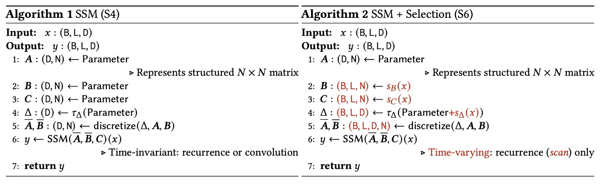
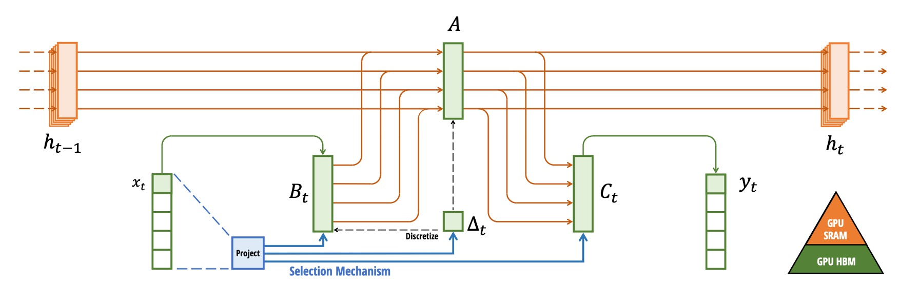

## 継承者は誰か

[**Mamba: Linear-Time Sequence Modeling with Selective State Spaces**](https://arxiv.org/abs/2312.00752)

---

この論文を読むために、かなりの努力が必要でした。

まず、著者の過去の代表作を復習しなければなりませんでした：

- [**[20.08] HiPPO: カバの記憶**](../2008-hippo/index.md)
- [**[21.11] S4: マンバの序曲**](../2111-s4/index.md)

次に、この論文の主要な比較対象である Transformer の長所と短所を理解する必要がありました。

ここまでで、前の数篇の論文をしっかり読み込んでおり、十分な背景知識を持っていると仮定します。

それでは、この論文を開いてみましょう。

## 問題の定義

S4 が何をしたか覚えていますか？

S4 は、以前の SSM の研究を継続し、状態行列$A$の再パラメータ化と周波数領域での生成関数計算を通じて、計算の複雑さとメモリの要求を大幅に削減し、数値的に安定性を保ちました。

しかし、S4 は依然として線形時不変系（LTI）です。つまり、モデルの動的な振る舞いはシーケンス全体で変わらない（同じ$A, B, C$パラメータがすべてのタイムステップに使用される）ということです。

例えば、次のコピー問題を考えてみましょう。入力として一連のシーケンスを与え、出力としてその「一部分の情報」をコピーすることが求められます：


左図のように、入力と出力の間に固定の時間間隔がある場合、LTI モデルにとっては非常に簡単です。なぜなら、固定のシフトまたは畳み込みカーネルを学習するだけで良いためです。

しかし、右図のように入力と出力の間にランダムな時間間隔があり、「コンテンツ認識（content-aware）」の能力が必要な場合、モデルはどのトークンが実際にコピーされるべきか、どれが無関係またはノイズであるかを識別しなければなりません。このような場合、モデルは「選択的」な能力を必要とします。

この能力は LLM（大規模言語モデル）で非常に一般的です。なぜなら、Transformer のアーキテクチャは自己注意メカニズムを採用しており、文脈に基づいて次に生成する出力を判断できるからです。しかし、LTI モデルには「パラメータを動的に変更する」能力が欠けているため、このような問題に対応するのが難しいのです。

したがって、著者は SSM のいくつかの重要なパラメータ（例えば、$\Delta$、$B$、$C$）を「入力依存」にする方法を考え出す必要があると考えました。つまり、これらのパラメータはタイムステップに応じて変化し、もはや固定された値ではなくなります。

## 問題解決

### 選択機構



まず、著者がどのように SSM のコアアルゴリズムを改良して、「選択的」な能力をモデルに持たせたのかを見ていきましょう。

まずは **Algorithm 1 (S4)** を見てみましょう：

```txt
Algorithm 1 SSM (S4)
Input: x : (B, L, D)
Output: y : (B, L, D)
    1: A : (D, N) ← Parameter       ⊲ 構造化されたN×N行列を表す
    2: B : (D, N) ← Parameter
    3: C : (D, N) ← Parameter
    4: Δ : (D) ← τΔ(Parameter)
    5: A, B : (D, N) ← discretize(Δ, A, B)
    6: y ← SSM(A, B, C) (x)         ⊲ 時間不変：再帰または畳み込み
    7: return y
```

- **(ステップ 1–3) パラメータの初期化**

  モデルには 3 つのコアパラメータがあり：$A, B, C$。

  ここで$A$は構造化された$N \times N$行列として考えられますが、実際の実装ではパラメータ数を節約するため、対角化したり、その他の特殊な構造を使ったりして$(D, N)$の形で保存されます。

- **(ステップ 4) $\Delta$の設定**

  $\Delta$は$(D)$の次元を持つベクトルで、$\tau_\Delta$（例えば$\mathrm{softplus}$）などの単調関数で処理され、離散化変換に使用されます。

- **(ステップ 5) 離散化 (discretize)**

  `discretize(Δ, A, B)`関数は、$\Delta$を使って連続系のパラメータ$A, B$に指数行列演算などを行い、離散時間での$\bar{A}, \bar{B}$を得ます。

  この時、$\Delta$と$A, B$は時間不変であるため、離散化後の$\bar{A}, \bar{B}$も固定のままです。

- **(ステップ 6) SSM 計算**

  (A, B, C)がシーケンス位置に応じて変化しないため、**固定畳み込み**(global convolution)または**線形再帰**(linear recurrence)で計算できます：

  - 畳み込みモードでは、シーケンス全体を一度に並列で処理でき、トレーニング時に非常に効率的です。
  - 自回帰推論が必要な場合、再帰モードに切り替えて逐次的に進めることもできます。

上記から、S4 は「線形時間不変 (LTI)」の特性を保ち、ほとんどの SSM が畳み込み核を使って加速できるため、明示的に隠れ状態テンソルを展開せずに非常に高い効率を示します。

---

次に **Algorithm 2 (S6)** を見てみましょう。

ここでは「選択的」な概念を導入し、$B, C, \Delta$が入力$x$に応じて変化するようにしました。これにより、もはや全体の畳み込みや固定再帰は適用できず、「スキャン」方式で更新を行うことになります。

```txt
Algorithm 2 SSM + Selection (S6)
Input: x : (B, L, D)
Output: y : (B, L, D)
    1: A : (D, N) ← Parameter         ⊲ 構造化されたN×N行列を表す
    2: B : (B, L, N) ← sB(x)
    3: C : (B, L, N) ← sC(x)
    4: Δ : (B, L, D) ← τΔ(Parameter + sΔ(x))
    5: A, B : (B, L, D, N) ← discretize(Δ, A, B)
    6: y ← SSM(A, B, C) (x)           ⊲ 時間変動：再帰（スキャン）のみ
    7: return y
```

- **(ステップ 1) $A$の構造**

  S4 と同様に、$N \times N$の構造化された行列が必要ですが、$B, C, \Delta$は時間ステップやシーケンス位置に応じて変化します。

- **(ステップ 2–3) 入力依存の$B, C$**

  ここでは、$B$と$C$はもはや固定の$(D, N)$形状ではなく、$(B, L, N)$に対応し、各バッチ、各シーケンス位置に異なるパラメータが対応します。

  - これらの値は関数$s_B(x)$と$s_C(x)$により、入力特徴に基づいて動的に生成されます。実装としては、通常、小さな線形射影や MLP が使用されます。

- **(ステップ 4) 入力依存の$\Delta$**

  同様に、$\Delta$も$(B, L, D)$の形状に拡張され、内部パラメータ（Parameter）を加え、$s_\Delta(x)$で計算後、$\tau_\Delta$（例えば softplus）を通じて最終的な「時間変化のステップ」を得ます。

- **(ステップ 5) 離散化 (discretize)**

  各時間ステップで$\Delta$が異なるため、離散化過程でも各位置ごとに$\bar{A}_{t}, \bar{B}_{t}$を個別に計算する必要があります。

  この時、$\bar{A}, \bar{B}$は$(B, L, D, N)$の次元を持ちます。

- **(ステップ 6) 再帰スキャン**

  パラメータが「時間変動する」ため、シーケンス全体を処理するために固定の畳み込み核を使うことはできません。代わりに「スキャン(scan)」方式で状態を逐次的または並列的に更新する必要があります。

### S6 アーキテクチャ

深層学習では、効率的な基礎計算として「**畳み込み (convolution)**」と「**注意機構 (attention)**」が一般的です。これらは、GPU での成熟した実装ライブラリと並列化戦略を活用することで、ハードウェアの計算能力を最大限に引き出します。

ここで著者は、注意機構を「**選択的 SSM**」に置き換えようとしていますが、これはハードウェア加速の恩恵を受けることができません。なぜなら、SSM は畳み込みでも注意機構でもなく、「再帰的」なモデルだからです。

したがって、SSM を拡張したい場合、GPU で良好な性能を発揮できるように、ハードウェア指向のアルゴリズムが必要です。

この目標を達成するために、著者は「選択的スキャン（selective scan）」というハードウェア指向のアルゴリズムを提案しています。これにより、GPU のメモリ階層で必要な中間状態のみを巧妙に展開し、並列スキャン（parallel scan）と再計算（recomputation）技術を利用して、明示的なメモリ（HBM）の読み書き回数を減らすことができます。

:::tip
**Selective Scan Structured State Space Sequence Modeling（選択的スキャン構造化状態空間シーケンスモデリング）を略して S6 と呼ばれています。**
:::

:::info
GPU の SRAM と HBM について理解しておきましょう：

1. **SRAM（静的ランダムアクセスメモリ）**

   SRAM は非常に高速なメモリで、GPU 内部のキャッシュメモリ（L1 や L2 キャッシュ）に使用されます。特長は、データアクセスの遅延が低く、頻繁に使用される小さなデータブロックに適しています。しかし、容量が小さく、大規模なデータセットには対応できません。

2. **HBM（高帯域幅メモリ）**

   HBM は高性能計算向けに設計された外部メモリで、非常に高いデータ伝送帯域を持っています。主に、深層学習、科学シミュレーション、画像処理など、大量のデータを扱うアプリケーションで使用されます。

SRAM は GPU の「キャッシュ」として、頻繁にアクセスされる小さなデータブロックの処理を加速し、HBM は「ストレージ」としてデータの転送や保存を担当します。計算を加速したい場合、HBM の読み書きを減らし、可能な限り SRAM を使用することが重要です。
:::

GPU アーキテクチャを理解した上で、全体のアーキテクチャ図を見てみましょう：



上図では、著者が 5 チャネルの SSM モデルの例を示しています。各チャネルには 4 次元の隠れ状態があります。これを展開すると、このモデルの状態空間は$(D \times N)$の次元になり、バッチサイズ$B$とシーケンス長$L$を掛けると非常に大きなサイズになります。そのため、中間状態の交換のステップを選択的スキャンアルゴリズムに置き換え、必要な時のみ展開します。

図のように、まずパラメータ（$\Delta, A, B, C$）を HBM からより高速な SRAM にロードします。次に、SRAM で「離散化（discretization）」と「再帰更新（scan）」を行います。

最終的には結果$(B, L, D)$を HBM に書き戻します。そして、複数の計算カーネルを一つまたは少数のカーネルに統合して実行し、HBM の繰り返し読み書きによる負荷を減らします。

バックプロパゲーションの計算時には、前向き計算で得られた中間状態にアクセスする必要があります。しかし、各タイムステップで保存すると大量の GPU RAM を消費します。著者の解決策は「保存しないこと」です！

バックワード時に、再度 HBM から元の入力とパラメータをロードし、もう一度前向き計算を実行して中間状態を取得します。この「再計算（recomputation）」技術は計算量が増加しますが、メモリ要求を大幅に削減し、全体的にはより効率的です。

これにより、選択的 SSM は入力依存の柔軟性を保ちながら、実際の運用において GPU のハードウェア特性を活用してより高いスループットと低いリソース使用を実現し、再帰モデルの大規模な適用の可行性を大きく向上させます。

:::tip
この概念は FlashAttention に似ており、注意機構で中間結果のアクセスを減らすために再計算方式を使用してメモリを節約するアプローチです。
:::

### Mamba アーキテクチャ

<div align="center">
<figure style={{"width": "90%"}}>

</figure>
</div>

従来の H3 アーキテクチャは、よく見られる SSM の変種で、各ブロックに「線形注意機構」の部分と MLP（多層パーセプトロン）が交互にスタックされる形になっています。ここでは、著者がこの 2 つを 1 つの単位に統合し、ネットワーク内で何度も繰り返すことで、より純粋で拡張しやすい設計を実現しています（GAU が注意機構を簡素化したのに似ています）。

実装として、最初にモデルの次元$D$に可変の拡張係数$E$を追加し、各ブロックの主要パラメータは線形投影（入力と出力への投影、計 3 倍の量）に基づき、実際の SSM（$\Delta, B, C$、$A$を含む部分）は小さな割合を占めるようにしています。

著者は実験で$E = 2$を固定し、2 層のブロックを使用することで、全体のパラメータ量が従来の Transformer の「多頭注意機構（MHA）+ MLP」のような規模（おおよそ$12D^2$）に対応するようにしています。

さらに、著者は「Gated MLP」を現代的な SwiGLU 変種に近づけるために、活性化関数に SiLU（Swish）を使用し、RetNet に似たアイデアで正規化層を配置し、選択可能な層正規化（LayerNorm）を追加することで、「Mamba」の完全なアーキテクチャが形成されています。

### 選択機構について再考

著者は方法論の最後で、「選択機構」が SSM 内で果たす役割とその影響について追加で議論しています：

1. **各「選択的」パラメータの解釈**

   - **$\Delta$の意味**：$\Delta$は拡張された RNN ゲートのように考えることができ、$\Delta$が大きいとモデルは「状態をリセットして現在の入力に集中し」、$\Delta$が小さいと「現在の入力を無視して古い状態を保持する」という動作をします。連続時間系の観点から見ると、「$\Delta \to \infty$」は「システムが現在の入力を処理するのにより多くの時間を使うこと」を意味し、「$\Delta \to 0$」はその時点をほとんどスキップすることに相当します。

   - **$A$と$\Delta$の関係**：$A$も「入力に応じて変化させる」ことができますが、著者は最も重要な選択性は$\Delta$によって支配されるべきだと指摘しています。なぜなら、$A$は離散化時に$\Delta$の影響を受けるからです（$\bar{A} = \exp(\Delta A)$）。$\Delta$が選択的に大きくなったり小さくなったりすることで、全体のダイナミクスに大きな影響を与えることができます。

   - **$B$と$C$の意味**：先に述べたように、「選択機構の鍵は不要な情報をフィルタリングする能力」にあります。$B$は「入力がどのように隠れ状態に書き込まれるか」を担当し、$C$は「隠れ状態がどのように出力にマッピングされるか」を担当します。$B$と$C$を入力に応じて変化させることで、$x_t$がモデルに入力されるかどうかをより細かく制御できます。

2. **選択機構の汎用性**

   「選択機構」は、伝統的な RNN や CNN にも適用可能で、Algorithm 2 の$A$のように、異なるパラメータに対応することができます。さらに、さまざまな入力変換関数$s(x)$を用いて実現することも可能です。つまり、「選択機構」は特定のモデルに限定されるものではなく、シーケンスモデル全体に適用できる一般的な概念であることを意味します。

3. **RNN ゲート機構との関連**

   著者は、RNN で一般的なゲート機構（例えば LSTM の入力ゲートや忘却ゲート、GRU の更新ゲートなど）が実は「選択機構」の特別なケースであることを強調しています。

   :::tip
   この部分は S4 の論文でもすでに触れた内容です。
   :::

4. **選択機構の三大効果**

   著者は、「選択機構」の影響を以下の 3 つの重要な「力」に分類しています：

   - **(a) Variable Spacing**：動的に入力を選別または無視できるため、モデルは無関係な「フィラー」や「ノイズ」のセクションをスキップし、時系列が必ずしも等間隔で記録される必要はありません。例えば人間の言語において、無意味な「うーん、あー」などのフィラー語を無視し、モデルは重要な単語に集中できます。

   - **(b) Filtering Context**：多くのシーケンスモデルは、過度に長いコンテキストに遭遇したときに性能が悪化します。その理由は、無関係な履歴情報を無視できないからです。しかし、選択機構を持つモデルは、不要な情報を随時捨てたりリセットしたりできるため、コンテキストが長くなるにつれて、性能が理想的に改善され続けます。

   - **(c) Boundary Resetting**：実際のタスクでは、複数の独立したシーケンスを結合して処理する場合があります。選択機構がないと、これらのセグメントコンテキストが「混同」されてしまいます。しかし、選択機構を持つモデルは、境界部分で状態をリセット（例えば$\Delta_t \to \infty$または$g_t \to 1$）できるため、前後のシーケンスが干渉しません。

### 訓練方法與協定

著者は **Pile データセット** を使用して事前学習を行いました。このデータセットは業界でよく使われる大規模な言語モデル用のコーパスで、訓練方法としては GPT-3 と似た訓練レシピ（例えば対応する深さと幅の使用）が採用されています。

:::tip
訓練のハイパーパラメータと設定の詳細については、論文の附録 E.2 を参照してください。
:::

- **モデル比較対象**

  1. **Transformer (GPT3 アーキテクチャ)**：これは最も伝統的で標準的な Transformer ベースの GPT3 タイプの言語モデルで、マルチヘッドアテンション機構を持っています。

  2. **Transformer++**：著者は特にこれを「現在知られている最強の Transformer レシピ」として挙げ、PaLM や LLaMa などのモデルでのベストプラクティスを組み合わせています。具体的には以下が含まれます：

     - ロータリー埋め込み（Rotary embedding）
     - SwiGLU MLP
     - RMSNorm（LayerNorm の代替）
     - 線形バイアスを使用しない（no linear bias）
     - より高い学習率（high learning rates）

  3. **他の次元削減（subquadratic）アーキテクチャ**：最近提案されている、アテンションよりも計算コストを節約するか、スケーラビリティを持つことを目指したモデル（例えば、RWKV、RetNet など）も比較対象に含まれています。

- **実験方法と結果**

  - **Chinchilla 協定**：著者は「Chinchilla」評価方法に従い、約 125M から約 1.3B パラメータ規模のモデルをテストしました。この方法は通常、「モデルのパラメータ数」と「訓練トークン数」のバランスを考慮し、「同等のコスト」で最適な結果を求めるものです。

    :::tip
    Chinchilla に関してあまり詳しくない場合は、以前読んだ記事を参照してください：

    - [**[22.03] Chinchilla: チンチラの瞳**](../../transformers/2203-chinchilla/index.md)
      :::

## 討論

### スケーリング法則


実験結果に基づき、上の図はシーケンス長が増加するにつれて、**Mamba**が強化されたレシピを使用した Transformer++とほぼ同等の困惑度（perplexity）指標を達成する様子を示しています。

著者は特に強調しており、**Mamba**は「注意機構を使わずに最強の Transformer と互角に戦える線形時間モデル」として、RWKV や RetNet が同様の「次元削減」モデルであるにも関わらず、長いシーケンスでの性能が Mamba ほど安定しないことを示しています。特に長いシーケンス（例えば 8k トークン）では、Mamba の優位性が際立っています。

### 他の言語モデルとの比較

<div align="center">
<figure style={{"width": "90%"}}>

</figure>
</div>

著者は、Pythia や RWKV などのモデルと比較するため、いくつかの一般的なゼロショット（zero-shot）タスクを選定しました。これには広く知られている知識推論、常識質問応答、完形填空などの基準が含まれます。

:::tip

- **Pythia**：有名なオープンソースモデルで、Mamba と同じトークナイザーとデータセット（Pile）を使用し、300B トークンで訓練されています。
- **RWKV**：RNN 型の言語モデルで、概念的には SSM の一種とも見なせますが、コンテキスト長が 1024 に設定されています。
  :::

実験結果によると、**Mamba**は同じパラメータ規模の競合モデルに対してほぼすべてのベンチマークで優れた性能を示しました。さらに、Mamba はパラメータ規模が 2 倍の他のモデルと「匹敵する」または「超越する」性能を示し、このアーキテクチャが同じ訓練条件下で「パラメータ効率（parameter efficiency）」に優れていることを示しています。

全体的に見て、**Mamba**は事前学習の困惑度やスケーリング法則において強化された Transformer と同等の潜在能力を持つだけでなく、いくつかのゼロショットタスクで同規模のオープンソースモデルを直接上回り、言語モデル分野での強い競争力を示しています。

### 推論効率の比較


著者は「**スキャン運算（scan）**」および**Mamba**モデルの推論段階でのスループット（throughput）とメモリ使用量について、詳細なパフォーマンス比較を行いました。

結果は上の図の通り、シーケンス長が 2K を超えると、**SSM のスキャンがより高速**であることが分かりました。PyTorch での標準スキャン実装と比較して、**20 ～ 40 倍**の速度向上が達成されています。

:::tip
この部分は、著者が提案したハードウェア指向の最適化（カーネル結合、並列スキャン、再計算など）によるものです。
:::

推論段階では、**Mamba**は Transformer の「注意機構キャッシュ（KV cache）」のような要求を省略でき、より大きなバッチサイズを可能にし、スループットを大幅に向上させます。

例えば、6.9B パラメータの Mamba モデルでは、**1.3B の Transformer（5 倍小さいモデル）**を超える推論スループットを実現しています。同じサイズの Transformer と比較すると、Mamba は推論時に通常、同じサイズの Transformer より 4 ～ 5 倍速いです。

### 消融実験 - 選択機構


著者は異なる構造とその内部での SSM 実装を比較しました。もし以前のように選択機構がない（LTI）SSM を使用すれば、それは全域畳み込み（global convolution）に相当し、複素数または実数でほぼ同じ結果が得られます。これにより、言語モデルにおいて「複素数を実数に変えることは性能を大きく犠牲にすることなく、ハードウェア効率では有利になる」ということが分かります。

しかし、LTI SSM を選択的 SSM（S6）に置き換えると、パフォーマンスが著しく向上します。著者はさらに、選択的 SSM を採用した場合、Mamba と H3 という二つのアーキテクチャのパフォーマンスが非常に近いことを指摘しています。

### 消融実験 - 主要パラメータ

<div align="center">
<figure style={{"width": "80%"}}>

</figure>
</div>

次に、著者は Δ、B、C の各パラメータにおける「選択性」の有無を比較しました。その結果、最も重要なのは Δ、すなわち RNN ゲーティングに直接対応するパラメータであることが分かりました。Δ が入力依存の変数になることで、モデルは長いシーケンスや高雑音のシーケンスで、関連のない情報を選択的に無視でき、最大の利益を得られることが示されています。

### 消融実験 - その他の設定

その後、著者は SSM の異なる初期化（特に実数または複素数）について調査し、言語モデル環境では、実数型の対角線初期化が複素数型よりも理想的であることを示しました。また、ランダム初期化でも十分良い結果が得られることが分かり、モデルが安定性や収束を得るために特別な複素数初期化に依存していないことが示されています。

最後に、著者は状態ベクトル次元 N が増加するにつれて、選択的 SSM の困惑度が約 1.0 の顕著な改善を見せ、追加のパラメータ量は約 1%にとどまることを強調しました。これは前述の核心論点を裏付けています：

> 正しい選択機構とハードウェア指向のアルゴリズムを組み合わせることで、状態次元を増やしても性能と効率を両立させ、計算やメモリ負荷を大きく増やすことなく、モデルのモデリング能力を強化できることが証明されました。

## 結論

本論文では、著者は完全に注意機構を排除し、「選択機構 + 状態空間モデル」の解決策として**Mamba**を提案しました。

実験結果は、Mamba がさまざまなタイプのデータ（音声、ゲノム、言語テキストなど）で、現代の強力な Transformer モデルに匹敵し、さらにはそれを超える性能を発揮することを示しています。また、推論速度とメモリ効率も優れており、Mamba は強力な言語モデリング能力を持っています。

著者は、Mamba が汎用のシーケンスモデルの骨幹となり、今後の超長シーケンスタスク（ゲノム、音声、視覚など）でさらに大きな役割を果たすことを期待しています。

:::tip
過去に行われたすべての Transformer ベースの試みは、Mamba アーキテクチャにおいて再び試されるべきです。これはまた、新たな膨大な論文の始まりです！
:::
