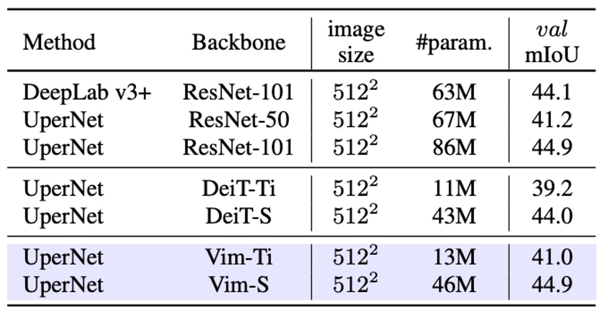

## マンバの視線

[**Vision Mamba: Efficient Visual Representation Learning with Bidirectional State Space Model**](https://arxiv.org/abs/2401.09417)

---

当時、Transformer が NLP 分野に登場した後、CV 分野では 3 年かかってようやく ViT が誕生しました。

今回は、Mamba が NLP 分野に現れ、以前の経験を活かして、CV 分野ではたった 1 ヶ月で Vim が登場しました。

この分野の研究者たちは、本当に寝食を忘れて働いているようです。

## 問題の定義

Mamba は長いシーケンスを扱う NLP タスクで優れた性能を発揮し、リソース消費も Transformer に比べてかなり低いです。

そのため、瞬く間に多くの研究者の注目を集め、Mamba が次世代の LLM の基盤となり、Transformer に取って代わる可能性があるのかどうかが議論されています。

Mamba が本当に Transformer の後継者となるかどうか、学術界ではさらに数年の議論が続くかもしれませんが、CV 分野ではそんなに待つことはありません。この論文の著者たちは、ViT 内の Transformer アーキテクチャを Mamba に置き換えて、その効果を見てみようとしています。

:::tip
ここでは多くの前提知識が必要です。まずは Transformer や ViT の基本概念、そして Mamba の基本アーキテクチャを理解しておく必要があります。もし関連する論文をまだ読んでいない場合、以下の以前の記事を参考にしてみてください：

- [**[17.06] Transformer: 新世界の起点**](../../transformers/1706-transformer/index.md)
- [**[20.10] ViT: 新世界の開拓者**](../../vision-transformers/2010-vit/index.md)
- [**[23.12] Mamba: 継承者は誰か**](../2312-mamba/index.md)

もしそれらを読む気がない場合、少なくとも Mamba が何かを理解しておかないと、この論文を読み進めることができません。
:::

## 問題の解決

### モデルアーキテクチャ

<figure style={{"width": "90%"}}>

</figure>

おそらく、過去の関連研究について必要な知識はすでに習得していると思いますので、ここでは Vim のアーキテクチャから直接見ていきましょう。

上図のモデルアーキテクチャは、実際には ViT の設計スタイルを踏襲したものです。Mamba もシーケンスモデルであるため、画像入力はまずシーケンスデータに変換する必要があります。画像をシーケンスに変換する方法は ViT と同様で、画像を$P \times P$の小さなパッチに切り分け、それをベクトルに展開します。

画像全体を$J$個のパッチに分けると、次のように表現されます：

$$
x_p \in \mathbb{R}^{J \times (P^2 \cdot C)}.
$$

次に、線形投影行列$W \in \mathbb{R}^{(P^2\cdot C) \times D}$を通じて、各パッチを次元$D$に投影します。そして、ViT の手法を踏襲し、シーケンスの先頭に**CLS トークン**を追加して、画像分類の際にシーケンス全体の情報を集約できるようにします。

さらに、シーケンス$\{\,t_{\text{cls}},\; x_1 W,\; x_2 W, \dots\}$に学習可能な位置エンコーディング$E_{\text{pos}} \in \mathbb{R}^{(J+1) \times D}$を加えます：

$$
T_0 = [\,t_{\text{cls}};\;t_{1}^{p}W;\; \dots;\; t_{J}^{p}W\,] \;+\; E_{\text{pos}}.
$$

最後に、$L$個の Vim ブロックを重ねて、各ブロックは前の層の出力トークンシーケンス$T^{l-1}$を$T^l$にマッピングし、最終的に$L$層目の**クラス・トークン**を取って最終分類を行います：

$$
T^l = \mathrm{Vim}(T^{l-1}) + T^{l-1},
\quad
\hat{p} = \mathrm{MLP}(\mathrm{Norm}(T_L^0)).
$$

ここまでの部分は、実際には ViT と同じです。主な違いは、Vim ブロックの設計にあります。それでは、さらに詳しく見ていきましょう。

### Vision Mamba Block

<figure style={{"width": "90%"}}>

</figure>

Mamba は厳密なシーケンスモデルであり、Transformer のように全てのデータを一度に見ることはできません。Mamba のアーキテクチャでは、入力シーケンスを一つずつ順番に処理する必要があります。この概念は、数年前の LSTM に似ており、Mamba の大きな特徴でもあります。

しかし、「空間的な認識が必要な」画像に関しては、最初から最後までシーケンスを一方向に入力するのは最適な方法ではありません。画像シーケンスには「左から右」だけでなく、「右から左」や広い文脈も必要とされることが多いため、ここでは双方向シーケンスモデリングの概念が導入されています。

入力された画像シーケンスは、モデルによって「正方向」と「逆方向」の SSM（状態空間モデル）演算が同時に行われ、その後出力端で統合されます。この概念は、自然言語処理における「双方向 RNN」に似ています。

上記のアーキテクチャ図に沿って、計算の流れを簡単に説明します：

- **正規化**：入力$T^{l-1}$を正規化し、出力を$\widetilde{T}$と呼びます。
- **線形投影**：$\widetilde{T}$を$x$と$z$に投影し、次元は$E$です。
- **1-D 畳み込み**：$x$に対して「正方向」と「逆方向」の 1-D 畳み込みを行い、$x'_o$を得ます。
- **SSM パラメータ化**：$x'_o$を$(A_o, B_o, C_o, \Delta_o)$にマッピングし、離散化によって対応する$A$と$B$を得ます。
- **正方向/逆方向 SSM**：それぞれ$y_{\text{forward}}$と$y_{\text{backward}}$を得ます。
- **ゲート統合**：$z$を用いて$y_{\text{forward}}$と$y_{\text{backward}}$を加重し、最終的に$T^l$を出力します。

数式で表すと、正方向のシーケンス長さを$M$とした場合、$t=1,2,\dots,M$に対して次のように表されます：

$$
h_{t+1} = A_t \, h_t + B_t \, x'_t,
\quad
y_t = C_t \, h_t,
$$

逆方向では$t=M$から$t=1$に向かって再帰します。

最後に$z$を用いて要素ごとの加算またはゲート結合を行い、次のようになります：

$$
T^l = z \odot (y_{\text{forward}} + y_{\text{backward}}).
$$

:::tip
これは注意力機構における$Q, K, V$に少し似ています。上記の数式で$x$の分岐が$Q, K$の役割を果たし、SSM を使って注意マップの計算を置き換えています。そして$z$が$V$の役割を果たし、$y_{\text{forward}}$と$y_{\text{backward}}$を加重して最終的な出力を得ます。

Transformer の自己注意力と比較すると、Vim における SSM はシーケンス長に対して線形に増加し、自己注意力は二次的に増加します。

以下に著者が示した理論的な計算量の比較があります：

$$
\Omega(\text{self-attention}) = 4MD^2 + 2M^2D
$$

$$
\Omega(\text{SSM}) = 3M(2D)N + M(2D)N
$$

自注意力は$M$に対して二次的に増加しますが、SSM は$M$に対して線形関係で増加します（$N=16$は固定の小さな定数）。そのため、$M$が非常に大きくなる（高解像度画像のパッチ数が増える）と、Vim の優位性が明らかになり、超高解像度画像の応用場面にも容易に拡張可能です。

基本的に、Mamba が計算効率の問題をどのように解決しているかを見れば、Vim はそのままコピーすれば良いということです！
:::

### パラメータ設定

Vim アーキテクチャのハイパーパラメータ設計は以下の通りです：

- **$L$**：積み重ねる Vim ブロックの数。
- **$D$**：入力トークンの隠れ次元。
- **$E$**：拡張次元、通常は$D$の 2 倍または 4 倍に設定されます。
- **$N$**：SSM の状態次元、デフォルトは 16 に設定されています。

DeiT-Tiny や DeiT-Small などのアーキテクチャと比較した場合、対応するハイパーパラメータ設定は以下の通りです：

- Tiny サイズ：$D=192, E=384, N=16, L=24$。
- Small サイズ：$D=384, E=768, N=16, L=24$。
- パッチ投影サイズは 16×16、オーバーラップなし、直接フラット化して Vim ブロックに入力されます。

全体のアーキテクチャは追加の畳み込みブランチや注意機構を必要とせず、純粋にシーケンスベースで画像をモデリングできます。

## 討論

### 画像分類の性能

<figure style={{"width": "70%"}}>

</figure>

まず、Vim の ImageNet-1K における分類性能をテストしました。訓練の設定は ViT と同じで、AdamW オプティマイザーを使用し、cosine スケジュールの学習率戦略を採用し、8 台の A800 GPU で実行しました。Vim の長いシーケンスの利点を十分に活用するために、事前学習後にさらに 30 エポックの fine-tuning を行い、より細かな視覚的特徴を抽出しました。

実験結果は上表の通り、ResNet50 を代表とする ConvNet、ViT、Transformer などの手法と比較した結果、Vim は同じパラメータ量でより良い Top-1 精度を達成しました。これにより、Vim のシーケンスモデリングにおける優位性が示され、分類性能が向上したことが分かります。

次に ViT と比較すると、Vim は同じ次元でより高い精度を達成し、パラメータ量も少なくて済みます。これにより、SSM ベースの構築がもたらす効率と効果の優位性が示されています。DeiT と比較して、異なるスケール（Tiny、Small、Base）で、Vim はほぼ同じパラメータ量でより高いまたは同等の精度を達成しています：

- Vim-Tiny は DeiT-Tiny より 3.9 ポイント高い。
- Vim-Small は DeiT-Small より 0.5 ポイント高い。
- Vim-Base は DeiT-Base より 0.1 ポイント高い。

これは、Transformer 分野で高度に最適化された DeiT でも、性能面で Vim に少し劣ることを示しています。

最後に、Vim-Tiny、Vim-Small、Vim-Base の長シーケンス fine-tuning 後（`†`で示された）にも精度が向上することが確認されました。これにより、少ないパラメータ量を維持しながら、長シーケンス fine-tuning によって更に良い性能が得られることが分かります。

### 高解像度下の性能比較

<figure style={{"width": "90%"}}>

</figure>

著者は、Tiny サイズの Vim と DeiT を異なる画像解像度における FPS（推論速度）と GPU メモリ使用量で比較しました。結果は上図の通りです：

- 画像サイズが 512×512 の場合：Vim と DeiT の FPS やメモリ使用量はほぼ同じでした。
- 画像サイズが 1248×1248 に増加した場合：
  - Vim は DeiT よりも推論速度が 2.8 倍速い。
  - GPU メモリ使用量は DeiT の 13.2%に過ぎず（86.8%節約）。

これは、自己注意機構がシーケンス長$M$に対して二次的に増加するのに対し、Vim の SSM モジュールはほぼ線形であるためです。$M$が非常に大きくなると、速度とメモリの優位性が一層顕著になります。

### 画像セグメンテーションの性能

<figure style={{"width": "70%"}}>

</figure>

画像分類のテストを行った後、画像セグメンテーションの性能を確認しました。著者は ADE20K データセットで実験を行い、UperNet を基盤としたセグメンテーションフレームワークを採用し、Vim と自己注意型バックボーンネットワークの比較優位性を示しました。

実験結果は上表の通り、異なるスケールで Vim は DeiT よりも優れた mIoU を達成しています。例えば、Vim-Tiny は DeiT-Tiny より 1.8mIoU 高い、Vim-Small は DeiT-Small より 0.9mIoU 高いことが分かります。これは、Vim が全体画像の意味的理解においてより強力な表現能力を持っていることを示しています。

ResNet-101 と比較すると、Vim-Small は mIoU で ResNet-101 に匹敵するセグメンテーション性能を達成し、パラメータ量は約半分であることがわかります。これにより、純粋なシーケンスモデリング（SSM ベース）によっても高効率かつ精度の高い結果が得られることが示されました。

### 物件検出の性能

<figure style={{"width": "70%"}}>

</figure>

著者は COCO 2017 データセットで物件検出実験を行い、ViTDet を基盤フレームワークとして研究を進めました。

実験結果は上表の通り、Vim-Tiny は box AP と mask AP の両方で DeiT-Tiny より 1.3 ポイント高いことが示されています。これにより、Vim は遠距離/広範囲の文脈を捉える能力が高いことが分かります。

さらに、異なる物体サイズ別に分けて分析すると、中型物体（middle-size）の box AP と mask AP はそれぞれ 1.6 および 1.3 ポイント高く、大型物体（large-size）では 1.4 および 1.8 ポイント高くなっています。これらのスコアは、Vim が遠距離の文脈を捉える能力において優れていることを示しています。

著者は COCO の物体検出とインスタンスセグメンテーション実験を通じて、Vim アーキテクチャが高解像度入力に対して良好なスケーラビリティを持つことを確認しました。また、Vim は 2D ウィンドウなどの空間的先入観に依存せず、優れた結果を達成できることが証明され、Vim が高解像度画像における表現能力と計算効率を兼ね備えていることが示されました。

### 消融実験 - 双方向設計

著者は 5 つの「双方向」戦略をテストし、ImageNet 分類と ADE20K セグメンテーションに対する影響を理解しました。セグメンテーション部分では、**Segmenter**のヘッドを使用し、特に 2 層のみでバックボーン出力の移行能力を検証しました。

1. **None**：元々の Mamba の単方向ブロックをそのまま使用し、forward 方向のみで処理を行います。画像シーケンスにおいては、このアプローチは分類には適しているかもしれませんが、「空間的な位置」や「後続の情報」を捉える能力が犠牲になり、下流のセグメンテーションに影響を与える可能性があります。
2. **Bidirectional Sequence**：トレーニング中にランダムで視覚シーケンスの方向を反転させます。基本的にはデータ拡張の一種であり、モデル構造として双方向処理能力を持っているわけではありません。
3. **Bidirectional Block**：2 つのブロックを 1 対として扱います。最初のブロックは forward、次のブロックは backward を担当します。言い換えれば、モデルを積み重ねる際、奇数層は正方向、偶数層は逆方向ですが、同じ層内で forward と backward を同時に行うわけではありません。
4. **Bidirectional SSM**：各ブロック内で、元々の forward SSM に加え、backward SSM を追加します。これにより、各ブロックがシーケンスを前後両方向で計算します。
5. **Bidirectional SSM + Conv1d**：Bidirectional SSM に加え、さらに**backward Conv1d**モジュールを追加し、反向 SSM 前に 1D 畳み込み操作を行います。

実験結果は以下の通りです：

<figure style={{"width": "70%"}}>

</figure>

- **None (単方向 Mamba)**

  - **分類**：Top-1 精度は良好でした。
  - **セグメンテーション**：双方向の空間情報が欠如しているため、下流のセグメンテーション性能は相対的に低いです。

- **Bidirectional Block**

  - **分類**：Top-1 精度は 7 ポイント低下し、forward/backward を 2 つのブロックに分けて積み重ねる方式では、分類学習には適していないことが示されました。
  - **セグメンテーション**：Unidirectional に対して mIoU は 1.3 ポイント向上し、「セグメント型」の双方向戦略でも全体的な文脈情報の増強に有用であることが示されました。

- **Bidirectional SSM + Conv1d (完全双方向戦略)**

  - この設定は**ImageNet**の分類と**ADE20K**のセグメンテーションタスクにおいて最良のバランスを達成しました：
    - 分類：Top-1 精度 73.9（Bidirectional SSM の 73.2 と比較）。
    - セグメンテーション：mIoU は 35.9（32.3 から大きな向上）。
  - 同一層内で forward/backward を統合し、backward SSM 前に 1D 畳み込みを加えることで、分類能力を維持しつつ、密な予測の改善が顕著になりました。
  - 最終的に、この設定が**Vim ブロック**の設計方式となりました。

### 消融実験 - 分類戦略

著者は**SSM ベース**のバックボーンにおいて、異なる「分類戦略」が最終的な ImageNet の結果にどのように影響するかを検証しました。そこで、著者は以下の 5 つの戦略を提案し、比較を行いました：

1. **Mean pool**：最終層の出力（トークン）をすべて平均プーリングし、その後分類を行います。class token は使用しません。
2. **Max pool**：すべてのシーケンストークンに対して最大プーリングを行います。同様に class token は使用せず、各トークンには「局所的な」分類ヘッドがあり、最終的に max pool で予測を決定します。
3. **Head class token**：DeiT に倣い、シーケンスの最前に class token を追加し、このトークンのみで分類を行います。
4. **Double class token**：シーケンスの「先頭」と「末尾」にそれぞれ class token を配置し、これらを組み合わせて分類を行います。開始と終了両端の情報を同時に抽出したいという意図です。
5. **Middle class token**：シーケンスの「中央」に class token を挿入し、この中央トークンのみで分類を行います。著者は、このデザインが SSM の再帰的特性を十分に活用し、ImageNet の画像における主要な物体が通常中央に位置するという経験的先入観に合致すると考えています。

実験結果は以下の通りです：

<figure style={{"width": "70%"}}>

</figure>

結果として、**Middle class token**が最良の Top-1 精度を提供し、**76.1**に達しました。

これは、SSM ベースのモデルにおいて class token をシーケンスの中央に配置することで、モデルの前後方向の情報フローをより効果的に活用でき、ImageNet の画像における物体分布の特徴にも適していることを示しています。

:::tip
多くの場合、主要な物体は画像の中央に位置しています。
:::

## 結論

本研究では、著者は Vision Mamba（Vim）を提案しました。その目的は、最新で高効率な Mamba を汎用的な視覚バックボーンネットワークへと拡張することです。

Vim は自己注意機構に依存せず、双方向 SSM を通じて十分な全体的コンテキストを取得します。また、長いシーケンスや高解像度画像に対しても計算とメモリの消費を合理的に保ちながら、複数の標準的な視覚タスクで優れたパフォーマンスを発揮しています。

この論文を読んだ後、最も印象的だったのは「双方向シーケンスモデリング」の概念です。

考えてみてください：画像は 2 次元のデータ構造ですから、どうして「左から右」や「右から左」の一方向だけで見ることができるのでしょうか？私たちは直線的に見ることはできないでしょうか？斜めに見ることはできないでしょうか？

私たちは様々な方法で自由に見ることができます：

<figure style={{"width": "90%"}}>

</figure>

さらに、MAE や CLIP の概念もここに適用できるかもしれません。MAE は「マスク画像モデル」を通じて、または CLIP スタイルのマルチモーダル事前学習を通じて、Vim のパフォーマンスをさらに向上させる可能性があります。

これからも新たな論文が待ち受けていることでしょう！
