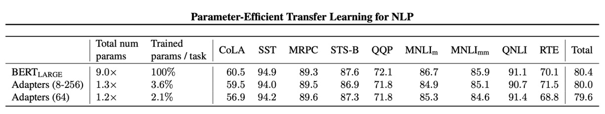

## パラメータ節約 96%

[**Parameter-Efficient Transfer Learning for NLP**](https://arxiv.org/abs/1902.00751)

---

BERT が提案された後、NLP の学習パラダイムが定まった：

- **「大量の」データで「大規模な」モデルをまず訓練し、その後微調整を行う必要がある。**

この学習パラダイムに従えば、さまざまな NLP タスクで最適なパフォーマンスを得ることができる。

## 問題定義

本論文の著者は、この方法に顕著な問題があると考えている：

### 無駄！

振り返ってみると、目標タスクにおいて、全体の事前訓練されたモデルを微調整する必要があるのだろうか？

- たとえ、ほんの一部を変更するだけでも。

つまり、もし異なる 10 のタスクを解決しようとすれば、10 の異なるモデルを訓練しなければならないのか？

- これらのタスクには多くの共通点があるにもかかわらず。

多くの共通点があるのに、なぜこんなにも多くのリソースを無駄にする必要があるのか？

## 問題解決

ここでは、必要なものは少なく、各タスクに小さな「Adapter」を与えるだけで十分だ。

著者は既存の Transformer アーキテクチャに、小さくて効率的な Adapter モジュールを追加した。この Adapter の目的は、追加のパラメータをほとんど増やさずに、モデルのパフォーマンスを向上させることだ。

上記の図を見ながら、著者は Transformer の各層の後ろに 2 つの Adapter モジュールを追加した。

- **1 つ目は Self-Attention の後、LayerNorm の前に追加。**
- **2 つ目は Feed-Forward の後、LayerNorm の前に追加。**

各 Adapter モジュールの動作は、小さなニューラルネットワークのように、最初に元の高次元特徴を低次元に圧縮し、非線形変換を適用し、最終的に元の高次元に戻す。

この設計は、以前 MobileNet や SqueezeNet などの軽量モデルで見られた「ボトルネック」設計であり、以下の 2 つの利点がある：

- **パラメータの節約：** この設計は、元のモデルの約 0.5％〜8％のパラメータ量しか必要としない。
- **特徴の圧縮：** 特徴の圧縮を通じて、特徴の表現能力を向上させる。

さらに、各 Adapter モジュールが正常に機能するように、著者は各 Adapter モジュール内部に「スキップ接続」を追加した。このため、Adapter モジュールの初期化パラメータがゼロに近い場合、それらは恒等関数のように元の出力に影響を与えないため、安定性が保証される。

モデル訓練時には、「Adapter モジュール」のパラメータのみを訓練し、他のパラメータはそのまま凍結することで、更新は不要となる。

## 議論

### GLUE 評価

著者は GLUE 検証セットで実験を行った。

結果として、Adapter モジュールの設計は、パラメータをほとんど増やさずに、モデルのパフォーマンスを向上させることができることが示された。

上の表には 2 種類の実験設計がある：

- **第一の実験（8-256）：** この設計は、異なるタスクに異なる Adapter モジュールを設計し、その特徴次元（ボトルネック内のユニット数）は「8、64、256」のいずれか。
- **第二の実験（64）：** この設計は、すべてのタスクに同じ Adapter モジュールを使用し、その特徴次元はすべて 64。

最終的に、訓練が不安定だったため、著者は異なるランダムシードで 5 回再実行し、検証セットで最適なモデルを選択した。

上記の表から、Adapter の平均 GLUE スコアは 80.0 であり、「完全微調整」の平均スコアは 80.4 であった。Adapter のパフォーマンスは「完全微調整」にわずかに劣るが、Adapter のパラメータ量は「完全微調整」の 3.6％であり、この効果は非常に驚異的である。

:::tip
これからは、小さな GPU でも大規模なモデルを微調整できる！素晴らしい！
:::

### アブレーション実験

Adapter モジュールの有効性を検証するために、著者は一連のアブレーション実験を行った。

これはヒートマップで、連続層から Adapter を取り除いた際のパフォーマンスの変化を示している。

:::tip
この図は初めて見ると少し複雑かもしれませんが、見方を説明します：

- **Row0 を見る**
  - ここでは、First ablated layer が 0 であるため、0 層から Adapter を取り除いている。
- **次に Row0、Column0 を見る**
  - この時、Last ablated layer は 0 で、0 層だけの Adapter を取り除いている。
- **次に Row0、Column1 を見る**
  - この時、Last ablated layer は 1 で、0 層から 1 層までの Adapter を取り除いている。
- **次に Row0、Column11 を見る**
  - この時、Last ablated layer は 11 で、0 層から 11 層までの Adapter を取り除いている。
- **次に Row5、Column8 を見る**
  - この時、First ablated layer は 5、Last ablated layer は 8 で、5 層から 8 層までの Adapter を取り除いている。

もう理解できたと思いますが、この図は異なる層で Adapter を取り除いたときのパフォーマンス変化を示しており、各セルの色がパフォーマンスの変化を表しています。色が濃いほど、パフォーマンスが低下しています。

この図は上三角部分を見ればよく、下三角部分は意味がありません。
:::

実験結果は Adapter の全体的な結果を示している：

1. **層の除去の影響：**

   - 単一層の Adapter を除去しても、パフォーマンスへの影響は大きくなく、最大で 2％の減少にとどまった。
   - しかし、すべての Adapter を除去すると、パフォーマンスが大きく低下し、MNLI では 37％、CoLA では 69％にまで落ちた。

2. **高層・低層の影響：**

   - 低層の Adapter（例えば 0-4 層）は影響が小さく、それらを取り除いてもパフォーマンスにほとんど影響を与えなかった。
   - 高層の Adapter はパフォーマンスに与える影響が大きく、これは直感的にも理解できる。高層の Adapter は特定のタスクの特徴を構築しているためである。

3. **初期化のスケール：**

   - Adapter の初期化標準偏差が 0.01 未満であれば、パフォーマンスは安定している。
   - 初期化標準偏差が大きすぎると、特に CoLA データセットではパフォーマンスが低下する。

4. **ボトルネック特徴の大きさ：** 特徴サイズが 8、64、256 のとき、パフォーマンスは比較的安定している。

5. **アーキテクチャの拡張：** BatchNorm や LayerNorm の追加、Adapter 層数の増加、活性化関数の変更（例えば tanh）や、注意層内にのみ Adapter を挿入する方法では、パフォーマンスに顕著な改善は見られなかった。

したがって、著者は最も初期の Adapter 設計を推奨している。なぜなら、それはシンプルで効果的であり、頭を悩ませる必要がないからだ。

## 結論

Adapter モジュールの設計思想は、モデルに小さくて効率的なプラグインを追加するようなもので、非常に少ないパラメータ（約 0.5％〜8％）で、モデルのパフォーマンスを目標タスクに移行することができる。例えば、30B のパラメータを持つモデルは、0.15〜2.4B のパラメータで同じ効果を得ることができる。

これにより、計算資源が限られた一般の人々でも、大規模な Transformer モデルを簡単に微調整できるようになった。あらゆる面で、これは非常に良いニュースだ！
