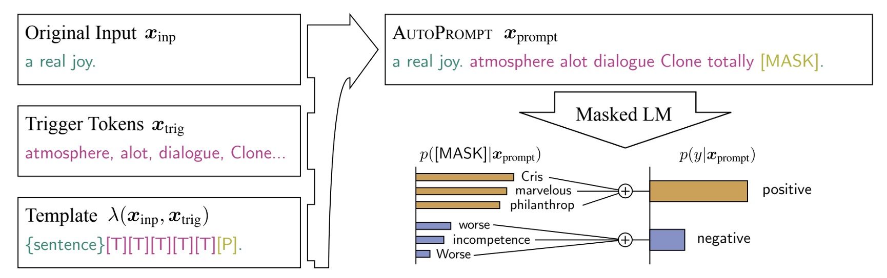
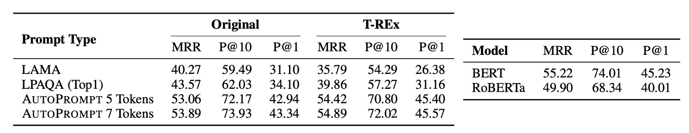

## モデル言語

[**AutoPrompt: Eliciting Knowledge from Language Models with Automatically Generated Prompts**](https://arxiv.org/abs/2010.15980)

---

言語モデルはますます大規模化しており、大多数の人々はこれらのモデルを訓練したり微調整したりする能力がありません。そのため、別の方向での研究が生まれました：プロンプトエンジニアリング（Prompt engineering）。

この概念は、どのようなプロンプト（prompt）を設計すれば、大規模な言語モデルが特定の問題に答えられるかを考えることです。

しかし、プロンプトを書くのは面倒です！

## 問題定義

### 手動でプロンプトを書くのは時間がかかり面倒

新しいタスクごとにプロンプトを書くのは、繰り返し試行錯誤するパズルのようで、大量の時間がかかります。

これらのプロンプトを書くことも簡単ではありません。モデルとタスクを非常に理解していなければ、効果的なプロンプトは書けません。これは多くの人々にとって直感的ではありません。

### モデルは入力に非常に敏感

モデルはプロンプトに非常に敏感で、わずかな変更でもモデルのパフォーマンスを大きく低下させる可能性があります。

プロンプトを書く際に少しでも注意を怠ると、結果はぐちゃぐちゃになるかもしれません。

### 専門知識の不足

手動でプロンプトを書くことは疲れるだけでなく、非常に専門的な知識も必要です。専門的な知識がなければ、核心的な概念に迫ることができず、モデルは表面的な質問にしか答えられません。

### モデルが変われば頭も変わる

これまでのいくつかの課題を乗り越え、数ヶ月かけてようやくモデルの潜在能力を最大限に引き出せるプロンプトエンジニアリングを完成させました。

しかし、その時、モデルがアップグレードされました！

そして、あなたは再び最初からやり直さなければならなくなります。

## 問題解決

### モデルアーキテクチャの設計

上記の問題を解決するために、本論文では新しい方法である「AutoPrompt」を提案しています。

概念は非常にシンプルです：もし、どのプロンプトがモデルに有効か分からないのであれば、モデルに自分でプロンプトを生成させればいいのです。

全体のアーキテクチャは、上の図に非常に明確に示されています：

1. **Original Input**：これは元の入力 $X$ です。

2. **\[MASK\]**：これは元の出力 $Y$ です。

ここでは感情分析のタスクを扱っているため、$Y$ は感情ラベル（ポジティブまたはネガティブ）です。

中央の \[T\] 部分が、AutoPrompt の核心部分です：自動でプロンプトを生成する範囲。

つまり、モデルは元の入力と出力を受け取った後、自分でプロンプトを見つけ出して、最終的なモデルのパフォーマンスを向上させなければなりません。

### 勾配に基づくプロンプト探索

著者は異なるタスクに対して異なるプロンプト生成戦略を設計し、モデルのパフォーマンスを向上させました。

この部分では、AutoPrompt は勾配に基づく探索戦略を利用して、プロンプトを自動で生成します。

先ほど言及した自動プロンプトの部分は、\[MASK\] を初期化として使用し、反復更新を行って top-k のトークン候補を見つけ出すことです。

したがって、この方法ではターゲット言語モデルには触れず、言語モデルからのフィードバックを使用して、勾配更新で最適なプロンプト語句を見つけ出します。

## 討論

### 感情分析実験

研究結果は以下のように示しています：

1. AutoPrompt で生成されたプロンプトは、BERT と RoBERTa が感情分析において深い認識を持っていることを証明しました。
2. 微調整なしで、BERT のパフォーマンスは監視付き BiLSTM と同等でした。
3. RoBERTa の精度は、微調整された BERT と ELMo モデルに匹敵しました。

また、著者は自動構築されたプロンプトが手動プロンプトよりも効果的であり、これらのプロンプトは人間の直感では構築できないことを観察しました：

- 自動プロンプトは手動プロンプトよりも 20%精度が向上しました。
- RoBERTa にとって、最適なテンプレートは **“\{文\} atmosphere alot dialogue Clone totally \[P\]。”** でした。

### 事実検索

著者は事実検索タスクでも実験を行い、この研究は LAMA および LPAQA データセットを利用し、事前訓練された MLM（BERT や RoBERTa など）が現実世界の事実を正確に認識し理解できるかを調べました。このタスクでは、著者はテンプレート「\{sub\}\[T\]...\[T\]\[P\]」を使用して三項関係をマッピングしました。トリガーのトークンは関係に関する特定のトークンで、正しい対象がラベルとして付けられます。

- **データ収集と処理**

  - T-REx データセットと Wikidata から最大 1000 個の事実を収集して AutoPrompt を訓練。
  - 訓練データとテストデータに重複がないことを確認し、80-20 で訓練セットと開発セットに分割。

- **性能評価**

  - 標準的なランク付け指標（平均逆順位(MRR)、P@1、P@10 など）を使用してモデルを評価。
  - AutoPrompt は事実検索において従来の方法よりも効果的なパフォーマンスを示し、特に 7 つのトリガーマークを使用した場合に効果的でした。

- **BERT と RoBERTa の比較**：

  - BERT と RoBERTa の性能を同じテスト条件下で比較しました。BERT はいくつかの状況でわずかに優れており、特にプロンプト生成において、RoBERTa が生成したプロンプトは多くの関連性のない単語を含んでいました。

この研究は、AutoPrompt を使用する方法が MLM から事実知識をより効果的に抽出できることを証明しました。

驚くべきことに、RoBERTa のパフォーマンスは BERT よりも良くなく、今後の研究でこの点をさらに調査する必要があることが分かりました。

:::tip
プロンプト方法を使用して言語モデルを評価する際、モデルの相対的な性能が低いことが、必ずしもそのモデルが関連する知識を理解していないことを意味するわけではありません。モデルの性能は、より広い評価文脈で理解すべきであり、単一のテスト結果だけに依存するべきではありません。

プロンプト方法は、言語モデルが特定の事実検索タスクにどのように対応するかを測るツールです。しかし、この方法はモデルのすべての能力を完全に捉えることができるわけではありません。例えば、プロンプトが理想的でない場合や、モデルの訓練データの分布と一致しない場合、モデルのパフォーマンスが悪化する可能性があります。さらに、いくつかのモデルは特定の問題タイプにおいて優れたパフォーマンスを発揮する一方で、他の問題タイプにはあまり効果的ではない場合もありますが、これはモデルが関連する知識や能力を学んでいないことを意味するわけではありません。

言語モデルは大規模なデータセットで訓練され、幅広い言語構造や情報を網羅しています。したがって、あるモデルは直接的に表現されない場合でも、実際には大量の隠れた知識を保持していることがあります。評価タスクがモデルの訓練経験と十分に一致しない場合、評価方法や特定の実験設計では、モデルの隠れた知識を引き出したり、示したりすることができないかもしれません。
:::

## 結論

前述の著者が述べたように：

- RoBERTa にとって、最適なテンプレートは **“\{文\} atmosphere alot dialogue Clone totally \[P\]。”** です。

言語モデルは人間の言語知識を使って訓練されていますが、モデルは訓練データから「モデル語」と呼ばれる、人間には理解できない「モデル固有の言語」をまとめ出しているのかもしれません。

この「モデル語」の形成は、深層神経ネットワークがデータから複雑な言語特徴を抽象化できることによって実現されます。これらの特徴は、言語の深層意味と文脈のパターンを含んでいます。

したがって、モデルがこれらの無秩序なフレーズを用いて内部状態を表現する際、実際にはモデルが情報を処理し、コード化するための自分自身の方法であることを意味します。

これは非常に面白いことであり、さまざまな思考を引き起こします：

1. 人間の言語は効率が悪いのではないか？

2. モデル語と人間語の違いは消すべきなのか？それとも、本当に消せるのか？

3. 我々はよくモデルの透明性を批判しますが、この「モデル語」の存在は、モデルの説明をより難しくしているのではないか？

4. 異なるモデル間の「モデル語」には類似性があるのか？結局、彼らは人間の言語から学んでいるのだから。

これからの研究に続き、この問題がどのように解決されるのかを見守りましょう。
