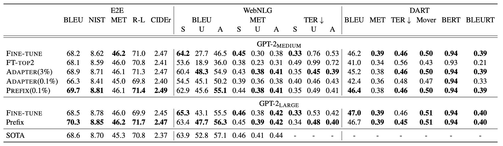
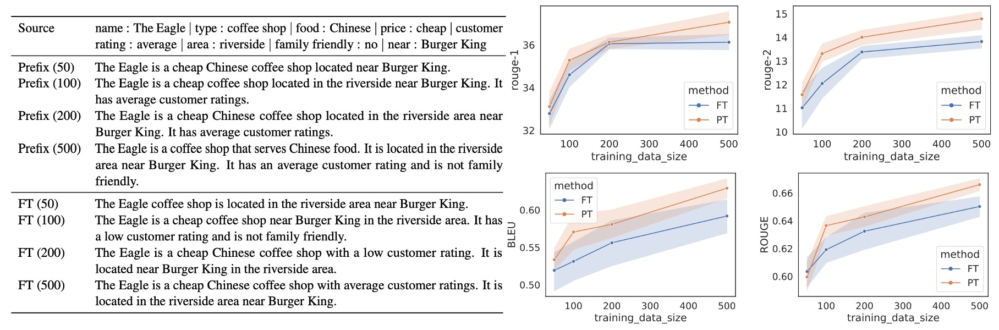

## それは彼？それとも彼ではない？

[**Prefix-Tuning: Optimizing Continuous Prompts for Generation**](https://arxiv.org/abs/2101.00190)

---

他の人が訓練した言語モデルを使用するための一般的な方法は次の通りです：

1. **Fine-tuning**：モデルのパラメータを新しいタスクに合わせて調整する。

   しかし、これは一般の人にはできません。なぜなら、大量のデータと計算リソースが必要だからです。

2. **Prompt-based**：設計されたプロンプトを使って、モデルに望む結果を導き出す。

   例えば、要約のタスクを行う場合、モデルに要約を生成させるためにプロンプトを設計します。異なるモデルでは異なるプロンプトが必要です。例えば：

   1. GPT-3：`Summarize with 3 sentences about the following article:`
   2. T5：`summarize the following article:`
   3. BART：`Document summarization:`
   4. ...

   ただし、モデルを変更すると脳も変わるため、テストを繰り返す必要があります。

---

これ以外に方法はありませんか？

もちろん！研究者たちに足りないものは創造力ではありません。

最近、**AutoPrompt**という方法が提案され、自動的に最適なプロンプトを見つけることで、Fine-tuning と Prompt-based の利点を組み合わせました。

- [**[20.10] AutoPrompt: モデル語**](../2010-autoprompt/index.md)

学習可能なパラメータを用いて、モデルが自分の特徴に基づいて最適なプロンプトを自分で見つける方法です。

## 問題定義

<figure style={{"width": "70%"}}>

</figure>

先程も触れましたが、現在の問題は元のモデルの規模が大きすぎて一般の人には Fine-tuning ができず、Prompt-based では繰り返しテストが必要だということです。

そこで、著者は新しい方法として**Prefix-Tuning**を提案しています。概念は非常にシンプルで、上図のように、**Prefix**というトークンをモデルの入力の最初に挿入し、それを通じてモデルに結果を導かせるというものです。

待ってください、それは AutoPrompt がやっていることではないですか？

その通りです！

違いは、AutoPrompt の方法が「既に訓練された」トークンから適切なプロンプトを組み合わせるのに対し、Prefix-Tuning は「特徴空間で」最適なトークンを訓練によって直接生成するということです。

著者は、AutoPrompt の方法で生成されたプロンプトには連続性の問題があると考えています。なぜなら、それはすでに訓練されたトークンを組み合わせて作られているからです。一方、Prefix-Tuning では特徴空間で直接トレーニングされたトークンが生成されるので、より適用しやすいとされています。

## 解決策

### モデルアーキテクチャ

上図は Prefix-Tuning のモデルアーキテクチャの示意図で、このアーキテクチャは以下の部分を含みます：

1. **学習可能なプレフィックスパラメータ $P_\theta$**：これは新しく追加されたパラメータで、入力シーケンスの最初に配置され、その長さや次元は設定可能です。これらのパラメータは訓練プロセス中に最適化され、特定のタスクに応じた出力を生成するようにモデルを導きます。

2. **固定された事前訓練済み言語モデル $\text{LM}_\phi$**：これはすでに事前訓練された大規模な言語モデル、例えば GPT-2、GPT-3 などです。Prefix-Tuning プロセスでは、この部分のパラメータ $\phi$ は固定され、モデルの微調整によるリソース消費を避けます。

3. **入力シーケンス $x$**：これはタスクの入力で、要約する必要がある記事や記述する必要がある表形式データなどです。

4. **出力シーケンス $y$**：これはモデルが生成する必要がある出力で、例えば記事の要約や表のテキスト記述です。

### 実装の詳細

Prefix-Tuning の実装にはいくつかの手順があります：

1. **プレフィックスパラメータの初期化**：まず、プレフィックス用の学習可能なパラメータ行列 $P_\theta$ を作成します。サイズは $|P_{\text{idx}}| \times \text{dim}(h_i)$ で、$|P_{\text{idx}}|$ はプレフィックスの長さ、$\text{dim}(h_i)$ はモデルの隠れ層の次元です。

2. **再パラメータ化**：

   高次元の $P_\theta$ を直接最適化すると最適化が不安定になる可能性があるため、著者は再パラメータ化戦略を採用しました：

   - **低次元表現 $P'_\theta$**：小さな行列 $P'_\theta$ を作成します。そのサイズは $|P_{\text{idx}}| \times d'$ で、$d' < \text{dim}(h_i)$ です。
   - **多層パーセプトロン（MLP）**：多層パーセプトロン $\text{MLP}_\theta$ を使用して $P'_\theta$ を高次元の $P_\theta$ にマッピングします：
     $$
     P_\theta[i, :] = \text{MLP}_\theta \left( P'_\theta[i, :] \right)
     $$
   - **最適化プロセス**：訓練中は、$P'_\theta$ のパラメータと MLP の重み $\theta$ を最適化し、事前訓練された言語モデルのパラメータ $\phi$ は固定します。

3. **モデルの前向き伝播**：

   - **プレフィックス部分**：プレフィックスの各位置 $i \in P_{\text{idx}}$ に対して、活性化値は $P_\theta[i, :]$ から直接取ります：
     $$
     h_i = P_\theta[i, :]
     $$
   - **入力シーケンス部分**：入力シーケンス $x$ と出力シーケンス $y$ に対して、活性化値は事前訓練されたモデルの計算方法に従って、プレフィックスの活性化の影響を受けます：
     $$
     h_i = \text{LM}_\phi(z_i, h_{<i})
     $$
     ここで、$z_i$ は入力シーケンスの $i$ 番目のトークンで、$h_{<i}$ はプレフィックスと入力シーケンスの $i$ 番目の位置以前のすべての活性化値を含んでいます。

モデルの訓練目標は、出力シーケンス $y$ の対数尤度関数を最大化することです：

$$
\max_\theta \log p_\phi(y | x, P_\theta) = \sum_{i \in Y_{\text{idx}}} \log p_\phi(z_i | h_{<i})
$$

ここでは、プレフィックスパラメータ $\theta$ のみを最適化し、言語モデルのパラメータ $\phi$ は固定されます。

訓練が完了した後、最適化された高次元プレフィックス行列 $P_\theta$ が得られます。推論時には再パラメータ化を行わないため、MLP モデルは破棄し、$P_\theta$ のみを保持します。推論時には、$P_\theta$ を新しい入力シーケンス $x$ と結合し、事前訓練された言語モデルを通じて出力 $y$ を生成します。

### データセット設定

1. **Table-to-Text 生成タスク**：

   - 三つのデータセットを使用し、複雑さと規模の順に並べます：
     1. **E2E (Novikova et al., 2017)**：
        - 1 つの領域（レストランレビュー）、約 50K データ、8 つのフィールドを含む。
        - 各データに複数のテスト参照が対応、平均出力長は 22.9。
        - 評価指標：BLEU、NIST、METEOR、ROUGE-L、CIDEr。
     2. **WebNLG (Gardent et al., 2017)**：
        - 22K データ、入力は(subject, property, object)の三項関係。
        - 14 の領域をカバー、テストセットは「既知」と「未知」のカテゴリに分かれ、モデルの一般化能力を検証。
        - 平均出力長は 22.5。
        - 評価指標：BLEU、METEOR、TER。
     3. **DART (Radev et al., 2020)**：
        - オープン領域データセット、82K データ、入力フォーマットは WebNLG に似ている。
        - WikiSQL、WikiTableQuestions、E2E、WebNLG からデータ。
        - 平均出力長は 21.6。
        - 評価指標：BLEU、METEOR、TER、MoverScore、BERTScore、BLEURT。

2. **要約生成タスク**：
   - **XSUM (Narayan et al., 2018)**：
     - 225K 件のニュース要約データ、記事の平均長さは 431 語、要約の平均長さは 23.3 語。
     - 評価指標：ROUGE-1、ROUGE-2、ROUGE-L。

## 討論

### 表格転文字生成性能

Prefix-Tuning は 0.1％のタスク特有のパラメータのみで、他の軽量化手法を超えるパフォーマンスを発揮しました：

- **Adapter-Tuning (ADAPTER)**：同じ 0.1％のパラメータを使用していますが、Prefix-Tuning は**BLEU**スコアで平均**4.1 点**向上しました。
- **FT-TOP2**：モデルの最初の 2 層のみ微調整。

Prefix-Tuning のパフォーマンスは、完全な Fine-tuning に匹敵し、時にはそれを上回ることもあります。Adapter-Tuning（3.0％のパラメータ）に対しても、Prefix-Tuning は遜色ないパフォーマンスを発揮しました。

Prefix-Tuning は、E2E、WebNLG、DART の 3 つのデータセットにおいて安定したパフォーマンスを示しており、この方法の汎用性が証明されています。特に**DART**データセットでの優れたパフォーマンスは、Prefix-Tuning が異なるドメインの表形式データと多様な関係に適応できることを示しており、良好な汎化能力を持つことが確認されました。

GPT-2 Medium および GPT-2 Large の実験では、Prefix-Tuning はモデルの規模が大きくなるにつれてパフォーマンスを維持できることが示され、GPT-3 のようなより大規模なモデルにも適用可能であることが示唆されました。

### 要約生成性能

<figure style={{"width": "70%"}}>

</figure>

**2％のパラメータ**を使用した場合、Prefix-Tuning の**ROUGE-L**スコアは**36.05**で、完全な微調整モデルの**37.25**にはわずかに劣ります。さらにパラメータを**0.1％**に減らすと、Prefix-Tuning の**ROUGE-L**スコアは**35.05**に低下し、少ないパラメータで性能が低下することが示されました。

Prefix-Tuning は要約生成タスクでのパフォーマンスが完全微調整に及ばない場合がありますが、その理由として以下の要因が考えられます：

1. **データ量の差異**：XSUM データセットのサンプル数は表形式データセットの**4 倍**であり、より多くのサンプルを処理する必要があります。
2. **入力の長さ**：XSUM の平均記事長は表形式データの**17 倍**であり、より長い入力シーケンスを処理する必要があります。
3. **タスクの複雑さ**：要約生成は表形式データからのテキスト生成よりも複雑で、モデルには読解能力が必要であり、記事から重要な内容を識別する能力が求められます。

Prefix-Tuning は要約生成タスクでのパフォーマンスが完全微調整に劣るものの、リソースが制限されたシナリオにおいてその潜在能力を示しています。タスクによってモデルへの挑戦が異なり、長い記事や複雑な内容を処理する場合、Prefix-Tuning の優位性はやや小さくなります。しかし、それでも大幅にパラメータを削減しながら、微調整に近い性能を達成しています。

### 小サンプル設定

Prefix-Tuning は小サンプルシナリオで Fine-tuning より優れており、**2.9 BLEU**スコアを平均して向上させ、使用するパラメータも大幅に減少させました。データセットの規模が増加するにつれて、Prefix-Tuning と Fine-tuning のパフォーマンス差は徐々に縮小します。

完全なデータセット（E2E は表形式データ用、XSUM は要約生成用）からサンプリングし、異なる規模の小さなデータセットを構築し、それぞれ**{50, 100, 200, 500}**件のデータを使用しました。各規模で**5 回の異なるサンプリング**を行い、**2 つのランダムシード**で平均した結果、各規模の結果は**10 個のモデル**の平均パフォーマンスに基づいています。

小データシナリオでは、どちらの手法でも生成内容が不足する（undergeneration）のが一般的で、表の一部の内容が欠ける場合があります。Prefix-Tuning の生成結果は、入力された表に忠実で、100 または 200 件のデータのシナリオでも、その記述は実際のデータに合致します。Fine-tuning では、100 または 200 件のデータで顧客評価を「低い」と誤報告することがあり、実際の評価は「平均」でした。逆に、Prefix-Tuning によって生成された記述は、表の内容を正確に反映しています。

Prefix-Tuning は、小サンプルシナリオで顕著な適応能力を示し、使用するパラメータが少ないにもかかわらず、より良い結果を提供します。この方法は、特にデータ量が少ない場合に、Fine-tuning よりも安定性と信頼性が高いパフォーマンスを示しています。

### 外挿能力

<figure style={{"width": "70%"}}>

</figure>

著者はさらに、Prefix-Tuning が**未見テーマ**での外挿能力を持つかどうかを調査しました。これは、モデルが訓練とテストで異なるテーマを処理する能力を示します。

- **外挿設定**

  - **表形式からテキスト生成 (Table-to-Text)**：**WebNLG**データセットを使用し、表のテーマに基づいてグループ化します：

    - **SEEN**：訓練と検証データセットに現れる 9 つのカテゴリ。
    - **UNSEEN**：テストデータセットにのみ現れる 5 つのカテゴリ。

    テスト対象は SEEN カテゴリで訓練を行い、UNSEEN カテゴリでのモデルのパフォーマンスを評価します。

  - **要約生成 (Summarization)**：2 つの外挿シナリオを設定：

    - **ニュースからスポーツ**：ニュース記事で訓練し、スポーツ記事でテスト。
    - **ニュース内分類**：「世界、イギリス、ビジネス」ニュースで訓練し、その他のニュースカテゴリ（健康、テクノロジーなど）でテスト。

Prefix-Tuning は、表形式からテキスト生成タスクでも要約生成タスクでも、すべての評価指標で Fine-Tuning を上回り、クロスドメインシナリオでの強力な外挿能力を示しました。

Adapter-Tuning は外挿シナリオで Prefix-Tuning と同等のパフォーマンスを示し、言語モデルパラメータを保持（モデルの完全微調整を行わない）することが外挿性能を向上させるのに役立つことを示しました。

### プレフィックスはどのくらいの長さが必要か？

実験結果によると、プレフィックスの長さが長いほどパフォーマンスに好影響を与えますが、一定の閾値を超えるとパフォーマンスがわずかに低下します。

- 要約生成タスクでは、プレフィックス長さが**200**で最適なパフォーマンスが得られました。
- 表形式からテキスト生成タスクでは、プレフィックス長さが**10**で最適なパフォーマンスが得られました。

プレフィックスの長さが推論速度に与える影響はほとんどなく、GPU が注意計算を並列処理できるためです。

### 初期化戦略

<figure style={{"width": "80%"}}>

</figure>

小データシナリオでは、初期化戦略がパフォーマンスに大きな影響を与えます：

- **ランダム初期化**はパフォーマンスを低くし、変動が大きくなります。
- **実際の語彙を使った活性化初期化**はパフォーマンスを大幅に改善します。

タスクに関連する語彙（「summarization」や「table-to-text」など）で初期化した場合のパフォーマンスは、タスクと無関係な語彙（「elephant」や「divide」など）で初期化した場合よりわずかに良好です。それでも、無関係な語での初期化でもランダム初期化よりはパフォーマンスが高いです。

### 適用シナリオ

Prefix-Tuning は、多くのタスクを個別に訓練する必要があるシナリオ、例えば多ユーザー個別化モデルに特に適しています。ユーザープライバシーを保護するために、各ユーザーのデータは分離され、個別のモデルが必要です。このシナリオでは、各ユーザーが独立したタスクとして扱われます。

Prefix-Tuning は、前綴りの追加と削除によってユーザーを柔軟に追加または削除でき、ユーザーデータの交差汚染を避けることができます。

一方、Adapter-Tuning ではこのような機能は実現できません。なぜなら、各ユーザーのアダプタが Transformer 層の間に埋め込まれており、計算を共有するのが難しいからです。

### 未見テーマで優れたパフォーマンスを発揮する理由

著者はこの問題について少し議論しています。

まず、事前訓練された言語モデルは、大規模で一般的なコーパスで訓練されています。そのため、これらのパラメータを保持すること（大きな調整を加えないこと）は、モデルの汎化能力を維持し、未見のテーマにも対応できるようにするのに役立ちます。Prefix-Tuning と Adapter-Tuning は、事前訓練されたパラメータを固定し、一部のパラメータのみを調整することで、モデルの元々の能力を損なうことなく、未見のテーマにも適応できるようにしています。

完全な微調整（Fine-tuning）は、モデルが訓練データに過剰適合する原因となる可能性があり、特に特定のドメインや小規模なデータセットの場合はそのリスクが高まります。軽量微調整（Prefix-Tuning や Adapter-Tuning）は、一部のパラメータのみを最適化し、過剰適合のリスクを減らすため、未見テーマに適応する能力が高いとされています。

軽量微調整は、事前訓練されたパラメータを保持しますが、これが新しいタスクに対して最適化できない場合があるという意味でもあります。特に、高度な理解や推論が必要なタスクでは、微調整が不可欠であり、軽量微調整では限界があるかもしれません。

Prefix-Tuning が外挿シナリオで良いパフォーマンスを示す一方で、この結果は特定のデータやタスクに依存している可能性もあります。例えば、非常に複雑で不規則なデータでは、軽量微調整が安定した汎化性能を提供できない場合もあります。さらに、一部の未見テーマのテストセットが事前訓練されたコーパスと潜在的に重複している可能性があり、その結果が楽観的になることがあります。

最後に、著者はこの問題は依然として開かれた課題であり、さらなる研究が必要であると考えています。

:::tip
著者は Prefix-Tuning が未見テーマで良いパフォーマンスを発揮する理由について試みましたが、実際の理由はまだ確定していないことを認めています。
:::

## 結論

Prefix-Tuning は軽量微調整の方法で、学習可能なプレフィックスパラメータを追加することで、モデルを特定のタスクに適応させることができます。

この方法は、表形式からテキスト生成タスクと要約生成タスクで印象的なパフォーマンスを達成し、少ないパラメータであっても優れた結果を出しました。Prefix-Tuning は小サンプルや未見テーマのシナリオでも優れたパフォーマンスを示し、良好な汎化能力を持っています。

:::tip
言語モデルに関してよく見ている人なら、この方法の最大の欠点に気づくかもしれません：

- **予測シーケンスの一部のトークンをプレフィックスに使う必要があること**。

実験では、最適な結果を得るために 200 トークンが必要だとされていますが、一般的な言語モデルの入力は 512 トークンがほとんどなので、この方法では半分以上を無駄に使うことになります。
