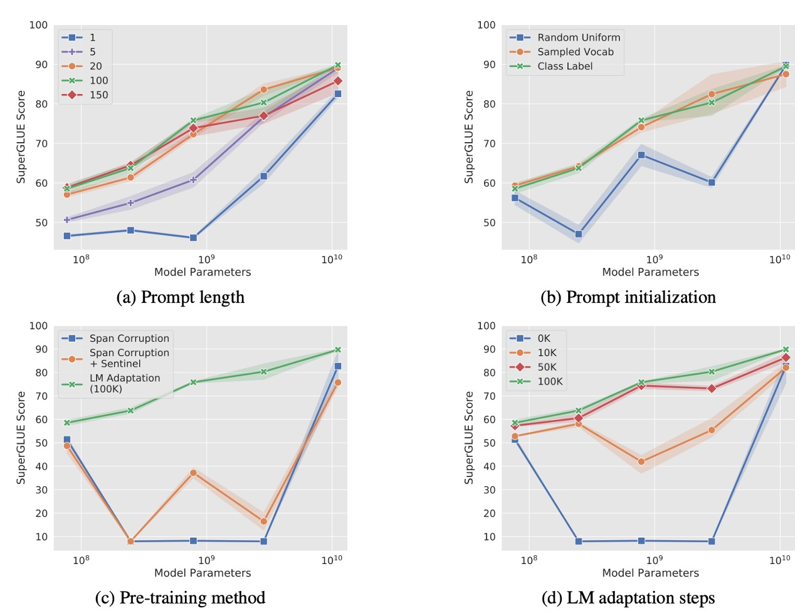
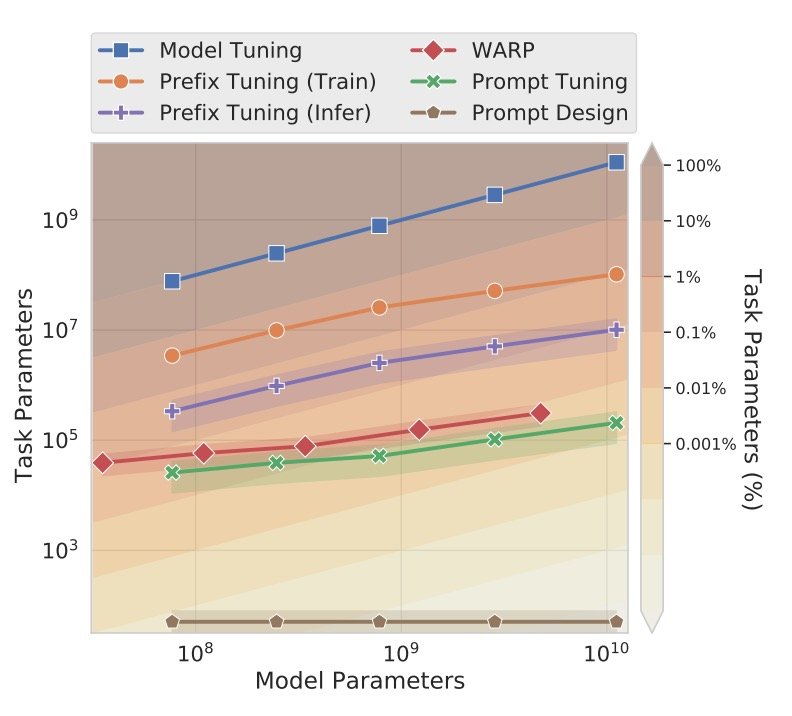

## 優しいリマインダー

[**The Power of Scale for Parameter-Efficient Prompt Tuning**](https://arxiv.org/abs/2104.08691)

---

Prefix-Tuning を見たばかりですが、今回は別の新しい方法である**Prompt Tuning**を見ていきましょう。

:::tip
もしまだ Prefix-Tuning を見ていないのであれば、まずは以前読んだ論文をチェックしてみてください：

- [**[21.01] Prefix-Tuning: それは彼？それとも彼ではない？**](../2101-prefix-tuning/index.md)
  :::

## 問題定義

著者は論文の中で、T5 の論文のアーキテクチャから始め、現在のモデル調整における困難を理解するための手助けをしています。

:::tip
もし T5 を見たことがないのであれば、以下の論文を参考にできます：

- [**[19.10] Exploring the Limits of Transfer Learning with a Unified Text-to-Text Transformer**](https://arxiv.org/abs/1910.10683)
  :::

T5 では、すべてのタスクがテキスト生成の問題として扱われます。翻訳、要約、分類など、すべてが入力テキストから出力テキストを生成する問題として表現されます。

従来の分類モデルは確率 $\text{Pr}(y|X)$ を使用して、入力 $X$ を出力カテゴリ $y$ にマッピングします。しかし、T5 のアーキテクチャでは、モデルが注目しているのは**条件付き生成**の問題で、目標は以下を計算することです：

$$
\text{Pr}_\theta(Y | X)
$$

ここで：

- $Y$ はカテゴリを表す**テキスト**で、例えば「positive」や「negative」などであり、0、1、2 といったカテゴリではありません。
- $\theta$ は Transformer モデルのパラメータです。

この方法の利点は、モデルが単一のクラスラベルだけでなく、より豊かなテキスト出力を直接生成できることです。

プロンプト（Prompting）は、入力 $X$ の前に追加されるテキストの一部で、モデルが正しい出力 $Y$ を生成するように導きます。プロンプトはモデルにタスクの文脈や指示を提供し、入力に対してどのように処理すべきかを理解させる役割を果たします。

例えば、感情分析タスクでは、次のようなプロンプトを使用できます：

```
"以下の文の感情傾向を判断してください："
```

そして、ユーザーの入力文をプロンプトの後ろに追加して、最終的な入力を形成します：

```
"以下の文の感情傾向を判断してください：I love this movie!"
```

しかし、この「従来の」プロンプトには、手間がかかるだけでなく、効果が不安定で、微分可能ではないという問題があります。微分可能でない問題は、逆伝播アルゴリズムを使ってプロンプトのパラメータを更新できないことを意味し、モデルが自動的に最適なプロンプトを学習できないことにつながります。

---

この問題を解決するために、以前の研究では Prefix-Tuning が提案され、モデルの入力の最前に「Prefix」と呼ばれるトークンを追加して、モデルを導く方法を採用しました。この Prefix はモデルの各層に深く組み込む必要があり、これによりモデルの各層でガイダンスを受けることができます。

では、これをもっと簡単にできないでしょうか？入力層でモデルを導くだけで良いのでは？

そこで登場したのがこの論文：**Prompt Tuning**です。

:::tip
ここで言う「導く」とは、私たちがよく聞く「Prompt Engineering」とは異なります。Prompt Engineering は自然言語の方法でモデルを導き、モデルの入力特徴を変更することなく、パラメータやアーキテクチャを変更しません。

一方で、「Prompt Tuning」はモデルの入力層に特別なトークンを追加し、このトークンは学習可能であり、モデルが訓練中に最適なガイダンス方法を学べるようにするものです。
:::

## 解決問題

### Prompt Tuning

<div align="center">
<figure style={{"width": "80%"}}>

</figure>
</div>

そこで、著者は Prompt Tuning の方法を提案し、更新可能なプロンプト埋め込みパラメータ $\theta_P$ を導入しました。これらのパラメータはモデルの埋め込み表に制約されず、訓練データを通じて自動的に学習できます。

新しい条件付き生成の式は次のようになります：

$$
\text{Pr}_{\theta; \theta_P}(Y | [P; X])
$$

ここで：

- $[P; X]$ はプロンプト $P$ と入力 $X$ を結合したものです。
- $\theta$ は固定されたモデルのパラメータです。
- $\theta_P$ は学習可能なプロンプトパラメータです。

訓練過程では、逆伝播アルゴリズムを使用してプロンプトパラメータ $\theta_P$ のみを更新し、モデルの本体のパラメータ $\theta$ は変更しません。

具体的な実装の詳細は、次のような手順に分けられます：

1. **入力埋め込み**：入力の$n$個のトークンを埋め込み行列$X_e \in \mathbb{R}^{n \times e}$に変換します。ここで、$e$は埋め込みの次元です。
2. **プロンプト埋め込み**：プロンプトの埋め込みは行列$P_e \in \mathbb{R}^{p \times e}$として定義され、ここで$p$はプロンプトの長さです。
3. **結合操作**：プロンプト埋め込みと入力埋め込みを結合して：
   $$
   [P_e; X_e] \in \mathbb{R}^{(p + n) \times e}
   $$
4. **モデル処理**：結合された埋め込みをエンコーダ・デコーダのアーキテクチャに入力し、計算を行います。

例えば、モデルに「I love this movie!」という文の感情を判断させたい場合、従来の方法では入力は次のようになります：

```
"以下の文の感情を判断してください：I love this movie!"
```

一方、Prompt Tuning を使用した場合のモデル入力は次のようになります：

```
[Token1] [Token2] [Token3] [Token4] [Token5] I love this movie!
```

ここで、上記の各トークンは学習可能であり、モデルはこれらのプロンプトを最適に使用する方法を自分で学ばなければなりません。

:::tip
**これって AutoPrompt ではないか？**

もし以前 AutoPrompt を読んだことがあるなら、こう疑問に思うかもしれません。読んでいない場合は、以下の記事を参照してください：

- [**[20.10] AutoPrompt: モデル語**](../2010-autoprompt/index.md)

---

この二つの違いは、AutoPrompt ではモデルが既存の語彙表から最適なプロンプトを見つけ出し、その結果が語彙表内に存在するのに対し、Prompt Tuning ではプロンプトの入力が特徴空間に直接作用し、語彙表に制約されることはありません。

そのため、Prompt Tuning の結果では、計算したコサイン類似度を通じて、プロンプトがどの語彙と近いかを見ることはできますが、プロンプトの内容自体を直接見ることはできません。
:::

## 討論



著者は Prompt Tuning に関するいくつかの重要な問題を調査するために、アブレーション実験を行いました：

### プロンプトの長さはどれくらいが最適か？

上図 (a) に示すように、著者は異なるモデルサイズ（Small、Base、Large、XL、XXL）におけるプロンプトの長さを実験し、プロンプトの長さを \{1, 5, 20, 100, 150\} と設定しました。

結果として、ほとんどのモデルではプロンプト長を 1 トークン以上に増加させると、パフォーマンスが顕著に向上することが示されました。しかし、T5-XXL モデルでは、単一のトークンをプロンプトとして使用するだけでも良いパフォーマンスが得られ、大規模モデルはプロンプト信号に対する要求が低いことがわかりました。

プロンプトの長さが 20 トークンを超えると、パフォーマンスの向上は緩やかになり、微小な改善しか見られませんでした。

### プロンプト初期化戦略の影響は？

上図 (b) に示すように、著者は 3 つの異なる初期化戦略を比較しました：

1. **ランダム初期化**：範囲$[-0.5, 0.5]$から均等にランダムサンプリング。
2. **語彙埋め込み初期化**：T5 の**最も一般的な 5,000 語**から埋め込みを選び、初期化。
3. **カテゴリラベル初期化**：下流タスクのカテゴリラベルを埋め込みに変換。ラベルが複数のトークンの場合は、その埋め込みの平均を取ります。プロンプトの長さがカテゴリ数を超える場合、残りのトークンには語彙埋め込みを使用。

結果として、カテゴリラベル初期化はすべてのモデルサイズで最良のパフォーマンスを示し、特に小さなモデルでは初期化戦略の差が非常に明確でした。T5-XXL モデルは初期化戦略に対してあまり敏感ではなく、どの初期化を使用してもそのパフォーマンスは比較的安定していました。

### 事前訓練目標の影響は？

上図 (c) に示すように、著者は異なる事前訓練目標が Prompt Tuning に与える影響を調査しました：

1. **Span Corruption**：T5 のデフォルトの span corruption 事前訓練目標を使用。
2. **Span Corruption + Sentinel**：下流タスクの目標出力にセントリンサインを追加し、事前訓練時の出力フォーマットを模倣。
3. **LM 適応**：T5 の事前訓練を引き続き使用し、**言語モデル（LM）目標**に変更して、追加で 100,000 ステップ訓練。

結果として、Span Corruption 事前訓練モデルは、モデルのプロンプトチューニングを凍結した場合には適していませんでした。なぜなら、モデルがセントリンサイン付きのテキストを読み取り、出力しているからです。**「Span Corruption + Sentinel」**による事前訓練フォーマットの模倣でも効果は限られていました。

**LM 適応**はすべてのモデルサイズでパフォーマンスを大幅に向上させました。

### LM 適応の訓練時間の影響は？

上図 (d) に示すように、著者は LM 適応の訓練時間が Prompt Tuning に与える影響を調査しました。

結果として、LM 適応ステップ数を増やすことで追加の改善が得られ、100,000 ステップあたりで最適なパフォーマンスに達しました。Span Corruption 事前訓練を LM 目標に変換するのは簡単なプロセスではなく、かなりの訓練リソースが必要でした（T5 の事前訓練ステップ数の約 10％相当）。

T5-XXL はさまざまな非理想的な設定でも良好なパフォーマンスを発揮し、モデル設定に対して高い頑健性を示しました。Span Corruption 設定では、モデルのパフォーマンスが不安定で、小さなモデルが Base、Large、XL モデルを超えることもありました。これらの問題はランダムな変動によるものではなく、3 回の繰り返し実験で一貫した低い変動が観察されました。

Span Corruption 事前訓練モデルと比較して、LM 適応後のモデルはすべてのサイズで安定しており、パフォーマンスの不安定性リスクを大幅に低減しました。

### 他の手法との比較

<div align="center">
<figure style={{"width": "80%"}}>

</figure>
</div>

上図では、著者は Prompt Tuning と他の関連手法を比較しました。手法が多いため、以下に各手法の簡単な紹介と参考文献を示します。

---

- **Prefix Tuning**：

  - [**[21.01] Prefix-Tuning: Optimizing Continuous Prompts for Generation**](https://arxiv.org/abs/2101.00190)

  Transformer の各層に学習可能なプレフィックスを追加する手法で、各層の固定された活性化値を提供します。この方法は GPT-2 や BART に適用されますが、Prompt Tuning は T5 に特化しています。BART では、Prefix Tuning は「エンコーダとデコーダ」の両方にプレフィックスを追加する必要があり、Prompt Tuning はエンコーダにのみプロンプトを追加するだけです。

  Prompt Tuning は入力層に単一のプロンプトを追加するだけで、各層にプレフィックスを追加する必要がなく、パラメータの要求が少なくなります。また、Prompt Tuning は入力例に基づいて中間層のタスク表現を更新することができ、Prefix Tuning は安定した訓練のために再パラメータ化が必要です。

---

- **WARP**

  - [**[21.01] WARP: Word-level Adversarial ReProgramming**](https://arxiv.org/abs/2101.00121)

  WARP はプロンプトパラメータを入力層に追加し、[MASK]トークンと学習可能な出力層を使用して、マスクされた部分をクラス予測にマッピングします。この手法は単一の出力しか生成できないため、分類タスクに制限されます。

  Prompt Tuning は入力に特殊な設計を加える必要がなく、タスク固有の出力層を使用することなく、より広範なタスクに適用できます。また、パフォーマンスも完全なモデル微調整に近いものです。

---

- **P-tuning**

  - [**[21.03] GPT Understands, Too**](https://arxiv.org/abs/2103.10385)

  P-tuning は、学習可能な連続プロンプトを入力の間に埋め込み、人間がデザインしたパターンに基づいて配置します。良好な SuperGLUE パフォーマンスを達成するためには、P-tuning はモデルの微調整と組み合わせて使用し、プロンプトとメインモデルのパラメータを同時に調整する必要があります。

  Prompt Tuning はプロンプトパラメータのみを更新し、メインの言語モデルは凍結されたままであり、モデル微調整のコストを回避できます。

---

- **Soft Words**

  - [**[21.04] Learning How to Ask: Querying LMs with Mixtures of Soft Prompts**](https://arxiv.org/abs/2104.06599)

    Soft Words では手作りのプロンプトテンプレートに基づいて学習されたプロンプトを使用し、各層に学習可能な$\Delta_i$パラメータを追加します。これにより、パラメータ要求はモデルの深さに応じて増加します。

    Prompt Tuning は層数の増加に伴って追加のパラメータを必要としないため、パラメータ規模の点で効率的です。

---

- **Adapters**

  - [**[19.02] Parameter-Efficient Transfer Learning for NLP**](https://arxiv.org/abs/1902.00751)

    Adapters は凍結されたモデル層間に挿入された小さなボトルネック層で、タスク固有のパラメータを削減します。BERT-Large で Adapter 層を微調整すると、パラメータは 2-4％増加し、性能は完全なモデル微調整に匹敵します。

    Adapters は中間層の活性化値を書き換えることでモデルの挙動を変更しますが、Prompt Tuning は入力表現を調整し、モデル内部の計算を変更しません。

### 結局プロンプトは何を伝えているのか？

先ほど述べたように、Prompt Tuning は明確な語彙空間ではなく連続空間で操作するため、これらのプロンプトがモデルの挙動にどのように影響するかを直接理解することは難しいです。

著者は各プロンプトトークンとモデル語彙表の各トークンとの「コサイン類似度」を計算し、最も近い語彙を特定しました。これにより、各プロンプトトークンに対応する「最近隣語彙」を見ることができ、プロンプトトークンの意味を語義的に理解できます。

実験結果では、プロンプトトークンの最初の 5 つの最近隣語彙は「語義的に密接に関連したグループ」を形成することが多かったです。ランダムに生成されたベクトルを訓練されたプロンプトトークンの代わりに使用した場合、このような語義のグループは形成されませんでした。

つまり、Prompt Tuning はランダムではなく、実際に言語モデルの中で語義構造を捉えていることが分かります。また、長いプロンプトシーケンスの場合、著者は複数のプロンプトトークンが同じ最近隣語彙を共有していることを発見しました。

しかし、これには二つの潜在的な問題が生じます：

1. **冗長性**：プロンプトに重複や余計な情報が含まれ、モデルの性能向上が見込めない可能性があります。
2. **シーケンス構造の欠如**：プロンプトトークンの表現がシーケンス内での位置情報を正確に反映していないため、モデルが重要な情報を正確に特定するのが難しくなります。

もう一つの重要な観察として、プロンプトトークンの最近隣語彙の中には、「下流タスクのカテゴリラベル」がよく含まれており、つまり、Prompt Tuning はモデル内部で期待される出力カテゴリを保存し、それを生成出力の参照基準として利用できることが示唆されています。

## 結論

Prompt Tuning は、さまざまな実験で従来のモデル微調整と同等のパフォーマンスを示し、モデルサイズが大きくなるにつれてそのパフォーマンスの差は縮小します。ゼロショットの領域遷移タスクでは、Prompt Tuning はより良い汎化能力を示し、言語モデルの一般的な理解パラメータを凍結し、学習範囲を軽量なプロンプトベクトルに制限することで、特定のドメインに過剰適合するのを効果的に避けることができます。

著者は今後の研究の方向性として、「タスク定義パラメータ」と「言語モデルの一般パラメータを分離すること」に焦点を当てることで、モデルの挙動をより良く制御し、モデルの解釈可能性を高めることができると考えています。

:::tip
今後も Prompt Tuning に関連した研究が進められる予定ですので、引き続きいくつかの論文をチェックしてみましょう。
:::
