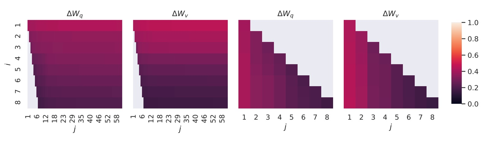

# [21.06] LoRA

## 万分之一の LLM

[**LoRA: Low-Rank Adaptation of Large Language Models**](https://arxiv.org/abs/2106.09685)

---

私たちは大部分の人々が LLM をトレーニングできないことを認めなければなりません。

世界は広大ですが、LLM を反復することができる企業は数えるほどしかありません。

研究者たちはこれらの巨大なモデルを使ってさまざまな問題を解決することを切望しており、したがって、これらのモデルを効果的に微調整する方法が重要な問題となっています。

## 問題の定義

もしあなたが今日、モデル全体を微調整したいと思った場合、具体的な手順は次のようになります：

1. モデルはまず事前訓練された重み $\Phi_0$ で初期化されます。
2. 勾配最適化を通じて $\Phi_0 + \Delta \Phi$ に更新され、条件付き言語モデルの目的を最大化します：

   $$
   \max_\Phi \sum_{(x,y) \in Z} \sum_{t=1}^{|y|} \log P_\Phi(y_t | x, y_{<t})
   $$

各ダウンストリームタスクは異なるパラメータ $\Delta \Phi$ を学習し、その次元 $|\Delta \Phi|$ は元のモデルパラメータの大きさ $|\Phi_0|$ と等しくなります。大型モデル、例えば GPT-3 のようなモデルでは、$|\Phi_0|$ は約 175 億のパラメータを持ち、微調整された複数のモデルを保存・展開することは非常に困難です。

過去の研究では、主流の解決策はアダプターでした。以前にも私たちは次のような研究を見ました：

- [**[19.02] Adapter: パラメータを 96%削減**](../1902-adapter/index.md)

しかし、関連する研究はこれだけにとどまらず、以下のいくつかの論文も参考になるでしょう。時間があればぜひ確認してください：

- [**[20.04] Exploring Versatile Generative Language Model Via Parameter-Efficient Transfer Learning**](https://arxiv.org/abs/2004.03829)
- [**[20.05] AdapterFusion: Non-Destructive Task Composition for Transfer Learning**](https://arxiv.org/abs/2005.00247)
- [**[21.04] The Power of Scale for Parameter-Efficient Prompt Tuning**](https://arxiv.org/abs/2104.08691)

ただし、これらの方法には大規模で遅延が敏感な生産シーンにおいて制約があります。なぜなら、パラメータ量を増加させる必要があり、元々並列計算を基盤としたモデルに干渉する可能性があるからです。以下の表のように、GPT-2 にアダプターを追加すると、顕著な遅延の増加が観察されます：

<figure style={{"width": "80%"}}>

</figure>

レイテンシを削減するために層の剪定や多タスク学習を使うことはできますが、アダプターによる追加計算のオーバーヘッドを完全に排除することはできません。アダプターの設計は本質的にボトルネックの次元を制限し、そのパラメータ数は元のモデルの 1% 未満に抑えられます。

理論的には計算量（FLOPs）は大きくないはずですが？

でも、うまくいきません。

なぜなら、大規模なニューラルネットワークは低遅延を維持するためにハードウェア並列計算に依存していますが、アダプターは順次処理しなければならないため、オンライン推論（通常のバッチサイズは 1）では遅延が顕著に増加するからです。

では、Prefix-Tuning に切り替えますか？

- [**[21.01] Prefix-Tuning: Optimizing Continuous Prompts for Generation**](https://arxiv.org/abs/2101.00190)

Prefix-Tuning のような技術は別の適応戦略を表していますが、prefix tuning の最適化過程ではパラメータ効率が単調でない変化を示し、最適化が難しいことがあります。また、調整のために一部のシーケンス長を prefix に割り当てなければならないため、ダウンストリームタスクを処理するために使用できるシーケンス長が減少します。

さらに悪化した感じです。

著者はこの問題を解決するために、パラメータの低ランク分解法を提案しました。タスク特定のパラメータ増分 $\Delta \Phi$ をより小さなパラメータ集合 $\Theta$ でエンコードし、次のように

$$
|\Theta| \ll |\Phi_0|
$$

目標は、より小さなパラメータ集合 $\Theta$ を最適化することに変換されます：

$$
\max_\Theta \sum_{(x,y) \in Z} \sum_{t=1}^{|y|} \log P_{\Phi_0 + \Delta \Phi(\Theta)}(y_t | x, y_{<t})
$$

:::tip
原論文の数式をそのまま保持します。大まかな意味としては、元のモデルのパラメータの万分の一程度の規模を持つ一組のパラメータを見つけて、それを使って微調整を行うということです。

しかし、このようなパラメータは簡単に見つかるわけではありません。この論文ではその探し方を教えてくれます。
:::

## 問題解決

方法論を見る前に、まずは高校の数学を復習する必要があります。

### 秩、全秩、低秩

数学において、**行列 (Matrix)** は数字で構成された表のことを指します。例えば：

$$
\mathbf{A} = \begin{bmatrix}
1 & 2 & 3 \\
4 & 5 & 6 \\
7 & 8 & 9
\end{bmatrix}
$$

行列はデータ処理や計算において非常に重要な役割を果たしており、**秩 (Rank)** は行列の重要な指標の一つです。

1. **秩 (Rank) とは何か？**

   秩 (Rank) は、行列の行ベクトルまたは列ベクトルの独立性を示します。

   ベクトルの独立性とは、ある行（または列）が他の行（または列）の線形結合で表せないことを意味します。もし、いくつかの行または列が他の行や列の組み合わせで表されるなら、それらは独立していないことになります。言い換えれば、行列の秩はその行列にどれだけの「有用な独立情報」があるかを教えてくれます。

   行列 $A$ が $m \times n$ の行列（つまり $m$ 行と $n$ 列を持つ）であるとき、行列の秩 (Rank) はその行列における最大の独立した行数または列数です。最大秩は行列の行数 $m$ または列数 $n$ を超えることはなく、次のように表されます：

   $$
   \text{rank}(A) \leq \min(m, n)
   $$

---

2. **全秩 (Full-rank) 行列**

   全秩行列は、行列の秩が行数または列数の最小値と等しい行列です。つまり、$\text{rank}(A) = \min(m, n)$ です。

   これは、行列のすべての行または列ベクトルが独立しており、**冗長な情報がない**ことを意味します。例えば、次のような行列です：

   $$
   \mathbf{I} = \begin{bmatrix}
   1 & 0 \\
   0 & 1
   \end{bmatrix}
   $$

   これは $2 \times 2$ の行列で、2 つの行ベクトルが独立しています。したがって、その秩は 2（$\min(2, 2)$ に等しい）であり、これは全秩行列です。各行または列が新しい情報を提供し、他の行や列の組み合わせで表すことはできません。

---

3. **低秩 (Low-rank) 行列**

   低秩行列の秩は、その行数または列数よりも小さいです。これは、行列の一部の行または列ベクトルが他の行や列の組み合わせで表されることを意味し、冗長な情報が含まれていることを示します。このような行列は、サイズが大きい場合でも「有用な情報」が相対的に少ないことがあります。

   例えば、次の行列を考えてみましょう：

   $$
   \mathbf{B} = \begin{bmatrix}
   1 & 2 \\
   2 & 4
   \end{bmatrix}
   $$

   この行列では、2 行目は 1 行目の 2 倍です。したがって、2 つの行ベクトルは独立していません。この行列の秩は 1（独立したベクトルが 1 つだけ）であり、2 ではありません。したがって、これは**低秩行列**です。秩が低いため、この行列はより小さな行列で近似または表現することができます。

### なぜ低秩行列は有用なのか？

多くのアプリケーションにおいて、私たちが直面する行列は非常に大きい場合がありますが、その中には冗長な情報が多く含まれていることがあります。この場合、**低秩行列**を用いて元の行列を近似することで、次の目的を達成することができます：

1. **計算コストの削減**：低秩行列の計算量は高秩行列よりも遥かに少なく、アルゴリズムの速度を加速できます。
2. **ストレージの削減**：低秩行列は必要とするメモリが少なく、大規模なデータセットを処理するのに適しています。
3. **データの次元削減**：高次元のデータを低次元に投影し、主要な情報を保持します。例えば、PCA（主成分分析）などです。
4. **モデルの性能向上**：低秩行列は過学習を防ぎ、モデルの汎化能力を向上させることができます。

最もよく知られている例は、特異値分解（SVD）です。SVD は行列をいくつかの小さな行列に分解し、その中で最も重要な情報成分だけを保持します。これは、画像圧縮や推薦システムなどの分野で非常に有用です。

### 低秩分解：LoRA

<figure style={{"width": "60%"}}>

</figure>

ニューラルネットワークの密な層（Dense Layer）は行列積を使用しており、そこにおける重み行列は通常、全秩です。過去の研究は、事前訓練された言語モデルが低い「内因次元（Intrinsic Dimension）」を持っていることを示しており、ランダムに小さな部分空間に射影しても学習効率を維持できることがわかっています。

- [**[20.12] Intrinsic Dimensionality Explains the Effectiveness of Language Model Fine-Tuning**](https://arxiv.org/abs/2012.13255)

したがって、ここで著者は、モデルの調整プロセスにおいて、重みの更新も「低い内因秩（Low Intrinsic Rank）」を持つと仮定しています。すなわち、事前訓練された重み行列 $W_0 \in \mathbb{R}^{d \times k}$ に対して、その更新は低秩分解として表現されます：

$$
W_0 + \Delta W = W_0 + BA
$$

ここで $B \in \mathbb{R}^{d \times r}$、$A \in \mathbb{R}^{r \times k}$ であり、秩 $r \ll \min(d, k)$ です。

訓練プロセスでは、**事前訓練された重み行列 $W_0$ は凍結され**、勾配は更新されません。一方で、$A$ と $B$ は**訓練可能なパラメータ**であり、これらの行列は入力ベクトル $x$ と掛け算され、結果を要素ごとに加算します。式は次の通りです：

$$
h = W_0 x + \Delta W x = W_0 x + BA x
$$

$A$ は**ガウスランダム分布**で初期化され、$B$ はゼロで初期化されるため、訓練開始時には $\Delta W = BA$ はゼロです。

安定性のため、$\Delta W x$ を $\frac{\alpha}{r} \cdot \Delta W x$ とスケーリングします。ここで $\alpha$ は $r$ に関連する定数です。Adam オプティマイザーを使用する際、$\alpha$ を調整することは学習率を調整することに似ており、超パラメータの調整手順を簡素化し、$\alpha$ を初期の $r$ 値に設定することができます。

LoRA の秩 $r$ が事前訓練された重み行列の秩に等しい場合、LoRA の性能は**全モデル微調整**に近づきます。訓練可能なパラメータが増加すると、LoRA の訓練効果は徐々に元のモデルに近づきます。

### Transformer における LoRA

LoRA は任意のニューラルネットワークの重み行列に適用可能です。Transformer アーキテクチャでは、主に**自己注意モジュール**内の重み行列に適用されます：

- 四つの重み行列：$W_q$、$W_k$、$W_v$、$W_o$
- 各行列の次元は $d_{model} \times d_{model}$ です（その出力が複数の注意ヘッドに分割されることがよくあります）。

本論文では、著者は**注意重み**にのみ調整を加え、MLP モジュールは凍結してパラメータ数を減らしました。

これにより、いくつかの利点が得られます：

- **メモリとストレージの需要を減らす**：大規模な Transformer モデル（例えば GPT-3 175B）では：
  - VRAM 使用量が **1.2TB** から **350GB** に減少します（$r \ll d_{model}$ の場合）。
  - $r = 4$ の場合、クエリと数値投影行列のみを調整し、チェックポイントのサイズが 350GB から 35MB に減少します（約 **10,000 倍の縮小**）。
- **GPU 使用量を減少させ、I/O ボトルネックを回避**：ストレージ需要が減少することで、より少ない GPU で訓練が可能になります。
- **タスクの迅速な切り替え**：LoRA 重みを交換するだけでタスクを切り替えることができ、モデル全体を再読み込みする必要はありません。
- **訓練の加速**：全モデル微調整と比較して、LoRA は GPT-3 175B で訓練速度が約 **25%** 向上します。なぜなら、大部分のパラメータで勾配計算が不要だからです。

ただし、完全に欠点がないわけではなく、$A$ と $B$ を $W$ に統合して推論の遅延を消す場合、**異なるタスクのバッチ入力**は扱いにくくなります。遅延に敏感でないシーンでは、重みを統合せず、動的に対応する LoRA モジュールを選択して異なるバッチ入力を処理することができます。

:::tip
ここで言っているのは実際には再パラメータ化の概念であり、別のパラメータセットが元のモデルの外部に付加され、必要な時に元のモデルに統合されますが、いくつかの悪影響をもたらすことがあります。

そのため、推論速度に問題がない場合には重みを統合せず、動的に適切な LoRA モジュールを選択して異なるバッチ入力を処理することができます。
:::

## 討論

### 実験基準

著者は RoBERTa、DeBERTa、GPT-2、GPT-3 に対して実験を行い、以下のいくつかの基準を設定しました：

1. **微調整 (Fine-Tuning, FT)**

   - **全モデル微調整**：事前訓練された重みとバイアスで初期化し、すべてのパラメータの勾配を更新します。
   - **部分層微調整 (FTTop2)**：GPT-2 の最後の 2 層のパラメータのみを更新します（Li & Liang, 2021）。
   - **バイアス微調整 (BitFit)**：バイアスベクトルのみを訓練し、その他のパラメータは凍結します（Zaken et al., 2021）。

---

2. **プロンプト埋め込み調整 (Prefix-Embedding Tuning, PreEmbed)**

   入力トークンの間に特殊なトークンを挿入し、これらのトークンには訓練可能な単語埋め込みがあります。

   - **戦略**：
     - **プレフィックス (Prefix)**：プロンプトの前に特殊なトークンを追加します。
     - **インフィックス (Infix)**：プロンプトの後に特殊なトークンを追加します。
   - **パラメータ数**：
     $$
     |\Theta| = d_{model} \times (l_p + l_i)
     $$
     ここで、$l_p$ と $l_i$ はそれぞれプレフィックスとインフィックスのトークン数です。

---

3. **プロンプト層調整 (Prefix-Layer Tuning, PreLayer)**

   単語埋め込みを調整するだけでなく、各 Transformer 層に対応する活性化値を学習します。

   - **パラメータ数**：
     $$
     |\Theta| = L \times d_{model} \times (l_p + l_i)
     $$
     ここで、$L$ は Transformer の層数です。

---

4. **アダプタ層微調整 (Adapter Tuning)**

   - **AdapterH**：元の設計（Houlsby et al., 2019）、アダプタ層を自己注意モジュールと残差接続の間に挿入します。
   - **AdapterL**：MLP モジュール後および LayerNorm 後に適用します（Lin et al., 2020）。
   - **AdapterP**：AdapterL に似ています（Pfeiffer et al., 2021）。
   - **AdapterD**：効率を向上させるために一部のアダプタ層を削除します（Rücklé et al., 2020）。
   - **パラメータ数**：
     $$
     |\Theta| = \hat{L}_{Adpt} \times (2 \times d_{model} \times r + r + d_{model}) + 2 \times \hat{L}_{LN} \times d_{model}
     $$
     ここで、$\hat{L}_{Adpt}$ はアダプタ層の数、$\hat{L}_{LN}$ は訓練可能な LayerNorm の数です。

---

5. **LoRA 調整 (LoRA Tuning)**

   元の重み行列の隣に**低秩分解行列**を加えて更新し、元の重み行列と並列に計算を行います。ほとんどの実験では、**クエリ行列 $W_q$** と**値行列 $W_v$** に LoRA を適用します。

   - **パラメータ数**：

     $$
     |\Theta| = 2 \times \hat{L}_{LoRA} \times d_{model} \times r
     $$

     ここで、$\hat{L}_{LoRA}$ は LoRA を適用する重み行列の数、$r$ は秩です。

### 他の微調整方法との比較

著者は **RoBERTa Base (125M)** と **RoBERTa Large (355M)** を使用してテストを行いました。

:::tip
**RoBERTa とは？**

RoBERTa は BERT に基づくモデルで、BERT のトレーニングプロセスにいくつかの最適化を加えることで、モデルの性能を向上させました。以前、私たちは以下の内容を読んだことがあります：

- [**[19.07] RoBERTa: BERT のトレーニングガイド**](../../transformers/1907-roberta/index.md)
  :::

Adapter のベンチマークと公平に比較するために、以下の 2 点が調整されました：

1. **同じバッチサイズとシーケンス長**：すべてのタスクにおいて、バッチサイズを同じにし、シーケンス長は 128 に設定しました。これはアダプタ層のベンチマーク設定に合わせるためです。
2. **モデルの初期化方法**：MRPC、RTE、STS-B タスクでは、事前訓練されたモデルから初期化しました。これは、微調整ベンチマークのように既に MNLI に適応したモデルから開始するのではありません。

実験結果は上表に示されており、LoRA は RoBERTa Base と RoBERTa Large において、全モデル微調整に近い性能を発揮し、ほとんどのタスクで Adapter や他の効率的な適応方法を上回っています。

**DeBERTa** は BERT の最新の変種で、トレーニング規模が大きく、GLUE や SuperGLUE などのベンチマークで非常に競争力のある性能を示します。著者は DeBERTa 上で LoRA を実験し、結果は上表の最下層に示されています。LoRA は多くのタスクで全モデル微調整を超えるパフォーマンスを発揮しています。

### GPT-3 の微調整

<figure style={{"width": "80%"}}>

</figure>

最後に、ついに GPT-3 の微調整部分に到達しました！

実験結果は上表に示されており、LoRA は Adapter や他の効率的な適応方法を全面的に上回っています。

さらに、すべての方法が訓練可能なパラメータを増加させることで単調に性能が向上するわけではないことが示されています。下のグラフに示す通りです：

Prefix-embedding tuning は、256 個以上の特殊トークンを使用した場合に、性能が明らかに低下します。Prefix-layer tuning は、32 個以上の特殊トークンを使用した場合にも性能の低下が見られます。この現象は、特殊トークンの数が多すぎることで、入力分布が事前訓練データの分布から逸脱するために起こる可能性があります。

### Transformer において LoRA を適用すべき重み行列はどれか？

限られたパラメータ予算の中で、どのタイプの重み行列を調整することで、下流タスクで最適な性能を得られるのでしょうか？

著者は GPT-3 175B を用いて実験を行い、GPT-3 175B に対して **1800 万パラメータ**（約 **35MB**、FP16 で保存した場合）を設定しました。すべての 96 層に対して、1 種類の注意重みを調整する場合、秩 $r = 8$；2 種類を調整する場合、秩 $r = 4$ としました。

結果は上表の通りです：

- **$\Delta W_q$ または $\Delta W_k$ のみを調整**：性能が著しく低下しました。
- **$W_q$ と $W_v$ を同時に調整**：最良の結果を得ました。

秩 $r = 4$ でも、$\Delta W$ は十分な情報をキャッチできることが示されています。つまり、より多くの種類の重み行列を調整し、より小さい秩を使用する方が、単一のタイプの重み行列のみを調整して大きな秩を使うよりも効果的です。

### LoRA の最適秩 $r$ はいくつか？

LoRA は非常に小さな秩 $r$ でも優れた性能を発揮します。特に、$\{W_q, W_v\}$ を調整する場合に顕著です。

秩 $r$ を増加させても、意味のある部分空間をカバーできるわけではなく、これは**低秩の適応行列が十分である**ことを示しています。

### 部分空間の類似性分析

著者は、異なる $r$ 値間の部分空間の類似性や、異なるランダムシード間の部分空間の類似性を知りたかったと述べています。ここで採用された手法は、これらの行列を特異値分解（SVD）し、右特異行列を得る方法です：

$$
U_{A_{r=8}} \quad \text{と} \quad U_{A_{r=64}}
$$

著者の目標は、$U_{A_{r=8}}$ の最初の $i$ 個の特異ベクトルが形成する部分空間が、$U_{A_{r=64}}$ の最初の $j$ 個の特異ベクトルが形成する部分空間にどれだけ含まれているかを調べることです。

計算された類似度は、Grassmann 距離に基づく**正規化部分空間類似度**を使用して計算されます：

$$
\phi(A_{r=8}, A_{r=64}, i, j) = \frac{\left\| U_{A_{r=8}}^{i^\top} U_{A_{r=64}}^{j} \right\|_F^2}{\min(i, j)} \in [0, 1]
$$

ここで、$U_{A_{r=8}}^{i}$ は $U_{A_{r=8}}$ の最初の $i$ 個の特異ベクトルの列を意味します。

結果は以下の図の通りです：

上位の特異ベクトルの方向は $A_{r=8}$ と $A_{r=64}$ の間で高い重なりを示し、他の方向はあまり重なっていません。全体的に見ると、$A_{r=8}$ と $A_{r=64}$ の $\Delta W_v$（または $\Delta W_q$）は一つの次元の部分空間を共有しており、その類似度 $\phi$ は $> 0.5$ です。

これは、なぜ下流タスクで秩 $r = 1$ でも良い結果を得られるのかを説明しています。最も有用な情報は、上位の特異ベクトルに集中しているためです。

---

最後に、著者が論文で述べた数点をまとめます：

1. **低秩の適応行列が十分である**：秩 $r$ が非常に小さくても、LoRA は下流タスクで全モデル微調整に匹敵する性能を発揮します。
2. **より多くの重み行列を適応する方が秩を増加させるより効果的**：限られたパラメータ予算の中では、**より多くのタイプの重み行列を調整**（例えば $W_q$ と $W_v$ を同時に調整）する方が、少ない秩を使用して性能を向上させるのに効果的です。

## 結論

他の微調整方法と比較して、LoRA は非常に大きな利点を提供します！

- 訓練可能なパラメータの数を（10000 倍も！）劇的に削減し、モデルのパフォーマンスを維持しています。

- **私たちもついに LLM を微調整できる時代が来ました！**

2021 年のこの時点で、全員が LLM を微調整することはもはや夢ではなく、実現可能な目標です。これにより、大規模なモデルの性能をより多くのアプリケーションに活かし、さまざまなシーンでその優位性を発揮できるようになります。

今後 10 年間は非常に活発な時期になることが予想され、さらなる興味深い研究成果を期待できます！
