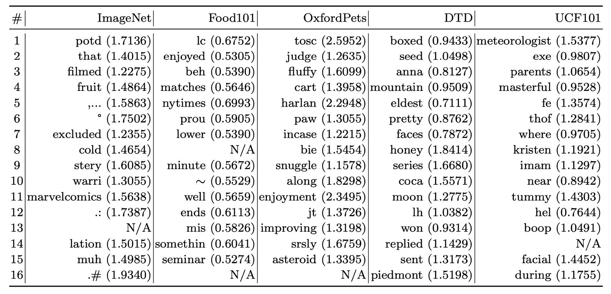

## 揺れるささやき

[**Learning to Prompt for Vision-Language Models**](https://arxiv.org/abs/2109.01134)

---

少し前に Soft Prompts という論文を見ましたが、今度はその後の関連応用を見ていきましょう。

:::tip
まだ見ていない方は、以前書いた記事をご参考に：

- [**[21.04] Soft Prompts: 優しいリマインダー**](../2104-soft-prompts/index.md)
  :::

このような外部プラグインを使ったモデル調整の方法は、通常 LLM や VLM を対象にしています。

そして、この論文の著者が設定した目標は VLM、正確には私たちがよく知っている CLIP です。

:::tip
CLIP を聞いたことがない？それならまずこの論文を見てください：

- [**[21.03] CLIP: 次元の壁を打ち破る**](../../multimodality/2103-clip/index.md)
  :::

CLIP は 2021 年 3 月に発表され、その 1 ヶ月後には Soft Prompts の概念が提案されました。

そこで著者は Soft Prompts の概念を CLIP に適用し、今回の論文が生まれたのです。

## 問題の定義

<figure style={{"width": "90%"}}>

</figure>

ここで定義された問題は Soft Prompts と同様に、手作業で設計されたプロンプトに多くの欠点があり、異なるモデルやタスクに対して全く異なる結果が現れることです。

上の図のように、CLIP を例にとると、`a photo of [CLASS]`というプロンプトを使うと、約 80%の精度が得られますが、`a`を加えて`a photo of a [CLASS]`にすると、精度は 86%に上がります！

そしてこれは特別な例ではなく、上の図にある 4 つの異なる画像すべてで同じような結果が得られています。

どうしてこんなことが起こるのでしょうか？たった数語の違いでこんなにも大きな差が出るのは？

:::tip
やっとこのモデルの特性を理解したと思ったら、今度は市場に新しいモデルが出てきて、また最初からやり直しです。
:::

## CLIP の復習

おそらく CLIP の論文を読まないと思いますので、簡単に CLIP の構造を復習しましょう。

<figure style={{"width": "70%"}}>

</figure>

CLIP には 2 つのエンコーダーがあります：

- **画像エンコーダー**：高次元の画像データを低次元の特徴空間に埋め込みます。画像エンコーダーは CNN または ViT を使用することができます。
- **テキストエンコーダー**：Transformer ベースで、自然言語をテキストの埋め込み表現に変換します。

入力されたテキストデータは、BPE（Byte Pair Encoding）という表現法で処理され、512 次元の単語埋め込みベクトルに変換されます。このとき、語彙数は 49,152 です。訓練過程では、文に`[SOS]`と`[EOS]`という特殊なシンボルが追加され、最大長さは 77 に制限されます。最後に、`[EOS]`位置の特徴を LayerNorm し、線形投影層を通して処理します。

CLIP の学習目標は、画像とテキストの埋め込み空間を整列させることです。この概念は、画像-テキストペアのバッチを与え、モデルがペアのサンプル間の余弦類似度を最大化し、未ペアのサンプル間の余弦類似度を最小化することです。

CLIP の訓練データセットは非常に大規模で、モデルが多様な視覚的概念を学べるように、4 億組の画像-テキストペアから成る大規模な訓練データを集めました。

復習はこれで終了です。これであなたも CLIP の達人ですね。

## 問題の解決

### モデル構造

<figure style={{"width": "90%"}}>

</figure>

上の図はコンテキスト最適化（Context Optimization, CoOp）の構造で、コンテキスト単語をデータから学習可能な連続ベクトルとしてモデル化し、手動でのプロンプト調整を避けています。

著者はこの方法を 2 つの異なる訓練方法に分けています：

- **統一されたコンテキスト**

  原文は Unified Context、略して UC です。

  プロンプト設計において、すべてのクラスに対して同じコンテキスト単語ベクトルを使い、統一されたプロンプトを構成します。プロンプトの構造は以下のようになります：

  $$
  t = [V]_1 [V]_2 \dots [V]_M \text{[CLASS]},
  $$

  ここで、$[V]_m$（$m \in \{1, \dots, M\}$）は単語埋め込みの次元と同じ次元のベクトルで、例えば CLIP の特徴次元が 512 の場合、$M$はコンテキスト単語の数を示すハイパーパラメータです。

  推論プロセスは以下のようになります：

  - プロンプト$t$をテキストエンコーダー$g(\cdot)$に渡し、対応する分類重みベクトルを取得します（これも`[EOS]`の位置から取ります）。
  - 予測確率は以下の式で計算されます：

  $$
  p(y = i|x) = \frac{\exp(\cos(g(t_i), f)/\tau)}{\sum_{j=1}^K \exp(\cos(g(t_j), f)/\tau)},
  $$

  ここで、$t_i$は第$i$クラス用のプロンプトで、そのクラス名を含む単語埋め込みベクトルです。

  :::tip
  クラス単語`[CLASS]`をプロンプトの末尾だけでなく、中央に配置することもできます。例えば次のように：

  $$
  t = [V]_1 \dots [V]_{\frac{M}{2}} \text{[CLASS]} [V]_{\frac{M}{2}+1} \dots [V]_M.
  $$

  :::

- **クラス専用コンテキスト**

  原文は Class-Specific Context、略して CSC です。

  プロンプト設計において、各クラスに対して独立したコンテキスト単語ベクトルを使用します。

  プロンプトの構造は以下のようになります：

  $$
  t_i = [V]_i^1 [V]_i^2 \dots [V]_i^M \text{[CLASS]},
  $$

  ここで、$[V]_i^m$（$m \in \{1, \dots, M\}$）は単語埋め込み次元と同じ次元のベクトルで、$M$はコンテキスト単語の数を示すハイパーパラメータです。

  推論プロセスは以下のようになります：

  - プロンプト$t_i$をテキストエンコーダー$g(\cdot)$に渡し、対応する分類重みベクトルを取得します（これも`[EOS]`の位置から取ります）。
  - 予測確率は以下の式で計算されます：

  $$
  p(y = i|x) = \frac{\exp(\cos(g(t_i), f)/\tau)}{\sum_{j=1}^K \exp(\cos(g(t_j), f)/\tau)},
  $$

  ここで、$t_i$は第$i$クラス用のプロンプトで、そのクラス名を含む単語埋め込みベクトルです。

:::tip
簡単に言うと、すべてのクラスが学習可能な 1 組のコンテキスト単語ベクトルを共有するか、各クラスが自分自身のコンテキスト単語ベクトルを持つかの違いです。

直感的には、各クラスが自分専用のコンテキスト単語ベクトルを持つ方が、より良い結果を得られるはずです。

本当にそうなのでしょうか？実験結果を見ていきましょう。
:::

## 議論

### 複数のデータセットでの効果

<figure style={{"width": "90%"}}>

<figurecaption>実線はCoOpがCLIPを改善した結果、星印はゼロショットCLIP 破線は線形プローブの代替案。 $M$はコンテキストの長さ 「end」または「mid」はクラスラベルが末尾または中央に配置されることを示します CSCはクラス固有のコンテキストを意味します。</figurecaption>
</figure>

---

上の図から分かるように、CLIP+CoOp はわずか 2 サンプル（2-shot）で、ゼロショット CLIP を大きく上回ります。サンプル数が 16-shot に増えると、平均的な性能向上は約 15%になります。

EuroSAT と DTD の 2 つの専用タスクでは、性能向上はそれぞれ 45%以上と 20%以上でした。細かい粒度のデータセット（Flowers102、StanfordCars、FGVCAircraft）やシーン・アクション認識データセット（SUN397、UCF101）でも、性能向上は 10%以上でした。

ImageNet のような挑戦的なデータセット（1,000 クラス）でも 4.77%の向上がありました。

### UC と CSC の比較

先ほど、統一されたコンテキスト（Unified Context）とクラス専用コンテキスト（CSC）について触れましたが、どちらの方が効果的だったのでしょうか？

ここでも上の図を参考に、CSC ありと CSC なしの UC の効果を比較してみましょう。

平均的に見ると、UC はほとんどのシーンで良い結果を出しています。しかし、細かい粒度のデータセット（StanfordCars、Flowers102、FGVCAircraft）や専用タスク（DTD、EuroSAT）では、CSC が特に優れており、特に 16-shot のときに顕著です。

つまり、どちらの方法が絶対的に良いわけではなく、タスクの要求に応じて適切なバージョンを選択することで、性能がさらに向上する可能性があります。

### 一般化能力の転送

<figure style={{"width": "80%"}}>

</figure>

CLIP は非常に強力なゼロショット能力を持っていますが、著者は CoOp が特定のデータセットで微調整されることによって、CLIP の一般化能力が影響を受けないか心配していました。

表の`source`は`ImageNet`を使って微調整した場合、`target`は一般化能力をテストするデータセットです。

実験結果から、CoOp は CLIP の分布転送に対する頑健性を強化しており、プロンプトの設計と学習にはクロスドメイン適応能力があることが示されました。

### プロンプトの長さはどのくらい必要か？

<figure style={{"width": "60%"}}>

</figure>

著者は 11 のデータセットで実験し、コンテキストの長さを 4、8、16 に設定しました。

実験の結果、コンテキスト単語数を増やすことで通常は性能が向上し、特にコンテキスト長が長い（例えば 16）の場合、クラス単語を中央（mid）に配置する効果がより明確になりました。しかし、固定された最適なコンテキスト長はなく、性能と分布転送の頑健性とのバランスを取る必要があります。

### 初期化方法

<figure style={{"width": "40%"}}>

</figure>

著者はランダム初期化と手動初期化の効果を比較しました。手動初期化は「a photo of a」の埋め込みベクトルを使用しました。

結果として、良い初期化は性能に大きな影響を与えないことが分かりました。初期化単語を調整することで役立つ場合もありますが、ランダム初期化でも実務では十分に効率的であることが示されました。

### プロンプトの解釈性

<figure style={{"width": "90%"}}>

</figure>

コンテキストベクトルは連続空間で最適化されるため、直接的に解釈することは難しいです。

ここで著者は、間接的な方法を使い、ユーザーの学習したベクトルに最も近い単語を語彙表内で検索する方法を採用しました。

いくつかのデータセットでの検索結果を以下に示します：

- Food101：「enjoyed」がタスクに関連しています。
- OxfordPets：「fluffy」、「paw」が一定の関連性を持っています。
- DTD：「pretty」が素材の説明に反映されています。

実験結果から、最も近い単語に基づく解釈は限られた精度であり、学習したベクトルの意味が最も近い単語と完全に一致しない場合があることが示されました。学習されたベクトルは、既存の語彙の意味空間を超えて、より高次元の意味情報を表している可能性があります。

### 結論

本研究の実験結果は、CoOp が複数のデータセットで優れた性能を示し、特に領域の一般化能力において手作業で設計されたプロンプトを大きく上回ることを示しています。この結果は、データ効率の良い学習における CoOp の潜在能力と利点を示しています。

プロンプト学習を大規模視覚モデルに適応させるための最初の包括的な研究として、この研究は重要な創造的意義を持ち、プロンプト学習に実証的なサポートを提供するとともに、今後の研究に基盤を築きました。

:::tip
注意すべきことは、後の研究で CoOp がノイズラベルに対して敏感であることや、学習したコンテキストが同一データセット内で未見のクラスに対して汎化できないことが発見されたことです。これらは、訓練中に基底クラスに過度に適合した特徴による制約を示しています。

今後の研究でこれらの課題をどのように克服するかを見ていきましょう。
:::
