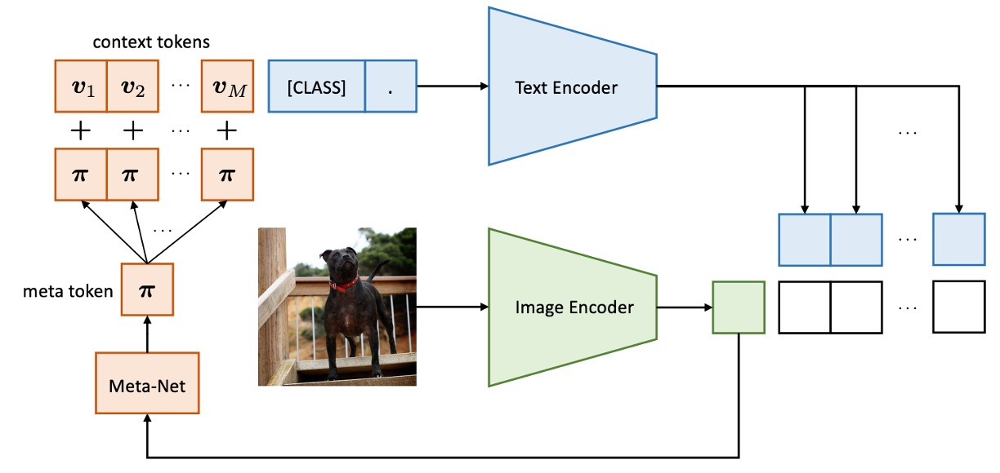
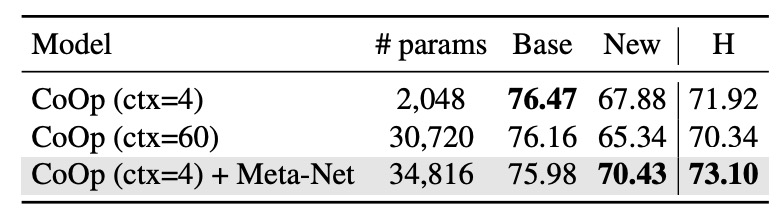

## 先に画像を見てから話す

[**Conditional Prompt Learning for Vision-Language Models**](https://arxiv.org/abs/2203.05557)

---

著者は CoOp を発表した後、いくつかの問題に気づきました。

VLM をガイドするために使用されるトークンと入力画像は独立しており、つまり、これらのトークンはトレーニングが終了した後、画像の情報を考慮することはありません。

:::tip
もしまだ CoOp を読んでいない場合は、以前書いた記事を参照できます：

- [**[21.09] CoOp: 揺れるささやき**](../2109-coop/index.md)
  :::

## 問題の定義

視覚言語モデルは通常、数億から数十億のパラメータを持っており、フルモデルの微調整はリソースの観点から実行不可能で、モデルの事前訓練された表現空間を破壊する可能性があります。そこで、著者は CoOp を提案し、プロンプト学習の方法を通じてモデルが新しいタスクに一般化できるようにしました。

しかし、CoOp はコンテキストの学習時に特定の訓練クラスに過剰適合してしまい、未見のクラスでの精度が顕著に低下します。この静的な設計は一般化能力を欠いており、より広範なシーンに対応するのが難しいのです。

直感的なアイデアとしては、モデルが予測時に入力された画像情報に基づいてトークンの内容を調整できるようにすることです。

## 問題の解決

この論文の構成は、前世代の CoOp とほぼ同じであり、いくつかの重要な部分を見ていきます。

### モデルアーキテクチャ

<figure style={{"width": "80%"}}>

</figure>

CoCoOp と CoOp の違いは、画像の特徴がトークン生成プロセスに導入される分岐が追加されている点です。

これまでは画像とテキストの分岐は独立して動作していましたが、このアーキテクチャは画像の情報がテキスト生成に影響を与えるように設計されています。

:::tip
初代の CoOp アーキテクチャは以下のようになっています：

<figure style={{"width": "80%"}}>

</figure>

:::

CoCoOp の方法は、軽量のニューラルネットワーク（Meta-Net）を導入し、学習可能なコンテキストベクターを組み合わせて入力条件のコンテキストを生成します。Meta-Net は 2 層のボトルネック構造（Linear-ReLU-Linear）で、隠れ層は入力次元を 16 倍圧縮します。入力は画像エンコーダーの出力特徴です。

条件付きコンテキストベクターの式は次のようになります：

$$
v_m(x) = v_m + \pi, \quad \pi = h_\theta(x)
$$

プロンプトの形式は $t_i(x) = \{v_1(x), v_2(x), ..., v_M(x), c_i\}$ に更新され、予測確率の式は次のように更新されます：

$$
p(y|x) = \frac{\exp(\text{sim}(x, g(t_y(x)))/\tau)}{\sum_{i=1}^{K} \exp(\text{sim}(x, g(t_i(x)))/\tau)}
$$

トレーニング中、コンテキストベクター $\{v_m\}_{m=1}^M$ と Meta-Net のパラメータ $\theta$ は同時に最適化され、ベースモデル（CLIP）は凍結されたままとなります。

:::tip
また、軽快に論文を読み終えました！
:::

## 討論

ここでは CoCoOp と CoOp の違いについて見ていきます。

### 未見クラスに対する一般化能力

著者は同様に 11 の異なるデータセットで実験を行いました。表内で、`Base` はベースクラス、`New` は未見クラスを示しています。`CoOp` は初代モデルで、`CoCoOp` は今回のモデルです。

上の表からわかるように、CoOp はベースクラスで CLIP より優れたパフォーマンスを示しましたが、新しいクラスでの精度は顕著に低下し、平均精度はベースクラスの 82.69% から新しいクラスで 63.22% に下がり、約 20% の差が生じました。これは、CoOp がベースクラスに過剰適合しているため、新しいクラスでのパフォーマンスが低下した可能性があり、学習型プロンプトの一般化能力を向上させる必要性を浮き彫りにしています。

CoCoOp は新しいクラスでの精度を 71.69% に向上させ、手動プロンプトとのギャップを大幅に縮小しました。11 のデータセットのうち 5 つのデータセットでは、精度が 10%以上向上し、例えば ImageNet では精度が 67.88% から 70.43% に上昇し、CLIP の 68.14% を超える結果となりました。

CoOp と比較して、CoCoOp は一部のデータセットでベースクラスの精度がわずかに低下しましたが、9 の低下ケースのうち 6 つのデータセットではその減少幅は 3% 以下で、新しいクラスの顕著な改善がベースクラスの損失を補っていることがわかります。例えば、StanfordCars では、ベースクラスの精度が 7.63% 低下した一方で、新しいクラスの精度は 13.19% 向上し、全体では 5.56% の平均向上が見られました。

### パラメータ数の増加は誰でもできる？

<figure style={{"width": "70%"}}>

</figure>

CoCoOp は Meta-Net を導入することでパラメータ数が増加しましたが、専門的なあなたならすぐにこう思うはずです：

- **この改善は単に増加したパラメータ数から来ているのか？**

これに対して著者は実験を設計し、CoCoOp の Meta-Net を除去し、CoOp のコンテキスト数を CoCoOp のパラメータ数に近い最大値まで増加させました。

上の表の結果に基づき、`CoOp (ctx=60)` と `CoOp (ctx=4) + Meta-Net` を比較すると、ほぼ同じパラメータ数の状況で、`CoOp (ctx=60)` は新しいクラスに対する一般化能力が向上することはなく、むしろ 2.54% 減少しており、これは再度、CoOp がベースクラスに過剰適合しているという著者の見解を裏付けています。

したがって、CoCoOp の改善は条件付きコンテキスト設計によるものであり、単なるパラメータ増加によるものではありません。

## 結論

CoCoOp は条件付きプロンプトの設計に基づき、静的プロンプトの一般化問題を解決し、さまざまなシーンで優れたパフォーマンスを示しました。例えば、データセット間のプロンプト転送やドメイン一般化のシーンなどです。

著者は最後に、CoCoOp のトレーニング効率が CoOp よりも著しく低いことを述べており、11 のデータセットのうち 7 つでは未見クラスのパフォーマンスが CLIP を下回っていることが示されています。これにより、学習型プロンプトと手動プロンプトとのパフォーマンス差は完全には埋まっていないことが示され、問題はまだ終わっていないことがわかります。

:::tip
CLIP の画像分岐とテキスト分岐の間に、さらに華麗なプロンプト学習のエンジニアリングを加えることは、この数年間の人気のある研究方向の一つと言えます。時間があれば、再度まとめてみましょう。
:::
