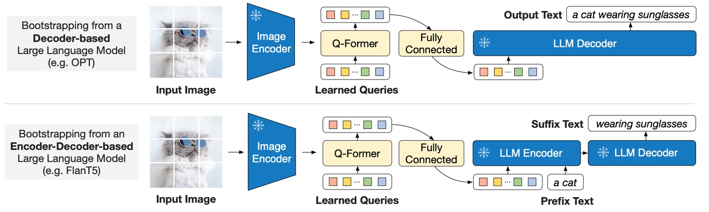

# [23.01] BLIP-2

## Q-Former 初登場

[**BLIP-2: Bootstrapping Language-Image Pre-training with Frozen Image Encoders and Large Language Models**](https://arxiv.org/abs/2301.12597)

---

これは BLIP という名前の第 2 世代のアーキテクチャです。

第 1 世代の BLIP はマルチモーダルな作業項目でしたが、第 2 世代の BLIP は少数のパラメータを使用して、既存の大規模な事前訓練モデルを私たちの望む方向に導くことに焦点を当てています。

:::tip
BLIP を見たことがない読者は、以前の記事を参考にできます：

- [**[22.01] BLIP: 合成テキスト技術**](../../multimodality/2201-blip/index.md)
  :::

## 問題の定義

私たちは引き続き VLM の領域に焦点を当てます。

現状の事前訓練アーキテクチャは大規模な訓練方法を採用しており、膨大なリソースが必要です。その上、さまざまな下流タスクに対応することも簡単ではなく、すべてのタスクにうまく移行できるわけではありません。

もし、事前に訓練された単一モーダルの LLM を使用し、パラメータを凍結した状態で、マルチモーダルな特徴を整合させることができれば、大規模なマルチモーダルモデルを再訓練するために大きな労力をかける必要はなくなりますよね！

この考えに基づいて、著者は「Q-Former」と呼ばれる軽量なクエリ変換器を設計し、これを橋渡しとして画像エンコーダーの主要な特徴を抽出し、それを言語モデルが理解できる出力に変換します。

こんなことができるの？ さあ学んでいきましょう。

## 問題の解決

### モデルアーキテクチャ

<figure style={{"width": "90%"}}>

</figure>

このアーキテクチャ図は少し複雑に見えますが、順を追って見ていきましょう：

まず、最左端から始めます。ここで入力された画像は、事前訓練された画像エンコーダーを通じて処理されます。このエンコーダーのパラメータは凍結されており、特徴を抽出する役割だけを担い、訓練には参加しません。

次に、右側に一塊の「Q-Former」モジュールがあります。これは二重アーキテクチャで、入力は 2 つの部分に分かれています：

1. **学習可能なクエリ埋め込み（Learned Query）**：このパラメータはランダムに初期化され、論文内では長さ 32 のトークンに設定されています。
2. **画像の説明に対するテキスト入力**：これは一般的な言語モデルと同じで、自然言語による説明です。

上図のオレンジ色、つまり Self-Attention の部分は、事前訓練された言語モデルの重みを初期化パラメータとして直接使用します。Q-Former 部分は Self-Attention 演算を経て、画像エンコーダーの出力特徴に対してクエリを行います。つまり、ここでの「Learned Query」の主な仕事は、画像特徴とテキスト記述を整合させることです。

:::tip
言い換えれば、まずランダムに生成した一組のトークンをテキスト特徴に対してクエリし、その後、画像特徴に対してもクエリすることで、「混合された」特徴を得るわけです。

最後に、この「混合された」特徴をテキスト特徴と整合させて、このステップが終了します。
:::

### 第一段階の事前訓練

<figure style={{"width": "80%"}}>

</figure>

上図の Q は Query トークン、T は Text トークンを指し、マスク部分は暗い色で表示されています。

第一段階では、Q-Former と凍結された画像エンコーダーを組み合わせて、画像-テキストペアに基づく事前訓練を行い、主に以下の 3 つの目的関数を最適化します：

1. **画像-テキスト一致（Image-Text Matching, ITM）**

   これは「Learned Query」の目的関数で、上図の Q 部分です。

   注意マスクの設計は上図に示された通りで、クエリとテキストは相互に観察可能で、線形分類器を使用して 2 クラス分類を行います。マッチングスコアはすべてのクエリ埋め込みの分類結果の平均で計算されます。訓練時には、ハードネガティブマイニング戦略を使用して、より挑戦的なネガティブサンプルを生成します。

2. **画像ベースのテキスト生成（Image-grounded Text Generation, ITG）**

   これは Text トークンの目的関数で、上図の T 部分です。

   ここではマルチモーダル因果的自己注意マスクを使用し、Q 部分のトークンは互いに観察可能ですが、T 部分のテキストトークンは Q 部分のクエリと T 部分の「前のテキスト」のみを観察できます。

   :::tip
   ここでは`[DEC]`トークンが`[CLS]`トークンの代わりに使われ、デコードタスクの開始マークとして機能します。
   :::

3. **画像-テキスト対比学習（Image-Text Contrastive Learning, ITC）**

   これまでの 2 つの目的関数は、Q 部分と T 部分をそれぞれ訓練するものでした。

   しかし、この 2 つの部分は同じ問題を説明しているため、これら 2 つの特徴も整合させる必要があります。この目的関数はその整合を訓練するために使用されます。

   ここでの設計は、正の画像-テキストペアと負のペアの類似性を比較し、クエリ出力$ Z $とテキスト特徴$t$の整合度を調整します。ここで$t$は`[CLS]`トークンの出力埋め込みです。

   情報漏洩を避けるために、単一モーダル自己注意マスクを採用し、クエリとテキストは直接観察できません。

### 第二段階の事前訓練

<figure style={{"width": "90%"}}>

</figure>

:::tip
第一段階では画像特徴とテキスト記述を整合させる作業を行い、第二段階では「生成テキスト」の事前訓練を行います。
:::

上図に示すように、Q-Former は凍結された大規模言語モデル（LLM）に接続され、LLM の言語生成能力を活用します。生成時には、以下の 2 つの異なるアーキテクチャを採用できます：

- **デコーダ型**：言語モデリング損失を使って事前訓練し、視覚特徴を条件にテキストを生成するように LLM に要求します。
- **エンコーダ-デコーダ型**：プレフィックス言語モデリング損失を使い、テキストを前半部分と後半部分に分割します。前半のテキストと視覚特徴を LLM エンコーダに入力し、後半のテキストを LLM デコーダの生成ターゲットとします。

:::tip
ここでの画像エンコーダは凍結されており、LLM も凍結されています。目的は、Q-Former が抽出した視覚的なヒントを使って、LLM にテキストを生成させることです。
:::

設計は、Q-Former の出力クエリ埋め込み$ Z $を LLM のテキスト埋め込みと同じ次元に線形投影し、投影後のクエリ埋め込みを入力テキスト埋め込みの前に追加して視覚的なヒント（ソフト視覚プロンプト）として利用します。

Q-Former は言語に関連する視覚特徴を抽出するように事前訓練されているため、情報のボトルネックとして機能し、無関係な視覚情報を効果的にフィルタリングし、LLM の視覚と言語の整合性負担を軽減します。

:::tip
以前に「Soft Prompts」の概念を読んだことがある読者は、以下の過去の記事を参考にできます：

- [**[21.04] Soft Prompts: 優しいリマインダー**](../2104-soft-prompts/index.md)
  :::

### 事前訓練データセット

- BLIP の事前訓練データセットを使用し、合計 1.29 億枚の画像が含まれています。以下のソースから構成されています：
  - COCO、Visual Genome、CC3M、CC12M、SBU、そして LAION400M データセットから選別された 1.15 億枚の画像。
- **CapFilt 法**を使用して、インターネット上の画像に合成された説明を生成：
  - BLIPlarge を使用して、画像に 10 件の説明を生成。
  - CLIP ViT-L/14 モデルを使って画像-テキストの類似性を計算し、類似性の上位 2 つの説明を訓練データとして保持。事前訓練時には毎回ランダムに 1 件の説明を選びます。

:::tip
CapFilt 法は BLIP 論文で提案された方法で、画像の説明を生成するものです。詳細はここでは省略します。
:::

### 事前訓練設定

- **事前訓練のステップ数**：
  - 特徴学習段階：250,000 ステップ。
  - 生成学習段階：80,000 ステップ。
- **バッチサイズ**：
  - 特徴学習：2320（ViT-L）または 1680（ViT-g）。
  - 生成学習：1920（OPT）または 1520（FlanT5）。
- **計算効率**：
  - 単一の 16×A100（40G）で訓練：
    - 特徴学習段階（最大モデル）：6 日未満。
    - 生成学習段階（最大モデル）：3 日未満。
- **オプティマイザと学習率**：
  - オプティマイザ：AdamW（$ \beta_1=0.9 $、$ \beta_2=0.98 $、重み減衰$0.05$）。
  - 学習率戦略：余弦減衰、ピーク学習率$1 \times 10^{-4}$、線形ウォームアップ 2000 ステップ；第 2 段階の最小学習率は$5 \times 10^{-5}$。
- **画像処理**：
  - 画像サイズ：$224 \times 224$。
  - 増強方法：ランダムクロップおよび水平反転。

## 討論

<figure style={{"width": "90%"}}>

</figure>

何も言わずに、まずは結果を見てみましょう。

先進的なモデルと比較して、BLIP-2 はより高い性能を実現し、VLM 事前訓練中に必要な学習可能なパラメータの数が大幅に削減されました。

### Zero-shot VQA

<figure style={{"width": "90%"}}>

</figure>

著者はまず BLIP-2 の Zero-shot 能力をテストしました。上表は BLIP-2 が異なる VQA タスクにおいて示したパフォーマンスです。VQAv2、GQA、OK-VQA の各タスクが含まれています。

評価方法：

- OPT モデルを使用したプロンプト：「`Question: {}` Answer:」
- FlanT5 モデルを使用したプロンプト：「`Question: {}` Short answer:」
- ビームサーチを用いて答案を生成し、束幅を 5 に設定、長さペナルティを$-1$にして短い答えを奨励します。

VQAv2 と GQA において、BLIP-2 は Flamingo80B よりも優れたパフォーマンスを示し、特に VQAv2 では 8.7%の改善を達成しました。これは Flamingo80B の$1/54$のパラメータ数に過ぎません。

OK-VQA では BLIP-2 は Flamingo80B に次いでいますが、その理由は OK-VQA がオープンワールドの知識により焦点を当てているためです。Flamingo80B の Chinchilla 言語モデル（70B）は BLIP-2 が使用する FlanT5XXL（11B）よりも多くの知識を持っています。

Zero-shot 能力に関する実験結果から、第一段階のマルチモーダル事前訓練が非常に重要であることが確認されました。Q-Former が第一段階でテキストに関連する視覚特徴を学習することで、LLM の視覚-言語整合の負担が軽減され、このステップを削除するとモデルは壊滅的な忘却を起こし、性能が大幅に低下します（OPT モデルで 15%の性能低下が観察されました）。

### Finetune VQA

<figure style={{"width": "80%"}}>

</figure>

著者はラベル付き VQA データで微調整を行い、LLM のパラメータを固定し、Q-Former と画像エンコーダのパラメータのみを微調整しました。

このタスクにおいて、BLIP-2 はオープン生成モデルの中で視覚的な質問応答タスクの最新のレベルに達し、問題に関連する視覚的特徴を抽出する能力が示されました。

### 画像記述生成

<figure style={{"width": "90%"}}>

</figure>

著者は BLIP-2 の画像記述生成タスクにおける性能を評価し、他の手法と比較しました。

画像記述タスクにおいて、初期プロンプトは「`a photo of`」とし、言語モデリング損失を使用して訓練を行いました。微調整の際、LLM のパラメータは固定され、Q-Former と画像エンコーダのパラメータのみが更新されました。

COCO データセットにおいて、BLIP-2 の性能は最新のレベルに達し、NoCaps 検証セットにおいては Zero-shot 移行の強力な汎化能力を示しました。

### 画像-テキスト検索

<figure style={{"width": "90%"}}>

</figure>

著者は COCO および Flickr30K データセットで画像-テキスト検索タスクの評価を行い、異なる損失関数が性能に与える影響を比較しました。

BLIP-2 は Zero-shot 画像-テキスト検索タスクにおいて最新のレベルを実現し、既存の手法を大きく上回りました。

最後に著者は、各損失関数が結果に与える影響を以下の表に示しています：

ITC および ITM 損失は画像とテキストの類似性を直接学習し、ITG 損失はクエリ抽出とテキストに関連する視覚特徴の能力を強化し、視覚と言語の整合性をさらに向上させました。

<figure style={{"width": "80%"}}>

</figure>

### 文字画像生成のデモ

<figure style={{"width": "90%"}}>

</figure>

著者は、視覚知識推論、視覚常識推論、視覚対話、個別化された画像からテキストへの生成など、さまざまな Zero-shot の画像からテキストへの機能の例を示しています。

:::tip
論文中の画像は非常に大きいため、全体の画像をキャプチャしていません。興味のある読者は原文を参照してください。
:::

### 失敗事例

<figure style={{"width": "90%"}}>

</figure>

過去の LLM と同様に、このモデルは未見の物体や概念に対して奇妙な結果を出すことがあります。さらに、このモデルは不正確な人物や概念を誤って関連付けることがあります。これらは将来的に改善が必要な点です。

## 結論

Q-Former の概念により、わずかなパラメータと数個のトークンで、大規模な言語モデルを多モーダルタスクに誘導できるようになりました。

特定の領域の問題を解決したい場合、この方法を使用して大規模な事前訓練モデルの能力を私たちの望む方向に転送することができます。

:::tip
近年、生体識別（Face Anti-Spoofing）の研究分野でも Q-Former がよく見かけます！
:::
