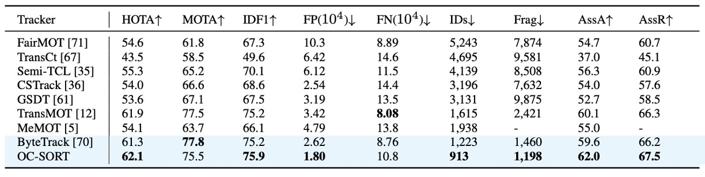
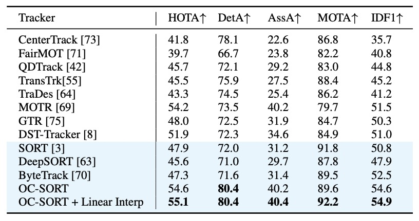

## カルマンの檻を脱する

[**Observation-Centric SORT: Rethinking SORT for Robust Multi-Object Tracking**](https://arxiv.org/abs/2203.14360)

---

これまで物体追跡（Object Tracking）についてはあまり学んでこなかったが、今回は CVPR の論文を通してこの分野に踏み込んでみようと思う。

このノートでは、今まで十分に理解していなかった指標や手法を補いながら、少し詳しく書いていく。

## 問題の定義

マルチオブジェクトトラッキング（Multi-Object Tracking, MOT）という分野において、課題は一見すると単純だ。

- **各フレームにおいてすべての物体を見つけ、時間軸上で一貫した ID を保つこと。**

しかし、この「同一であり続けること」を保証する問題は、「見つけること」よりもはるかに難しい。

---

現代の MOT はほとんどが **Tracking-by-Detection** の枠組みに基づいている。

つまり、**検出してから追跡する** という流れだ。

まず「検出モデル（Detection）」で物体を見つけ、続いて「追跡モデル（Tracking）」でそれらをつなぎ合わせて軌跡（Trajectory）を形成する。

その代表的なシステムが **SORT（Simple Online and Real-time Tracking）** である。

SORT は **カルマンフィルタ（Kalman Filter）** を基盤としており、物体の短時間内の速度がほぼ一定であると仮定し、線形運動モデルによって将来の位置を予測する。

この仮定のおかげで SORT はシンプルかつ高効率であり、「リアルタイム追跡」の象徴とも言える。ミリ秒単位で予測を完了しながらも、安定した結果を維持できる。しかし、この優雅な前提は同時にきわめて脆い。

> **物体の運動は線形でなければならない。**

実際に使ったことのある人なら、この仮定がいかに現実離れしているかを知っているだろう。

人は立ち止まり、車は曲がり、カメラは揺れ、そして遮蔽（occlusion）は至るところに存在する。物体が一時的に見えなくなり、再び現れるとき、カルマンフィルタの予測はすでに実際の軌跡から大きくずれてしまっている。

この誤差は時間とともに累積し、最終的に追跡が「途切れ」、ID が「リセット」される。

軌跡が連続性を失った時点で、MOT のタスクは事実上失敗となる。

この問題を軽減するために「フレームレート（frame rate）」を上げることを考えるかもしれない。

しかし、実際にはより逆説的なことが起こる。
**「高フレームレート」は問題を軽減するどころか、むしろ悪化させる。**

理論的には、フレームレートが高いほど線形仮定はより正確になるはずだ。
だが現実には、隣接するフレーム間の移動量が小さすぎてノイズと同程度になり、カルマンフィルタの推定速度が激しく揺らぎ、ノイズが増幅され続け、最終的に軌跡全体が実際の位置から逸脱してしまう。

さらに、より根本的な矛盾が浮かび上がってくる。

> **現代の検出器は、追跡器の「推定モデル」よりも高精度である。**

SORT の枠組みでは、観測（observation）は推定（estimation）を更新するための補助情報にすぎず、実際に軌跡を延長する主導権は「モデル予測」にある。
つまり、検出モデルが「物体はここにある」と明確に示しているにもかかわらず、追跡モデルは自分の推定に従って、軌跡を別の位置へと延ばしてしまうのだ。

これはまさに本末転倒である。

そこで本論文の著者たちは、この矛盾点から出発し、「観測」と「推定」の関係を再考する。
軌跡の延長を再び観測中心に戻すことで、より堅牢な追跡を実現しようとするのだ。

果たしてそれは良いアイデアなのだろうか？

## SORT の限界を再考する

OC-SORT を語る前に、その出発点であるカルマンフィルタ（Kalman Filter）に立ち返る必要がある。

この古典的なアルゴリズムは、すべての線形追跡モデルの中心にあり、SORT もその上に構築されている。

Kalman Filter（KF）は、**線形状態推定器** である。

対象物の運動が離散時間の線形動的システムに従うと仮定し、各時間ステップで「**予測（predict）**」と「**更新（update）**」の 2 段階を交互に行う。先験的推定（predict）で状態を予測し、後験的推定（update）で偏差を修正する。観測が得られない状況でも「未来を予測」し続けることができるため、追跡問題において非常に好まれている。

SORT はこの Kalman Filter を視覚追跡に応用したものである。

状態ベクトルは次のように定義される：

$$
\mathbf{x} = [u, v, s, r, \dot{u}, \dot{v}, \dot{s}]^\top
$$

ここで：

- $(u, v)$：物体の中心座標（画像平面上）
- $s$：バウンディングボックスの面積
- $r$：バウンディングボックスのアスペクト比（一定と仮定）
- $(\dot{u}, \dot{v}, \dot{s})$：それぞれの速度成分

検出器が提供する観測ベクトルは：

$$
\mathbf{z} = [u, v, w, h, c]^\top
$$

すなわち中心座標・幅・高さ・信頼度である。

SORT は物体が短時間内では線形運動に従うと仮定する：

$$
u_{t+1} = u_t + \dot{u}_t \Delta t, \quad
v_{t+1} = v_t + \dot{v}_t \Delta t
$$

フレームレートが一定（$\Delta t = 1$）であれば、フレーム間の移動は線形近似できる。

高フレームレートでは、この仮定は一般的に十分妥当である。連続フレーム間の移動量は非常に小さいため、ダンサーが回転していても、ボクサーがパンチを繰り出していても、局所的時間内では「線形」と見なせる。

しかし、物体が遮蔽（occlusion）された場合、検出器は観測を提供できず、Kalman Filter は「仮想更新」を行うしかない：

$$
\hat{\mathbf{x}}_{t|t} = \hat{\mathbf{x}}_{t|t-1}, \quad
\mathbf{P}_{t|t} = \mathbf{P}_{t|t-1}
$$

これは、システムが新たな観測がなくても自分の予測を「盲信」することを意味する。

観測よりも推定に依存するこの設計こそが、SORT の根本的な限界である。

SORT の限界はそれだけにとどまらない。以下の 3 つが主要な問題点である。

---

1. **状態ノイズへの過敏さ**

   物体中心の推定がガウス分布に従うと仮定する：

   $$
   u \sim \mathcal{N}(\mu_u, \sigma_u^2), \quad v \sim \mathcal{N}(\mu_v, \sigma_v^2)
   $$

   線形運動モデルより：

   $$
   \dot{u} = \frac{u_{t+\Delta t} - u_t}{\Delta t}, \quad
   \dot{v} = \frac{v_{t+\Delta t} - v_t}{\Delta t}
   $$

   よって速度ノイズは次のように分布する：

   $$
   \delta \dot{u} \sim \mathcal{N}\left(0, \frac{2\sigma_u^2}{(\Delta t)^2}\right), \quad
   \delta \dot{v} \sim \mathcal{N}\left(0, \frac{2\sigma_v^2}{(\Delta t)^2}\right)
   $$

   つまり、**フレームレートが高いほど（$\Delta t$ が小さいほど）、速度推定ノイズは大きくなる。**

   MOT17 データセットでは、各フレームの平均移動量は 1 ～ 2 ピクセル程度しかない。したがって、位置誤差がわずか 1 ピクセルでも、推定速度は大きく乱れる可能性がある。単一フレームの偏差は小さく見えても、時間的に累積されることで誤差は急速に増幅される。

---

2. **時間的な誤差増幅効果**

   遮蔽が発生すると、Kalman Filter は新しい観測を得られず、過去の推定をもとに外挿を続ける。

   $T$ フレームの間観測が得られない場合：

   $$
   u_{t+T} = u_t + T \dot{u}_t, \quad v_{t+T} = v_t + T \dot{v}_t
   $$

   そのとき位置誤差は二乗的に増加する：

   $$
   \delta u_{t+T} \sim \mathcal{N}(0, 2T^2\sigma_u^2), \quad
   \delta v_{t+T} \sim \mathcal{N}(0, 2T^2\sigma_v^2)
   $$

   位置分散が 1 ピクセルしかなくても、10 フレーム連続で遮蔽されれば軌跡は歩行者の身長（数百ピクセル）を超えてずれる。
   混雑したシーンでは、こうしたずれは追跡失敗と同義である。

---

3. **推定中心設計の欠陥**

   上記の 2 つの問題の根本は、SORT の設計哲学にある。すなわち、**推定中心のアルゴリズム** であるということだ。

   観測がなくても更新を続け、モデル予測を観測より信頼し、過去の誤差が累積しても問題にならないと仮定している。しかし、現代の環境ではこれらの仮定はいずれも成立しない。

   現代の検出器の観測ノイズは、Kalman Filter の予測ノイズよりもはるかに小さい。
   言い換えれば、**「観測」の方が「推定」よりも信頼できる**。

   非線形運動や遮蔽が発生したとき、SORT における最大の誤差要因は、もはや外部ノイズではなく内部の「推定」そのものとなってしまう。

## 問題の解決

<figure style={{ "width": "90%"}}>

</figure>

著者たちが提案する核心的な発想は、実にシンプルだ。

> **観測の方が推定より信頼できる** のなら、追跡も「推定中心」ではなく「**観測中心（observation-centric）**」に構築すべきである。
> この思想に基づき、手法は **OC-SORT（Observation-Centric SORT）** と名付けられた。

本手法には、次の 2 つの重要な設計要素がある。

1. **Observation-centric Re-Update (ORU)**：
   遮蔽期間中に累積した誤差を、観測を用いて再補正する。

2. **Observation-Centric Momentum (OCM)**：
   関連付け段階で「運動方向の一貫性」を導入するが、今回は推定に依存せず、実際の観測に基づいて行う。

全体の流れは上図の通りである。

- 赤枠：検出器が出力する観測結果
- オレンジ枠：現在アクティブな追跡軌跡
- 青枠：一時的に追跡を失った対象
- 破線枠：Kalman Filter による予測結果

例えば、ターゲット #1 がフレーム $t+1$ で遮蔽により消失した場合、SORT ではそのまま軌跡が漂流してしまう。
しかし $t+2$ フレームで再び観測が得られると、OC-SORT は **ORU** を発動し、この遮蔽区間を「巻き戻して再計算」することで、誤差の蓄積を防ぐ。

---

### Observation-Centric Re-Update (ORU)

従来の SORT では、ある対象がフレーム $t+2$ で再び検出されたとしても、
カルマンフィルタの内部パラメータはすでに大きくドリフトしている。

そのため、再び見つけてもすぐに追跡を失う可能性が高い。

---

**ORU（Observation-Centric Re-Update）** の解決策はこうだ。
再検出（re-activation）が起きた際、ドリフトした過去の状態をそのまま接続するのではなく、
**「仮想軌跡（virtual trajectory）」を生成して遮蔽区間を遡って修正** する。

数式的には、最後に観測されたフレームを $t_1$、再出現したフレームを $t_2$ とし、
それぞれの観測を $z_{t_1}$、$z_{t_2}$ とする。
このとき、遮蔽区間 $t_1 < t < t_2$ に対して以下のように補間軌跡を生成する：

$$
{\mathbf{z}}_t = Traj_{\text{virtual}}(\mathbf{z}_{t_1}, \mathbf{z}_{t_2}, t), \quad t_1 < t < t_2
$$

その後、Kalman Filter はこの仮想観測系列に対して再び「予測－更新」サイクルを実行する：

$$
\begin{cases}
\mathbf{K}_t = \mathbf{P}_{t|t-1}\mathbf{H}_t^\top(\mathbf{H}_t\mathbf{P}_{t|t-1}\mathbf{H}_t^\top + \mathbf{R}_t)^{-1} \\
\hat{\mathbf{x}}_{t|t} = \hat{\mathbf{x}}_{t|t-1} + \mathbf{K}_t (\mathbf{z}_t - \mathbf{H}_t \hat{\mathbf{x}}_{t|t-1}) \\
\mathbf{P}_{t|t} = (\mathbf{I} - \mathbf{K}_t \mathbf{H}_t) \mathbf{P}_{t|t-1}
\end{cases}
$$

---

その効果は下図に示すとおりである。

<figure style={{ "width": "90%"}}>

</figure>

ドラゴンダンスの演者が第 2 フレームで遮蔽され、第 3 フレームで再び現れた場合、
ORU を使わなければカルマンフィルタの推定中心（白い星印）は大きくずれ、
検出ボックスとの対応づけに失敗する。

一方、ORU によって仮想観測で補正を行うと、
新しい推定中心（黄色の星印）は検出ボックスと再び整合し、追跡を継続できる。

---

### Observation-Centric Momentum (OCM)

累積誤差の修正だけでなく、著者たちは**関連付け段階における安定性**も高めたいと考えた。

理想的な状況では、物体の運動方向には一貫性があるはずだ。
例えば、人が左へ走っているのに、次のフレームで突然右方向の検出ボックスと対応づけられるのはおかしい。

しかし、もし運動方向をカルマンフィルタの推定値から計算すると、推定ノイズの影響を強く受けてしまう。
そこで **OCM（Observation-Centric Momentum）** は観測主導の設計を採用し、**実際の検出結果に基づいて方向を算出**し、その方向一貫性を関連付けのコスト行列に組み込む。

---

数式的には、関連コストは次のように定義される：

$$
C(\hat{\mathbf{X}}, \mathbf{Z}) = C_{\text{IoU}}(\hat{\mathbf{X}}, \mathbf{Z}) + \lambda C_v(\mathcal{Z}, \mathbf{Z})
$$

- $C_{\text{IoU}}$：IoU に基づくコスト
- $C_v$：運動方向の一貫性コスト
- $\lambda$：重みハイパーパラメータ

ここで $C_v$ は 2 つの角度の差を評価する：

1. $\theta_{\text{track}}$：既存の軌跡上の 2 つの観測点から得られる方向
2. $\theta_{\text{intention}}$：軌跡の最後の観測点から新しい検出ボックスへの方向

方向差は次式で表される：

$$
\Delta \theta = |\theta_{\text{track}} - \theta_{\text{intention}}|
$$

角度 $\theta$ の計算式は：

$$
\theta = \arctan \frac{v_1 - v_2}{u_1 - u_2}
$$

---

概念図は次の通りである。

<figure style={{ "width": "60%"}}>

</figure>

緑の線は既存の軌跡、赤い点は新しい検出結果、
青の線は $\theta_{\text{track}}$、黄色の線は $\theta_{\text{intention}}$ を示す。

両者の方向が一致しているほど（$\Delta \theta$ が小さいほど）、関連コストは低くなり、対応づけが成功しやすくなる。

---

### Observation-Centric Recovery (OCR)

ORU と OCM に加えて、著者たちはもう一つの実践的な工夫として **OCR（Observation-Centric Recovery）** を提案している。

通常の関連付け段階で対応が見つからなかった場合、
OCR は **最後に観測された位置情報を用いて、新しい検出と再び関連付けを試みる（二次対応）**。

この手法は、**一時的な遮蔽（short occlusion）** や **静止している物体** を扱う際に特に効果的である。

## 議論

OC-SORT の堅牢性を総合的に検証するために、著者らは複数のマルチオブジェクトトラッキングデータセットで評価を行った。

- **MOT17**

  - **タスク**：都市環境における歩行者追跡

  - **データ特性**：

    - **7 本の動画**で構成され、各動画には異なる検出器（DPM、Faster R-CNN、SDP）によるラベルが付与されており、異なる検出入力での追跡性能比較に広く利用される。
    - フレームレートは **約 30 FPS** と高く、時間間隔が短いため、物体の運動はおおむね線形に近い。
    - 遮蔽（occlusion）は存在するが、複雑度は中程度。

  - **難易度**：

    - 歩行者同士が接近・交差するが、多くの場面で Kalman Filter の線形仮定は妥当。
    - 「基本的な MOT システム」の性能検証に最適。

  ***

  :::info
  参考文献：[**Mot16: A benchmark for multi-object tracking**](https://arxiv.org/abs/1603.00831)
  :::

  ***

- **MOT20**

  - **タスク**：同じく歩行者追跡だが、より極端なシーンを対象とする。

  - **データ特性**：

    - **2020 年**に公開され、「高密度人群（crowded scenes）」を想定して設計された。
    - 各フレームには **100 人以上の歩行者** が同時にラベル付けされることもある。
    - 遮蔽（occlusion）と重なり（overlap）が非常に深刻。

  - **難易度**：

    - 高フレームレートでも、密集による相互遮蔽が「単純な線形運動モデル」を無効化する。
    - SORT や DeepSORT のような Kalman Filter 系手法では、多数の ID スイッチが発生しやすい。
    - 「遮蔽下での極限ストレステスト」に最適。

  ***

  :::info
  参考文献：[**Mot20: A benchmark for multi object tracking in crowded scenes**](https://arxiv.org/abs/2003.09003)
  :::

  ***

- **KITTI**

  - **タスク**：歩行者および車両の追跡

  - **特性**：

    - 車載カメラ視点で、主に街路や交通シーンを撮影。
    - **フレームレートは 10 FPS** と低く、時間間隔が長いため線形仮定が崩れやすい。
    - その結果、非線形運動が顕著（例：歩行者の横断、車両の加速・旋回など）。

  - **難易度**：

    - より長い時間スパンを予測に含める必要がある。
    - 低フレーム環境では、Kalman Filter が誤差を蓄積しやすい。

  ***

  :::info
  参考文献：[**Vision meets robotics: The kitti dataset**](https://www.cvlibs.net/publications/Geiger2013IJRR.pdf)
  :::

  ***

- **DanceTrack**

  - **タスク**：ダンスシーンにおける人物追跡

  - **特性**：

    - 検出自体は容易で、バウンディングボックスの精度も高い。
    - **運動が高度に非線形**：回転・交差・位置入れ替えが頻繁。
    - 外観が極めて類似しており（同じ衣装など）、見た目だけでは識別困難。
    - 遮蔽が多く、ID の交錯が頻発。

  - **難易度**：

    - 「検出精度」よりも「関連付けの正確性」を重視。
    - 非線形運動・高頻度の遮蔽下で ID の一貫性を保てるかを問う。

  ***

  :::info
  参考文献：[**DanceTrack: Multi-Object Tracking in Uniform Appearance and Diverse Motion**](https://arxiv.org/abs/2111.14690)
  :::

  :::tip
  本稿では特にこのデータセットを強調している。
  それは「非線形運動＋遮蔽」という課題設定に最も適しているためである。
  :::

  ***

- **CroHD**

  - **タスク**：人混み中での頭部追跡

  - **特性**：

    - 極めて高密度な群衆シーン。
    - ラベル対象は歩行者全体ではなく「頭部」に限定され、高密度環境下での識別能力をより強調。

  - **難易度**：

    - 遮蔽と重なりが極めて深刻。
    - 「超混雑シーン」での追跡性能の限界を試すのに最適。

  - **本論文ではこのデータセットの結果は付録に掲載され、追加検証として扱われる。**

  ***

  :::info
  参考文献：[**Tracking Pedestrian Heads in Dense Crowd**](https://arxiv.org/abs/2103.13516)
  :::

  ***

これらのデータセット設計からわかるように、著者は意図的に異なる運動特性のシーンを選択している。
MOT と KITTI は線形傾向が強く、DanceTrack はほぼ「非線形運動の極限テスト」と言える。

公平な比較のため、OC-SORT では検出器の再学習は行わず、既存ベースラインの公開検出結果をそのまま使用した。

- MOT17 / MOT20 / DanceTrack → **ByteTrack** 提供の **YOLOX** 検出器ウェイトを使用
- KITTI → **PermaTrack** の公式検出結果を使用

これにより、差異が検出性能ではなく追跡アルゴリズムに由来することを保証する。

---

ORU および OCM の詳細設定は以下の通り。

- **ORU 仮想軌跡生成**

  遮蔽期間中は **定速度仮定** を用いる：

  $$
  {z}_t = z_{t_1} + \frac{t - t_1}{t_2 - t_1}(z_{t_2} - z_{t_1}), \quad t_1 < t < t_2
  $$

  （式の形は実質的に線形補間である）

- **OCM 運動方向推定**

  - **3 フレーム間隔（Δt = 3）** の観測点で方向を算出
  - 評価方法：2 つの方向角の **絶対差（ラジアン単位）**
  - 重み $\lambda$ は **0.2** に設定

- **その他の設定**

  - 検出しきい値：MOT20 → 0.4、それ以外のデータセット → 0.6
  - 関連付け IoU しきい値：0.3

---

追跡性能の評価には、従来の MOTA だけでなく、**関連品質をより正確に反映する指標** が重視された。

- **HOTA**

  - 主指標であり、「検出精度」と「関連精度」を両立的に評価する。

- **AssA**

  - **association performance**（同一対象を追い続けられるか）を直接評価。

- **IDF1**

  - ID 一貫性を測る指標で、関連系の補助指標。

その他 MOTA も報告されているが、著者は次のように指摘する：

> MOTA は検出性能に強く依存するため、
> 「すべての手法が同一の検出結果を用いる場合」にのみ公平な比較が成立する。

したがって本論文では、この条件下の比較を **public tracking** と呼び、付録 C に詳細を掲載している。

### MOT17 の結果

<figure style={{ "width": "90%"}}>

</figure>

**MOT17** において、OC-SORT は既存の最先端手法と同等の水準を維持している。

MOT17 のシーンは主に **線形または準線形な歩行者運動** が中心であるため、元々の SORT 設計でも比較的安定しており、OC-SORT の優位性は顕著ではない。
それでもなお、OC-SORT は **関連精度（AssA, IDF1）** において一貫した改善を示した。

特に重要なのは、著者が公平性を保つために ByteTrack の YOLOX 検出結果をそのまま使用している点だ。
OC-SORT は ByteTrack のように動的な検出しきい値調整を行わず、低信頼度検出を追加して MOTA を上げるような処理も行っていない。
それでも HOTA や IDF1 など「関連の正確性」を重視する指標では優位を維持している。

このことは、「線形運動＋遮蔽が軽い」環境であっても、観測中心の設計がより安定した軌跡継続をもたらすことを示している。

---

### MOT20 の結果

<figure style={{ "width": "90%"}}>

</figure>

MOT17 と比べて、**MOT20 ははるかに混雑し、遮蔽が頻発する**。
これは SORT の弱点を正確に突いた環境である。

この困難なシナリオにおいて、OC-SORT は明確な優位性を示した。

- **HOTA スコア 62.1** を達成し、当時の SOTA を更新。
- 歩行者が互いに重なり遮蔽が深刻な場合、従来の SORT は誤差累積によって多数の ID switch を引き起こすが、OC-SORT の **ORU 機構** により遮蔽期間の誤差を効果的に修正し、ID の連続性を維持できる。

OC-SORT は ByteTrack のような adaptive threshold やマルチ検出融合を採用していないシンプルな設計を保ちながらも、極端な群衆環境で安定的に他手法を上回った。
これは「観測中心」設計が高遮蔽環境に特に適していることを示す。

---

### DanceTrack の結果

<figure style={{ "width": "80%"}}>

</figure>

**DanceTrack は OC-SORT の核心的な検証データセット** である。

このデータセットの特徴：

- 検出は容易だが、運動は高度に非線形（回転・交差・位置入れ替えが頻発）。
- 外観が非常に類似しており、外観情報のみでは識別が困難。
- 遮蔽や ID の交錯が常態化している。

結果として、OC-SORT は **HOTA と IDF1 の両指標で大幅にベースラインを上回った**。
ダンサー同士が交差する場面でも、従来の SORT は ID の断裂やリセットが多発するのに対し、OC-SORT は ORU と OCM により安定した軌跡を維持できた。

すなわち、**「非線形運動＋遮蔽」環境において、OC-SORT の観測中心設計は極めて有効** であることが示された。

---

### KITTI の結果

<figure style={{ "width": "90%"}}>

</figure>

**KITTI** の最大の課題は低フレームレート（10 FPS）である。

歩行者追跡では、OC-SORT はここでも新たな SOTA を達成し、PermaTrack を明確に上回った。
さらに速度も **約 10 倍** 向上した。
つまり、「低フレーム＋歩行者運動」環境でも、OC-SORT の ORU が遮蔽期間中の誤差補正に寄与し、連続性を保てることを意味する。

一方で **車両追跡** では、OC-SORT の限界が現れた。

- 車両の移動速度が速く、低フレーム環境では連続フレーム間の bounding box IoU がほぼゼロになる。

OC-SORT の既定実装は依然として IoU ベースの関連付けに依存しており、高速運動時の性能は不十分だった。
これは OC-SORT 固有の欠陥ではなく、**IoU 関連法全体の構造的制約** である。

対策としては、外観特徴（DeepSORT の ReID のような）やその他の関連手がかりを融合することが考えられる。

---

### モジュール貢献分析

著者は **MOT17** と **DanceTrack** の検証セット上で各モジュールをオン／オフにして比較実験を行った。結果は以下の通り。

<figure style={{ "width": "70%"}}>

</figure>

結果の傾向は明確である。

- **ORU の貢献が最も大きい。**

  両データセットで HOTA および IDF1 の顕著な向上を確認。
  遮蔽後に軌跡が再出現した際、仮想観測で誤差を修正することが安定性向上に直結している。

- **OCM の効果はシーン依存的。**

  - **DanceTrack**（非線形運動＋頻繁な遮蔽）では関連性能を大幅に改善。
  - **MOT17** では効果が限定的。多くの歩行者運動が線形に近く、方向一貫性が問題にならないためである。

ORU は「遮蔽期間の修復力」を、OCM は「非線形運動下の安定的関連性」を提供し、
両者の組み合わせにより OC-SORT はあらゆる動的シーンで堅牢性を維持できる。

---

### ORU の仮想軌跡生成法

<figure style={{ "width": "70%"}}>

</figure>

ORU では、OC-SORT が遮蔽期間中の「見えない区間」に対して仮想観測点を生成する必要がある。

著者は複数の軌跡生成仮定を比較した：

- **Constant Speed（定速度仮定）** ← 本論文で採用
- Constant Acceleration（定加速度）
- Linear Regression（線形回帰）
- Gaussian Process Regression（GPR, RBF カーネル使用）
- Near Constant Acceleration Model（NCAM）

実験結果（上表）によると、**局所的仮定（Local Hypotheses）が全域回帰（Global Regression）を大きく上回った。**

その理由は、ORU が「オンライン追跡」中に即時動作するためである。
遮蔽期間に利用できる履歴点はわずか数フレームしかないため、線形回帰や GPR のような全域的近似を行うと過学習や不安定性を引き起こしやすい。

結果的に、**Constant Speed モデルが最も単純でありながら最高の安定性とリアルタイム性を実現した。**

---

### OCM の Δt 選択

<figure style={{ "width": "70%"}}>

</figure>

OCM の要は運動方向（momentum consistency）の算出であり、これは 2 つの異なる時刻の観測が必要となる。

では、時間間隔 Δt はどの程度が適切だろうか？

- Δt が小さすぎる → ノイズが大きく、速度推定が極端に不安定。
- Δt が大きすぎる → 線形仮定が崩れ、方向が変わってしまう。

著者は複数の Δt 値を比較し、その結果を上表に示している。

- Δt = 1 → 3 に増やすと性能が明確に向上。
- しかし Δt = 5 など大きすぎる場合、性能が低下。

これは理論的予測と一致しており、
**有限時間間隔で観測を取ることで速度ノイズを抑えつつ線形近似を維持できる** ことを示している。

最終的に、著者は **Δt = 3** を OCM のデフォルト値として採用した。

---

## 結論

OC-SORT は SORT の基本仮定を出発点とし、
従来の Kalman Filter が遮蔽や非線形運動下で観測欠如により誤差を累積する問題を指摘した。

これに対し、**観測中心の再設計** によって追跡パイプラインを再構築した：
**ORU** により遮蔽期間の誤差を補正し、**OCM** により運動方向の一貫性を強化。
これにより OC-SORT は、シンプルさとリアルタイム性を保ちながら、
複雑な運動・深い遮蔽環境でも大幅に安定性を向上させた。

応用面での示唆は次の通りである。

> **検出器が十分高精度であるなら、追跡の核心は複雑な予測モデルではなく、観測をいかに効果的に活用するかである。**

最後に、OC-SORT は複数のデータセットで優れた性能を示したものの、
低フレームレートや高速移動物体における IoU ベース関連の不安定性には依然として制約がある。
それでも、**モジュール化・即時性・堅牢性** を兼ね備えたベースラインとして、
OC-SORT は「軽量トラッカー」の新たな基準を定義した。
