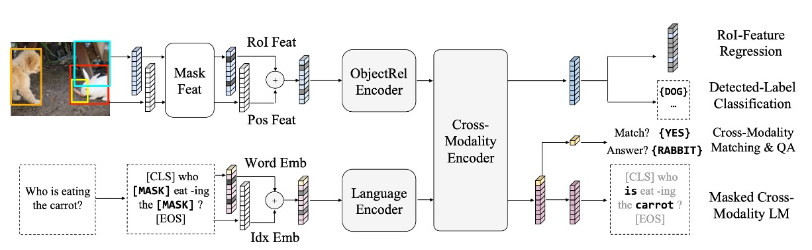

## もっと多くの事前学習

[**LXMERT: Learning Cross-Modality Encoder Representations from Transformers**](https://arxiv.org/abs/1908.07490)

---

最近の研究者たちは、多モーダル研究に注目しています。

ViLBERT、VL-BERT、VisualBERT など、同じ月に発表された多くの研究があります。

LXMERT は、より多くの注意機構と、より包括的な事前学習戦略を採用することで、当時の視覚と言語の解決策として、比較的完璧なものを提供しました。

## 問題の定義

この時期の論文が解決しようとしている問題は、同じ大きな方向性を持っています。

その問題の核心は次の通りです：

- **視覚と言語情報を効果的に理解し、表現できるモデルを設計・訓練し、さまざまなクロスモーダルタスクにおいて優れた性能を発揮できるようにするには？**

この問題は、ViLBERT や VisualBERT が取り組んでいますが、著者は彼らの方法が十分ではないと考えています。

なぜなら、それらは十分に汎用性がないからです。

## 問題の解決

### モデルアーキテクチャ

このデザインのインスピレーションは、Transformer 構造から来ており、その構造は自己注意とクロス注意層を統合することで、モデルが画像と対応する文章入力を同時に処理できるようにしています。このデザインは、モデルが視覚と言語情報を独立してエンコードできるだけでなく、両者が相互作用してクロスモーダルなエンコーディングを生成することを可能にします。

まずは言語部分です。入力された文は WordPiece トークナイザーで分割され、その後エンコードされ、文中の各単語とそのインデックスが対応するベクトル表現を得ます。

画像部分は、まず Faster R-CNN の出力を受け取り、各オブジェクトをエンコードします。これには、オブジェクトの領域特徴だけでなく、空間位置の情報も追加され、モデルの空間認識能力が強化されます。

上の図のように、最終的に LXMERT は三つの異なるレベルの出力を提供します：言語、視覚、そしてクロスモーダル出力です。そのうち、言語と視覚の出力はクロスモーダルエンコーダからの特徴列から直接得られます。クロスモーダル出力は、特別な `[CLS]` トークンを使用しており、これはモデルが最終的に言語と視覚情報を統合した結果であり、さまざまな下流タスクに使用できます。

### 事前学習戦略

モデルが視覚と言語間の関係をより深く理解できるようにするために、LXMERT は大規模な統合データセットで事前学習を行いました。

事前学習タスクは次のいくつかの部分に分かれています：

- **言語タスク – クロスモーダル言語モデルのマスキング**

  このタスクの目的は、モデルが文中でランダムにマスキングされた部分を理解し、生成するのを助けることです。

  モデルは文中の 15% の単語をランダムにマスクします。BERT とは異なり、LXMERT は視覚情報を使ってこれらのマスクされた単語を予測します。

  例えば：「りんご」という単語がマスクされていて、画像にりんごが表示されていれば、LXMERT は画像のヒントを使ってその単語を補完します。

- **視覚タスク – オブジェクトのマスキング予測**

  このタスクの目的は、モデルが画像中のオブジェクトをより良く理解できるようにすることです。

  画像内のオブジェクト特徴がランダムにマスクされ、モデルはこれらのマスクされたオブジェクトの属性や識別情報を予測する必要があります。画像の他の部分や、画像に関連する言語的文脈を手掛かりとして使うことができます。

- **クロスモーダルタスク**

  - **クロスモーダルマッチング**

    このタスクは、モデルの能力を強化し、画像と言語の関連性を理解できるようにします。ここでは、モデルは画像とその画像を説明する文を受け取り、その文が画像を正確に記述しているかどうかを判断する必要があります。これは BERT の「次の文予測」タスクに似ていますが、視覚と言語の一致に焦点を当てています。

  - **画像質問応答**

    このタスクの目的は、モデルが画像の内容に関連する質問に答えられるようにすることです。モデルは画像とその画像に関する質問を受け取り、正しい答えを生成または選択する必要があります。これには、視覚と言語の理解が必要であり、クロスモーダルで両者を組み合わせる必要があります。

事前学習データは、MS COCO と Visual Genome から得た画像を含む五つの主要な視覚と言語データセットから来ています。全体のデータセットは 18 万枚の画像と 918 万の対応する画像と言語ペアを含んでいます。

モデルパラメータは最初から学習され、事前学習された BERT パラメータは使用されません。訓練中は複数の事前学習タスクが同時に使用され、その損失が統合されて訓練されます。全体の事前学習過程は、4 台の Titan Xp で 10 日間実行されました。

## 議論

### 他のモデルとの比較

:::tip
議論を始める前に、気になる点があるのですが、本文の著者は比較対象を「State-of-the-Art」とだけ書いており、どの SoTA を指しているのか正確に調べる必要がありました……

まあ、いいでしょう、続けましょう。
:::

上の表のデータに基づいて、LXMERT はさまざまなテストで優れた性能を発揮しました。

1. **VQA (Visual Question Answering)**

   以前の最先端結果は、Kim らが 2018 年に提案した [**BAN+Counter**](https://arxiv.org/abs/1805.07932) でした。これにより、VQA で他の最近の方法（MFH、Pythia、DFAF、Cycle-Consistency）よりも優れた結果が得られました。

   しかし、LXMERT は全体の精度で 2.1% 向上し、「Binary」と「Other」の問題サブカテゴリーで 2.4% の改善を達成しました。LXMERT は BAN+Counter のように明確にカウントモジュールを使用していませんが、「Number」に関する計算問題において、結果は同等かそれ以上でした。

2. **GQA**

   GQA の最先端結果は BAN を基にしており、この結果は 2018 年に Kim らによって提案されました。

   LXMERT は GQA での精度が、以前の SOTA 方法に対して 3.2% 向上しました。この向上は VQA での改善を超えています。これは GQA が視覚的推論に依存しているためかもしれません。実際、LXMERT の新しいエンコーダとクロスモーダル事前学習によって、オープンドメインの問題で 4.6% の改善が実現されました。

3. **NLVR2**

   LXMERT の新しい事前学習戦略により、NLVR2 の未公開テストセットでの精度は 22% 増加し、76.2% に達しました。さらに、LXMERT は一貫性評価指標で顕著な進展を達成し、42.1% となり、以前の 3.5 倍となりました。

### 事前学習の重要性

1. **BERT と LXMERT の比較**

   BERT を視覚言語タスクに適用すると、効果があまり良くありません。例えば、NLVR2 で BERT モデルを使用した場合、22% の性能低下が見られます。NLVR2 は言語と視覚を組み合わせた複雑なタスクであり、モデルは画像内容を理解し、それを自然言語の説明と一致させる必要があります。

   LXMERT は特別な事前学習戦略を提供しており、言語情報だけでなく視覚情報も考慮しています。この方法により、視覚と言語間の複雑な関係をよりよく捉えることができます。

2. **画像 QA 事前学習の重要性**

   画像 QA 事前学習を通じて、モデルは言語構造を学習するだけでなく、画像から問題を解釈し回答する方法も学びます。これにより、NLVR2 のようなタスクでより良い性能を発揮します。

   実験では、QA 事前学習戦略を使用したモデルは、NLVR2 で 2.1% の性能向上を達成しました。

3. **事前学習とデータ拡張**

   訓練データを増強するために、データ拡張は多くの視覚言語タスクで広く使用されています。この方法は訓練データの多様性を高め、モデルが実世界のシナリオに適応できるようにします。

   単にデータ量を増やすのではなく、LXMERT は複数の QA データセットで事前学習を行う戦略を採用しており、単一のデータセットによるデータ拡張よりも効果的です。

## 結論

この事前学習戦略とさまざまな事前学習タスクを組み合わせることにより、LXMERT は一連の視覚言語タスクで優れた成果を上げました。

VQA と GQA という主要な画像 QA データセットで新たな基準を設定しただけでなく、NLVR2 でも印象的な汎用性を示しました。
