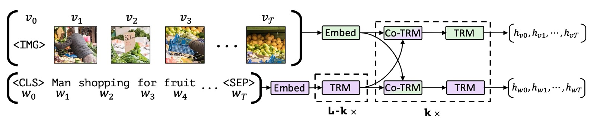

# [19.08] ViLBERT

## 序幕における絡み合い

[**ViLBERT: Pretraining Task-Agnostic Visiolinguistic Representations for Vision-and-Language Tasks**](https://arxiv.org/abs/1908.02265)

---

学術界では毎年多くのことが起こりますが、2019 年は特に多く、まだ終わっていません。

## 問題の定義

現在の方法の多くは「視覚と語言モデルを別々に訓練し、その後で統合しようとする」方法です。

このアプローチは、視覚と語言のデータが限られているか偏っている場合、モデルの汎用性が低くなるため、理想的な結果をもたらしません。モデルは画像内の物体を認識したり、語言を理解することはできますが、それらをどのように結びつけるかが大きな課題です。

著者は、画像と言語を同時に学習し、それらの関連性をより密接に結びつける新しい学習方法を提案したいと考えています。

## 解決方法

### モデルアーキテクチャ

<figure style={{"width": "85%"}}>

</figure>

BERT からのインスピレーションを受け、著者はペアデータから言語と視覚の内容を結びつけた表現を学習するようなモデルを開発したいと考えました。

元々の BERT アーキテクチャでは言語データのみが入力されますが、これを一部画像に変更することはできないでしょうか？これにより、モデルは画像と言語の関係を同時に学習できます。

上の図のように、著者は二重流のアーキテクチャを提案しました。1 つの流れは視覚用に設計され、もう 1 つは言語用に設計されています。これらの二つの流れは、クロスアテンション機構を通じて相互作用し、二つのモダリティのネットワーク深度を変化させ、異なる深度でクロスモーダルな接続を実現します。

ここでの画像入力は、事前学習された物体検出器から抽出されたバウンディングボックスと視覚特徴を使用し、これを視覚位置エンコーディングと組み合わせます。

### 事前学習タスク

<figure style={{"width": "70%"}}>

</figure>

上の図のように、著者は 2 つの主要な事前学習タスクを提案しました：それぞれ、MLM（多モーダルモデリング）と多モーダルアライメント予測です。

- MLM 多モーダルモデリングタスクの目的は、モデルがマスクされた入力を再構成できるようにすることです。
- 多モーダルアライメント予測は、モデルに画像と言語が一致しているかどうかを判定させます。つまり、テキストが画像を正しく説明しているかどうかを確認します。

著者は Conceptual Captions というデータセットを使用して訓練を行いました。このデータセットは 330 万の画像キャプションペアから成り、これらのペアはインターネット上の画像から自動的に取得されました。このデータセットはノイズや不完全なキャプションを含んでいますが、それでも非常に多様な視覚コンテンツを提供します。

実験設定の詳細は次の通りです：

- 言語モデルは BERT-BASE で初期化され、このモデルは BookCorpus と英語の Wikipedia で事前学習されています。
- 視覚特徴は事前学習された Faster R-CNN を使用します。
- Transformer と共同アテンション Transformer ブロックは、視覚フロー内でそれぞれ 1024 のニューロンと 8 つのアテンションヘッドを持っています。
- モデル全体は 8 台の TitanX GPU 上で 10 エポックの訓練が行われました。

## 討論

### ViLBERT の効果は？

上表を参照すると、ViLBERT モデルはさまざまな視覚言語タスクにおいて優れた性能を示しました：

事前学習された状態（単一流モデルおよび ViLBERT との比較）だけでなく、事前学習されていない状態（単一流†および ViLBERT†との比較）でも優れた性能を発揮しました。特に VQA と RefCOCO+では、ViLBERT は最も顕著な利益を得ました。

事前学習タスクを使用して ViLBERT モデルを訓練した結果、異なるタスクでの性能が 2%から 13%向上しました（ViLBERT と ViLBERT†の比較）。これにより、ViLBERT モデルだけでなく、単一流モデルも事前学習タスクから改善を受けることができることが示されました。

ViLBERT の微調整戦略は、4 つの確立されたタスクすべてで最先端の特定タスクモデルを上回りました。特に VCR、RefCOCO+、画像検索では、ViLBERT が新たな技術水準を設定し、効果は 7-10 ポイント向上しました。これらのタスクへの拡張は比較的簡単で、各タスクに分類器を追加するだけで済みます。

### モデルの深さが性能に与える影響は？

上表のように、著者は ViLBERT の視覚モデルの深さが性能に与える影響を探りました。

- **VQA と画像検索**：これらのタスクは、より深い ViLBERT モデルから利益を得ており、性能は層の深さが増すにつれて単調に増加します。特に、層の深さが 6 のときに性能がピークに達しました。
- **ゼロショット画像検索**：このタスクでは、モデルの深さが増すことで顕著に利益が向上し、このタスクでは深層モデルがより適していることが示唆されています。
- **VCR と RefCOCO+**：上記のタスクとは逆に、これらのタスクでは浅層モデルが好まれるようで、最適な性能を得るためには異なるモデルの深さが必要である可能性があります。

:::tip
ただし、現在では 96 層（はい、GPT3 はその例です！）のようなモデルアーキテクチャを考慮すると、2 層でも 8 層でも、それは小さなモデル規模に過ぎないと言えるでしょう。
:::

### 事前学習データセットの影響は？

Conceptual Captions データセットからランダムに 25%と 50%のサブセットを抽出して事前学習を行った場合、使用するデータが増えるにつれて、モデルの精度は単調に増加しました。

この発見は、深層学習分野でよく知られている考え方を確認するものであり、より多くの訓練データはより良い性能を提供することを示しています。なぜなら、モデルが大量のサンプルから特徴やパターンを学習しやすくなるからです。

さらに、これも ViLBERT モデルが事前学習の際により大きなデータセットから利益を得る可能性があることを示しており、これは今後の研究や応用においてモデルの性能を最適化し、向上させるための方向性となるかもしれません。

## 結論

初期の多モーダル研究において、二重流アーキテクチャの設計は重要な突破口となり、画像と言語の間の微細な関連を観察し学習するための詳細な視点を提供しました。

ViLBERT の提案は、この分野のマイルストーンであり、画像内容と言語の結びつきを深く統合し、両者を密接に結びつけ、複数の視覚言語タスクで優れた性能を達成しました。
